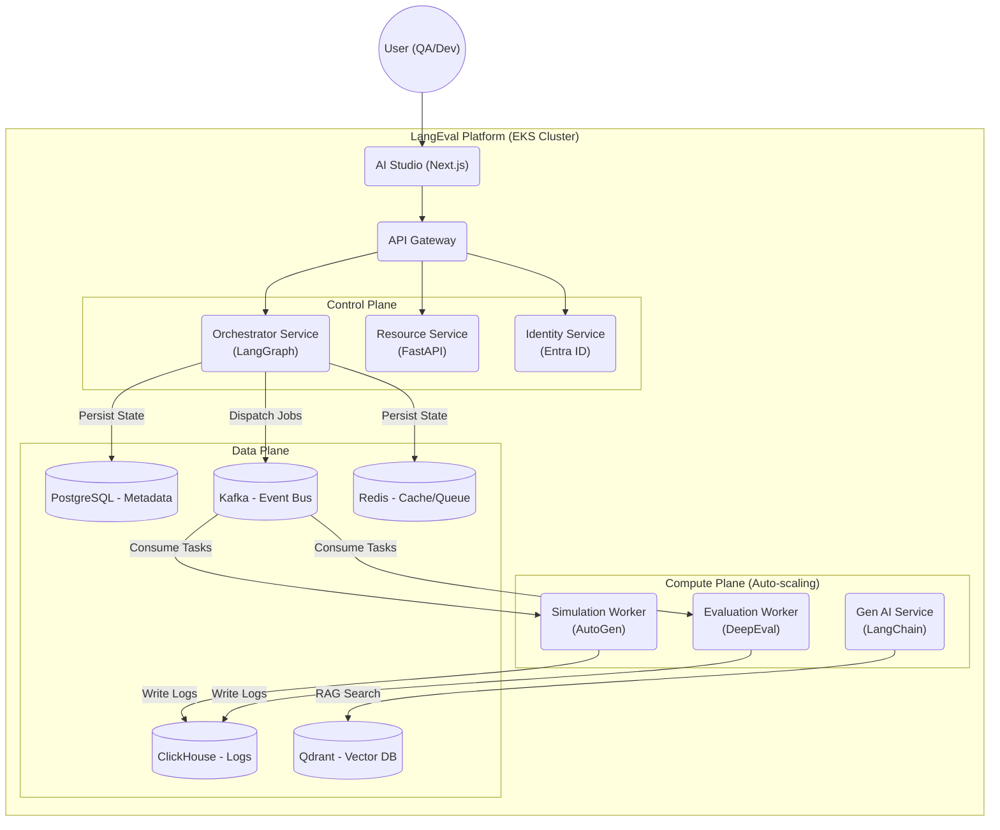

# LangEval - Enterprise AI Agent Evaluation Platform

[](LICENSE)
[]()
[](CONTRIBUTING.md)
[](evaluation-ui/docs)

**LangEval** là nền tảng đánh giá AI Agent (Agentic Evaluation Platform) cấp doanh nghiệp, tiên phong trong việc áp dụng chiến lược **Active Testing** (Kiểm thử chủ động) và **User Simulation** (Giả lập người dùng) để đảm bảo chất lượng, an toàn và hiệu năng cho các hệ thống Generative AI trước khi đưa ra thị trường.

Khác với các công cụ giám sát thụ động (Passive Monitoring) chỉ "bắt lỗi" khi sự cố đã xảy ra, LangEval cho phép bạn chủ động "tấn công" (Red-Teaming), stress-test và đánh giá Agent trong môi trường Sandbox an toàn.

---

## 📑 Mục Lục

1.  [Tại Sao Chọn LangEval?](#-tại-sao-chọn-langeval)
2.  [Tính Năng Cốt Lõi](#-tính-năng-cốt-lõi)
3.  [Kiến Trúc Hệ Thống](#-kiến-trúc-hệ-thống)
4.  [Công Nghệ Sử Dụng](#-công-nghệ-sử-dụng)
5.  [Cấu Trúc Dự Án](#-cấu-trúc-dự-án)
6.  [Hướng Dẫn Cài Đặt Chi Tiết](#-hướng-dẫn-cài-đặt-chi-tiết)
7.  [Lộ Trình Phát Triển (Roadmap)](#-lộ-trình-phát-triển)
8.  [Tài Liệu Tham Khảo](#-tài-liệu-tham-khảo)
9.  [Đóng Góp](#-đóng-góp)

---

## 💡 Tại Sao Chọn LangEval?

Trong kỷ nguyên Agentic AI, các phương pháp đánh giá truyền thống (dựa trên text similarity) không còn đủ. LangEval giải quyết các bài toán khó nhất của Enterprise AI:

*   **Đánh giá hành vi (Behavioral Eval)**: Agent có tuân thủ quy trình nghiệp vụ (SOP) không? Có gọi đúng Tool không?
*   **An toàn & Bảo mật (Safety & Security)**: Agent có bị Jailbreak không? Có làm lộ PII không?
*   **Tự động hóa (Automation)**: Làm sao test 1000 kịch bản hội thoại mà không cần 1000 tester?
*   **Bảo mật dữ liệu (Data Privacy)**: Chạy hoàn toàn On-Premise/Private Cloud, không gửi dữ liệu nhạy cảm ra ngoài.

---

## 🚀 Tính Năng Cốt Lõi

### 1. Active Testing & User Simulation 🧪
*   **Persona-based Simulation**: Tự động sinh hàng ngàn "người dùng ảo" với tính cách khác nhau (Khó tính, Tò mò, Thiếu kiên nhẫn...) sử dụng **Microsoft AutoGen**.
*   **Multi-turn Conversation**: Đánh giá khả năng duy trì ngữ cảnh qua nhiều lượt hội thoại, không chỉ hỏi-đáp đơn thuần.
*   **Dynamic Scenarios**: Kịch bản test linh hoạt, hỗ trợ rẽ nhánh logic (Decision Tree).

### 2. DeepEval Integration & Agentic Metrics 🤖
*   **Tiered Metrics System**:
    *   *Tier 1 (Response)*: Answer Relevancy, Toxicity, Bias.
    *   *Tier 2 (RAG)*: Faithfulness (Chống ảo giác), Contextual Precision.
    *   *Tier 3 (Agentic)*: **Tool Correctness**, **Plan Adherence** (Tuân thủ quy trình).
*   **Custom Metrics**: Hỗ trợ định nghĩa metric riêng bằng G-Eval (LLM-as-a-Judge).

### 3. Orchestration with LangGraph 🕸️
*   **State Machine Management**: Quản lý trạng thái phức tạp của quy trình test.
*   **Self-Correction Loop**: Tự động phát hiện lỗi và thử lại với chiến lược khác (Prompt Mutation) để tìm ra điểm yếu của Agent.
*   **Human-in-the-loop**: Cơ chế dừng (Breakpoint) để con người can thiệp chấm điểm khi AI không chắc chắn.

### 4. Enterprise Security & Compliance 🛡️
*   **Identity Management**: Tích hợp sẵn **Microsoft Entra ID** (Azure AD B2C) cho SSO.
*   **RBAC Matrix**: Phân quyền chi tiết tới từng nút bấm (Admin, Workspace Owner, AI Engineer, QA, Stakeholder).
*   **PII Masking**: Tự động che giấu thông tin nhạy cảm (Email, Phone, CC) ngay từ lớp SDK.

### 5. AI Studio & Comprehensive Dashboard 📊
*   **Battle Arena**: So sánh A/B Testing giữa 2 phiên bản Agent (Split View).
*   **Root Cause Analysis (RCA)**: Phân cụm lỗi (Failure Clustering) để biết Agent hay sai ở chủ đề nào.
*   **Trace Debugger**: Tích hợp Langfuse UI để soi (trace) từng bước suy luận (Thought/Action/Observation).

---

## 🏗️ Kiến Trúc Hệ Thống

LangEval áp dụng kiến trúc **Event-Driven Microservices**, tối ưu cho việc triển khai trên Kubernetes (EKS) và khả năng mở rộng chiều ngang (Horizontal Scaling).



---

## 🛠️ Công Nghệ Sử Dụng

Chúng tôi chọn lựa các công nghệ "Best-in-Class" cho từng phân lớp:

| Phân Lớp | Công Nghệ | Lý Do Lựa Chọn |
| :--- | :--- | :--- |
| **Frontend** | **Next.js 14**, Shadcn/UI, ReactFlow | Hiệu năng cao, SEO tốt, giao diện Enterprise chuẩn mực. |
| **Orchestration** | **LangGraph** | Hỗ trợ Cyclic Graph (Vòng lặp) tốt hơn LangChain Chain truyền thống. |
| **Simulation** | **Microsoft AutoGen** | Framework mạnh nhất hiện nay cho Multi-Agent Conversation. |
| **Evaluation** | **DeepEval** | Tích hợp sâu với PyTest, hỗ trợ Unit Test cho AI. |
| **Observability** | **Langfuse** (Self-hosted) | Open Source, bảo mật dữ liệu, giao diện Tracing tuyệt vời. |
| **Database** | **PostgreSQL**, **ClickHouse**, **Qdrant** | Polyglot Persistence: Đúng DB cho đúng việc (Metadata, Logs, Vectors). |
| **Queue/Stream** | **Kafka**, **Redis** | Đảm bảo High Throughput và Low Latency cho hàng triệu event. |

---

## 📂 Cấu Trúc Dự Án

Dự án được tổ chức theo mô hình Monorepo để dễ dàng quản lý và phát triển đồng bộ:

```text
langeval/
├── backend/
│   ├── data-ingestion/      # Rust service: Xử lý log tốc độ cao từ Kafka vào ClickHouse
│   ├── evaluation-worker/   # Python service: DeepEval worker chấm điểm
│   ├── gen-ai-service/      # Python service: Sinh dữ liệu test và Persona
│   ├── identity-service/    # Python service: Auth & RBAC với Entra ID
│   ├── orchestrator/        # Python service: Core logic, LangGraph State Machine
│   ├── resource-service/    # Python service: CRUD APIs (Agents, Scenarios...)
│   └── simulation-worker/   # Python service: AutoGen simulators
├── evaluation-ui/           # Frontend: Next.js Web Application
│   ├── docs/                # 📚 Tài liệu dự án chi tiết
│   └── ...
├── infrastructure/          # Terraform, Docker Compose, K8s manifests
└── ...
```

---

## 🚦 Hướng Dẫn Cài Đặt Chi Tiết

### Yêu Cầu Tiên Quyết (Prerequisites)
*   **Docker & Docker Compose** (v2.20+)
*   **Python 3.10+** (Khuyên dùng pyenv)
*   **Node.js 18+** (LTS)
*   **Git**

### Bước 1: Clone Repository
```bash
git clone https://github.com/your-org/langeval.git
cd langeval
```

### Bước 2: Khởi Tạo Infrastructure
Chúng ta cần chạy các dịch vụ nền (Databases, Message Queue) trước.
```bash
# Khởi chạy PostgreSQL, Redis, Kafka, ClickHouse, Qdrant
docker-compose up -d postgres redis kafka clickhouse qdrant
```

### Bước 3: Cấu Hình Biến Môi Trường (.env)
Copy file `.env.example` thành `.env` trong thư mục gốc và các thư mục service.
```bash
cp .env.example .env
# Cập nhật các key quan trọng:
# OPENAI_API_KEY=sk-...
# LANGFUSE_PUBLIC_KEY=...
# LANGFUSE_SECRET_KEY=...
```

### Bước 4: Chạy Backend Services
Bạn có thể chạy toàn bộ hệ thống bằng Docker Compose:
```bash
docker-compose up --build
```
*Lưu ý: Lần đầu build có thể mất 10-15 phút để tải các Docker image.*

### Bước 5: Truy Cập Ứng Dụng
Sau khi khởi động thành công:
*   **AI Studio (UI)**: `http://localhost:3000`
*   **API Gateway**: `http://localhost:8000`
*   **Langfuse Dashboard**: `http://localhost:3001` (Default credentials: admin/admin)

### Troubleshooting
*   **Kafka Connection Error**: Đảm bảo container Kafka đã `healthy` trước khi start các worker.
*   **Port Conflict**: Kiểm tra các port 3000, 8000, 5432, 6379 có đang bị chiếm dụng không.

---

## 🗺️ Lộ Trình Phát Triển (Roadmap)

Dự án được chia thành 3 giai đoạn chiến lược:

### Phase 1: The Core Engine (Q1/2026) ✅
*   [x] Xây dựng Orchestrator Service với LangGraph.
*   [x] Tích hợp Simulation Worker (AutoGen) và Evaluation Worker (DeepEval).
*   [x] Hoàn thiện Data Ingestion pipeline với Kafka & ClickHouse.

### Phase 2: The Studio Experience (Q2/2026) 🚧
*   [ ] Ra mắt AI Studio với Visual Scenario Builder (Kéo thả).
*   [ ] Tích hợp Active Red-Teaming (Tấn công tự động).
*   [ ] Human-in-the-loop Interface (Hàng chờ duyệt điểm).

### Phase 3: Scale & Ecosystem (Q3/2026+) 🔮
*   [ ] Battle Mode (Arena UI) cho A/B Testing.
*   [ ] Tích hợp CI/CD Pipeline (GitHub Actions Quality Gate).
*   [ ] Self-Optimization (Thuật toán GEPA tự sửa Prompt).

---

## 📚 Tài Liệu Tham Khảo

Hệ thống tài liệu đầy đủ (Architecture, API, Database, Deployment) nằm trong thư mục `evaluation-ui/docs/`. Đây là nguồn sự thật duy nhất (Single Source of Truth).

*   **Tổng quan**: [Master Plan](evaluation-ui/docs/00-Master-Plan.md), [Business Requirements](evaluation-ui/docs/00-Business-Requirements.md)
*   **Kỹ thuật**: [System Architecture](evaluation-ui/docs/01-System-Architecture.md), [Database Design](evaluation-ui/docs/03-Database-Design.md), [API Spec](evaluation-ui/docs/04-API-Microservices-Spec.md)
*   **Vận hành**: [Deployment & DevOps](evaluation-ui/docs/06-Deployment-DevOps.md), [Security](evaluation-ui/docs/07-Security-Compliance.md)

---

## 🤝 Đóng Góp

Chúng tôi áp dụng quy trình **Vibe Coding** (AI-Assisted Development). Vui lòng đọc kỹ [CONTRIBUTING.md](CONTRIBUTING.md) để hiểu cách sử dụng AI Tools đóng góp hiệu quả và đúng chuẩn dự án.

---

## 📄 License

Dự án này được cấp phép theo giấy phép MIT. Xem file [LICENSE](LICENSE) để biết thêm chi tiết.

---
**LangEval Team** - *Empowering Enterprise AI with Confidence*
