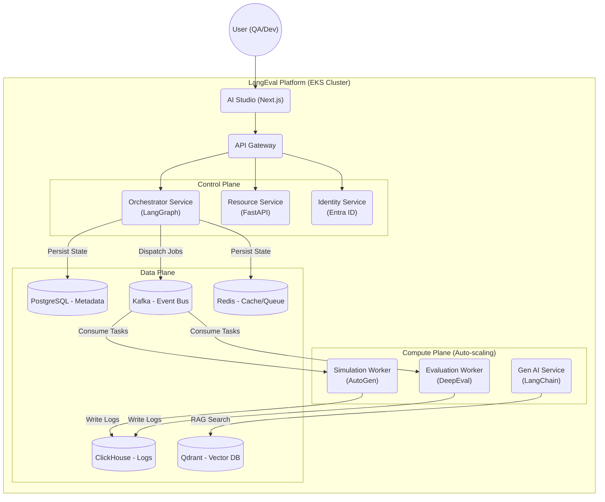

# LangEval - Enterprise AI Agent Evaluation Platform

[English](README.md) | [Tiếng Việt](README.vi.md)


[](LICENSE)
[]()
[](CONTRIBUTING.md)
[](langeval-ui/docs/en)

**LangEval** is an enterprise-grade AI Agentic Evaluation Platform, pioneering the application of **Active Testing** and **User Simulation** strategies to ensure the quality, safety, and performance of Generative AI systems before they reach the market.

> [!TIP]
> **🚀 Live**: Explore the platform in action at [langeval.space](https://langeval.space)


Unlike passive monitoring tools that only "catch errors" after an incident has occurred, LangEval allows you to proactively "attack" (Red-Teaming), stress-test, and evaluate Agents in a safe Sandbox environment.

---

## ❤️ Support the Project

If you find **LangEval** useful, please consider supporting its development to help us maintain server costs and coffee supplies! ☕

[](https://www.paypal.com/ncp/payment/CCAU7CPZM8QEA)

**[www.paypal.com/ncp/payment/CCAU7CPZM8QEA](https://www.paypal.com/ncp/payment/CCAU7CPZM8QEA)**


---

## 📑 Table of Contents

1.  [Why Choose LangEval?](#-why-choose-langeval)
2.  [Core Features](#-core-features)
3.  [Detailed Installation Guide](#-detailed-installation-guide)
4.  [Contributing](#-contributing)
5.  [Support the Project](#-support-the-project-hearts)
6.  [System Architecture](#-system-architecture)
7.  [API Specification](#-api-specification)
8.  [Technology Stack](#-technology-stack)
9.  [Project Structure](#-project-structure)
10. [Development Roadmap](#-development-roadmap)
11. [Reference Documentation](#-reference-documentation)
12. [License](#-license)

---

## 💡 Why Choose LangEval?

In the era of Agentic AI, traditional evaluation methods (based on text similarity) are no longer sufficient. LangEval addresses the toughest challenges in Enterprise AI:

*   **Behavioral Evaluation (Behavioral Eval)**: Does the Agent follow business processes (SOP)? Does it call the correct Tools?
*   **Safety & Security**: Can the Agent be Jailbroken? Does it leak PII?
*   **Automation**: How to test 1000 conversation scenarios without 1000 testers?
*   **Data Privacy**: Runs entirely On-Premise/Private Cloud, without sending sensitive data externally.

---

## 🚀 Core Features

### 1. Active Testing & User Simulation 🧪
*   **Persona-based Simulation**: Automatically generates thousands of "virtual users" with different personalities (Difficult, Curious, Impatient...) using **Microsoft AutoGen**.
*   **Multi-turn Conversation**: Evaluates the ability to maintain context across multiple conversation turns, beyond simple Q&A.
*   **Dynamic Scenarios**: Flexible test scenarios supporting logical branching (Decision Tree).

### 2. DeepEval Integration & Agentic Metrics 🤖
*   **Tiered Metrics System**:
    *   *Tier 1 (Response)*: Answer Relevancy, Toxicity, Bias.
    *   *Tier 2 (RAG)*: Faithfulness (Anti-hallucination), Contextual Precision.
    *   *Tier 3 (Agentic)*: **Tool Correctness**, **Plan Adherence** (Process compliance).
*   **Custom Metrics**: Supports defining custom metrics using G-Eval (LLM-as-a-Judge).

### 3. Orchestration with LangGraph 🕸️
*   **State Machine Management**: Manages complex states of the test process.
*   **Self-Correction Loop**: Automatically detects errors and retries with different strategies (Prompt Mutation) to find Agent weaknesses.
*   **Human-in-the-loop**: Breakpoint mechanisms for human intervention and scoring when the AI is uncertain.

### 4. Enterprise Security & Compliance 🛡️
*   **Identity Management**: Pre-integrated with **Microsoft Entra ID** (Azure AD B2C) for SSO.
*   **RBAC Matrix**: Detailed permission control down to every button (Admin, Workspace Owner, AI Engineer, QA, Stakeholder).
*   **PII Masking**: Automatically hides sensitive information (Email, Phone, CC) starting from the SDK layer.

### 5. AI Studio & Comprehensive Dashboard 📊
*   **Battle Arena**: Compares A/B Testing between two Agent versions (Split View).
*   **Root Cause Analysis (RCA)**: Failure Clustering to identify where the Agent frequently fails.
*   **Trace Debugger**: Integrated Langfuse UI to trace every reasoning step (Thought/Action/Observation).

---

## 🚦 Detailed Installation Guide

### Prerequisites
*   **Docker & Docker Compose** (v2.20+)
*   **Node.js 18+** (LTS) & **npm/yarn/pnpm**
*   **Python 3.11+** (Optional, for running individual services locally)
*   **Git**

### Step 1: Clone Repository
```bash
git clone https://github.com/your-org/langeval.git
cd langeval
```

### Step 2: Configure Environment Variables
Copy the `.env.example` file to `.env` in the root directory and update essential keys.

```bash
cp .env.example .env

# Edit .env file and update:
# 1. OPENAI_API_KEY=sk-... (Required for Simulation Agents)
# 2. GOOGLE_CLIENT_ID=... (Required for Auth)
# 3. GOOGLE_CLIENT_SECRET=...
# 4. NEXTAUTH_SECRET=... (Generate with: openssl rand -base64 32)
# 5. PAYPAL_CLIENT_ID=... (Required for Billing/Plans)
# 6. PAYPAL_CLIENT_SECRET=...
# 7. PAYPAL_PRO_PLAN_ID=P-...
# 8. PAYPAL_ENTERPRISE_PLAN_ID=P-...
```

### Step 2.1: Configure PayPal Sandbox (Billing)
To enable the **Pro** and **Enterprise** Subscription features, you need to configure a PayPal Sandbox application:
1. Go to the [PayPal Developer Dashboard](https://developer.paypal.com/).
2. Navigate to **Apps & Credentials** and create a new **Sandbox** App.
3. Copy the **Client ID** and **Secret ID** into `.env` (`PAYPAL_CLIENT_ID` and `PAYPAL_CLIENT_SECRET`).
4. (Optional) Go to **Subscriptions > Billing Plans** in the dashboard, create a plan, and copy the new Plan ID (`P-...`) into `.env` file as `PAYPAL_PRO_PLAN_ID` and `PAYPAL_ENTERPRISE_PLAN_ID`.

### Step 3: Start Backend & Infrastructure (Docker Compose)
We use Docker Compose to spin up the entire backend stack, including Databases (Postgres, ClickHouse, Qdrant), Message Queue (Kafka, Redis), and Core Services (Orchestrator, Resource Service).

```bash
# Start all backend services in the background
docker-compose up -d
```

> **Note**: This process may take a few minutes to download images and initialize databases (PostgreSQL, Qdrant, ClickHouse). Ensure all containers are `healthy` before proceeding.

### Step 4: Start Frontend (AI Studio)
Run the Next.js frontend application locally for the best development experience.

```bash
cd langeval-ui

# Install dependencies
npm install

# Start the development server
npm run dev
```

### Step 5: Access the Application
Once everything is running:

*   **AI Studio (Frontend)**: [http://localhost:8800](http://localhost:8800)
*   **API Gateway**: [http://localhost:8000/docs](http://localhost:8000/docs)
*   **Langfuse Dashboard**: [http://localhost:3000](http://localhost:3000) (Check docker-compose for exposed port)

---

## 🔧 Troubleshooting

### Nginx "AccessDenied" or "404 Not Found" during Google Login
If you recently restarted Docker containers, Nginx might have cached stale internal IP addresses for the `identity-service` and `resource-service` containers (Docker DNS Caching issue).
To force Nginx to re-resolve the internal Docker networks, simply restart the Nginx container:
```bash
docker compose restart nginx
```

### Nginx Container Crash Loop (Missing SSL Files)
If you cleared the `certbot/conf` directory (e.g., via `docker compose down -v`), Nginx may fail to start with the error `[emerg] open() "/etc/letsencrypt/options-ssl-nginx.conf" failed`. 
To restore the missing default Let's Encrypt configuration files securely without recreating all certificates, run:
```bash
curl -s https://raw.githubusercontent.com/certbot/certbot/master/certbot-nginx/certbot_nginx/_internal/tls_configs/options-ssl-nginx.conf > certbot/conf/options-ssl-nginx.conf
curl -s https://raw.githubusercontent.com/certbot/certbot/master/certbot/certbot/ssl-dhparams.pem > certbot/conf/ssl-dhparams.pem
docker compose restart nginx
```

---

## 🤝 Contributing

We adopt the **Vibe Coding** (AI-Assisted Development) process. We welcome contributions from the community!

Please carefully read [CONTRIBUTING.md](CONTRIBUTING.md) to understand how to use AI tools to contribute effectively and according to project standards.

---

## 🏗️ System Architecture

LangEval adopts an **Event-Driven Microservices** architecture, optimized for deployment on Kubernetes (EKS) and horizontal scalability.



---

## 🔌 API Specification

The system exposes a unified API via **Nginx Gateway** (`https://api.langeval.space`).
Authentication requires `Authorization: Bearer <token>` (obtained via Identity Service).

### 1. Identity Service (`/identity`)
> **Interactive Docs**: [https://api.langeval.space/identity/docs](https://api.langeval.space/identity/docs)

*   `GET /identity/me`: Get current user profile & workspace.
*   `POST /identity/auth/google`: Exchange Google Code for Access Token.
*   `GET /identity/workspaces`: List user workspaces.

### 2. Resource Service (`/resource`)
> **Interactive Docs**: [https://api.langeval.space/resource/docs](https://api.langeval.space/resource/docs)

*   `GET /resource/agents`: List Agents (System Under Test).
*   `POST /resource/agents`: Register a new Agent.
*   `GET /resource/scenarios`: Manage Test Scenarios (Graph).
*   `POST /resource/red-teaming/campaigns`: Configure Red Teaming parameters.

### 3. Orchestrator Service (`/orchestrator`)
> **Interactive Docs**: [https://api.langeval.space/orchestrator/docs](https://api.langeval.space/orchestrator/docs)

*   `POST /orchestrator/campaigns`: **Start Simulation**.
    ```json
    { "scenario_id": "scen-1", "agent_id": "agent-A" }
    ```
*   `GET /orchestrator/campaigns/{id}`: Get Campaign Status (Queued, Running, Completed).
*   `GET /orchestrator/campaigns/{id}/state`: Get full conversation history & metrics.

### 4. Gen AI Service (`/gen-ai`)
> **Interactive Docs**: [https://api.langeval.space/gen-ai/docs](https://api.langeval.space/gen-ai/docs)

*   `POST /gen-ai/generate/personas`: Generate synthetic user personas.
*   `POST /gen-ai/generate/test-cases`: Generate test inputs based on persona.

### 5. Simulation Worker (Internal)
*   **Port**: `8004` (Internal).
*   **Docs**: `https://api.langeval.space/simulation/docs`
*   **Role**: Consumes `simulation.requests` (Kafka) -> runs AutoGen agents -> produces `simulation.completed`.

### 6. Evaluation Worker (Internal)
*   **Port**: `8005` (Internal).
*   **Docs**: `https://api.langeval.space/evaluation/docs`
*   **Role**: Consumes `evaluation.requests` (Kafka) -> runs DeepEval metrics -> produces `evaluation.completed`.

> 📄 **Full Specification**: See [04-API-Microservices-Spec.md](langeval-ui/docs/04-API-Microservices-Spec.md) for complete request/response examples.

---

## 🛠️ Technology Stack

We select "Best-in-Class" technologies for each layer:

| Layer | Technology | Reason for Selection |
| :--- | :--- | :--- |
| **Frontend** | **Next.js 14**, Shadcn/UI, ReactFlow | High performance, good SEO, standard Enterprise interface. |
| **Orchestration** | **LangGraph** | Better support for Cyclic Graphs compared to traditional LangChain Chains. |
| **Simulation** | **Microsoft AutoGen** | The most powerful framework currently available for Multi-Agent Conversation. |
| **Evaluation** | **DeepEval** | Deep integration with PyTest, supporting Unit Testing for AI. |
| **Observability** | **Langfuse** (Self-hosted) | Open Source, data security, excellent Tracing interface. |
| **Database** | **PostgreSQL**, **ClickHouse**, **Qdrant** | Polyglot Persistence: The right DB for the right job (Metadata, Logs, Vectors). |
| **Queue/Stream** | **Kafka**, **Redis** | Ensures High Throughput and Low Latency for millions of events. |

---

## 📂 Project Structure

The project is organized using a Monorepo model for easy management and synchronized development:

```text
langeval/
├── backend/
│   ├── data-ingestion/      # Rust service: High-speed log processing from Kafka into ClickHouse
│   ├── evaluation-worker/   # Python service: DeepEval scoring worker
│   ├── gen-ai-service/      # Python service: Test data and Persona generation
│   ├── identity-service/    # Python service: Auth & RBAC
│   ├── orchestrator/        # Python service: Core logic, LangGraph State Machine
│   ├── resource-service/    # Python service: CRUD APIs (Agents, Scenarios...)
│   └── simulation-worker/   # Python service: AutoGen simulators
├── langeval-ui/           # Frontend: Next.js Web Application
│   ├── docs/                # 📚 Detailed project documentation
│   └── ...
├── infrastructure/          # Terraform, Docker Compose, K8s manifests
└── ...
```

---

## 🗺️ Development Roadmap

The project is divided into 3 strategic phases:

### Phase 1: The Core Engine (Completed) ✅
*   [x] **Orchestrator Service**: Powered by LangGraph for complex state machine management.
*   [x] **Worker Ecosystem**: High-fidelity Simulation (AutoGen) & Multi-metric Evaluation (DeepEval).
*   [x] **Foundational Services**: Identity (Google OAuth, Workspaces) & Resource (Full CRUD, Langfuse Trace).
*   [x] **Data Pipeline**: High-performance Rust Ingestion (Kafka to ClickHouse).

### Phase 2: The Studio Experience (Active Development) 🚧
*   [x] **Gen AI Studio**: Automated Persona & Test Case generation using LLMs.
*   [x] **Active Red-Teaming**: Specialized workflows for Adversarial attacks (Jailbreak, PII, Toxicity).
*   [x] **Self-Optimization**: GEPA algorithm for automated Prompt refinement.
*   [x] **Human-in-the-loop**: Integrated interface for manual scoring and review queue.
*   [/] **Visual Designer**: Drag-and-drop Scenario Builder (UI implementation in progress).
*   [x] **Observability**: Real-time Trace Debugger with Langfuse integration.

### Phase 3: Scale & Ecosystem (Q3/2026+) 🔮
*   [x] **Battle Mode Judge**: Pairwise LLM-as-a-judge for automated A/B testing (Backend Ready).
*   [ ] **Arena UI**: Specialized scoreboard and comparison dashboard for Model Battles.
*   [ ] **CI/CD Quality Gates**: Automated evaluation triggers for GitHub Actions.
*   [ ] **Enterprise Security**: Advanced RBAC, Audit Logs, and Private Cloud deployment options.

---

## 📚 Reference Documentation

The comprehensive documentation system (Architecture, API, Database, Deployment) is located in the `langeval-ui/docs/` directory. This is the Single Source of Truth.

*   **Overview**: [Master Plan](langeval-ui/docs/en/00-Master-Plan.md), [Business Requirements](langeval-ui/docs/en/00-Business-Requirements.md)
*   **Technical**: [System Architecture](langeval-ui/docs/en/01-System-Architecture.md), [Database Design](langeval-ui/docs/en/03-Database-Design.md), [API Spec](langeval-ui/docs/en/04-API-Microservices-Spec.md), [Google OAuth Setup](langeval-ui/docs/en/04-b-Google-OAuth-Setup.md)
*   **Operations**: [Deployment & DevOps](langeval-ui/docs/en/06-Deployment-DevOps.md), [Kafka Configuration](langeval-ui/docs/en/06-b-Kafka-Configuration.md), [Security](langeval-ui/docs/en/07-Security-Compliance.md)
*   **User Guides**: [Dashboard User Guide](langeval-ui/docs/en/13-Dashboard-User-Guide.md)


---

## ✍️ Author

**Solana** - [https://github.com/solana8800](https://github.com/solana8800)

---

## 📄 License

Distributed under the **Apache License 2.0**. See `LICENSE` for more information.

---

Copyright © 2026 **LangEval Team**. All rights reserved.
"LangEval" and the LangEval logo are trademarks of the LangEval Team.

---
**LangEval Team** - *Empowering Enterprise AI with Confidence*
