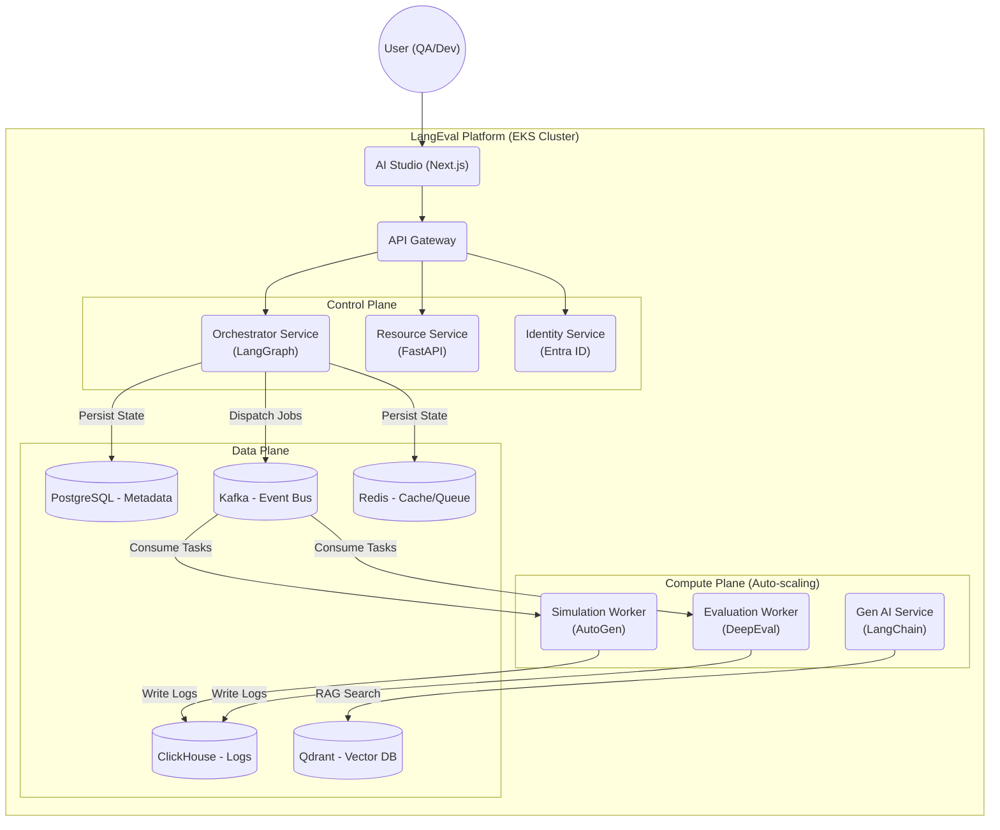

# LangEval - Enterprise AI Agent Evaluation Platform

[English](README.md) | [Tiếng Việt](README.vi.md)


[](LICENSE.vi)
[]()
[](CONTRIBUTING.md)
[](langeval-ui/docs/vi)

**LangEval** là nền tảng đánh giá AI Agent (Agentic Evaluation Platform) cấp doanh nghiệp, tiên phong trong việc áp dụng chiến lược **Active Testing** (Kiểm thử chủ động) và **User Simulation** (Giả lập người dùng) để đảm bảo chất lượng, an toàn và hiệu năng cho các hệ thống Generative AI trước khi đưa ra thị trường.

> [!TIP]
> **🚀 Live**: Trải nghiệm nền tảng trực tuyến tại [langeval.space](https://langeval.space)


Khác với các công cụ giám sát thụ động (Passive Monitoring) chỉ "bắt lỗi" khi sự cố đã xảy ra, LangEval cho phép bạn chủ động "tấn công" (Red-Teaming), stress-test và đánh giá Agent trong môi trường Sandbox an toàn.

---

## ❤️ Ủng Hộ Dự Án

Nếu bạn thấy **LangEval** hữu ích, hãy cân nhắc ủng hộ (donate) để giúp chúng tôi duy trì chi phí server và mua cà phê cho team phát triển! ☕

[](https://www.paypal.com/ncp/payment/CCAU7CPZM8QEA)

**[www.paypal.com/ncp/payment/CCAU7CPZM8QEA](https://www.paypal.com/ncp/payment/CCAU7CPZM8QEA)**


---

## 📑 Mục Lục

1.  [Tại Sao Chọn LangEval?](#-tại-sao-chọn-langeval)
2.  [Tính Năng Cốt Lõi](#-tính-năng-cốt-lõi)
3.  [Hướng Dẫn Cài Đặt Chi Tiết](#-hướng-dẫn-cài-đặt-chi-tiết)
4.  [Đóng Góp](#-đóng-góp)
5.  [Ủng Hộ Dự Án](#-ủng-hộ-dự-án-hearts)
6.  [Kiến Trúc Hệ Thống](#-kiến-trúc-hệ-thống)
7.  [Thông số kỹ thuật API (API Spec)](#-thông-số-kỹ-thuật-api-api-spec)
8.  [Công Nghệ Sử Dụng](#-công-nghệ-sử-dụng)
9.  [Cấu Trúc Dự Án](#-cấu-trúc-dự-án)
10. [Lộ Trình Phát Triển (Roadmap)](#-lộ-trình-phát-triển)
11. [Tài Liệu Tham Khảo](#-tài-liệu-tham-khảo)
12. [License](#-license)

---

## 💡 Tại Sao Chọn LangEval?

Trong kỷ nguyên Agentic AI, các phương pháp đánh giá truyền thống (dựa trên text similarity) không còn đủ. LangEval giải quyết các bài toán khó nhất của Enterprise AI:

*   **Đánh giá hành vi (Behavioral Eval)**: Agent có tuân thủ quy trình nghiệp vụ (SOP) không? Có gọi đúng Tool không?
*   **An toàn & Bảo mật (Safety & Security)**: Agent có bị Jailbreak không? Có làm lộ PII không?
*   **Tự động hóa (Automation)**: Làm sao test 1000 kịch bản hội thoại mà không cần 1000 tester?
*   **Bảo mật dữ liệu (Data Privacy)**: Chạy hoàn toàn On-Premise/Private Cloud, không gửi dữ liệu nhạy cảm ra ngoài.

---

## 🚀 Tính Năng Cốt Lõi

### 1. Active Testing & User Simulation 🧪
*   **Persona-based Simulation**: Tự động sinh hàng ngàn "người dùng ảo" với tính cách khác nhau (Khó tính, Tò mò, Thiếu kiên nhẫn...) sử dụng **Microsoft AutoGen**.
*   **Multi-turn Conversation**: Đánh giá khả năng duy trì ngữ cảnh qua nhiều lượt hội thoại, không chỉ hỏi-đáp đơn thuần.
*   **Dynamic Scenarios**: Kịch bản test linh hoạt, hỗ trợ rẽ nhánh logic (Decision Tree).

### 2. DeepEval Integration & Agentic Metrics 🤖
*   **Tiered Metrics System**:
    *   *Tier 1 (Response)*: Answer Relevancy, Toxicity, Bias.
    *   *Tier 2 (RAG)*: Faithfulness (Chống ảo giác), Contextual Precision.
    *   *Tier 3 (Agentic)*: **Tool Correctness**, **Plan Adherence** (Tuân thủ quy trình).
*   **Custom Metrics**: Hỗ trợ định nghĩa metric riêng bằng G-Eval (LLM-as-a-Judge).

### 3. Orchestration with LangGraph 🕸️
*   **State Machine Management**: Quản lý trạng thái phức tạp của quy trình test.
*   **Self-Correction Loop**: Tự động phát hiện lỗi và thử lại với chiến lược khác (Prompt Mutation) để tìm ra điểm yếu của Agent.
*   **Human-in-the-loop**: Cơ chế dừng (Breakpoint) để con người can thiệp chấm điểm khi AI không chắc chắn.

### 4. Enterprise Security & Compliance 🛡️
*   **Identity Management**: Tích hợp sẵn **Microsoft Entra ID** (Azure AD B2C) cho SSO.
*   **RBAC Matrix**: Phân quyền chi tiết tới từng nút bấm (Admin, Workspace Owner, AI Engineer, QA, Stakeholder).
*   **PII Masking**: Tự động che giấu thông tin nhạy cảm (Email, Phone, CC) ngay từ lớp SDK.

### 5. AI Studio & Comprehensive Dashboard 📊
*   **Battle Arena**: So sánh A/B Testing giữa 2 phiên bản Agent (Split View).
*   **Root Cause Analysis (RCA)**: Phân cụm lỗi (Failure Clustering) để biết Agent hay sai ở chủ đề nào.
*   **Trace Debugger**: Tích hợp Langfuse UI để soi (trace) từng bước suy luận (Thought/Action/Observation).

---

## 🚦 Hướng Dẫn Cài Đặt Chi Tiết

### Yêu Cầu Tiên Quyết (Prerequisites)
*   **Docker & Docker Compose** (v2.20+)
*   **Node.js 18+** (LTS) & **npm/yarn/pnpm**
*   **Python 3.11+** (Tùy chọn, để chạy service lẻ)
*   **Git**

### Bước 1: Clone Repository
```bash
git clone https://github.com/your-org/langeval.git
cd langeval
```

### Bước 2: Cấu Hình Biến Môi Trường
Copy file `.env.example` thành `.env` ở thư mục gốc và cập nhật các key quan trọng.

```bash
cp .env.example .env

# Chỉnh sửa file .env và cập nhật:
# 1. OPENAI_API_KEY=sk-... (Bắt buộc cho Simulation Agents)
# 2. GOOGLE_CLIENT_ID=... (Bắt buộc cho Login)
# 3. GOOGLE_CLIENT_SECRET=...
# 4. NEXTAUTH_SECRET=... (Tạo bằng lệnh: openssl rand -base64 32)
# 5. PAYPAL_CLIENT_ID=... (Bắt buộc cho Thanh toán & Quản lý Gói cước)
# 6. PAYPAL_CLIENT_SECRET=...
# 7. PAYPAL_PRO_PLAN_ID=P-...
# 8. PAYPAL_ENTERPRISE_PLAN_ID=P-...
```

### Bước 2.1: Cấu hình PayPal Sandbox (Thanh toán Billing)
Để tính năng Thanh toán Gói cước (Pro/Enterprise) hoạt động đúng, bạn cần khai báo PayPal Sandbox:
1. Đăng nhập vào [PayPal Developer Dashboard](https://developer.paypal.com/).
2. Chuyển sang mục **Apps & Credentials**, tạo một App mới ở chế độ **Sandbox**.
3. Copy **Client ID** và **Secret ID** dán tương ứng vào file `.env` (`PAYPAL_CLIENT_ID`, `PAYPAL_CLIENT_SECRET`).
4. (Tuỳ chọn) Chuyển qua mục **Subscriptions > Billing Plans**, tạo gói cước mới và copy mã Plan ID (`P-...`) vào file `.env` ở các biến `PAYPAL_PRO_PLAN_ID` và `PAYPAL_ENTERPRISE_PLAN_ID`.

### Bước 3: Khởi Chạy Backend & Infrastructure (Docker Compose)
Sử dụng Docker Compose để dựng toàn bộ backend stack, bao gồm Databases (Postgres, ClickHouse, Qdrant), Message Queue (Kafka, Redis), và Core Services (Orchestrator, Resource Service).

```bash
# Khởi chạy tất cả backend services dưới nền
docker-compose up -d
```

> **Lưu ý**: Lần đầu chạy sẽ mất vài phút để tải image và khởi tạo database (PostgreSQL, Qdrant, ClickHouse). Hãy đảm bảo tất cả container ở trạng thái `healthy` trước khi tiếp tục.

### Bước 4: Khởi Chạy Frontend (AI Studio)
Chạy ứng dụng Frontend Next.js ở môi trường máy cục bộ (local) để có trải nghiệm phát triển tốt nhất.

```bash
cd langeval-ui

# Cài đặt dependencies
npm install

# Khởi chạy development server
npm run dev
```

### Bước 5: Truy Cập Ứng Dụng
Sau khi khởi động thành công:

*   **AI Studio (Frontend)**: [http://localhost:8800](http://localhost:8800)
*   **API Gateway**: [http://localhost:8000/docs](http://localhost:8000/docs)
*   **Langfuse Dashboard**: [http://localhost:3000](http://localhost:3000) (Kiểm tra file docker-compose để biết port chính xác)

---

## 🔧 Xử Lý Sự Cố (Troubleshooting)

### Lỗi "AccessDenied" hoặc "404 Not Found" khi Đăng nhập Google
Nếu bạn vừa khởi động lại Docker container, Nginx có thể đã lưu cache các địa chỉ IP nội bộ cũ của `identity-service` và `resource-service` (Lỗi Docker DNS Caching). 
Để bắt Nginx phải phân giải lại chính xác mạng lưới nội bộ của Docker, chỉ cần khởi động lại container Nginx:
```bash
docker compose restart nginx
```

### Nginx Crash Loop (Thiếu File Cấu Hình SSL)
Nếu bạn lỡ xóa thư mục `certbot/conf` (ví dụ: dùng lệnh `docker compose down -v`), Nginx sẽ báo lỗi không thể khởi động: `[emerg] open() "/etc/letsencrypt/options-ssl-nginx.conf" failed`.
Để khôi phục lại các file cấu hình tiêu chuẩn của Let's Encrypt bị thiếu mà không cần phải xóa và tạo lại toàn bộ chứng chỉ, hãy chạy lệnh sau ở thư mục chứa file `docker-compose.yml`:
```bash
curl -s https://raw.githubusercontent.com/certbot/certbot/master/certbot-nginx/certbot_nginx/_internal/tls_configs/options-ssl-nginx.conf > certbot/conf/options-ssl-nginx.conf
curl -s https://raw.githubusercontent.com/certbot/certbot/master/certbot/certbot/ssl-dhparams.pem > certbot/conf/ssl-dhparams.pem
docker compose restart nginx
```

---

## 🤝 Đóng Góp

Chúng tôi áp dụng quy trình **Vibe Coding** (AI-Assisted Development). Chúng tôi hoan nghênh mọi đóng góp từ cộng đồng!

Vui lòng đọc kỹ [CONTRIBUTING.md](CONTRIBUTING.md) để hiểu cách sử dụng công cụ AI hỗ trợ đóng góp hiệu quả và đúng chuẩn dự án.

---

## 🏗️ Kiến Trúc Hệ Thống

LangEval áp dụng kiến trúc **Event-Driven Microservices**, tối ưu cho việc triển khai trên Kubernetes (EKS) và khả năng mở rộng chiều ngang (Horizontal Scaling).



---

## 🔌 Thông số kỹ thuật API (API Spec)

Hệ thống cung cấp API thống nhất qua **Nginx Gateway** (`https://api.langeval.space`).
Yêu cầu xác thực: `Authorization: Bearer <token>` (Lấy từ Identity Service).

### 1. Identity Service (`/identity`)
> **Interactive Docs**: [https://api.langeval.space/identity/docs](https://api.langeval.space/identity/docs)

*   `GET /identity/me`: Lấy thông tin user hiện tại & workspace.
*   `POST /identity/auth/google`: Đổi Google Code lấy Access Token.
*   `GET /identity/workspaces`: Danh sách workspace của user.

### 2. Resource Service (`/resource`)
> **Interactive Docs**: [https://api.langeval.space/resource/docs](https://api.langeval.space/resource/docs)

*   `GET /resource/agents`: Danh sách Agent (Hệ thống cần kiểm thử).
*   `POST /resource/agents`: Đăng ký Agent mới.
*   `GET /resource/scenarios`: Quản lý kịch bản kiểm thử (Graph).
*   `POST /resource/red-teaming/campaigns`: Cấu hình tham số Red Teaming.

### 3. Orchestrator Service (`/orchestrator`)
> **Interactive Docs**: [https://api.langeval.space/orchestrator/docs](https://api.langeval.space/orchestrator/docs)

*   `POST /orchestrator/campaigns`: **Bắt đầu chạy giả lập (Simulation)**.
    ```json
    { "scenario_id": "scen-1", "agent_id": "agent-A" }
    ```
*   `GET /orchestrator/campaigns/{id}`: Lấy trạng thái Campaign (Queued, Running, Completed).
*   `GET /orchestrator/campaigns/{id}/state`: Lấy toàn bộ lịch sử hội thoại & metrics.

### 4. Gen AI Service (`/gen-ai`)
> **Interactive Docs**: [https://api.langeval.space/gen-ai/docs](https://api.langeval.space/gen-ai/docs)

*   `POST /gen-ai/generate/personas`: Sinh giả lập nhân vật người dùng (Persona).
*   `POST /gen-ai/generate/test-cases`: Sinh dữ liệu test input dựa trên persona.

### 5. Simulation Worker (Internal)
*   **Port**: `8004` (Nội bộ).
*   **Docs**: `https://api.langeval.space/simulation/docs`
*   **Vai trò**: Consumer Kafka `simulation.requests` -> chạy AutoGen agents -> bắn event `simulation.completed`.

### 6. Evaluation Worker (Internal)
*   **Port**: `8005` (Nội bộ).
*   **Docs**: `https://api.langeval.space/evaluation/docs`
*   **Vai trò**: Consumer Kafka `evaluation.requests` -> chạy DeepEval metrics -> bắn event `evaluation.completed`.

> 📄 **Tài liệu đầy đủ**: Xem [04-API-Microservices-Spec.md](langeval-ui/docs/04-API-Microservices-Spec.md) để biết chi tiết request/response.

---

## 🛠️ Công Nghệ Sử Dụng

Chúng tôi chọn lựa các công nghệ "Best-in-Class" cho từng phân lớp:

| Phân Lớp | Công Nghệ | Lý Do Lựa Chọn |
| :--- | :--- | :--- |
| **Frontend** | **Next.js 14**, Shadcn/UI, ReactFlow | Hiệu năng cao, SEO tốt, giao diện Enterprise chuẩn mực. |
| **Orchestration** | **LangGraph** | Hỗ trợ Cyclic Graph (Vòng lặp) tốt hơn LangChain Chain truyền thống. |
| **Simulation** | **Microsoft AutoGen** | Framework mạnh nhất hiện nay cho Multi-Agent Conversation. |
| **Evaluation** | **DeepEval** | Tích hợp sâu với PyTest, hỗ trợ Unit Test cho AI. |
| **Observability** | **Langfuse** (Self-hosted) | Open Source, bảo mật dữ liệu, giao diện Tracing tuyệt vời. |
| **Database** | **PostgreSQL**, **ClickHouse**, **Qdrant** | Polyglot Persistence: Đúng DB cho đúng việc (Metadata, Logs, Vectors). |
| **Queue/Stream** | **Kafka**, **Redis** | Đảm bảo High Throughput và Low Latency cho hàng triệu event. |

---

## 📂 Cấu Trúc Dự Án

Dự án được tổ chức theo mô hình Monorepo để dễ dàng quản lý và phát triển đồng bộ:

```text
langeval/
├── backend/
│   ├── data-ingestion/      # Rust service: Xử lý log tốc độ cao từ Kafka vào ClickHouse
│   ├── evaluation-worker/   # Python service: DeepEval worker chấm điểm
│   ├── gen-ai-service/      # Python service: Sinh dữ liệu test và Persona
│   ├── identity-service/    # Python service: Auth & RBAC
│   ├── orchestrator/        # Python service: Core logic, LangGraph State Machine
│   ├── resource-service/    # Python service: CRUD APIs (Agents, Scenarios...)
│   └── simulation-worker/   # Python service: AutoGen simulators
├── langeval-ui/           # Frontend: Next.js Web Application
│   ├── docs/                # 📚 Tài liệu dự án chi tiết
│   └── ...
├── infrastructure/          # Terraform, Docker Compose, K8s manifests
└── ...
```

---

## 🗺️ Lộ Trình Phát Triển (Roadmap)

Dự án được chia thành 3 giai đoạn chiến lược:

### Giai đoạn 1: Lõi Hệ Thống (Đã hoàn thành) ✅
*   [x] **Orchestrator Service**: Quản lý trạng thái phức tạp bằng LangGraph.
*   [x] **Hệ sinh thái Worker**: Giả lập độ trung thực cao (AutoGen) & Đánh giá đa tiêu chí (DeepEval).
*   [x] **Dịch vụ nền tảng**: Identity (Google OAuth, Workspaces) & Resource (Quản lý tài nguyên, Langfuse).
*   [x] **Data Pipeline**: Hệ thống Ingestion viết bằng Rust (Kafka sang ClickHouse) hiệu suất cao.

### Giai đoạn 2: Trải nghiệm AI Studio (Đang phát triển) 🚧
*   [x] **Gen AI Studio**: Tự động sinh Persona & Kịch bản kiểm thử sử dụng LLM.
*   [x] **Active Red-Teaming**: Workflow chuyên biệt cho tấn công đối kháng (Jailbreak, PII, Độc hại).
*   [x] **Tự động tối ưu**: Thuật toán GEPA giúp tinh chỉnh Prompt tự động.
*   [x] **Human-in-the-loop**: Giao diện duyệt điểm thủ công và hàng chờ đánh giá.
*   [/] **Visual Designer**: Trình thiết kế kịch bản Kéo-thả (Đang hoàn thiện UI).
*   [x] **Khả năng quan sát**: Trace Debugger tích hợp sâu với Langfuse.

### Giai đoạn 3: Quy mô & Hệ sinh thái (Q3/2026+) 🔮
*   [x] **Battle Mode Judge**: Đánh giá Pairwise LLM-as-a-judge cho A/B testing tự động (Backend Ready).
*   [ ] **Arena UI**: Bảng điểm và Dashboard so sánh trực quan cho các trận đấu giữa các model.
*   [ ] **CI/CD Quality Gates**: Tự động kích hoạt đánh giá trong GitHub Actions.
*   [ ] **Bảo mật doanh nghiệp**: RBAC nâng cao, Audit Logs và tùy chọn triển khai Private Cloud.

---

## 📚 Tài Liệu Tham Khảo

Hệ thống tài liệu đầy đủ (Architecture, API, Database, Deployment) nằm trong thư mục `langeval-ui/docs/`. Đây là nguồn sự thật duy nhất (Single Source of Truth).

*   **Tổng quan**: [Master Plan](langeval-ui/docs/vi/00-Master-Plan.md), [Business Requirements](langeval-ui/docs/vi/00-Business-Requirements.md)
*   **Kỹ thuật**: [System Architecture](langeval-ui/docs/vi/01-System-Architecture.md), [Database Design](langeval-ui/docs/vi/03-Database-Design.md), [API Spec](langeval-ui/docs/vi/04-API-Microservices-Spec.md), [Cấu hình Google OAuth](langeval-ui/docs/vi/04-b-Google-OAuth-Setup.md)
*   **Vận hành**: [Deployment & DevOps](langeval-ui/docs/vi/06-Deployment-DevOps.md), [Cấu hình Kafka](langeval-ui/docs/vi/06-b-Kafka-Configuration.md), [Security](langeval-ui/docs/vi/07-Security-Compliance.md)
*   **Sử dụng**: [Hướng dẫn Dashboard](langeval-ui/docs/vi/13-Dashboard-User-Guide.md)


---

## ✍️ Tác giả

**Solana** - [https://github.com/solana8800](https://github.com/solana8800)

---

## 📄 License

Phát hành dưới giấy phép **Apache License 2.0**. Xem tệp `LICENSE.vi` để biết thêm chi tiết.

---

Bản quyền © 2026 **LangEval Team**. Bảo lưu mọi quyền.
"LangEval" và logo LangEval là thương hiệu của LangEval Team.

---
**LangEval Team** - *Empowering Enterprise AI with Confidence*
