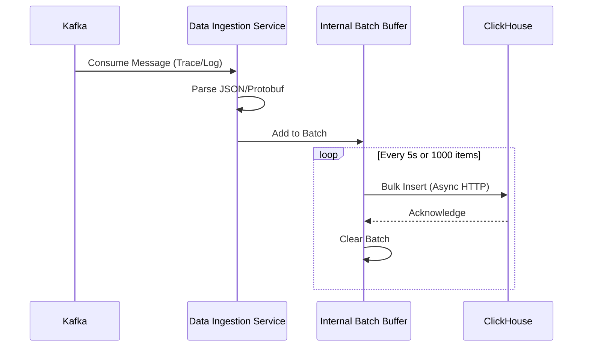
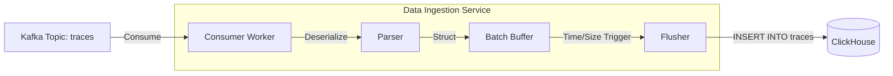
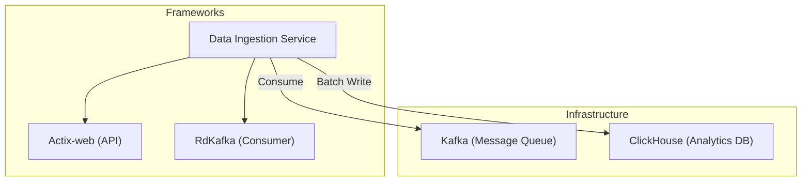

# Data Ingestion Service

## 1. Giới thiệu
**Data Ingestion Service** là cổng tiếp nhận dữ liệu tốc độ cao (High-throughput) của hệ thống. Được viết bằng **Rust**, service này đảm bảo việc thu thập Log và Trace từ các nguồn khác nhau (Kafka) và ghi xuống cơ sở dữ liệu phân tích (ClickHouse) một cách hiệu quả nhất.

## 2. Chức năng chính (Key Features)
*   **High Performance Ingestion**: Tiêu thụ message từ Kafka với độ trễ thấp.
*   **Batch Processing**: Gom nhóm (Batching) dữ liệu trước khi insert vào ClickHouse để tối ưu I/O.
*   **Protocol Buffers / JSON Parsing**: Xử lý định dạng dữ liệu Log/Trace phức tạp.

## 3. Kiến trúc & Công nghệ (Technical Stack)
*   **Language**: **Rust**
*   **Web Framework**: Actix-web (cho Healthcheck / Metrics endpoint)
*   **Kafka Client**: `rdkafka` (Rust wrapper for librdkafka)
*   **Database**: ClickHouse (via HTTP/Native interface)
*   **Port**: `8008` (Host) / `8080` (Container)

## 4. API Endpoints
Service chủ yếu chạy background task, chỉ expose endpoint quản trị:

| Method | Endpoint | Mô tả |
| :--- | :--- | :--- |
| `GET` | `/health` | Health Check. Trả về status service và version Rust. |

## 5. Flow hoạt động

### Service Flow Diagram



### Data Flow Graph



### Service Dependencies



## 6. Trạng thái phát triển (Status)
> **Trạng thái: 🟡 Đang phát triển (In Progress)**

### ✅ Đã hoàn thiện (Done)
*   [x] **Core Framework**: 
    *   Actix-web server khởi tạo thành công với Runtime bất đồng bộ.
    *   Healthcheck endpoint `/health` hoạt động ổn định.
*   [x] **Kafka Integration**:
    *   Consumer loop sử dụng `rdkafka` đã được implement.
    *   Kết nối tới Kafka cluster và consume messages từ topic `traces`.
    *   Auto-commit được bật để đảm bảo không mất message.
*   [x] **Database (ClickHouse)**:
    *   HTTP Client (`db.rs`) kết nối tới ClickHouse thành công.
    *   Batch Insert logic đã hoàn thiện với trigger theo size (1000 items) hoặc time (5s).
    *   Async HTTP insert để tối ưu throughput.
*   [x] **Observability**:
    *   Prometheus metrics endpoint tại `/metrics` expose các chỉ số cơ bản.
    *   Health Check endpoint trả về status và version.
    *   Logging với `env_logger` ghi lại các event quan trọng.
*   [x] **Docker Integration**:
    *   Dockerfile đã được tạo và tích hợp vào docker-compose.
    *   Service chạy ổn định trong container environment.

### 🔄 Đang phát triển (In Progress)
*   [ ] **Parsing Logic Enhancement**: 
    *   Hiện tại service chỉ nhận raw string từ Kafka.
    *   Đang thiết kế schema để parse JSON/Protobuf chi tiết.
    *   Cần map chính xác vào các cột trong ClickHouse (trace_id, span_id, input, output, latency, cost).

### ⚠️ Chưa hoàn thiện (TODO)
*   [ ] **Reliability / Error Handling**:
    *   Hiện tại lỗi insert chỉ log ra console, không có retry mechanism.
    *   Cần implement Dead Letter Queue (DLQ) - có thể là file local hoặc Kafka topic riêng.
    *   Cần exponential backoff cho retry logic.
*   [ ] **Configuration Management**: 
    *   Batch Size, Flush Interval đang hardcode trong code.
    *   Cần externalize ra Environment Variables để dễ điều chỉnh.
*   [ ] **Graceful Shutdown**: 
    *   Chưa xử lý signal SIGTERM/SIGINT đúng cách.
    *   Cần flush hết batch đang pending trước khi tắt service.
*   [ ] **Monitoring & Alerting**:
    *   Cần thêm metrics chi tiết: batch_size, flush_duration, error_rate.
    *   Tích hợp với Grafana dashboard để visualize.

## 7. Testing & TDD (Planned)

> **Note**: Hiện tại source code (`src/`) chưa bao gồm các file test. Kế hoạch testing dưới đây sẽ được triển khai trong giai đoạn tiếp theo.

### 1. Framework
*   **Rust Built-in Test**: `cargo test` is the primary tool.
*   **Testcontainers**: For spawning ephemeral Kafka/ClickHouse containers.

### 2. Planned Test Structure
```
data-ingestion/
├── src/
│   ├── lib.rs
│   └── batcher.rs       # Unit tests for Batching Logic
├── tests/               # Integration Tests
│   ├── common/
│   │   └── mod.rs       # Setup Docker Containers
│   └── test_flow.rs     # Full End-to-End Flow
└── Cargo.toml
```

### 3. Key Test Scenarios
| Category | Scenario | Expected Outcome |
| :--- | :--- | :--- |
| **Logic** | **Batch Trigger (Size)** | Send 1000 logs > Buffer Size. System MUST flush multiple times. |
| | **Batch Trigger (Time)** | Send 1 log and wait > timeout. System MUST flush. |
| **Parsing** | **Malformed JSON** | Input: `{"invalid":json"}`. System MUST log error and NOT crash. |
| **Integration** | **ClickHouse Insert** | Verify data inserted into `traces` table matches input JSON. |

### 4. Running Tests (Future)
```bash
# Run unit tests
cargo test --lib

# Run integration tests (requires Docker)
cargo test --test test_flow
```
