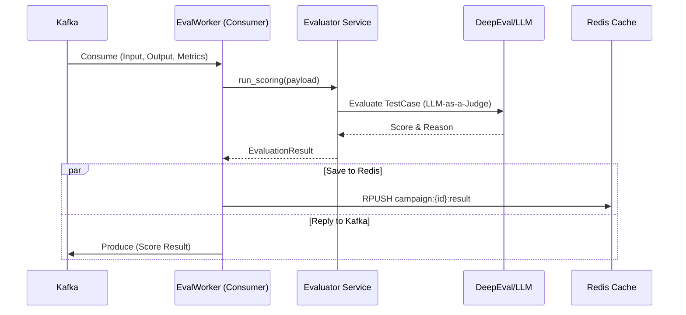
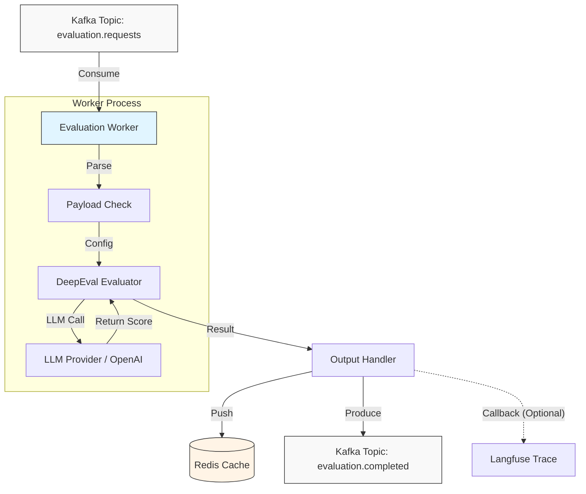
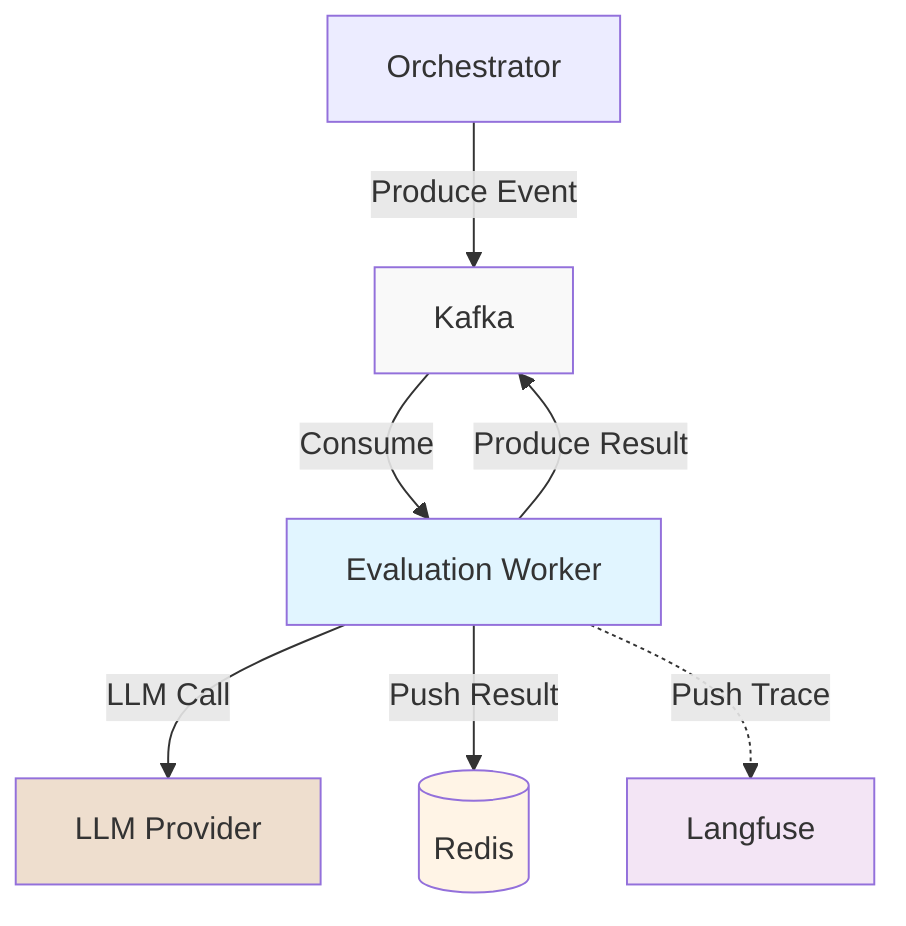

# Evaluation Worker

## 1. Giới thiệu
**Evaluation Worker** là một background worker chuyên biệt cho việc chấm điểm (Scoring) các tương tác hội thoại. Service này hoạt động bất đồng bộ, lắng nghe yêu cầu từ Kafka và sử dụng mô hình LLM-as-a-judge để đánh giá chất lượng câu trả lời.

## 2. Chức năng chính (Key Features)
*   **LLM-as-a-Judge**: Sử dụng LLM để chấm điểm dựa trên các metric định nghĩa trước (DeepEval).
*   **Async Processing**: Xử lý hàng đợi đánh giá qua Kafka, đảm bảo không chặn main thread của Orchestrator.
*   **Metric Support**: Hỗ trợ các metric như Faithfulness, Answer Relevancy, Hallucination, v.v.

## 3. Kiến trúc & Công nghệ (Technical Stack)
*   **Language**: Python 3.10+
*   **Core Library**: **DeepEval**
*   **Messaging**: Kafka Consumer (`aiokafka` / `confluent-kafka`)
*   **Communication**: Giao tiếp với `Orchestrator` qua Kafka Topics.
*   **Port**: `8005` (Host) - Chủ yếu dùng cho Healthcheck, logic chính chạy ngầm.

### Project Structure
```
backend/evaluation-worker/
├── app/
│   ├── consumers/              # Kafka Consumers
│   │   └── kafka_consumer.py   # Main Consumer Loop
│   ├── core/                   # Configuration
│   │   └── config.py           # Environment Variables
│   ├── models/                 # Data Schemas
│   │   └── schemas.py          # Pydantic Models
│   ├── services/               # Business Logic
│   │   └── evaluator.py        # DeepEval Integration
│   └── main.py                 # Entry Point
├── Dockerfile
├── requirements.txt
└── README.md
```

## 4. API & Integration
Service này chủ yếu không expose REST API phức tạp mà hoạt động theo mô hình Event-Driven.

*   `GET /health`: Health Check.

**Kafka Topics:**
*   Input: `evaluation.requests` (Nhận lệnh chấm điểm).
*   Input: `evaluation.requests` (Nhận lệnh chấm điểm).
*   Output: `evaluation.completed` (Trả về kết quả điểm số).
*   Output (Manual): `evaluation.manual_review` (Đẩy ra khi điểm thấp).

## 4. Resource Service API for Manual Review
Frontend sẽ gọi Resource Service để lấy items từ queue này:
*   `GET /resource/reviews/manual-reviews`: Lấy danh sách Pending.
*   `POST /resource/reviews/manual-reviews/{id}/decision`: Duyệt/Từ chối.

## 5. Flow hoạt động

### 5.1. Evaluation Process Flow


### 5.2. Data Flow Graph


### 5.3. Service Dependencies


## 6. Trạng thái phát triển (Status)
> **Trạng thái: 🟢 Production Ready (v1.0)**

### ✅ Đã hoàn thiện (Completed)
*   [x] **Architecture Refactoring**: 
    *   Chuyển đổi sang cấu trúc MVC modular với các layer rõ ràng (Consumer, Service, Model).
    *   Code dễ maintain và mở rộng.
*   [x] **Core Evaluation Engine**: 
    *   Tích hợp DeepEval framework thành công.
    *   Hỗ trợ các metrics chuẩn: Faithfulness, Answer Relevancy, Hallucination Detection.
    *   LLM-as-a-Judge sử dụng OpenAI/DeepSeek để chấm điểm tự động.
*   [x] **Async Processing**: 
    *   Kafka Consumer với aiokafka xử lý message bất đồng bộ.
    *   Batch Processing (batch size: 10) để tối ưu throughput.
    *   Non-blocking I/O đảm bảo hiệu năng cao.
*   [x] **Reliability & Persistence**: 
    *   Redis caching cho kết quả evaluation (key pattern: `campaign:{id}:result`).
    *   Retry mechanism với exponential backoff khi LLM API timeout.
    *   Error handling toàn diện, không crash khi gặp lỗi.
*   [x] **Human-in-the-loop (FR-05)**:
    *   Confidence Threshold Check (mặc định: 0.5).
    *   Tự động route các item có điểm thấp hoặc confidence thấp vào queue `evaluation.manual_review`.
    *   Metadata tracking để frontend hiển thị lý do cần review.
*   [x] **Langfuse Integration**:
    *   Push trace data vào Langfuse để theo dõi quá trình evaluation.
    *   Callback mechanism ghi lại toàn bộ LLM calls.
*   [x] **Docker Deployment**:
    *   Dockerfile và docker-compose configuration hoàn chỉnh.
    *   Service chạy ổn định với replicas support.
*   [x] **Red Teaming Evaluation (FR-04)**:
    *   Safety Metrics implementation (Toxicity, PII Leakage, Bias Detection).
    *   Severity classification logic (Critical, High, Medium, Low).
    *   Refusal detection để tránh false positives.
    *   Automated vulnerability assessment cho adversarial attacks.

### 🔄 Đang phát triển / Roadmap
1.  **Metric Expansion**:
    *   [ ] Custom Metrics cho các domain cụ thể (Code Quality, Compliance, Safety).
    *   [ ] Support cho user-defined metrics qua configuration.
2.  **Performance Optimization**:
    *   [ ] Parallel evaluation cho multiple test cases.
    *   [ ] Caching LLM responses để giảm cost và latency.
3.  **Dashboard Integration**:
    *   [ ] Real-time metrics streaming qua WebSocket.
    *   [ ] API endpoints để frontend pull aggregated metrics từ Redis/ClickHouse.

### 🔗 Dependencies
```toml
[tool.poetry.dependencies]
python = "^3.10"
fastapi = "^0.104.0"
aiokafka = "^0.8.1"
deepeval = "^0.21.0"
redis = "^5.0.1"
pydantic-settings = "^2.0.0"
```

## 7. Testing & TDD

We follow the **Test Driven Development (TDD)** approach.

### 1. Framework
*   **Pytest**: Main testing framework.
*   **DeepEval Mocks**: Avoid calling real OpenAI API for unit tests.

### 2. Test Structure
```
tests/
├── unit/
│   ├── test_metrics_logic.py # Verify custom metric formulas
│   └── test_faithfulness.py  # Mocked Hallucination checks
├── integration/
│   ├── test_kafka_consumer.py
│   └── test_redis_push.py
└── conftest.py
```

### 3. Detailed Test Scenarios (from BRD)
| Category | Scenario | Expected Outcome |
| :--- | :--- | :--- |
| **Metric Accuracy** | **Answer Relevancy** (Metric) | Input: "What is 2+2?", Output: "Paris is capital of France". Score MUST be < 0.2. |
| | **Faithfulness** (RAG) | Input Context: "Apple is red". Output: "Apple is blue". Score MUST be 0.0 (Hallucination detected). |
| **Performance** | **Batch Evaluation** | Process 50 test cases. Total time < 2 minutes (using Async Batching). |
| **Error Handling** | LLM API Timeout | System MUST retry 3 times (Exponential Backoff) before marking as ERROR. |
| **Logic** | **Low Confidence** (FR-05) | If score between 0.3 - 0.5, Flag as `NEEDS_HUMAN_REVIEW` in Metadata. |

### 4. Running Tests
```bash
pytest
```
