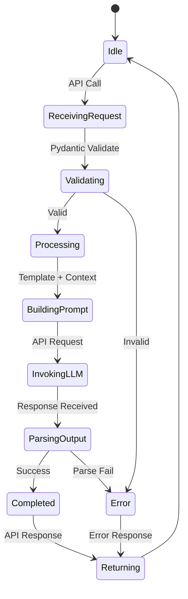
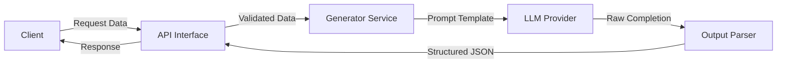
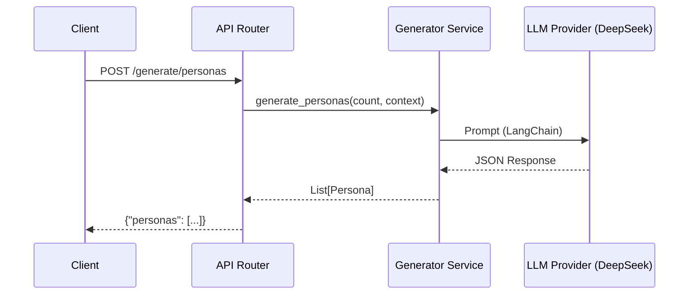
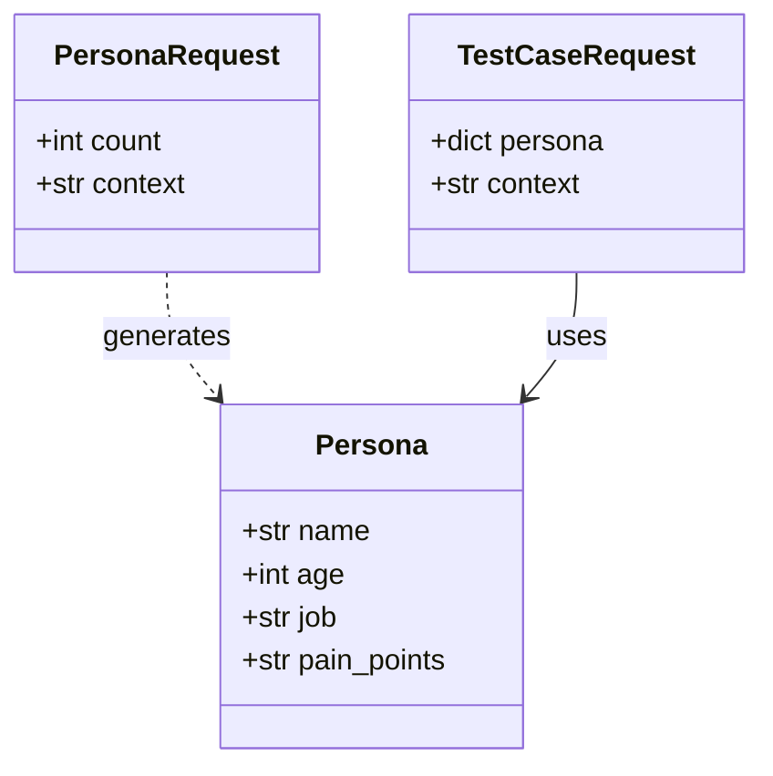
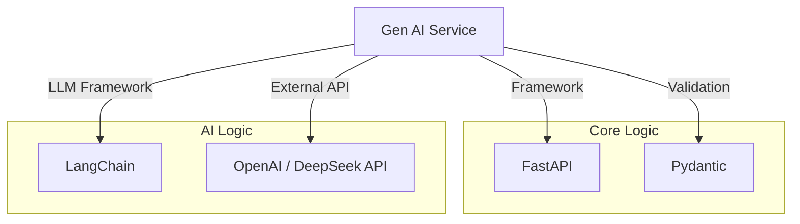

# Gen AI Service

## 1. Giới thiệu
**Gen AI Service** tận dụng sức mạnh của Generative AI để tự động sinh dữ liệu kiểm thử, giúp giảm thiểu công sức cấu hình thủ công. Service này có khả năng tạo ra các Persona (nhân vật giả lập) và Test Cases từ tài liệu nghiệp vụ.

## 2. Chức năng chính (Key Features)
*   **Persona Generation**: Sinh các nhân vật giả lập (User Personas) với tính cách, mục tiêu và hành vi cụ thể dựa trên ngữ cảnh (VD: "Khách hàng khó tính", "Người dùng mới").
*   **Test Case Generation**: Sinh các kịch bản test (Input prompts) dựa trên Persona và tài liệu.
*   **Synthetic Data**: Hỗ trợ tạo dữ liệu giả lập (Goldens) cho RAG Testing.

## 3. Kiến trúc & Công nghệ (Technical Stack)
*   **Language**: Python 3.10+
*   **Framework**: FastAPI
*   **AI Logic**: `LangChain`, `OpenAI API`
*   **Port**: `8000` (Host - Updated code runs on 8000)

## 4. Cấu Trúc Thư Mục (Code Structure)

Mã nguồn đã được refactor theo cấu trúc modular để dễ dàng mở rộng và bảo trì:

```
backend/gen-ai-service/
├── app/
│   ├── api/
│   │   └── routes/         # Chứa API routes (gen_ai.py)
│   ├── core/               # Core logic, utils (logging, config)
│   ├── models/             # Pydantic models (Schemas)
│   ├── services/           # Business logic (LLM Generators)
│   └── main.py             # Entry point
├── Dockerfile
└── README.md
```

## 5. API Endpoints

> **Interactive API Documentation:** [https://api.langeval.space/gen-ai/docs](https://api.langeval.space/gen-ai/docs)

| Method | Endpoint | Mô tả |
| :--- | :--- | :--- |
| `GET` | `/health` | Health Check. |
| `POST` | `/generate/personas` | Sinh danh sách Persona. Input: `count`, `context`. |
| `POST` | `/generate/test-cases` | Sinh danh sách Test Cases cho một Persona cụ thể. |

## 6. Diagrams (Quy trình hoạt động)

### Process Flow (State Diagram)

Hành trình xử lý một request điển hình:



### Data Flow Graph

Luồng dữ liệu giữa các thành phần:



### Sequence Diagram (Chi tiết tương tác)



### Class Diagram (Models)



### Service Dependencies



## 7. Hướng dẫn chạy (Getting Started)

### Local Development

```bash
# Cài đặt dependencies
pip install -r requirements.txt

# Chạy server
uvicorn app.main:app --host 0.0.0.0 --port 8000 --reload
```

### Docker

```bash
docker build -t gen-ai-service .
docker run -p 8000:8000 gen-ai-service
```

## 8. Trạng thái phát triển (Status)
> **Trạng thái: 🟢 Production Ready (v1.0)**

### ✅ Đã hoàn thiện (Completed Features)
*   [x] **Core Framework**: 
    *   FastAPI application với modular structure (api/routes, services, models, core).
    *   LangChain integration cho LLM orchestration.
    *   Pydantic models cho validation và type safety.
*   [x] **Persona Generation**: 
    *   API endpoint `/generate/personas` sinh nhân vật giả lập từ context.
    *   Hỗ trợ customize số lượng personas và business context.
    *   Output format chuẩn với name, age, job, pain_points.
*   [x] **Test Case Generation**: 
    *   API endpoint `/generate/test-cases` sinh kịch bản test tự động.
    *   Dựa trên persona và context để tạo test cases phù hợp.
    *   Evolutionary generation để tạo variations phức tạp.
*   [x] **RAG Integration (FR-03)**:
    *   PDF Upload & Parsing sử dụng `PyMuPDF` (`PyPDFLoader`).
    *   Vector Store với `ChromaDB` cho semantic search.
    *   Document chunking với configurable strategy.
    *   **Storage Integration**: Upload file lên **MinIO/S3** (`app/core/storage.py`).
    *   Generate QA pairs từ PDF documents với context preservation.
*   [x] **Prompt Optimization (FR-07)**: 
    *   Thuật toán GEPA implementation (`app/services/optimizer.py`).
    *   Tự động tối ưu prompt qua multiple generations.
    *   Scoring mechanism để đánh giá prompt quality.
*   [x] **Docker Deployment**:
    *   Dockerfile với Python 3.10 slim base.
    *   Environment variables configuration.
    *   Tích hợp vào docker-compose stack.

### 🔄 Đang phát triển / Roadmap
1.  **Synthetic Data Quality Metrics**:
    *   [ ] Tích hợp DeepEval để tự chấm điểm chất lượng dữ liệu sinh ra.
    *   [ ] Self-check mechanism trước khi return data cho user.
    *   [ ] Quality threshold configuration.
2.  **Advanced RAG Integration**:
    *   [ ] Hybrid Search (Keyword + Vector) để cải thiện độ chuẩn xác.
    *   [ ] Re-ranking results với cross-encoder models.
    *   [ ] Multi-document synthesis cho complex scenarios.
3.  **Enhanced Prompt Optimization**:
    *   [ ] Upgrade lên MIPROv2 algorithm.
    *   [ ] A/B testing framework cho prompt variations.
    *   [ ] Automatic prompt versioning và rollback.

## 9. Testing & TDD

We follow the **Test Driven Development (TDD)** approach.

### 1. Framework
*   **Pytest**: Main testing framework.
*   **LangChain Eval**: For evaluating prompt outputs quality.

### 2. Test Structure
```
tests/
├── unit/
│   ├── test_synthesizer.py  # Test evolutionary logic (DeepEval)
│   ├── test_pdf_parser.py   # Test PyPDFLoader
│   └── test_prompt_opt.py   # Test GEPA/MIPROv2 algorithms
├── integration/
│   ├── test_openai_api.py   # Mocked OpenAI responses
│   └── test_s3_upload.py    # MinIO persistence
└── conftest.py
```

### 3. Detailed Test Scenarios (from BRD)
| Category | Scenario | Expected Outcome |
| :--- | :--- | :--- |
| **Synthetic Data** | **Evolutionary Generation** (FR-03) | Given a simple question "What is AI?", System MUST generate 5 complex variations (Adding constraints, reasoning). |
| | **RAG Context** | Upload PDF. Generated QA pair MUST be verifiable against text chunks in PDF. |
| **Prompt Opt** | **GEPA Algorithm** | (FR-07) Run 10 generations of prompt mutation. Final prompt score MUST be > Initial prompt score. |
| **Integration** | **S3 Upload** | Upload 50MB PDF. File MUST appear in MinIO bucket `raw-documents`. |

### 4. Running Tests
```bash
pytest
```
