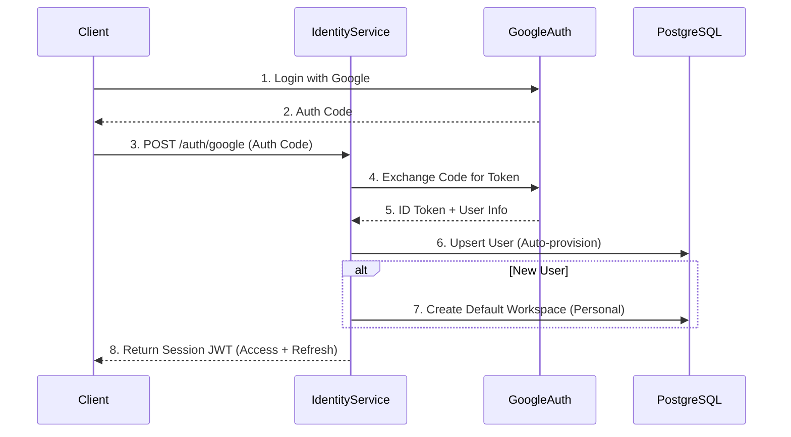

# Identity Service

## 1. Giới thiệu
**Identity Service** là trái tim của hệ thống bảo mật LangEval, chịu trách nhiệm quản lý định danh người dùng, xác thực (Authentication) và phân quyền (Authorization) theo mô hình **Workspaces**. Service này tích hợp chặt chẽ với **Google OAuth 2.0** để cung cấp trải nghiệm đăng nhập đơn giản và bảo mật.

## 2. Key Features
*   **Google OAuth 2.0**: Đăng nhập nhanh chóng bằng tài khoản Google (SSO). [Xem hướng dẫn tạo Credentials](GOOGLE_SETUP.md).
*   **Workspace-based Architecture**: Mô hình tổ chức tài nguyên theo Không gian làm việc (Team/Project).
*   **RBAC (Role-Based Access Control)**: Phân quyền chi tiết trong Workspace (Owner, Editor, Viewer).
*   **Auto-provisioning**: Tự động tạo tài khoản người dùng và Workspace cá nhân khi đăng nhập lần đầu.
*   **Secure Session**: Quản lý phiên làm việc bằng JWT an toàn.

## 3. Tech Stack
*   **Language**: Python 3.10+
*   **Framework**: FastAPI
*   **Database**: PostgreSQL
*   **ORM**: SQLModel (SQLAlchemy + Pydantic)
*   **Auth Library**: `authlib` hoặc `python-jose`
*   **Port**: `8002` (Internal)

## 4. API Endpoints

> **Interactive API Documentation:** [https://api.langeval.space/identity/docs](https://api.langeval.space/identity/docs)

| Method | Endpoint | Mô tả |
| :--- | :--- | :--- |
| **Auth** | | |
| `GET` | `/health` | Health Check. |
| `POST` | `/auth/google` | Trao đổi Authorization Code lấy Access Token & ID Token. |
| `POST` | `/auth/refresh` | Làm mới Session Token. |
| `GET` | `/me` | Lấy thông tin Profile và Workspace mặc định. |
| **Workspace** | | |
| `GET` | `/workspaces` | Danh sách Workspace của User. |
| `POST` | `/workspaces` | Tạo Workspace mới. |
| `POST` | `/workspaces/{id}/invite` | Mời thành viên vào Workspace. |
| `PATCH` | `/workspaces/{id}/roles` | Cập nhật quyền (Role) của thành viên. |

## 5. Authentication Flow (Google OAuth)



---

## 6. Trạng thái phát triển (Development Status)

> **Trạng thái tổng thể: 🟡 Đang phát triển (Active Development)**
> Mục tiêu: Hoàn thiện hệ thống quản lý Workspace và phân quyền trong Q1.

### ✅ Đã hoàn thiện (Completed) v0.9
*   [x] **Project Foundation**:
    *   Cấu trúc dự án FastAPI chuẩn, tích hợp SQLModel.
    *   Docker & Docker Compose setup.
*   [x] **Authentication (Google OAuth 2.0)**:
    *   Tích hợp `google-auth` library để verify ID Token.
    *   Endpoint `/auth/google` xử lý login/register tự động.
    *   Logic **Auto-provisioning**: Tự động tạo User và "Personal Workspace" khi đăng nhập lần đầu.
    *   Quản lý phiên sử dụng JWT.
*   [x] **Basic Workspace CRUD**:
    *   [x] API `GET /workspaces`: Liệt kê danh sách Workspace mà User tham gia.
    *   [x] API `POST /workspaces`: Tạo Workspace mới (Team Workspace).
    *   [x] API `GET /me`: Lấy thông tin Profile cá nhân.

### 🔄 Đang phát triển (In Progress) v0.9.5
*   [ ] **Member Management**:
    *   [x] API `POST /invite`: Mời thành viên dựa trên Email (Hiện tại yêu cầu User mục tiêu phải từng đăng nhập hệ thống).
    *   [ ] API `DELETE /members`: Xóa thành viên khỏi Workspace.
    *   [ ] API `PATCH /members`: Cập nhật quyền (Role) của thành viên.
*   [ ] **Robust Invitation Flow**:
    *   [ ] Hỗ trợ mời người dùng chưa có tài khoản (Pending Invites).
    *   [ ] Gửi Email thông báo mời tham gia.

### 📝 Sẽ thực hiện (To Do) v1.0
Đây là các tính năng cần làm để đạt mốc Release 1.0:

1.  **Authorization Middleware**:
    *   [ ] Viết Dependency `verify_workspace_permission(action)` để chặn truy cập trái phép ở Resource Service.
    *   [ ] Tích hợp Workspace context vào mọi API call của các service khác.
2.  **Security Hardening**:
    *   [ ] Rate Limiting cho Auth endpoints.
    *   [ ] Refresh Token logic (Endpoint đã khai báo nhưng chưa implement logic rotate).
    *   [ ] Audit Log ghi lại các thay đổi quan trọng (Thêm/Xóa thành viên).
3.  **UI Integration**:
    *   [ ] Hoàn thiện trang Settings/Team trên giao diện để gọi các API mới này.

## 7. Hướng dẫn chạy (Development)

```bash
# 1. Cài đặt dependency
cd langeval-core/identity-service
pip install -r requirements.txt

# 2. Setup Database
docker-compose up -d postgres
alembic upgrade head

# 3. Chạy Server (Hot reload)
uvicorn app.main:app --reload --port 8002
```
