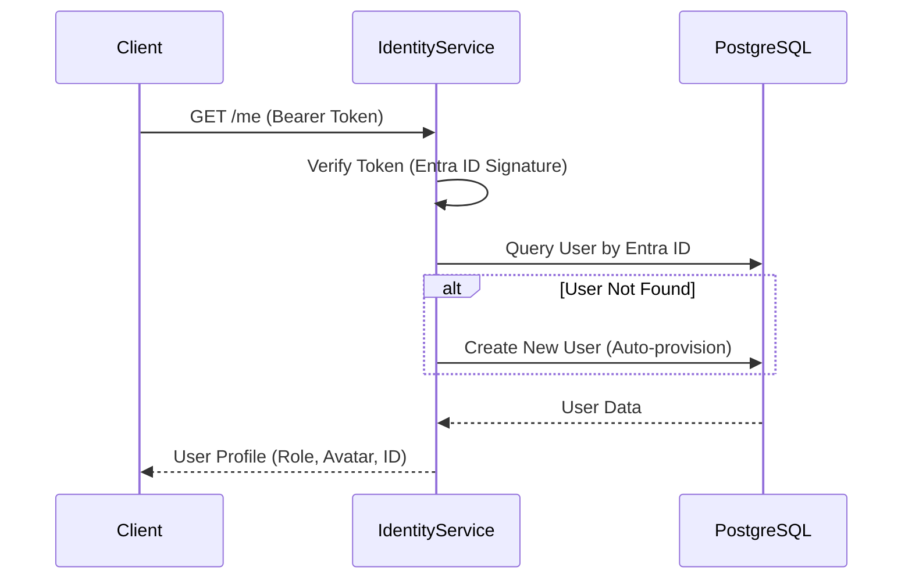

# Identity Service

## 1. Giới thiệu
**Identity Service** quản lý định danh người dùng, xác thực (Authentication) và phân quyền (Authorization) cho toàn bộ hệ thống. Service này tích hợp chặt chẽ với Microsoft Entra ID (trước đây là Azure AD).

## 2. Chức năng chính (Key Features)
*   **User Management**: Quản lý thông tin người dùng, tự động tạo user mới (Auto-provisioning) khi đăng nhập lần đầu.
*   **Authentication**: Xác thực Token từ Entra ID (OIDC).
*   **Role-Based Access Control (RBAC)**: Phân quyền người dùng (SYS_ADMIN, WS_OWNER, STAKEHOLDER, v.v.).
*   **Team Management (Planned)**: Quản lý thành viên trong dự án.

## 3. Kiến trúc & Công nghệ (Technical Stack)
*   **Language**: Python 3.10+
*   **Framework**: FastAPI
*   **Database**: PostgreSQL
*   **ORM**: SQLAlchemy / SQLModel
*   **Security**: `fastapi-security`, `jwt`
*   **Port**: `8001` (Host)

## 4. API Endpoints

| Method | Endpoint | Mô tả |
| :--- | :--- | :--- |
| `GET` | `/health` | Health Check. |
| `GET` | `/me` | Lấy thông tin profile của user hiện tại (Decode from Token & DB lookup). |

## 5. Flow hoạt động



## 6. Trạng thái phát triển (Status)
> **Trạng thái: 🟡 Đang phát triển (In Progress)**

### ✅ Đã hoàn thiện (Completed)
*   [x] **Project Foundation**: 
    *   FastAPI application structure với SQLAlchemy/SQLModel.
    *   Database models cho User, Team, Role.
    *   Alembic migrations setup.
*   [x] **Authentication Core**: 
    *   JWT Token verification với Microsoft Entra ID.
    *   Token signature validation.
    *   Secure token parsing và claims extraction.
*   [x] **Auto-provisioning**: 
    *   Logic tự động tạo user mới khi đăng nhập lần đầu.
    *   Sync thông tin từ Entra ID (email, name, avatar).
    *   Default role assignment.
*   [x] **User Profile API**: 
    *   Endpoint `GET /me` trả về thông tin user hiện tại.
    *   Database lookup và caching.
*   [x] **Docker Integration**:
    *   Dockerfile và docker-compose configuration.
    *   PostgreSQL connection pooling.

### 🔄 Đang phát triển (In Progress)
*   [ ] **RBAC Middleware**: 
    *   Đang thiết kế middleware kiểm tra quyền trên từng endpoint.
    *   Permission decorator cho route handlers.

### ⚠️ Chưa hoàn thiện (TODO - Gap Analysis)
Dựa trên yêu cầu hệ thống, các module sau cần bổ sung:

1.  **Team Management APIs**: 
    *   [ ] `POST /team/invite`: API mời thành viên mới vào team.
    *   [ ] `PATCH /team/role`: Cập nhật role của thành viên.
    *   [ ] `GET /team/members`: List members trong team.
    *   [ ] `DELETE /team/members/{id}`: Remove member khỏi team.
2.  **Fine-grained RBAC**: 
    *   [ ] RBAC hiện tại mới chỉ có Model UserRole, chưa apply middleware.
    *   [ ] Cần implement permission checks trên từng resource (VD: Chỉ ADMIN được xóa Project).
    *   [ ] Resource-level permissions (Owner, Editor, Viewer).
3.  **API Key Management (FR-06)**: 
    *   [ ] `GET /identity/api-keys`: List API keys của user.
    *   [ ] `POST /identity/api-keys`: Generate new API key.
    *   [ ] `DELETE /identity/api-keys/{id}`: Revoke API key.
    *   [ ] API key encryption và secure storage.
4.  **Audit Logging**:
    *   [ ] Track user actions (login, permission changes).
    *   [ ] Integration với ClickHouse cho audit trail.

## 7. Testing & TDD

We follow the **Test Driven Development (TDD)** approach.

### 1. Framework
*   **Pytest**: Main testing framework.
*   **Pytest-Cov**: Coverage reporting.

### 2. Test Structure
```
tests/
├── unit/               # Isolated Logic Tests
│   ├── test_auth.py    # JWT decoding, Token validation
│   └── test_rbac.py    # Role checking logic (ADMIN vs USER)
├── integration/        # Service-Level Tests
│   ├── test_api_auth.py  # Full login flow (Mocked Entra)
│   └── test_api_teams.py # Team invites & Role updates
└── conftest.py         # Mock Fixtures (DB, Entra Keys)
```

### 3. Detailed Test Scenarios (from BRD)
These scenarios MUST be automated in TDD:

| Category | Scenario | Expected Outcome |
| :--- | :--- | :--- |
| **Authentication** | User logs in with valid Entra ID Token | Auto-provision user in DB if not exists. Return Session Token. |
| | User logs in with expired/invalid Token | Return 401 Unauthorized. Do NOT create user. |
| **RBAC** (FR-05) | User with role `STAKEHOLDER` tries to delete Project | Return 403 Forbidden. Access Denied. |
| | User with role `SYS_ADMIN` invites new member | Send invitation email. Create pending user record. |
| **Security** | API Key Generation (FR-06) | Revoke old key immediately. Generate new SK. |

### 4. Running Tests
```bash
# Run unit tests
pytest tests/unit

# Run full suite
pytest
```
