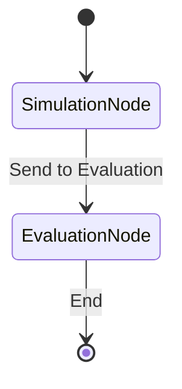
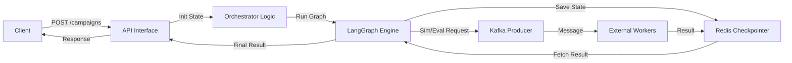
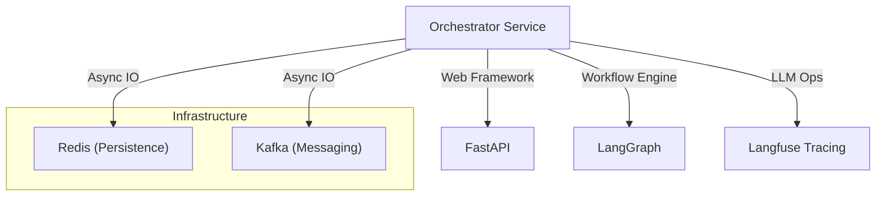
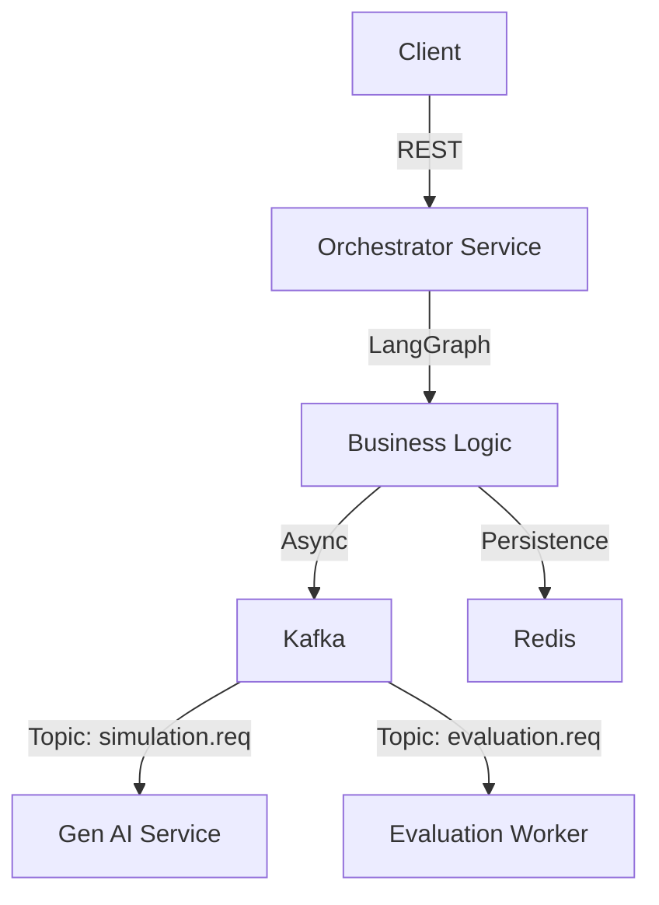
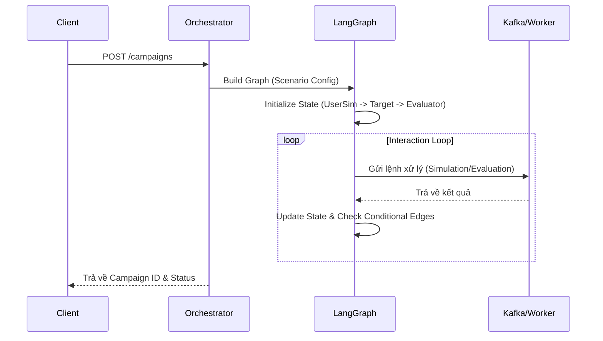

# Orchestrator Service

## 1. Giới thiệu
**Orchestrator Service** là trái tim của hệ thống đánh giá AI Agent. Service này chịu trách nhiệm điều phối toàn bộ quy trình kiểm thử (Campaign) sử dụng **LangGraph** để quản lý trạng thái (State Machine) của các kịch bản test phức tạp.

## 2. Chức năng chính (Key Features)
*   **Quản lý Campaign**: Khởi tạo và điều phối các đợt kiểm thử.
*   **State Machine Management**: Sử dụng `LangGraph` để định nghĩa và thực thi luồng tương tác giữa User Simulator, Target Bot và Evaluator.
*   **Workflow Persistence**: Lưu trữ trạng thái của luồng test vào Redis (Checkpointer), cho phép "Time Travel" và retry.
*   **Integration**:
    *   Kết nối với **Langfuse** để tracing toàn bộ quá trình suy luận.
    *   Gửi lệnh giả lập (Simulation Requests) qua Kafka.

## 3. Kiến trúc & Công nghệ (Technical Stack)
*   **Language**: Python 3.10+
*   **Framework**: FastAPI
*   **Core Library**: `langgraph`, `langchain`
*   **Database/Storage**:
    *   **Redis**: Lưu trữ Graph State (Checkpointer).
*   **Message Queue**: **Kafka** (để gửi event cho các worker).
*   **Port**: `8001` (Host) / `8000` (Container)

## 4. Cấu Trúc Thư Mục (Code Structure)

Mã nguồn được tổ chức theo kiến trúc modular:

```
backend/orchestrator/
├── app/
│   ├── api/
│   │   └── routes/         # API Controllers (campaigns.py)
│   ├── core/               # Core Resources (Kafka, Redis)
│   ├── models/             # Pydantic Schemas & State TypedDict
│   ├── services/           # Business Logic
│   │   ├── workflow.py     # LangGraph Building
│   │   └── checkpointer.py # Persistence Logic
│   └── main.py             # App Entrypoint
├── Dockerfile
└── README.md
```

## 5. API Endpoints

> **Interactive API Documentation:** [https://api.langeval.space/orchestrator/docs](https://api.langeval.space/orchestrator/docs)

| Method | Endpoint | Mô tả |
| :--- | :--- | :--- |
| `GET` | `/orchestrator/health` | Kiểm tra trạng thái hoạt động của service. |
| `POST` | `/orchestrator/campaigns` | Khởi tạo một Campaign mới. Payload bao gồm `scenario_id` và `metadata`. |
| `GET` | `/orchestrator/campaigns/{id}/state` | (TODO) Lấy trạng thái hiện tại của một Campaign đang chạy. |

## 6. Diagrams (Quy trình hoạt động)

### State Diagram (LangGraph Workflow)



### Data Flow Graph



### Service Dependencies


### System Context



### Sequence Diagram (Campaign Flow)



## 7. Hướng dẫn chạy (Getting Started)

### Local Development

```bash
# Cài đặt dependencies
pip install -r requirements.txt

# Chạy server
uvicorn app.main:app --host 0.0.0.0 --port 8002 --reload
```

### Docker

```bash
docker build -t orchestrator .
docker run -p 8002:8002 orchestrator
```

## 8. Trạng thái phát triển (Status)
> **Trạng thái: 🟢 Production Ready (v1.0)**

### ✅ Đã hoàn thiện (Completed)
*   [x] **Project Foundation**: 
    *   FastAPI application với modular structure.
    *   Docker và docker-compose configuration hoàn chỉnh.
    *   Environment variables management.
*   [x] **Code Refactoring**: 
    *   Chuyển đổi sang cấu trúc modular (api/routes, services, models, core).
    *   Separation of concerns rõ ràng.
    *   Maintainable và scalable codebase.
*   [x] **LangGraph Integration**: 
    *   Core workflow engine (`app/services/workflow.py`).
    *   State management với TypedDict.
    *   Node và Edge definition.
*   [x] **Campaign Management**: 
    *   API `POST /orchestrator/campaigns` để khởi tạo campaign.
    *   Campaign lifecycle management.
    *   Status tracking và updates.
*   [x] **Dynamic Graph Builder**: 
    *   `build_dynamic_graph` function hỗ trợ cấu hình node động từ JSON.
    *   Flexible scenario configuration.
    *   Support cho custom node types.
*   [x] **Redis Persistence**: 
    *   `RedisSaver` implementation (`app/services/checkpointer.py`).
    *   Checkpoint và State persistence.
    *   Time-travel debugging capability.
    *   State recovery sau restart.
*   [x] **Async Kafka Integration**: 
    *   Kafka Producer/Consumer logic bất đồng bộ.
    *   Event-driven communication với workers.
    *   Topics: `simulation.requests`, `evaluation.requests`.
    *   Error handling và retry mechanism.
*   [x] **Cyclic Logic (Self-correction)**: 
    *   `check_retry` conditional edge implementation.
    *   Tự động retry khi evaluation score thấp.
    *   Max retry limit để tránh infinite loop.
    *   Graceful degradation khi vượt quá retry limit.
*   [x] **Langfuse Integration**:
    *   Tracing toàn bộ workflow execution.
    *   LLM call tracking.
    *   Performance monitoring.
*   [x] **Red Teaming Workflow (FR-04)**:
    *   `build_red_teaming_graph` implementation với specialized state machine.
    *   Adversarial attack orchestration (Jailbreak, Prompt Injection, PII Leakage, Toxicity).
    *   Integration với Evaluation Worker để phân loại severity levels.
    *   Real-time progress tracking và database updates.
    *   Automated probe generation và attack execution loop.
*   [x] **Multi-Language Support (Localization)**:
    *   `language` parameter support trong Campaign workflows.
    *   Dynamic instruction generation dựa trên ngôn ngữ (English/Vietnamese).
    *   Language propagation qua Kafka messages đến Workers.
    *   Metadata tracking cho language preferences.

### 🔄 Đang phát triển / Roadmap
1.  **Streaming Logs (FR-08)**:
    *   [ ] WebSocket/SSE endpoint để stream campaign progress.
    *   [ ] Real-time state updates cho frontend.
2.  **Advanced Monitoring**:
    *   [ ] Prometheus metrics export.
    *   [ ] Grafana dashboard templates.
    *   [ ] Alert rules cho failure scenarios.
3.  **Multi-Campaign Orchestration**:
    *   [ ] Parallel campaign execution.
    *   [ ] Resource allocation và queuing.
    *   [ ] Priority-based scheduling.

## 9. Testing & TDD

We follow the **Test Driven Development (TDD)** approach for complex State Machine logic.

### 1. Framework
*   **Pytest**: Main framework.
*   **LangGraph Studio**: Visual debugging (Optional).
*   **Testcontainers**: For Kafka/Redis integration tests.

### 2. Test Structure
```
tests/
├── unit/
│   ├── test_workflow_state.py   # Verify Graph nodes & edges
│   ├── test_checkpointer.py     # Redis serialization logic
│   └── test_campaign_manager.py # CRUD logic
├── integration/
│   ├── test_flow_happy_path.py  # User -> Bot -> Eval -> End
│   ├── test_flow_cyclic.py      # User -> Bot -> Eval(Fail) -> User (Retry)
│   └── test_kafka_events.py     # Event production verification
└── conftest.py
```

### 3. Detailed Test Scenarios (from BRD)
| Category | Scenario | Expected Outcome |
| :--- | :--- | :--- |
| **State Machine** | **Cyclic Graph (Self-Correction)** | If Evaluator returns `score < 0.5`, graph MUST transition back to `UserSimulator` node (retry_count + 1). |
| | **Max Retry Limit** | If loop count > 5, graph MUST transition to `END` node with status `FAILED`. |
| **Persistence** | **Time Travel Debugging** | Stop execution at Step 3. Resume from Redis state. Context must be preserved perfectly. |
| **Integration** | **Kafka Failure** | If Kafka Broker is down during event publish, system MUST retry (Exponential Backoff) or log ERROR (Prevent Crash). |
| **Logic** | **Parallel Campaigns** | Run 10 campaigns simultaneously. Ensure Redis keys do not collide (`campaign:{id}`). |

### 4. Running Tests
```bash
# Run unit tests
pytest tests/unit

# Run specific cyclic flow test
pytest tests/integration/test_flow_cyclic.py
```
