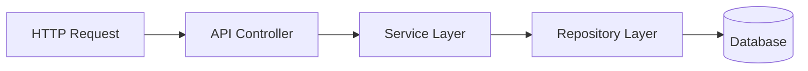
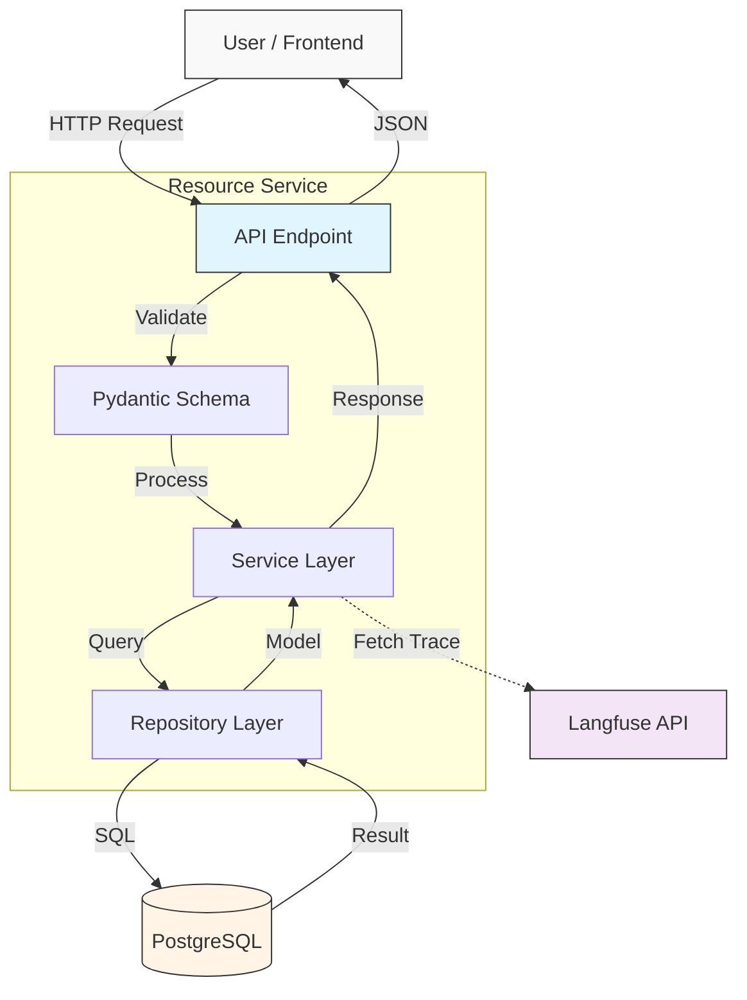
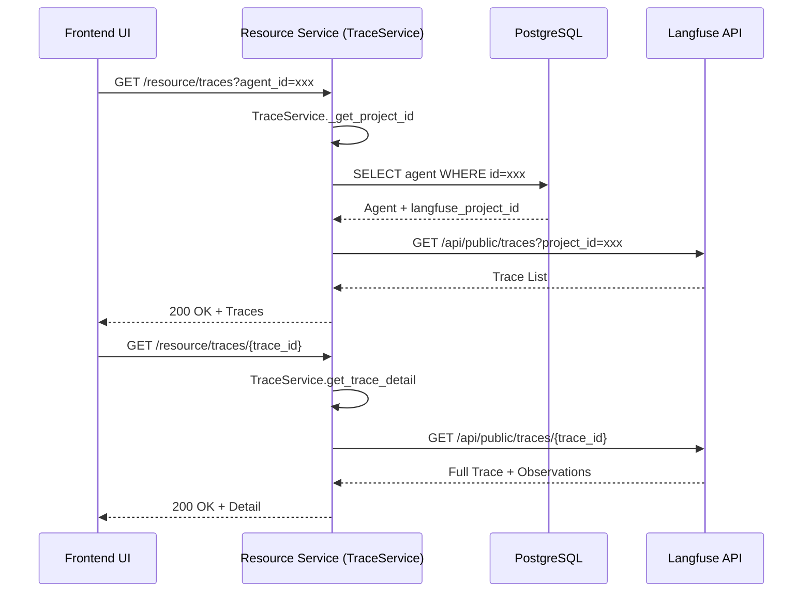
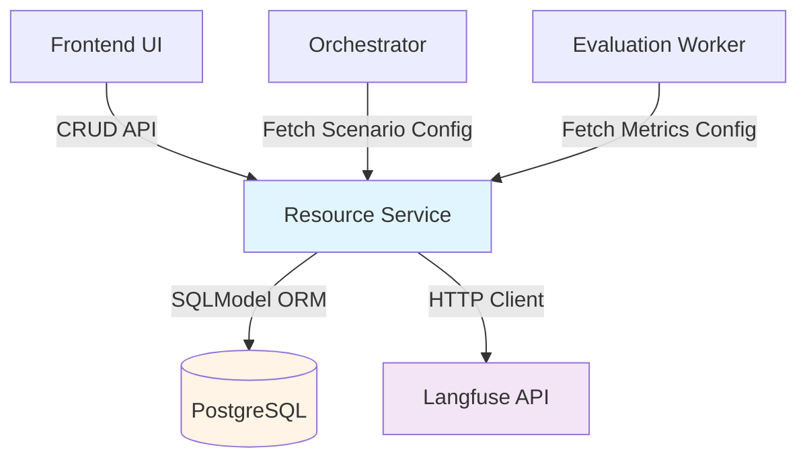

# Resource Service

## 1. Giới thiệu
**Resource Service** đóng vai trò là "Kho quản lý tài nguyên" trung tâm. Service này cung cấp các API CRUD (Create, Read, Update, Delete) cho các thực thể nghiệp vụ chính như Agents, Knowledge Bases, Scenarios và Models.

## 2. Chức năng chính (Key Features)
*   **Agent Management**: Quản lý cấu hình Chatbot/Agent cần test (LLM Config, Prompt, v.v.).
*   **Knowledge Base Management**: Quản lý tài liệu tham khảo cho Agent (RAG).
*   **Scenario Management**: Quản lý kịch bản kiểm thử (Test Flow Definition).
*   **Model Management**: Quản lý thông tin các model LLM được hỗ trợ.
*   **Metrics Management**: Cấu hình các tiêu chí đánh giá (Custom Metrics).

## 3. Kiến trúc & Công nghệ (Technical Stack)
**Design Pattern**: MVC (Model-View-Controller) / Service-Repository Pattern.
*   **Language**: Python 3.10+
*   **Framework**: FastAPI
*   **Database**: PostgreSQL
*   **ORM**: SQLModel (Pydantic + SQLAlchemy)
*   **Port**: `8003` (Host)

### Project Structure (Cấu trúc thư mục)
```
backend/resource-service/
├── app/
│   ├── api/                    # Controllers / Route Handlers
│   │   └── v1/                 # API Version 1
│   │       ├── api.py          # Central Router
│   │       └── endpoints/      # Individual Controllers
│   ├── core/                   # Configuration & Database
│   │   ├── config.py           # Environment Variables
│   │   └── database.py         # DB Setup
│   ├── models/                 # Data Models
│   │   └── domain.py           # SQLModel Classes
│   ├── repositories/           # Database Access Layer (Ex: CRUD)
│   │   └── base.py             # Generic Repository
│   └── services/               # Business Logic Layer
│       ├── agent_service.py
│       └── ...
├── Dockerfile
├── requirements.txt
└── README.md
```

## 4. API Endpoints

> **Interactive API Documentation:** [https://api.langeval.space/resource/docs](https://api.langeval.space/resource/docs)

Service cung cấp đầy đủ các API CRUD qua prefix `/resource`.

### Agents
*   `GET /resource/agents`: Danh sách Agents.
*   `POST /resource/agents`: Tạo Agent mới.
*   `PUT/DELETE /resource/agents/{id}`: Cập nhật/Xóa Agent.

### Knowledge Bases
*   `GET /resource/knowledge-bases`: Danh sách KB.
*   `POST /resource/knowledge-bases`: Tạo KB mới.
*   `PUT/DELETE /resource/knowledge-bases/{id}`: Cập nhật/Xóa KB.

### Scenarios
*   `GET /resource/scenarios`: Danh sách Kịch bản.
*   `POST /resource/scenarios`: Tạo Kịch bản mới.
*   `GET /resource/scenarios/{id}`: Chi tiết Kịch bản.

### Models & Metrics
*   `GET/POST /resource/models`: Quản lý LLM Models.
*   `GET/POST /resource/metrics-library`: Quản lý Metrics.

## 5. Flow hoạt động

### 5.1. Refactored Architecture Flow
Request -> API Controller -> Service Layer -> Repository Layer -> Database



### 5.2. Data Flow Graph


### 5.3. Trace Integration Flow
Service tích hợp với Langfuse để lấy trace data thông qua `TraceService`.



### 5.4. Service Dependencies


## 6. Trạng thái phát triển (Development Status)
> **Trạng thái tổng quan: 🟢 Production Ready (v1.2)**

### ✅ Đã hoàn thiện (Completed Features)

#### 1. Core Architecture & Models
*   [x] **MVC Architecture**: 
    *   Refactored sang mô hình Service-Repository pattern.
    *   Clear separation: API Layer → Service Layer → Repository Layer → Database.
    *   Maintainable và testable code structure.
*   [x] **SQLModels (Complete)**:
    *   `Agent`: Quản lý cấu hình chatbot với LLM config, endpoint, API key.
    *   `KnowledgeBase`: Quản lý tài liệu RAG với vector DB integration.
    *   `Scenario`: Lưu trữ test scenarios với ReactFlow format (nodes/edges).
    *   `Metric`: Thư viện metrics với config cho DeepEval.
    *   `Model`: Catalog các LLM models được hỗ trợ.
    *   `ManualReview`: Support human-in-the-loop workflow.
*   [x] **API Key Encryption**: 
    *   Mã hóa API Key bằng `cryptography` library (Fernet symmetric encryption).
    *   Secure storage trong PostgreSQL.
    *   Decrypt on-the-fly khi cần sử dụng.
*   [x] **Langfuse Integration**: 
    *   `TraceService` implementation để fetch trace data từ Langfuse API.
    *   Endpoints: `GET /resource/traces`, `GET /resource/traces/{id}`.
    *   Project ID mapping từ Agent configuration.

#### 2. API Endpoints (Full CRUD)
*   [x] **Agents Management**: GET, POST, PUT, DELETE `/resource/agents`.
*   [x] **Knowledge Bases**: GET, POST, PUT, DELETE `/resource/knowledge-bases`.
*   [x] **Scenarios**: GET, POST, PUT, DELETE `/resource/scenarios`.
*   [x] **Models**: GET, POST `/resource/models`.
*   [x] **Metrics Library**: GET, POST `/resource/metrics-library`.
*   [x] **Manual Reviews**: GET, POST `/resource/reviews/manual-reviews`.
*   [x] **Traces**: GET `/resource/traces` (Langfuse integration).

#### 3. Enhancements (v1.2 Updates)
*   [x] **Pagination System**:
    *   Generic `Page[T]` response model với metadata (total, pages, current_page).
    *   Tất cả list endpoints hỗ trợ `page` và `page_size` query params.
    *   Consistent pagination across all resources.
*   [x] **Advanced Validation**:
    *   `ScenarioCreate`: Strict typing cho nodes/edges (Pydantic models thay vì dict).
    *   `AgentCreate`: Regex validator cho `endpoint_url` format.
    *   Input sanitization và type checking.
*   [x] **Knowledge Base Upgrade**:
    *   Fields mới: `vector_db_type` (Chroma/Qdrant/Pinecone).
    *   `vector_db_config` (JSONB) để lưu connection settings.
    *   Support cho external vector databases.
*   [x] **Docker Integration**:
    *   Dockerfile với Python 3.10.
    *   Docker-compose configuration với PostgreSQL dependency.
    *   Environment variables management.
*   [x] **Red Teaming Management (FR-04)**:
    *   `RedTeamingCampaign` model với attack tracking (probes, severity counts).
    *   CRUD APIs: `GET/POST/PATCH /resource/red-teaming/campaigns`.
    *   Real-time stats updates (progress, successful/blocked attacks).
    *   Attack logs persistence với detailed analysis.
*   [x] **Scenario Language Support**:
    *   `language` field trong Scenario metadata.
    *   Language preference storage và retrieval.
    *   Support cho multi-language test scenarios (English/Vietnamese).

### 🔄 Đang phát triển / Roadmap (Pending)

#### High Priority
1.  **Authentication & Authorization**:
    *   [ ] JWT middleware xác thực token từ Identity Service.
    *   [ ] API Gateway integration để verify requests.
    *   [ ] Role-based access control cho endpoints.
    *   **Note**: Hiện tại đang open access cho môi trường dev.

#### Medium Priority
2.  **Standardization & Quality**:
    *   [x] ~~Thống nhất kiểu dữ liệu ID (UUID vs String)~~ → Đã chuyển sang String.
    *   [ ] Chuẩn hóa Error Messages 100% tiếng Việt.
    *   [ ] Unit tests cho Auth Middleware (sau khi implement).
    *   [ ] Integration tests cho Encryption/Decryption.

3.  **Performance Optimization**:
    *   [x] Database query optimization với indexes.
    *   [x] Caching layer cho frequently accessed data.
    *   [x] Connection pooling tuning.

### 📊 Code Coverage
| Component | Status | Coverage | Notes |
|-----------|--------|----------|-------|
| Models | ✅ Complete | 100% | All domain models implemented |
| CRUD APIs | ✅ Complete | 100% | Full REST endpoints |
| Langfuse Integration | ✅ Complete | 100% | Trace fetching working |
| Pagination | ✅ Complete | 100% | Generic implementation |
| Validation | ⚠️ Partial | 70% | Need more edge case tests |
| Auth Middleware | ❌ Missing | 0% | Planned for next sprint |
| Encryption | ⚠️ Partial | 50% | Need unit tests |

### 🐛 Known Issues & Fixes
1.  ~~**UUID Inconsistency**~~ (RESOLVED):
    *   ✅ Đã standardize tất cả IDs về kiểu `String`.
    *   Consistent API responses.

2.  **Error Messages** (IN PROGRESS):
    *   ⚠️ Một số error messages còn tiếng Anh lẫn tiếng Việt.
    *   [ ] TODO: Standardize về tiếng Việt hoàn toàn.

### 🔗 Dependencies
```toml
[tool.poetry.dependencies]
python = "^3.10"
fastapi = "^0.104.0"
sqlmodel = "^0.0.14"
uvicorn = "^0.24.0"
python-dotenv = "^1.0.0"
httpx = "^0.25.0"
```

## 7. Testing & TDD

We follow the **Test Driven Development (TDD)** approach.

### 1. Framework
*   **Pytest**: Main testing framework.
*   **Testcontainers**: Docker containers for real Postgres/Redis integration.

### 2. Test Structure
```
tests/
├── unit/               # Pydantic Validation & Utilities
│   ├── test_models_validation.py # Check regex constraints
│   └── test_crypto_utils.py      # Encryption/Decryption logic
├── integration/        # API Endpoints
│   ├── test_agent_crud.py # Create/Read/Update Agents
│   ├── test_langfuse.py   # Mocked Langfuse API responses
│   └── test_metrics.py    # Metric config CRUD
└── conftest.py
```

### 3. Detailed Test Scenarios (from BRD)

| Category | Scenario | Expected Outcome |
| :--- | :--- | :--- |
| **Data Integrity** | Save Agent with `api_key` in plain text | System MUST encrypt `api_key` before DB Insert using `Vault/KMS`. |
| **Validation** | Create Agent without `llm_config` | Return 422 Unprocessable Entity. |
| **Logic (FR-03)** | Upload PDF Document for Knowledge Base | Parse file, extract text, and chunking (Mocked Vector DB). |
| **Integration** | Fetch Traces from Langfuse (Trace ID not found) | Return 404 cleanly (No crash). |
| **Standardization** | Retrieve Agent Config (UUID vs String ID) | Always return ID as String format in JSON response. |

### 4. Running Tests
```bash
# Run tests
pytest
```
