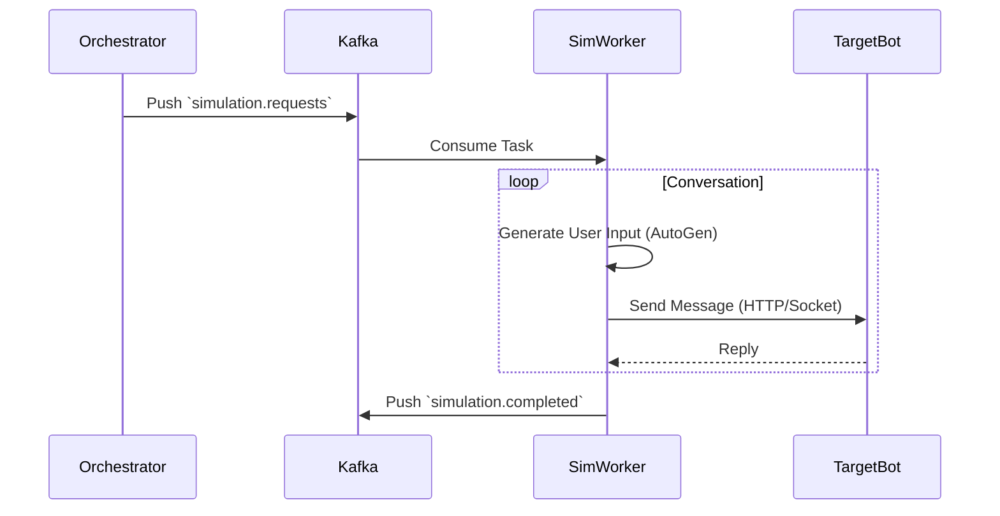
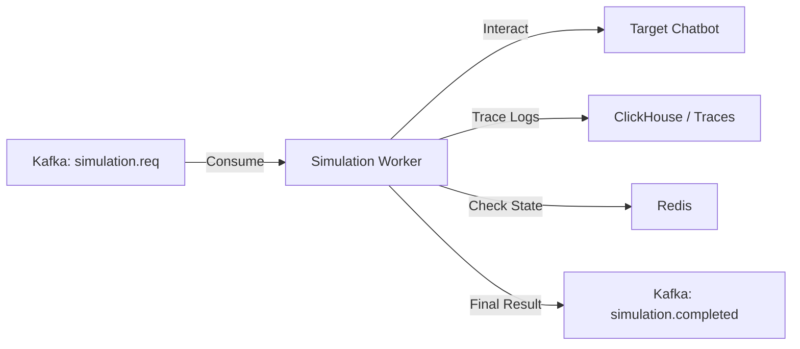
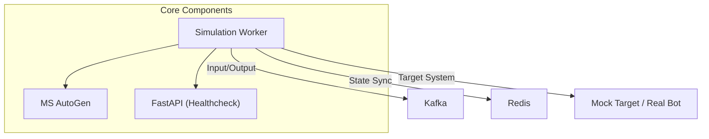

# Simulation Worker

## 1. Giới thiệu
**Simulation Worker** là service chịu trách nhiệm chạy các giả lập người dùng (User Simulator). Service này sử dụng **Microsoft AutoGen** hoặc các Agent framework để đóng vai "người dùng", tương tác tự động với Chatbot mục tiêu để tìm ra lỗi hoặc đánh giá năng lực của Chatbot.

## 2. Chức năng chính (Key Features)
*   **User Simulation**: Đóng vai người dùng với các Persona khác nhau (khó tính, tò mò, thiếu kiên nhẫn...).
*   **Conversable Agents**: Duy trì hội thoại nhiều bước (Multi-turn conversation).
*   **Headless Operation**: Chạy ngầm trong container, nhận lệnh qua Kafka.

## 3. Kiến trúc & Công nghệ (Technical Stack)
*   **Language**: Python 3.10+
*   **Core Library**: **Microsoft AutoGen** / LangChain
*   **Messaging**: Kafka Consumer (`aiokafka`)
*   **Port**: `8004` (Host) / `8000` (Container)

## 4. Cấu Trúc Thư Mục (Code Structure)

```
backend/simulation-worker/
├── app/
│   ├── core/               # Resources (Kafka, Redis)
│   ├── services/           # Simulator Logic (AutoGen)
│   ├── worker.py           # Kafka Consumer Loop
│   └── main.py             # Entry point (FastAPI + Background Task)
├── Dockerfile
└── README.md
```

## 5. API & Integration
Service hoạt động theo mô hình Event-Driven.

*   `GET /health`: Health Check.

**Kafka Topics:**
*   Input: `simulation.requests` (Nhận lệnh bắt đầu giả lập hội thoại).
*   Output: `simulation.completed` (Trả về nội dung hội thoại/kết quả).

## 6. Diagrams (Quy trình hoạt động)

### Sequence Diagram (Worker Loop)



### Data Flow Graph



### Service Dependencies



## 7. Hướng dẫn chạy (Getting Started)

### Local Development

```bash
# Cài đặt dependencies
pip install -r requirements.txt

# Chạy server
uvicorn app.main:app --host 0.0.0.0 --port 8004 --reload
```

### Docker

```bash
docker build -t simulation-worker .
docker run -p 8004:8004 simulation-worker
```

## 8. Trạng thái phát triển (Status)
> **Trạng thái: 🟢 Production Ready (v1.0)**

### ✅ Đã hoàn thiện (Completed)
*   [x] **Core Framework**: 
    *   Kafka Consumer với `aiokafka` xử lý messages bất đồng bộ.
    *   AutoGen integration cho conversational agents.
    *   FastAPI server với healthcheck endpoint.
*   [x] **Architecture**: 
    *   Modular Design với Service/Worker pattern.
    *   Clear separation: Consumer → Service → Agent Factory.
    *   Maintainable và extensible codebase.
*   [x] **Red Teaming (FR-04)**: 
    *   Adversarial persona implementation (`app/services/adversarial.py`).
    *   Attack scenarios: Prompt Injection, Jailbreak attempts.
    *   Configurable attack intensity levels.
*   [x] **Dynamic Connection**: 
    *   Flexible target bot connection via configuration.
    *   Support cho HTTP/WebSocket endpoints.
    *   Retry mechanism cho failed connections.
*   [x] **Persona System**: 
    *   `UserSimulatorFactory` tạo agents với tính cách khác nhau.
    *   System prompt generation từ persona config.
    *   Behavior customization (patient, impatient, curious, adversarial).
*   [x] **Human Proxy Support**: 
    *   `CustomUserProxyAgent` với `human_input_mode` configuration.
    *   Human-in-the-loop capability khi cần.
    *   Manual intervention points.
*   [x] **Multi-agent Chat**: 
    *   `GroupChat` và `GroupChatManager` implementation.
    *   Support cho complex multi-turn scenarios.
    *   Agent coordination và turn-taking logic.
*   [x] **Conversation Management**: 
    *   Multi-turn conversation tracking.
    *   Max turns limit để tránh infinite loops.
    *   Conversation history persistence.
*   [x] **Docker Integration**:
    *   Dockerfile và docker-compose configuration.
    *   Environment variables management.
    *   Kafka và Redis connectivity.
*   [x] **Red Teaming Implementation (FR-04)**:
    *   Adversarial persona prompts (Jailbreak, Prompt Injection, PII Leakage, Toxicity).
    *   Dynamic attack probe generation với temperature tuning (0.7).
    *   Language-aware attack execution (English/Vietnamese).
    *   Integration với Target Bot qua HTTP/WebSocket.
*   [x] **Multi-Language Support (Localization)**:
    *   `language` parameter handling trong simulation requests.
    *   Language-specific system prompts và instructions.
    *   Conditional prompt generation dựa trên ngôn ngữ.
    *   Vietnamese language support cho adversarial attacks.

### 🔄 Đang phát triển / Roadmap
1.  **Dynamic Tool Loading**:
    *   [ ] Load custom tools (function calling) từ external configuration.
    *   [ ] Tool registry và dynamic registration.
    *   [ ] Sandboxed tool execution.
2.  **Advanced Attack Vectors**:
    *   [ ] Tích hợp Garak framework cho automated adversarial testing.
    *   [ ] Microsoft PyRIT integration cho red teaming.
    *   [ ] Custom attack pattern library.
3.  **Performance Optimization**:
    *   [ ] Parallel simulation execution.
    *   [ ] Agent pooling để giảm initialization overhead.
    *   [ ] Caching cho repeated scenarios.

## 9. Testing & TDD

We follow the **Test Driven Development (TDD)** approach.

### 1. Framework
*   **Pytest**: Main testing framework.
*   **AutoGen Mocks**: Mocking `UserProxyAgent` interactions.

### 2. Test Structure
```
tests/
├── unit/
│   ├── test_persona_gen.py  # Verify system prompt construction
│   └── test_conversation.py # Test multi-turn logic
├── integration/
│   ├── test_target_link.py  # Mock connection to generic Chatbot API
│   └── test_kafka_listen.py # Verify consumer payload parsing
└── conftest.py
```

### 3. Detailed Test Scenarios (from BRD)
| Category | Scenario | Expected Outcome |
| :--- | :--- | :--- |
| **Persona Fidelity** | Create "Angry User" Persona | Generated System Prompt MUST contain keywords: "impatient", "rude", "short sentences". |
| **Conversation** | **Multi-turn Limit** | Agent MUST send `TERMINATE` signal after reaching `max_turns` (e.g., 10 turns). |
| **Safety** | **Sandbox Execution** (FR-04) | If Agent generates Python code (e.g., `os.system('rm -rf')`), it MUST be executed in Docker Sandbox or BLOCKED. |
| **Logic** | **Topic Injection** | Inject a random topic mid-conversation. Verify Agent adapts context or rejects gracefully. |

### 4. Running Tests
```bash
pytest
```
