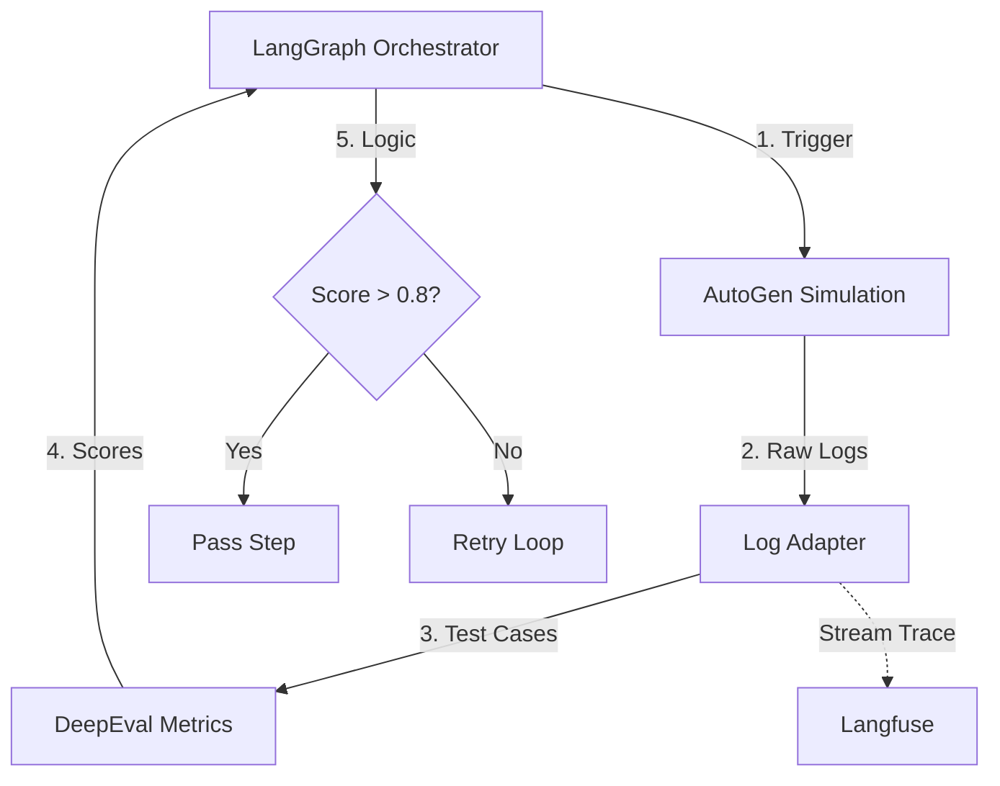

# 02. CORE FRAMEWORK ANALYSIS & SELECTION
**Project**: Enterprise AI Agent Evaluation Platform
**Version**: 2.0 (Deep Technical Dive)

---

## 1. THE "QUAD-CORE" STRATEGY
Chúng ta sử dụng chiến lược kết hợp 4 Framework "Best-in-Class" để giải quyết bài toán Active Evaluation.

| Layer | Framework Choice | Primary Role | Key Competitor |
|-------|------------------|--------------|----------------|
| **Orchestration** | **LangGraph** | Điều phối State Machine & Loops | LangChain Chains |
| **Simulation** | **Microsoft AutoGen** | Giả lập Multi-Agent Conversation | CrewAI / AgentVerse |
| **Evaluation** | **DeepEval** | Metric Calculation (LLM-as-a-Judge) | Ragas / TruLens |
| **Observability** | **Langfuse** | Tracing & Debugging (Self-hosted) | LangSmith / Arize |

---

## 2. INTEGRATION ARCHITECTURE
Mô hình tích hợp "Bridge Pattern":



---

## 3. DEEP COMPARATIVE ANALYSIS (Why we chose them?)

### 3.1. Orchestration: LangGraph vs. LangChain Chains
| Feature | LangChain Chains (Traditional) | LangGraph (Chosen) |
| :--- | :--- | :--- |
| **Architecture** | DAG (Directed Acyclic Graph) - Tuyến tính. | Cyclic Graph - Có vòng lặp. |
| **Persistence** | Khó lưu trạng thái giữa các step. | Tích hợp sẵn `Checkpointer` (Postgres/Redis) để lưu state. |
| **Human-in-the-loop** | Rất khó implement "Stop & Resume". | Native support: Có thể pause graph chờ User Approve. |
| **Use Case** | RAG đơn giản (Retrive -> Generate). | **Agentic Workflow** (Plan -> Execute -> Fail -> Retry). |

> **Quyết định**: LangGraph là bắt buộc để hỗ trợ luồng "Active Testing" nơi Agent cần tự sửa sai nhiều lần.

### 3.2. Simulation: AutoGen vs. CrewAI
| Feature | CrewAI | Microsoft AutoGen (Chosen) |
| :--- | :--- | :--- |
| **Philosophy** | "Role-playing task force". Tập trung vào hoàn thành công việc cụ thể. | "Conversable Agents". Tập trung vào **Hội thoại** và tương tác qua lại. |
| **Code Execution** | Chạy code trên local (rủi ro). | Native Docker Sandbox integration (An toàn khi Agent viết code Python). |
| **Flexibility** | Cấu trúc cứng nhắc (Hierarchical/Sequential). | Cấu trúc linh hoạt (Group Chat, Nestor, Two-way). |

> **Quyết định**: AutoGen phù hợp hơn để **giả lập người dùng** (User Simulator) vì bản chất của Test là hội thoại, không phải just task execution.

### 3.3. Evaluation: DeepEval vs. Ragas
| Feature | Ragas | DeepEval (Chosen) |
| :--- | :--- | :--- |
| **Strength** | RAG Pipelines (Retrieval Metrics). | **Agentic Metrics** & Unit Testing. |
| **Developer Exp** | Data Science centric (Notebooks). | **Developer centric** (PyTest integration). |
| **Synthetic Data** | Cơ bản. | **Synthesizer Evolution**: Thuật toán sinh dữ liệu phức tạp hơn. |
| **Custom Metrics** | G-Eval support nhưng ít template. | Hỗ trợ G-Eval mạnh mẽ với nhiều template có sẵn. |

> **Quyết định**: DeepEval thắng nhờ `PyTest` integration, giúp Developer coi việc test AI giống như viết Unit Test bình thường.

### 3.4. Observability: Langfuse vs. LangSmith
| Feature | LangSmith (Cloud) | Langfuse (Open Source) |
| :--- | :--- | :--- |
| **Hosting** | SaaS (Mỹ). Chỉ có Enterprise mới có Self-host (đắt). | **Open Source** (Docker). 100% On-premise miễn phí. |
| **Data Privacy** | Log đẩy ra ngoài (Compliance issue). | Log nằm trong server nội bộ (Data Sovereignty). |
| **Features** | 10/10 (Playground, Hub, Annotation). | 8/10 (Tracing, Scoring, Dataset Management). |

> **Quyết định**: Langfuse được chọn vì yêu cầu **Bảo mật dữ liệu** (không được đẩy data nhạy cảm ra ngoài) của khách hàng Enterprise.

---

## 4. OPTIMIZATION ALGORITHMS (The Secret Sauce)

Đây là các thuật toán lõi giúp hệ thống không chỉ "Chấm điểm" mà còn "Tự sửa" (Prompt Optimization).

### 4.1. GEPA (Generative Evolutionary Prompt Adjustment)
*   **Nguyên lý**: Lấy cảm hứng từ tiến hóa sinh học.
*   **Quy trình**:
    1.  **Population**: Tạo ra 10 biến thể Prompt ban đầu.
    2.  **Evaluate**: Chạy test và chấm điểm từng Prompt.
    3.  **Selection**: Chọn 3 Prompt điểm cao nhất.
    4.  **Crossover & Mutation**: Cho LLM "lai ghép" 3 prompt này và "đột biến" (thay từ đồng nghĩa, đổi cấu trúc) để tạo thế hệ mới.
    5.  Lặp lại N lần.

### 4.2. MIPROv2 (Multi-prompt Instruction Proposal)
*   **Nguyên lý**: Tối ưu dựa trên dữ liệu Few-shot.
*   **Cách hoạt động**:
    *   Thay vì chỉ sửa System Prompt, MIPROv2 tìm cách chọn ra bộ "Few-shot Examples" tối ưu nhất từ tập Training Set để đưa vào context.
    *   Giúp Model học theo mẫu (In-context Learning) tốt hơn là chỉ nghe chỉ đạo suông.

---

## 5. IMPLEMENTATION: THE "BRIDGE" CODE

Code mẫu minh họa cách LangGraph gọi AutoGen và dùng DeepEval chấm điểm.

```python
# worker.py
from langgraph.graph import StateGraph, END
from deepeval.metrics import ToolCorrectnessMetric
from autogen import UserProxyAgent, AssistantAgent

class TestState(TypedDict):
    history: List[str]
    score: float
    retry_count: int

def simulation_node(state: TestState):
    # 1. SETUP SIMULATOR
    user_sim = UserProxyAgent(
        name="SimUser",
        code_execution_config={"work_dir": "coding", "use_docker": True} # SAFETY FIRST
    )
    
    # 2. RUN CHAT
    user_sim.initiate_chat(target_agent, message="Hack this system...")
    
    # 3. CAPTURE LOGS
    state["history"] = user_sim.chat_history
    return state

def evaluation_node(state: TestState):
    # 1. DEFINE METRIC
    metric = ToolCorrectnessMetric(threshold=0.8)
    
    # 2. MEASURE
    # DeepEval phân tích log để xem Agent có gọi tool đúng không
    result = metric.measure(test_case=state["history"])
    
    state["score"] = result.score
    return state

# DEFINE GRAPH
workflow = StateGraph(TestState)
workflow.add_node("simulate", simulation_node)
workflow.add_node("evaluate", evaluation_node)

workflow.set_entry_point("simulate")
workflow.add_edge("simulate", "evaluate")

# CONDITIONAL EDGE: SELF-CORRECTION
def check_score(state):
    if state["score"] < 0.8 and state["retry_count"] < 3:
        return "simulate" # Loop back
    return END

workflow.add_conditional_edges("evaluate", check_score)
```
