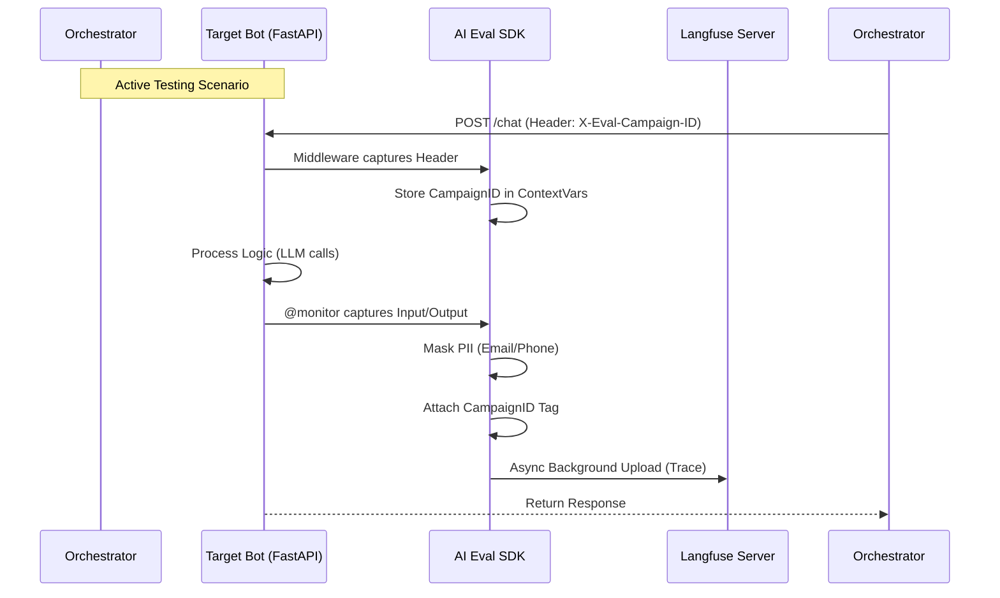

# 05. SDK INTEGRATION: THE "THIN WRAPPER" STRATEGY
**Project**: Enterprise AI Agent Evaluation Platform
**Type**: Technical Specification
**Status**: APPROVED

---

## 1. Strategy Overview: "Opinionated Thin Wrapper"

Thay vì sử dụng trực tiếp Langfuse SDK (Raw) hoặc tự viết lại toàn bộ (Full Custom), chúng ta sử dụng chiến lược **"Thin Wrapper"**.

Chúng ta sẽ xây dựng một thư viện Python nhỏ tên là `langeval-sdk`.
*   **Core**: Bên dưới vẫn là `langfuse-python` (để tận dụng tính năng batching/async/retry mạnh mẽ của nó).
*   **Wrapper Layer**: Thêm các logic đặc thù của dự án mà Langfuse không có sẵn.

### Tại sao chọn cách này?
1.  **Automatic Context Injection**: Tự động đọc Header `X-Eval-Scenario-ID` từ request để gắn tag cho Trace (Quan trọng cho active testing).
2.  **Safety First**: Bật tính năng PII Masking mặc định.
3.  **Simplicity**: Dev chỉ cần `@monitor` thay vì setup phức tạp.

### 1.1. High-Level Flow (Data Pipeline)



---

## 2. Installation & Configuration

### 2.1. Installation
Bot Developer cài đặt gói SDK nội bộ:

```bash
pip install langeval-sdk
```

### 2.2. Environment Variables
SDK tự động đọc cấu hình chuẩn của Langfuse:

```bash
LANGFUSE_PUBLIC_KEY="pk-lf-..."
LANGFUSE_SECRET_KEY="sk-lf-..."
LANGFUSE_HOST="https://eval.evaluation.ai" # Self-hosted URL
AI_EVAL_PROJECT_ID="CSKH_BOT_V1"
```

---

## 3. Core Features Implementation

### 3.1. The Unified `@monitor` Decorator

Đây là tính năng chính dành cho Developer.

```python
# main.py
from ai_eval_sdk import monitor

@monitor
def chat_endpoint(user_message: str):
    # Logic xử lý của Bot...
    return "Bot response"
```

#### How it works (Wrapper Logic)
Bên trong `ai_eval_sdk`, decorator này thực hiện 3 việc:
1.  **PII Masking**: Quét `user_message` để che SĐT/Email trước khi gửi lên Server.
2.  **Langfuse Observe**: Gọi `langfuse.observe()` để bắt đầu Trace.
3.  **Context Injection (Critical)**: Kiểm tra xem có `ContextVars` (từ Middleware) không để gắn Tag.

### 3.2. Automatic Context Injection (Middleware)

Để phân biệt giữa **User Thật** và **User Giả Lập (Simulation)**, SDK cung cấp Middleware cho FastAPI/Flask.

```python
# app_startup.py
from fastapi import FastAPI
from ai_eval_sdk.integrations.fastapi import EvalContextMiddleware

app = FastAPI()
app.add_middleware(EvalContextMiddleware) # Tự động bắt Header
```

**Logic xử lý của Middleware:**
1.  Bot nhận request từ `Orchestrator` (khi chạy test).
2.  Request có Header: `X-Eval-Campaign-ID: cam_123`.
3.  Middleware đọc Header này -> Lưu vào `contextvars`.
4.  Decorator `@monitor` đọc `contextvars` -> Gắn tag `campaign_id=cam_123` vào Trace.
5.  **Kết quả**: Trace trên Dashboard tự động map với Campaign Test.

### 3.3. PII Masking (Default On)

Logic Masking được nhúng thẳng vào SDK để đảm bảo không ai quên.

```python
# ai_eval_sdk/security.py
import re

def mask_pii(text: str) -> str:
    # Regex cho VN Phone (+84...)
    text = re.sub(r'(84|0[3|5|7|8|9])+([0-9]{8})\b', '<PHONE>', text)
    # Regex cho Email
    text = re.sub(r'[\w\.-]+@[\w\.-]+', '<EMAIL>', text)
    return text
```

---

## 4. Integration Examples

### 4.1. LangChain Integration
Nếu Bot dùng LangChain, SDK cung cấp `GetCallbackHandler` đã được cấu hình sẵn.

```python
from ai_eval_sdk.integrations.langchain import get_eval_callback

# Tự động lấy cấu hình từ Env và Context hiện tại
handler = get_eval_callback()

# Chạy chain
chain.invoke({"input": "Hello"}, config={"callbacks": [handler]})
```

### 4.2. AutoGen Integration (Manual Trace)
Với AutoGen, dev dùng wrapper `trace_agent`.

```python
from ai_eval_sdk.integrations.autogen import trace_agent

user_proxy = UserProxyAgent("user")
assistant = AssistantAgent("assitant")

# Wrap để bắt nội dung chat
with trace_agent(name="Autogen_Conversation"):
    user_proxy.initiate_chat(assistant, message="Hello")
```

---

## 5. SDK Architecture (Internal)

Cấu trúc thư mục của `langeval-sdk`:

```
ai_eval_sdk/
├── __init__.py           # Exports @monitor
├── core/
│   ├── client.py         # Singleton Wrapper quanh Langfuse Client
│   ├── context.py        # Quản lý ContextVars (Campaign ID)
│   └── security.py       # PII Masking Logic
├── decorators.py         # Implementation của @monitor
└── integrations/
    ├── fastapi.py        # Middleware bắt Header
    ├── langchain.py      # Factory cho CallbackHandler
    └── autogen.py        # Context Manager cho AutoGen
```

### Lợi ích của kiến trúc này:
1.  **Decoupling**: Nếu sau này đổi từ Langfuse sang Arize Phoenix, ta chỉ cần sửa file `core/client.py`, code của Bot Dev (`@monitor`) không cần sửa.
2.  **Compliance**: Đảm bảo 100% data ra khỏi Bot đều đã được Masking (do đi qua `core/security.py`).
3.  **Active Testing**: Giải quyết bài toán khó nhất là làm sao biết Trace nào thuộc về bài Test nào (nhờ Middleware bắt Header).
