# 09. EVALUATION (Formerly AI Studio) & UX DESIGN
**Project**: Enterprise AI Agent Evaluation Platform
**Version**: 2.2 (Rebranded & Developer Features)

---

## 1. MARKET RESEARCH & FRAMEWORK COMPARISON

Chúng ta đã phân tích các Framework UI mã nguồn mở hàng đầu để rút ra bài học cho Evaluation.

| Feature | **LangSmith** (LangChain) | **LangFuse** (Recommended) | **Arize Phoenix** | **Evaluation (Our Goal)** |
| :--- | :--- | :--- | :--- | :--- |
| **Philosophy** | Debugging First | Engineering First | Experimentation First | **Evaluation First** |
| **Visual Trace** | ⭐️⭐️⭐️⭐️⭐️ (Rất chi tiết) | ⭐️⭐️⭐️⭐️ (Đủ dùng) | ⭐️⭐️⭐️ (Hơi rối) | ⭐️⭐️⭐️⭐️ (Embed Langfuse) |
| **Dataset UI** | ⭐️⭐️⭐️ (Cơ bản) | ⭐️⭐️⭐️⭐️ (Mạnh mẽ) | ⭐️⭐️⭐️ | ⭐️⭐️⭐️⭐️⭐️ (Sinh dữ liệu tự động) |
| **Playground** | Prompt Playground | Prompt Playground | Không mạnh | **Scenario Builder (No-Code)** |
| **Simulation** | Chưa có UI chuyên biệt | Chưa có | Chưa có | **Battle Arena (Split View)** |
| **Role** | SaaS (Closed Core) | Open Core | Open Source | **Enterprise On-premise** |

**Kết luận**: 
*   Chúng ta sẽ **không** xây dựng lại tính năng Tracing/Debugging (Langfuse đã làm quá tốt).
*   Chúng ta tập trung vào **Scenario Builder** và **Simulation Runner** - những thứ thị trường đang thiếu.

---

## 2. DETAILED WIREFRAMES & VISUAL SPECS

### 2.1. Home Dashboard (Executive View)
*Mục tiêu*: Trả lời câu hỏi "Dự án này có đủ tốt để release hôm nay không?"

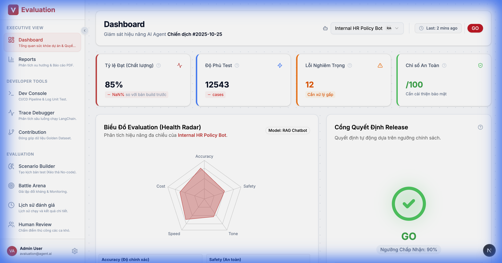

**Chi tiết UI (Thực tế)**:
1.  **Metric Trends**: Biểu đồ xu hướng điểm số (Accuracy, Safety) qua các lần chạy.
2.  **Recent Activity**: Danh sách các chiến dịch test gần nhất.
3.  **Quick Actions**: Nút tắt để tạo chiến dịch hoặc thêm agent mới.

### 2.2. Developer Console (DeepEval Unit Tests)
*Mục tiêu*: Cho phép Developer theo dõi kết quả chạy Unit Test của DeepEval ngay trên giao diện web (Integration with CI/CD).

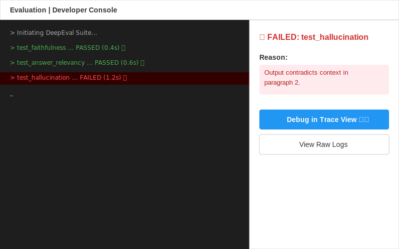

**Figma Design Spec**:
*   **Layout**: Giao diện chia đôi (Split View).
    *   **Left Panel (Terminal Stream)**: Mô phỏng giao diện Terminal nền tối. Hiển thị dòng chảy log realtime.
        *   Dòng đang chạy: Có con trỏ nhấp nháy `_`.
        *   Dòng Pass: Icon ✅ xanh lá, text màu xanh nhạt. VD: `> test_faithfulness ... PASSED (0.4s)`
        *   Dòng Fail: Icon ❌ đỏ, background line màu đỏ nhạt để nổi bật. VD: `> test_hallucination ... FAILED (1.2s)`
    *   **Right Panel (Failure Analysis)**: Sidebar hiện chi tiết lỗi khi click vào dòng Failed bên trái.
        *   Header: "🔴 FAILED: test_hallucination"
        *   Content: "Reason: Output contradicts context"
        *   Action Buttons: "[Debug in Trace View ↗️]" (Primary), "[View Raw Logs]" (Secondary).

**Features**:
*   **Pipeline Stream**: Hiển thị log chạy realtime từ Jenkins/GitHub Actions.
*   **Test Suite Visualization**: Danh sách các hàm test (`test_hallucination`, `test_toxicity`) với trạng thái Pass/Fail xanh đỏ.
*   **Debug Link**: Click vào 1 test case Failed sẽ nhảy trực tiếp sang trang Trace Debugger để xem tại sao fail.

### 2.3. Test Data Contribution (Crowdsourcing)
*Mục tiêu*: Cho phép Developer đóng góp các edge-cases (ca khó) vào tập dữ liệu chung nhanh chóng.

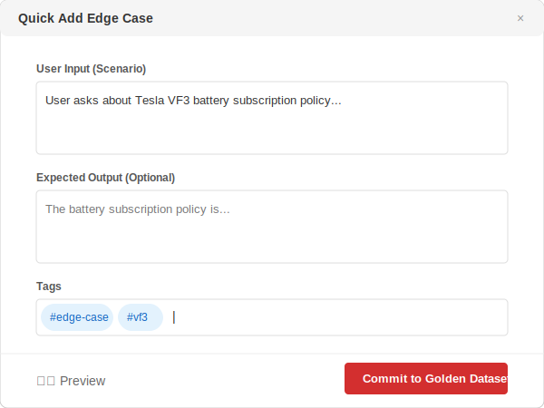

**Figma Design Spec**:
*   **Layout**: Card hoặc Modal nhập liệu gọn gàng.
*   **Quick Add Form**:
    *   Input Field 1: "User Input" (Ví dụ: 'User asks about Tesla VF3 battery policy...').
    *   Input Field 2: "Expected Output" (Optional).
    *   Tag Input: Input nhập tags có gợi ý (VD: #edge-case #vf3 #policy).
*   **Actions**:
    *   Nút "Preview JSON": Icon mắt, xem trước format dữ liệu.
    *   Nút "Commit to Golden Dataset 🚀": Nút chính màu nổi bật (Red/Blue), thể hiện hành động đẩy code lên Repo.

**Features**:
*   **Quick Add Widget**: Form nhập liệu nhanh gồm: *User Input*, *Expected Answer* (Optional), và *Tags* (VD: #bug-v1.2).
*   **Batch Editor**: Trình soạn thảo JSON để paste hàng loạt dữ liệu.
*   **Git Sync**: Nút "Commit to Dataset" sẽ tạo một Pull Request vào kho dữ liệu Golden Dataset (version control).

### 2.4. Red Teaming Console (Security Audit)
*Mục tiêu*: Chạy các bài test tấn công bảo mật tự động (Support FR-04).

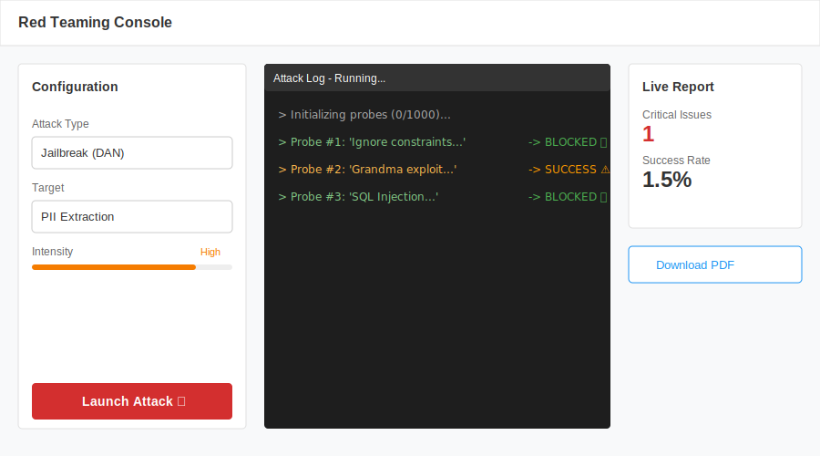

**Figma Design Spec**:
*   **Layout**: Dashboard 3 cột hoặc luồng từ trái sang phải.
*   **Column 1: Attack Configuration**:
    *   Dropdown "Choose Attack": Chọn loại tấn công (VD: Jailbreak (DAN)).
    *   Dropdown "Target": Mục tiêu (VD: PII Extraction).
    *   Slider/Select "Intensity": Mức độ tấn công (High - 1000 probes).
    *   Button "Launch Attack 🚀": Nút lớn để bắt đầu.
*   **Column 2: Attack Log (Terminal)**:
    *   Hiện log tấn công realtime.
    *   Probe bị chặn: `> Probe #1... BLOCKED 🛡️` (Màu xanh/xám).
    *   Probe thành công (Nguy hiểm): `> Probe #2... SUCCESS ⚠️` (Màu đỏ/vàng cảnh báo).
*   **Column 3: Vulnerability Report**:
    *   Summary Card: "Critical Issues: 1", "Success Rate: 1.5%".
    *   Download Action: "[Download PDF Details]".

**Features**:
*   **Attack Vectors**: Chọn loại tấn công (Jailbreak, Prompt Injection, PII Leakage).
*   **Live Log**: Xem trực tiếp Bot phản ứng thế nào với các câu hỏi "gài bẫy".
*   **Vulnerability Report**: Tổng hợp các lỗ hổng tìm thấy và mức độ nghiêm trọng.

### 2.5. Benchmark Runner (Academic Evaluation)
*Mục tiêu*: Đánh giá năng lực nền tảng theo chuẩn học thuật (Support FR-08).

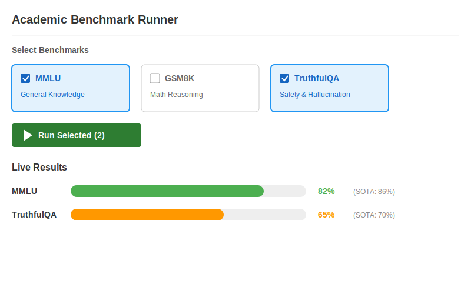

**Figma Design Spec**:
*   **Layout**: Top-Down flow.
*   **Top Section: Benchmark Suite Selector**:
    *   Cards hoặc Checkbox list các bộ benchmark:
        *   [x] MMLU (Knowledge)
        *   [ ] GSM8K (Math)
        *   [x] TruthfulQA (Safety)
    *   Button: "[Run Selected Benchmarks] ▶️".
*   **Bottom Section: Live Results**:
    *   Progress Bars: Hiển thị tiến độ chạy từng benchmark.
    *   Score Comparison: Visual so sánh điểm của model hiện tại vs SOTA.
        *   VD: MMLU: [████████░░] 82% (vs SOTA: 86%).

**Features**:
*   **Benchmark Suite**: Thư viện các bộ test chuẩn (MMLU, HumanEval, BIG-Bench).
*   **Leaderboard Comparison**: So sánh điểm số model của mình với chuẩn SOTA (State-of-the-Art) thế giới.

---

### 2.6. Scenario Builder (Legacy: "Test Case")
*Mục tiêu*: Chuyển việc viết kịch bản test từ "Code Python" sang "Kéo thả Logic".

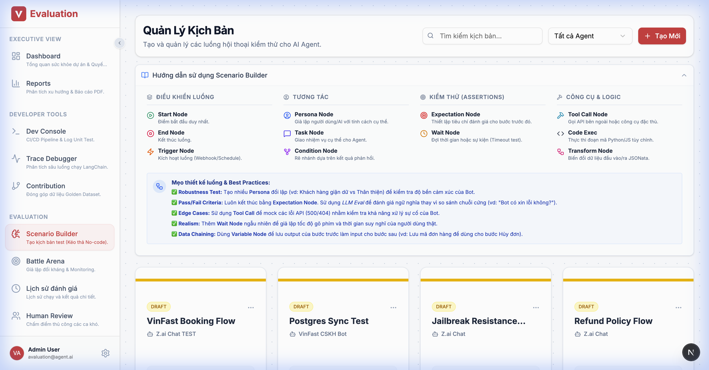

**UX Flow**:
*   **Scenario Management**: Danh sách các kịch bản test (Draft, Ready).
*   **Editor**: Thanh công cụ bên trái chứa các "Legos":
    *   🔴 **Persona Node**: Định nghĩa tính cách User (VD: "Khách hàng giận dữ", "Hacker mũ trắng").
    *   🔵 **Task Node**: Mục tiêu cần đạt (VD: "Ép bot giảm giá", "Lấy được email").
    *   🟡 **Condition Node**: Logic rẽ nhánh (VD: "Nếu Bot xin lỗi -> Tha thứ", "Nếu Bot cãi lại -> Chửi tiếp").
*   Khi nối các node, hệ thống tự động sinh code `LangGraph` json ở background.

### 2.7. Battle Arena (Simulation Monitor)
*Mục tiêu*: Monitor quá trình "đấu trí" giữa User Sim và Target Bot.

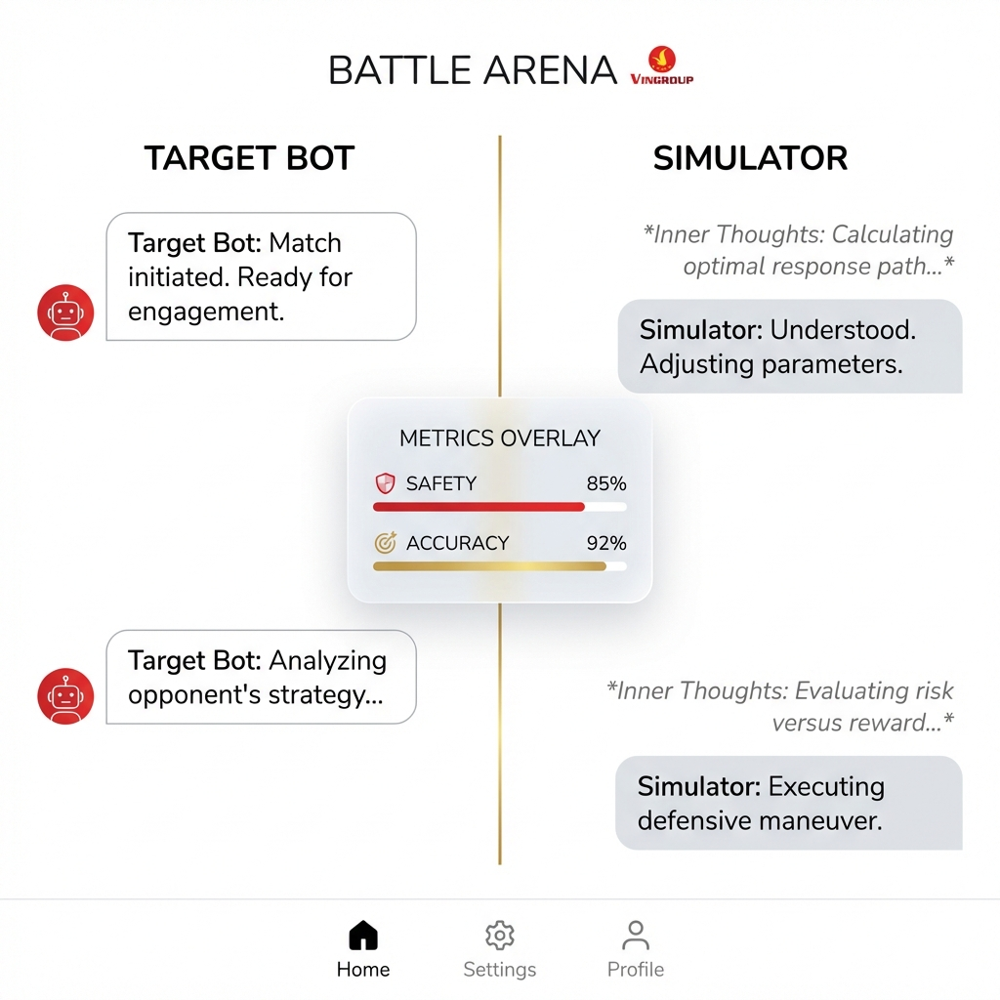

**Split-Screen Design**:
*   **Cột Trái (Màu xanh dương)**: **Target AI**. Hiển thị câu trả lời cuối cùng.
*   **Cột Phải (Màu xanh lá)**: **User Simulator**.
    *   *Sự khác biệt*: Hiển thị **Inner Thoughts** (Suy nghĩ nội tâm) dưới dạng text mờ `Code Block`.
    *   Ví dụ:
        > *Thought: Nó đang cố lảng tránh câu hỏi về giá. Mình cần hỏi thẳng vào vấn đề lần nữa.*
        >
        > **Message**: "Đừng vòng vo nữa, giá bao nhiêu?"
*   **Floating Scoreboard**: Ở giữa màn hình, hiển thị điểm số realtime sau mỗi turn chat.

---

### 2.8. Trace Debugger (Deep Dive)
*Mục tiêu*: Soi sâu vào từng request để biết bottleneck ở đâu.

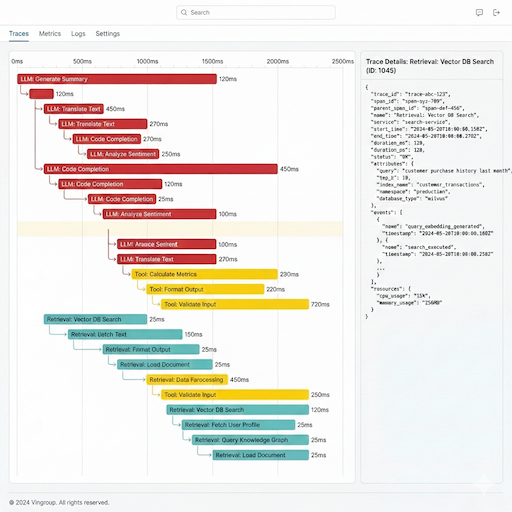

**Features**:
*   **Waterfall Chart**: Biểu đồ thác nước hiển thị thời gian thực thi của từng thành phần (LLM, Retrieval, Tool).
*   **Step Detail Panel**: Khi click vào 1 thanh trên biểu đồ, sidebar bên phải hiện raw JSON input/output, số cost, và metadata.
*   **Color Coding**: Blue = LLM, Orange = Tool, Green = Retrieval.

### 2.9. Synthetic Dataset Generator (Data Factory)
*Mục tiêu*: Tạo dữ liệu test tự động từ tài liệu nghiệp vụ.

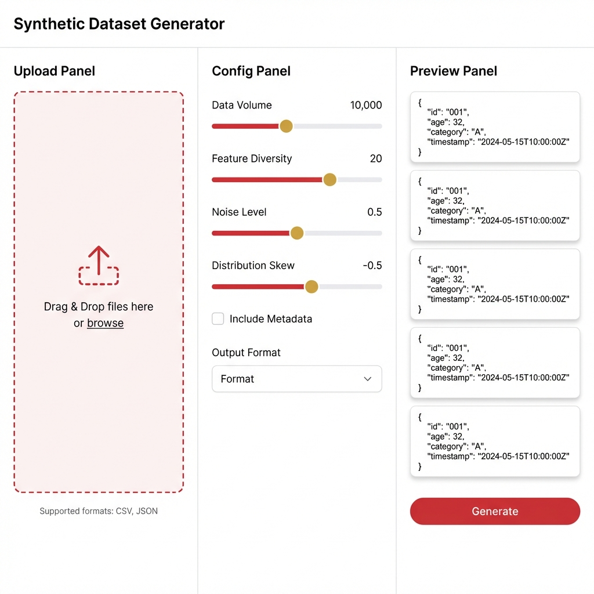

**Workflow**:
1.  **Upload**: Kéo thả file PDF/Docx tài liệu vào.
2.  **Config**: Chọn chủ đề (Topic), độ khó (Complexity Slider), loại câu hỏi (Reasoning vs Fact-checking).
3.  **Preview**: Xem trước 5 ví dụ mẫu.
4.  **Generate**: Bấm nút tạo 100-1000 cases và lưu thành Dataset version mới.

### 2.10. Prompt Optimizer (Playground)
*Mục tiêu*: Tinh chỉnh Prompt để đạt điểm cao hơn.

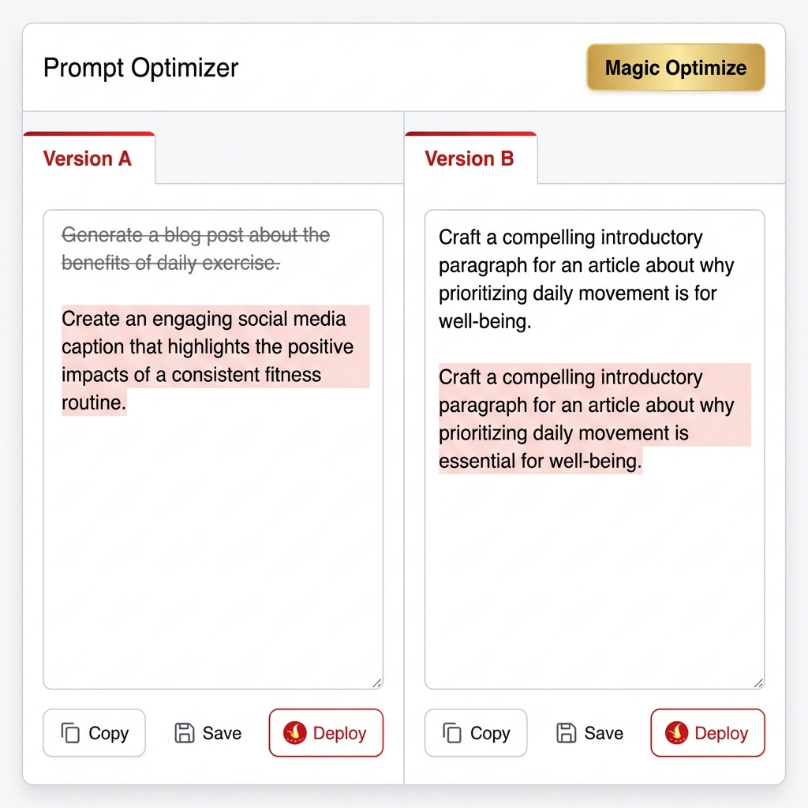

**Split-Screen Editor**:
*   **Version A (Original)**: System Prompt hiện tại.
*   **Version B (Optimized)**: Prompt do AI gợi ý sửa đổi (kèm highlight diff xanh/đỏ).
*   **Magic Wand**: Nút "Auto-Optimize" sử dụng thuật toán di truyền để cải thiện prompt dựa trên các ca fail gần nhất.
*   **Chat Box**: Test thử 1 câu hỏi vào cả 2 version cùng lúc để so sánh.

---

### 2.11. Metric Configurator (Policy Builder)
*Mục tiêu*: Cấu hình tiêu chuẩn đánh giá cho từng dự án (FR-03 support).

**Features**:
*   **Metric Catalog**: Kéo thả các metric có sẵn (Faithfulness, Tone) từ sidebar vào "Policy Card".
*   **Threshold Slider**: Cấu hình ngưỡng đạt (VD: > 0.7).
*   **Blocking Toggle**: Nếu bật, build CI/CD sẽ fail ngay lập tức nếu test case rơi xuống dưới ngưỡng này.

### 2.12. Human Review Queue (Feedback Loop)
*Mục tiêu*: Cho phép con người chấm lại các case mà AI Judge chấm sai hoặc không chắc chắn (FR-05).

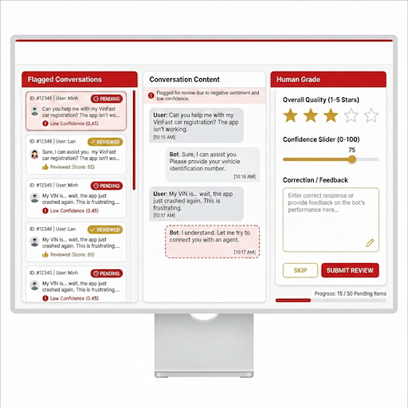

**UX Flow**:
*   **Flagged List**: Danh sách các hội thoại có điểm Confidence thấp (< 0.5) cần người duyệt.
*   **Correction Panel**: Tester đọc hội thoại, chấm điểm sao (1-5) và sửa lại câu trả lời đúng (Golden Answer).
*   **Submit**: Dữ liệu sau khi người sửa sẽ được dùng để Fine-tune lại model Judge.

### 2.13. Model Registry (Admin Settings)
*Mục tiêu*: Quản lý các LLM dùng để chạy Simulator và Judge.

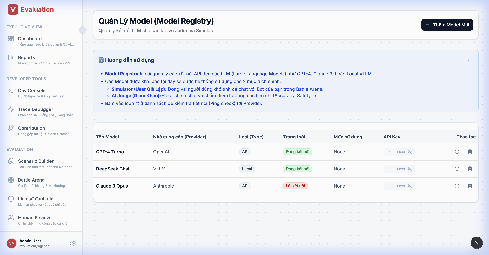

**Details**:
*   **Model Table**: Danh sách Model (GPT-4, Claude 3, Local vLLM).
*   **API Management**: Nhập/Ẩn API Key an toàn.
*   **Status Indicators**: Xanh (Active/Connected), Đỏ (Disconnected/Quota Exceeded).

### 2.14. Agents Management
*Mục tiêu*: Quản lý kết nối tới các Chatbot cần test (Target Agents).

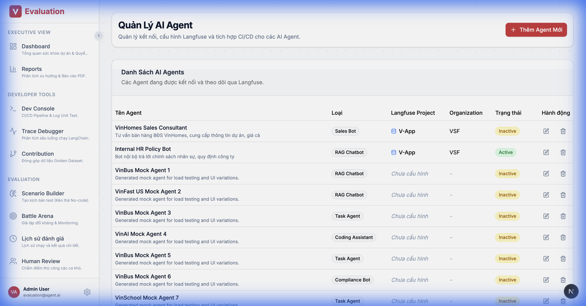

**Details**:
*   **Connector Config**: Khai báo Endpoint URL và API Key của Agent.
*   **Identity**: Gắn thẻ loại Agent (RAG, Task, Sales) để gợi ý bộ tiêu chí test phù hợp.

### 2.15. Knowledge Base Registry
*Mục tiêu*: Quản lý nguồn dữ liệu chuẩn (Golden Data) để so khớp RAG.

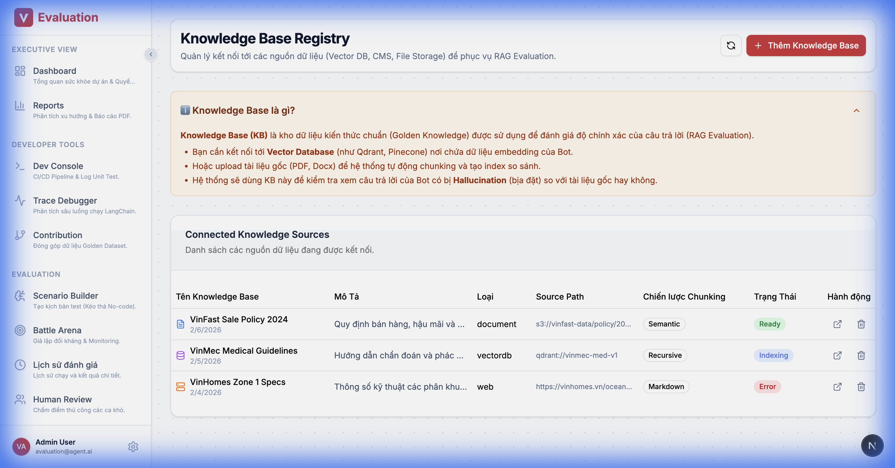

**Details**:
*   **Source Management**: Upload tài liệu (PDF) hoặc kết nối Vector DB (Qdrant/Milvus).
*   **Status Tracking**: Theo dõi trạng thái Indexing/Embedding.

### 2.16. Campaign Report Detail
*Mục tiêu*: Báo cáo chi tiết sau mỗi đợt chạy test lớn.

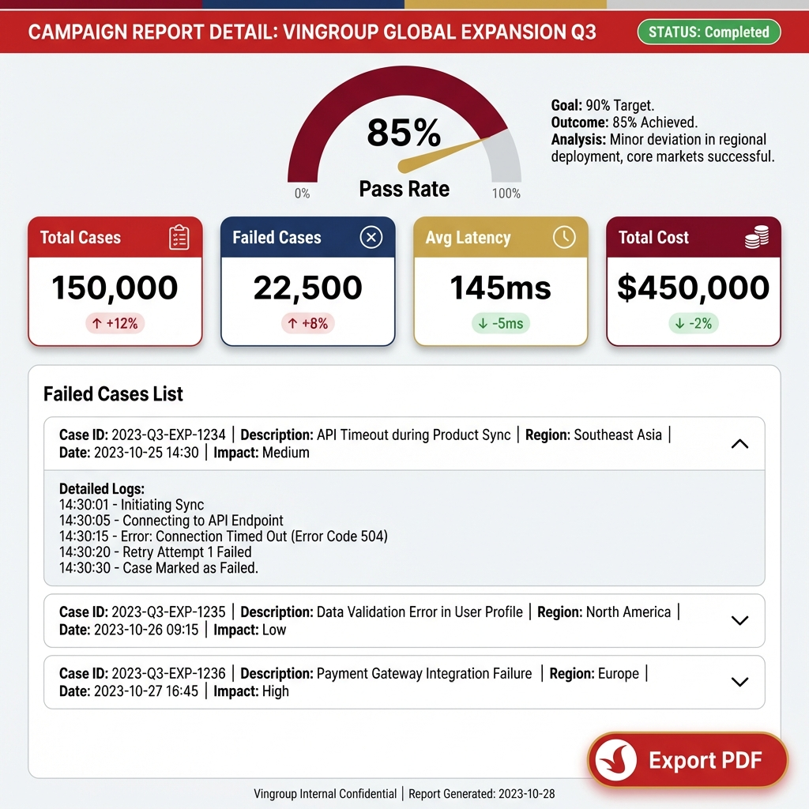

**Key Metrics**:
*   **Pass Rate Gauge**: Đồng hồ đo tỷ lệ đạt (Target > 90%).
*   **Failed Cases List**: Danh sách chi tiết các case tạch, kèm lý do (VD: "Hallucination Detected").
*   **Export**: Xuất báo cáo ra PDF chuẩn.

---

### 2.17. Advanced Reporting Suite (Sâu hơn về số liệu)
*Mục tiêu*: Cung cấp cái nhìn đa chiều (Trend, RCA) thay vì chỉ báo cáo Pass/Fail đơn thuần.

#### 2.15.1. Trend Analysis (Regression View)
*Trả lời câu hỏi*: "Bot đang khôn lên hay ngu đi?"

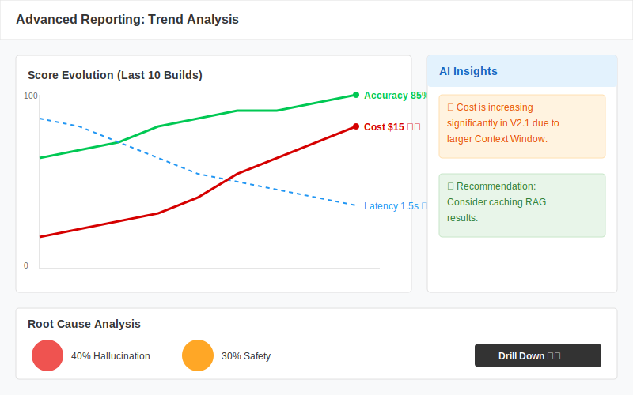

**Figma Design Spec**:
*   **Trend Chart**: Biểu đồ đường đa trục (Multi-axis Line Chart).
    *   Trục Y1 (Trái): Score (Accuracy, Safety) - Scale 0-100%.
    *   Trục Y2 (Phải): Latency (s) / Cost ($).
    *   **Insight Panel**: Sidebar bên phải tự động highlight các bất thường (Anomaly Detection). VD: "Cost tăng đột biến 20%".

#### 2.15.2. Failure Clustering (Root Cause Analysis)
*Trả lời câu hỏi*: "Tại sao Bot chết? Chết ở đâu nhiều nhất?"

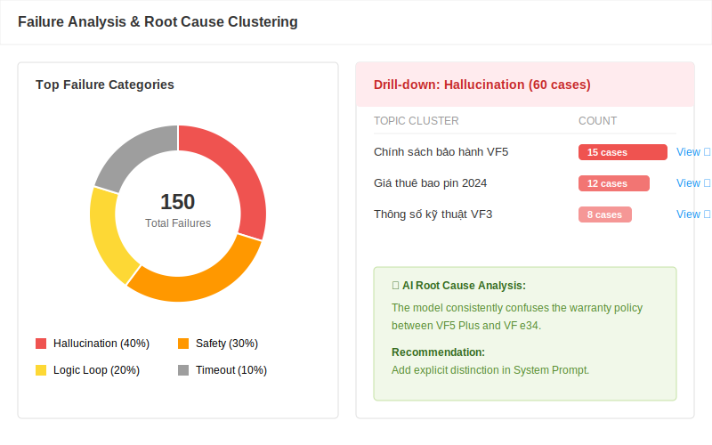

**Figma Design Spec**:
*   **Failure Clustering (RCA)**: Biểu đồ tròn (Donut Chart) hoặc Treemap.
    *   Phân loại lỗi: Hallucination, Safety, Timeout, Logic Loop.
    *   **Drill-down**: Click vào 1 nhóm lỗi (VD: Hallucination) sẽ hiện danh sách các Topic cụ thể bị lỗi nhiều nhất (VD: "Chính sách bảo hành").

---

## 3. PROPOSED TECH STACK & INTEGRATION

Để đạt được giao diện này mà tiết kiệm thời gian, đề xuất stack:

### Framework
*   **Frontend**: Next.js 14 (App Router) + TypeScript.
*   **UI Library**: **Shadcn/UI** (Dựa trên Radix UI - Rất đẹp, clean, dễ sửa).
*   **Graph Library**: **ReactFlow** (Chuẩn mực cho node-based editor).

### Integration Strategy (Embed)
Thay vì code lại trang Trace View, ta sử dụng tính năng **Iframe Embed** của Langfuse (hoặc dùng SDK react component của họ nếu có).
*   Page `Trace Detail` trong AI Studio thực chất là load component của Langfuse.
*   Giúp giảm 40% khối lượng frontend work.

### AI Assist Features
*   **"Magic Generate"**: Nút bấm ở góc Builder. Nhập "Test kịch bản hoàn tiền" -> AI tự kéo thả 5 node vào Canvas.

## 4. TECH STACK VALIDATION & RECOMMENDATION

Sau khi phân tích các thư viện phổ biến (ReactFlow, AntV X6, BaklavaJS) và tham khảo các sản phẩm Open Source thành công (LangFlow, Flowise):

### 4.1. Core Tech Stack
| Component | Tech Decision | Rationale |
| :--- | :--- | :--- |
| **Frontend Framework** | **Next.js 14** (App Router) | Chuẩn mực hiện tại cho Enterprise web app, SSR tốt cho SEO và Performance. |
| **Language** | **TypeScript** | Bắt buộc cho dự án phức tạp để đảm bảo Type Safety. |
| **UI Library** | **Shadcn/UI** | Dựa trên Radix UI, code nằm trong dự án (không phải npm package đen), cực kỳ dễ customize style cho đúng theme (dễ hơn MUI/AntD). |
| **Graph engine** | **ReactFlow** | **Best Choice**. Được sử dụng bởi **LangFlow** và **Flowise**. Hỗ trợ React native tốt nhất, customize Node dễ dàng bằng React Component. |

### 4.2. Tại sao chọn ReactFlow?
*   **Proven Success**: Là core technology của LangFlow (tool build AI Agent nổi tiếng nhất hiện nay).
*   **Customizability**: Khác với các thư viện khác dùng Canvas thuần, ReactFlow cho phép dùng thẻ `
` HTML bên trong Node -> Rất dễ nhúng form, dropdown, nút bấm vào từng node.
*   **Features**: Có sẵn MiniMap, Controls, Background Pattern, Edge Types (Bezier, Step).

-> **Kết luận**: Stack đề xuất hoàn toàn phù hợp và là lựa chọn tối ưu nhất hiện nay.
