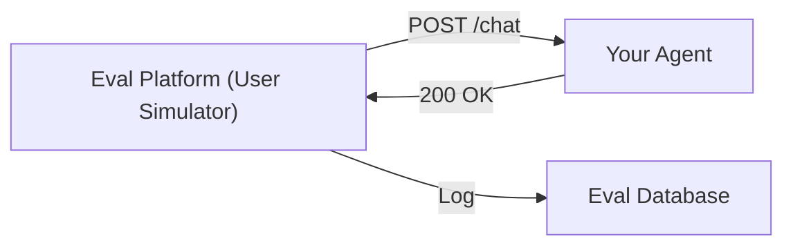
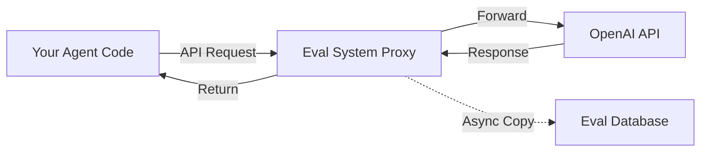
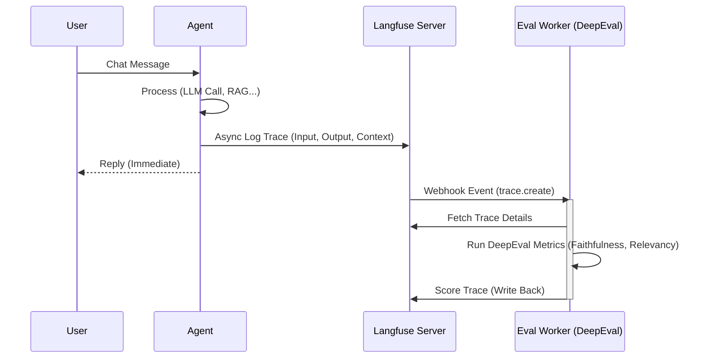

# 11. Agent Integration Patterns Guide

## 1. Overview
Trả lời câu hỏi: **"Làm thế nào để đánh giá một AI Agent bất kỳ?"**
Hệ thống cung cấp 5 phương pháp tích hợp, từ không can thiệp (Black-box) đến tích hợp sâu (White-box).

## 2. Pattern A: The "Black-Box" Simulation (Recommended for finished Agents)
**Nguyên lý**: Coi Agent như một hộp đen. Không cần truy cập code hay database của Agent.
**Cách hoạt động**:
1.  Agent của bạn expose 1 API endpoint `POST /chat`.
2.  Hệ thống Eval (dùng AutoGen) sẽ đóng vai User, gọi API đó.
3.  Hệ thống ghi lại cặp `Input` -> `Output` để chấm điểm.

*   **Ưu điểm**: Zero code change. Test được trên môi trường Production/Staging thật.
*   **Nhược điểm**: Không biết vì sao Agent trả lời sai (không có logs suy nghĩ/thought process).



## 3. Pattern B: The "LLM Proxy" Middleware
**Nguyên lý**: Agent của bạn gọi OpenAI/Anthropic qua một "Trạm trung chuyển" (Proxy) của hệ thống Eval.
**Cách làm**:
Thay vì config `OPENAI_BASE_URL="https://api.openai.com"`, bạn đổi thành:
`OPENAI_BASE_URL="https://api.eval-platform.com/proxy/openai"`

*   **Ưu điểm**: Chỉ sửa 1 dòng config (.env). Tự động capture toàn bộ prompt gửi đi và response nhận về.
*   **Nhược điểm**: Chỉ capture được LLM calls, không capture được logic nội bộ (tool calling, database query).



## 4. Pattern C: Async SDK Logging (Fire & Forget)
**Nguyên lý**: Bạn chèn 1 dòng code vào function chat của Agent để gửi log về hệ thống.
**Cách làm**:

```python
# Code của bạn
response = agent.run(user_input)

# Thêm dòng này
eval_client.log(input=user_input, output=response)
```

## 5. Pattern D: Deep Instrumentation (LangChain/LangGraph Callbacks)
**Nguyên lý**: Sử dụng cơ chế Callback có sẵn của Framework để hook vào từng bước suy nghĩ.
**Cách làm**: Truyền callback handler vào lúc khởi tạo Agent.

```python
from ai_eval import EvalCallbackHandler

agent = create_openai_function_agent(
    llm=llm,
    tools=tools,
    # Tự động gửi mọi bước (Thought, Tool Call, Observation)
    callbacks=[EvalCallbackHandler()]
)
```

## 6. Pattern E: Agent -> Langfuse -> DeepEval (Recommended Enterprise Architecture)
**Nguyên lý**: Sử dụng Langfuse làm "Source of Truth" cho logs và observability. DeepEval đóng vai trò là "Evaluation Worker" chạy ngầm để chấm điểm các logs này.

*   **Tại sao chọn mô hình này?**
    *   **Hiệu năng**: Tác vụ chấm điểm (Evaluation) rất chậm (do phải gọi LLM). Việc tách rời worker giúp Agent phản hồi user tức thì.
    *   **Observability**: Tận dụng UI mạnh mẽ của Langfuse để xem Traces/Spans.
    *   **Scalability**: Có thể scale worker chấm điểm độc lập với Agent.

### 6.1. Architecture Diagram


### 6.2. Implementation details
Mô hình này yêu cầu 2 thành phần code riêng biệt:

#### A. Agent Side (Tích hợp Langfuse SDK)
Nhiệm vụ: Gửi Input, Output và **quan trọng nhất là Context** (để chấm Hallucination) lên Langfuse.

```python
# Agent Code
from langfuse.decorators import observe
from langfuse import Langfuse

@observe()
def chat_pipeline(user_input):
    # 1. Retrieval
    docs = retriever.invoke(user_input)
    # QUAN TRỌNG: Phải log retrieved docs vào metadata để DeepEval đọc được
    langfuse.trace.update(
        metadata={"retrieved_contexts": [d.page_content for d in docs]}
    )
    
    # 2. Generation
    response = llm.invoke(user_input)
    
    return response
```

#### B. Eval Worker Side (DeepEval Logic)
Nhiệm vụ: Lắng nghe sự kiện, đọc trace, chấm điểm và ghi ngược lại.

```python
# Worker Code
from deepeval.metrics import FaithfulnessMetric
from deepeval.test_case import LLMTestCase

def process_trace(trace_data):
    # 1. Extract Data from Langfuse Trace
    user_input = trace_data['input']
    actual_output = trace_data['output']
    # Lấy context từ metadata đã log ở bước trên
    retrieval_context = trace_data['metadata'].get('retrieved_contexts', [])
    
    # 2. Create DeepEval Test Case
    test_case = LLMTestCase(
        input=user_input,
        actual_output=actual_output,
        retrieval_context=retrieval_context
    )
    
    # 3. Measure
    metric = FaithfulnessMetric(threshold=0.7)
    metric.measure(test_case)
    
    # 4. Write Score back to Langfuse
    langfuse.score(
        trace_id=trace_data['id'],
        name="Faithfulness",
        value=metric.score,
        comment=metric.reason
    )
```

## Summary Comparison

| Pattern | Code Change? | Depth of Data | Best For |
|---------|--------------|---------------|----------|
| **Black-box** | No | Input/Output only | Logic nghiệp vụ, Acceptance Testing, Web UI |
| **Proxy** | Env Config | LLM Raw Inputs | Debug chi phí, Prompt optimization |
| **SDK Log** | Minimal | Custom | Custom Agent, Production Monitoring |
| **Callbacks** | Config | Full Traces | Debugging phức tạp, Dev Phase |
| **Langfuse->DeepEval** | **Medium** | **Full Context + Scores** | **Enterprise Production, RAG Apps** |
