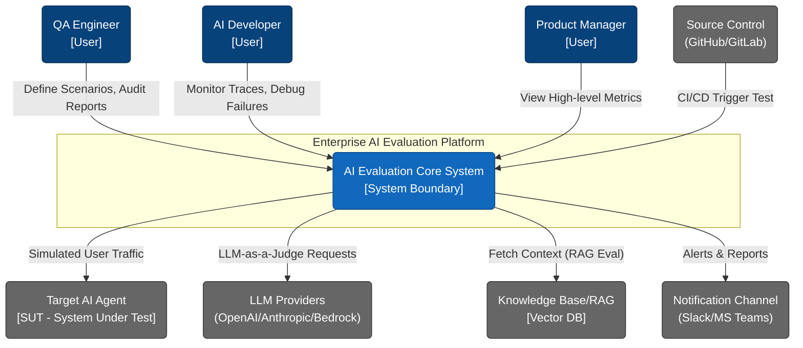
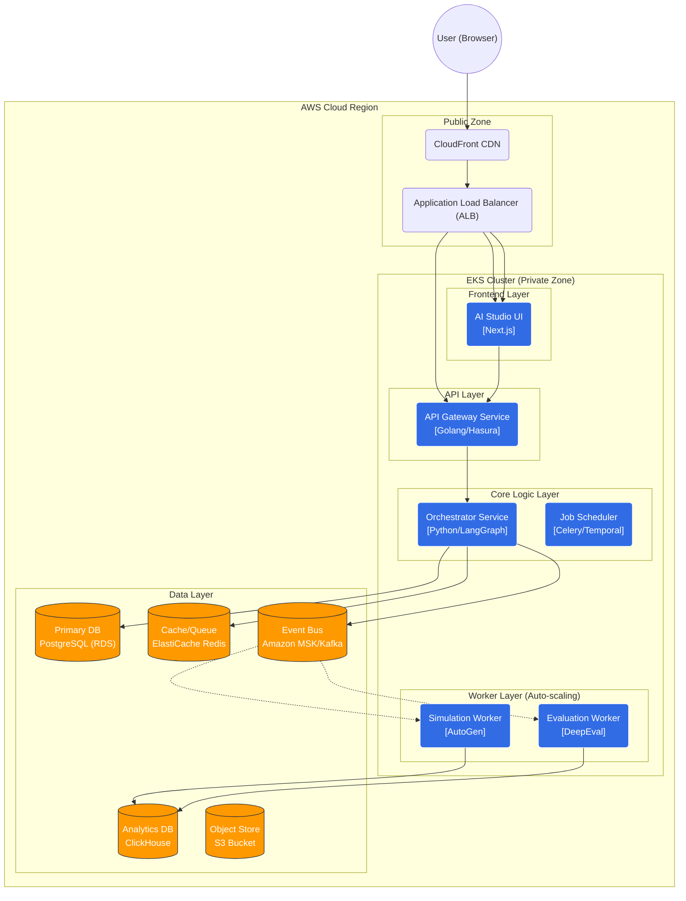
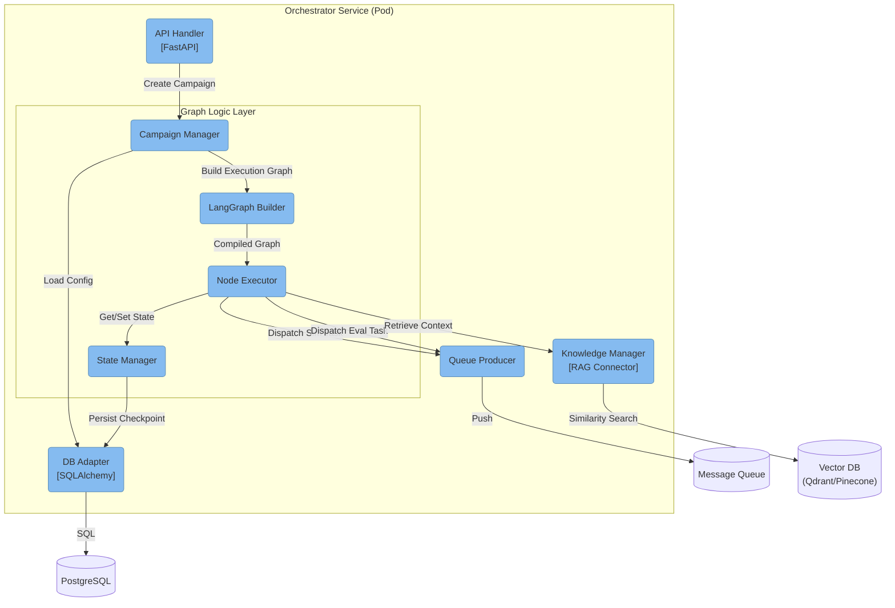
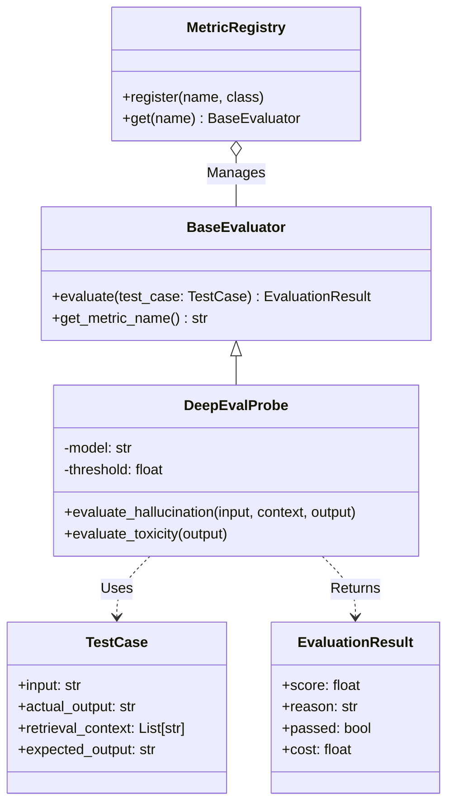
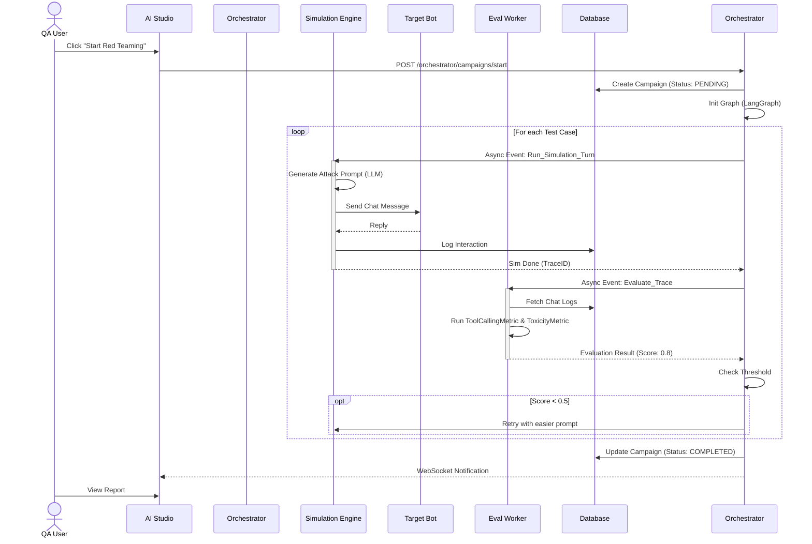

# 01. SYSTEM ARCHITECTURE DESIGN
**Project**: Enterprise AI Agent Evaluation Platform
**Version**: 2.1 (Consolidated Master)
**Status**: APPROVED
**Last Updated**: 2026-01-22

---

## 1. INTRODUCTION

This document defines the overall Solution Architecture for the **Enterprise AI Agent Evaluation Platform**, an automated evaluation and testing system for next-generation AI Agents.

The architecture is designed following **Cloud-Native** principles, ensuring High Availability, Scalability, and Enterprise-grade Security, ready for deployment on **AWS Cloud** infrastructure.

### Design Principles
1.  **Microservices on Kubernetes**: All workloads (excluding the Data Layer) run on EKS to optimize resource management and auto-scaling.
2.  **Event-Driven & Graph-based**: Utilizes LangGraph for complex orchestration logic and Kafka/Redis for asynchronous processing.
3.  **Security-First**: Adopts a Zero Trust model, 2-way data encryption (At-rest & In-transit), and strict VPC Isolation.
4.  **Separation of Concerns**: Clear distinction between the Control Plane (Orchestrator), Compute Plane (Simulation/Eval Workers), and Data Plane.

---

## 2. SYSTEM CONTEXT (C4 Level 1)

Describes the interaction between the Platform and external systems.

---

## 3. CONTAINER ARCHITECTURE (C4 Level 2)

Details the main services and containers in the system, mapped to AWS/EKS infrastructure.

---

## 4. COMPONENT ARCHITECTURE (C4 Level 3)

In-depth look at the internal structure of the `Orchestrator Service` - the brain of the system.

### Key Components
*   **Campaign Manager**: Manages the lifecycle of a test campaign.
*   **LangGraph Builder**: Translates JSON configurations (from UI) into LangGraph Runnable objects, supporting cyclic graphs for self-correcting test scenarios.
*   **Node Executor**: Executes the logic of each node (Start, Wait, End).
*   **State Manager**: Manages short-term memory for campaigns, ensuring durability across server restarts.

---

## 4.1. AUTOGEN INTEGRATION STRATEGY (Headless Simulation)

The system uses **AutoGen** as an embedded Python library within the `Simulation Worker`, **NOT** deploying the AutoGen Studio UI.

### 4.1.1. Headless Architecture (Engine-only)
We bypass the AutoGen UI layer (AutoGen Studio) and utilize only the Core Engine:

*   **Role**: Automates multi-agent conversations to simulate users.
*   **Deployment**: Runs as a Python process within Docker containers (`Simulation Worker`).
*   **Input**: JSON configuration from the `Orchestrator` (User Profile, Test Scenarios).
*   **Output**: Chat History (List of Messages) returned for `DeepEval` scoring.

### 4.1.2. Why not use AutoGen Studio UI?
| Feature | AutoGen Studio UI | Evaluation UI (Custom) |
| :--- | :--- | :--- |
| **Purpose** | Prototyping & Demoing Agents. | **Evaluation & Benchmarking**. |
| **Interface** | Simple Chat (ChatGPT style). | **Split-View Battle Arena**: Compare thoughts vs. responses. |
| **Integrations** | Hard to integrate DeepEval scoring. | Deeply integrated: Realtime Scoring, Latency, CI/CD. |
| **Customization** | Limited theme/layout editing. | Fully controlled (Shadcn/UI). |

---

## 5. CODE/CLASS DESIGN (C4 Level 4)

Modeling the main classes in the Evaluation module (DeepEval Integration).

---

## 6. DYNAMIC VIEWS & SCENARIOS

### 6.1. Sequence Diagram: Active Testing / Red Teaming

---

## 7. AMAZON AWS INFRASTRUCTURE ARCHITECTURE

This section details the physical infrastructure design on AWS.

### 7.1. Network Topology (VPC Design)

Deployed in a dedicated **Virtual Private Cloud (VPC)** across **3 Availability Zones (AZs)**.

*   **VPC CIDR**: `10.0.0.0/16`
*   **Subnet Strategy**:
    *   **Public Subnets**: ALB, NAT Gateways.
    *   **Private App Subnets**: EKS Node Groups (Microservices).
    *   **Private Data Subnets**: RDS, ElastiCache, MSK, ClickHouse.

### 7.3. Compute & Data Layer
*   **Amazon EKS**: Container management.
    *   *Spot Node Group*: Used for Eval Workers for cost optimization.
*   **Persistence**:
    *   **PostgreSQL (RDS)**: Metadata.
    *   **ClickHouse**: Big Data Analytics (Traces).
    *   **S3**: Object Storage.

---

## 8. SECURITY & OPERATIONS

### 8.3. Authorization Model (RBAC)
The system applies strict Role-Based Access Control:

| Role | Key Permissions | Target Users |
| :--- | :--- | :--- |
| **ADMIN** | **Full Access**: Member management, Billing, System Config, Project Deletion. | Project Owner, Tech Lead |
| **EDITOR** | **Modify**: Create/Edit Agents, Run Campaigns, Config Metrics. | AI Engineers, Developers |
| **STAKEHOLDER** | **Analyze**: View Dashboards, Reports, Detailed Logs. Limited Test activation. | QC Lead, Product Manager |
| **VIEWER** | **Read-Only**: High-level Dashboards and Published Reports only. | Business Analysts, Guests |

---
*End of Document*
