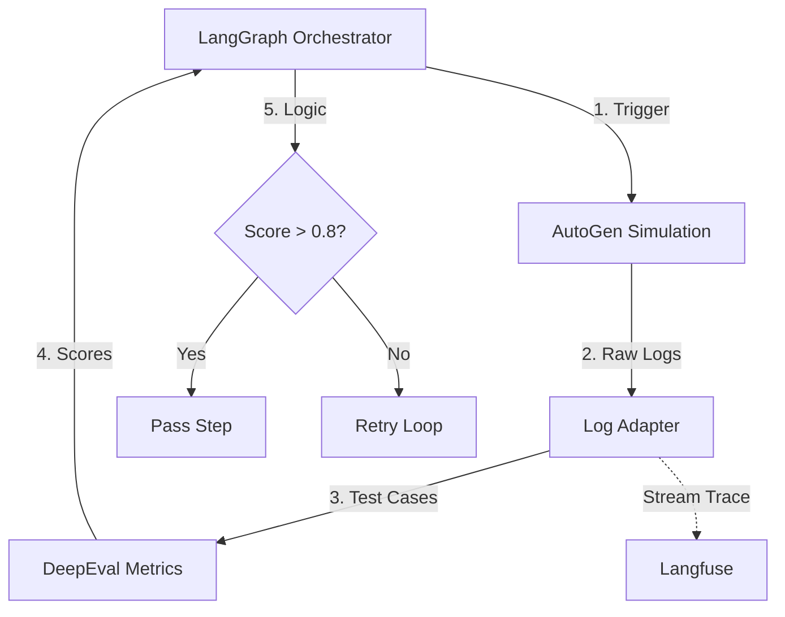

# 02. CORE FRAMEWORK ANALYSIS & SELECTION
**Project**: Enterprise AI Agent Evaluation Platform
**Version**: 2.0 (Deep Technical Dive)

---

## 1. THE "QUAD-CORE" STRATEGY
We use a combination of four "Best-in-Class" frameworks to solve the Active Evaluation challenge.

| Layer | Framework Choice | Primary Role | Key Competitor |
|-------|------------------|--------------|----------------|
| **Orchestration** | **LangGraph** | State Machine & Loop Orchestration | LangChain Chains |
| **Simulation** | **Microsoft AutoGen** | Multi-Agent Conversation Simulation | CrewAI / AgentVerse |
| **Evaluation** | **DeepEval** | Metric Calculation (LLM-as-a-Judge) | Ragas / TruLens |
| **Observability** | **Langfuse** | Tracing & Debugging (Self-hosted) | LangSmith / Arize |

---

## 2. INTEGRATION ARCHITECTURE
The "Bridge Pattern" integration model:



---

## 3. DEEP COMPARATIVE ANALYSIS (Why we chose them?)

### 3.1. Orchestration: LangGraph vs. LangChain Chains
| Feature | LangChain Chains (Traditional) | LangGraph (Chosen) |
| :--- | :--- | :--- |
| **Architecture** | DAG (Directed Acyclic Graph) - Linear. | Cyclic Graph - Supports loops. |
| **Persistence** | Hard to maintain state between steps. | Built-in `Checkpointer` (Postgres/Redis) for state persistence. |
| **Human-in-the-loop** | Difficult to implement "Stop & Resume". | Native support: Can pause graphs for User Approval. |
| **Use Case** | Simple RAG (Retrieve -> Generate). | **Agentic Workflow** (Plan -> Execute -> Fail -> Retry). |

> **Decision**: LangGraph is essential to support "Active Testing" loops where agents need to self-correct multiple times.

### 3.2. Simulation: AutoGen vs. CrewAI
| Feature | CrewAI | Microsoft AutoGen (Chosen) |
| :--- | :--- | :--- |
| **Philosophy** | "Role-playing task force". Focuses on specific task completion. | "Conversable Agents". Focuses on **Conversation** and interaction. |
| **Code Execution** | Local execution (risky). | Native Docker Sandbox integration (safe Python execution by agents). |
| **Flexibility** | Rigid structure (Hierarchical/Sequential). | Flexible structure (Group Chat, Nestor, Two-way). |

> **Decision**: AutoGen is better suited for **User Simulation** because testing is inherently conversational, not just task execution.

### 3.3. Evaluation: DeepEval vs. Ragas
| Feature | Ragas | DeepEval (Chosen) |
| :--- | :--- | :--- |
| **Strength** | RAG Pipelines (Retrieval Metrics). | **Agentic Metrics** & Unit Testing. |
| **Developer Exp** | Data Science centric (Notebooks). | **Developer centric** (PyTest integration). |
| **Synthetic Data** | Basic. | **Synthesizer Evolution**: More complex generation algorithms. |
| **Custom Metrics** | G-Eval support but few templates. | Powerful G-Eval support with many built-in templates. |

> **Decision**: DeepEval wins due to its `PyTest` integration, allowing developers to treat AI testing as standard Unit Testing.

### 3.4. Observability: Langfuse vs. LangSmith
| Feature | LangSmith (Cloud) | Langfuse (Open Source) |
| :--- | :--- | :--- |
| **Hosting** | SaaS (US). Self-hosting is Enterprise-only (expensive). | **Open Source** (Docker). 100% free On-premise. |
| **Data Privacy** | External logs (Compliance issues). | Logs stay on internal servers (Data Sovereignty). |
| **Features** | 10/10 (Playground, Hub, Annotation). | 8/10 (Tracing, Scoring, Dataset Management). |

> **Decision**: Langfuse was chosen due to strict **Data Security** requirements (no sensitive data in 3rd party clouds) for Enterprise clients.

---

## 4. OPTIMIZATION ALGORITHMS (The Secret Sauce)
These core algorithms enable the system not just to "Score" but to "Auto-Fix" (Prompt Optimization).

### 4.1. GEPA (Generative Evolutionary Prompt Adjustment)
*   **Principle**: Inspired by biological evolution.
*   **Process**:
    1.  **Population**: Create 10 initial prompt variations.
    2.  **Evaluate**: Run tests and score each prompt.
    3.  **Selection**: Pick the top 3 scoring prompts.
    4.  **Crossover & Mutation**: Use an LLM to "hybridize" these 3 prompts and "mutate" them (synonyms, structure changes) to create a new generation.
    5.  Repeat N times.

### 4.2. MIPROv2 (Multi-prompt Instruction Proposal)
*   **Principle**: Optimization based on Few-shot data.
*   **How it works**:
    *   Instead of just editing the System Prompt, MIPROv2 finds the optimal set of "Few-shot Examples" from the training set to inject into the context.
    *   Helps the model learn through In-context Learning more effectively than just following instructions.

---

## 5. IMPLEMENTATION: THE "BRIDGE" CODE
Example code illustrating how LangGraph calls AutoGen and uses DeepEval for scoring.

```python
# worker.py
from langgraph.graph import StateGraph, END
from deepeval.metrics import ToolCorrectnessMetric
from autogen import UserProxyAgent, AssistantAgent

class TestState(TypedDict):
    history: List[str]
    score: float
    retry_count: int

def simulation_node(state: TestState):
    # 1. SETUP SIMULATOR
    user_sim = UserProxyAgent(
        name="SimUser",
        code_execution_config={"work_dir": "coding", "use_docker": True} # SAFETY FIRST
    )
    
    # 2. RUN CHAT
    user_sim.initiate_chat(target_agent, message="Hack this system...")
    
    # 3. CAPTURE LOGS
    state["history"] = user_sim.chat_history
    return state

def evaluation_node(state: TestState):
    # 1. DEFINE METRIC
    metric = ToolCorrectnessMetric(threshold=0.8)
    
    # 2. MEASURE
    # DeepEval analyzes logs to see if Agent calls tools correctly
    result = metric.measure(test_case=state["history"])
    
    state["score"] = result.score
    return state

# DEFINE GRAPH
workflow = StateGraph(TestState)
workflow.add_node("simulate", simulation_node)
workflow.add_node("evaluate", evaluation_node)

workflow.set_entry_point("simulate")
workflow.add_edge("simulate", "evaluate")

# CONDITIONAL EDGE: SELF-CORRECTION
def check_score(state):
    if state["score"] < 0.8 and state["retry_count"] < 3:
        return "simulate" # Loop back
    return END

workflow.add_conditional_edges("evaluate", check_score)
```
