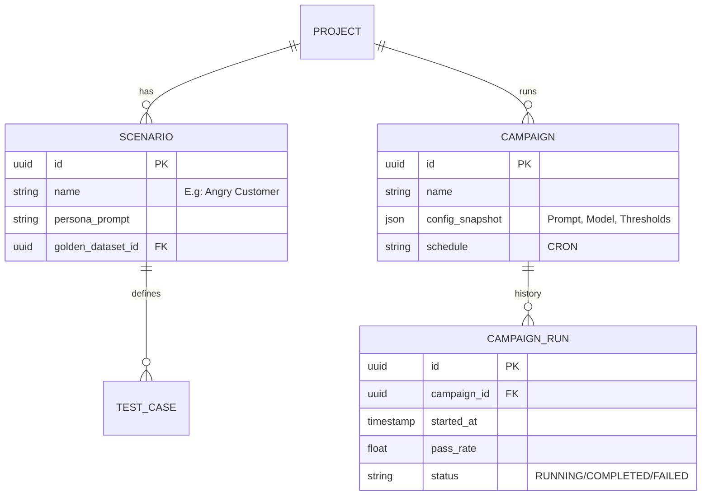

# 03. DATABASE DESIGN SPECIFICATION
**Project**: Enterprise AI Agent Evaluation Platform
**Version**: 2.0 (Active Testing Support)

---

## 1. DATA ARCHITECTURE STRATEGY (Polyglot Persistence)

We use the right tool for the right job.

| Component | Technology | Role | Rationale in Context |
|-----------|------------|------|----------------------|
| **Primary** | **PostgreSQL 16** | Metadata & Config | Requires ACID transactions for Campaign Configs, Users, and Billing management. |
| **Analytics** | **ClickHouse** | Logs & Events | High-speed insertion for millions of chat logs and low-latency aggregate (SUM, AVG) queries. |
| **Vector** | **Qdrant** | Context & Semantic | Supports similarity search for Golden Datasets and RAG context. |
| **Queue** | **Redis** | Job Queue | Lightweight broker for LangGraph tasks. |

---

## 2. POSTGRESQL SCHEMA (Metadata & Orchestration)

Focuses on managing **Test Campaigns** and **Scenarios**.

### 2.1. ER Diagram


### 2.2. Key Tables DDL

**Table: `campaigns`**
Manages recurring test runs.
```sql
CREATE TABLE campaigns (
    id UUID PRIMARY KEY DEFAULT gen_random_uuid(),
    project_id UUID REFERENCES projects(id),
    name VARCHAR(255) NOT NULL,
    type VARCHAR(50) NOT NULL, -- 'RED_TEAMING', 'REGRESSION', 'A_B_TEST'
    
    -- Configuration snapshot at campaign creation
    config JSONB NOT NULL, 
    -- E.g: { "model_a": "gpt-4", "simulator_model": "gpt-4-turbo", "metrics": ["toxicity", "relevancy"] }
    
    cron_schedule VARCHAR(50), -- NULL if manual
    created_at TIMESTAMP DEFAULT NOW()
);
```

**Table: `scenarios`**
Defines test scenarios (Simulation Configs).
```sql
CREATE TABLE scenarios (
    id UUID PRIMARY KEY DEFAULT gen_random_uuid(),
    project_id UUID REFERENCES projects(id),
    name VARCHAR(255),
    description TEXT,
    
    -- Config for AutoGen UserProxy
    persona_template TEXT, -- "You are a {age} year old user..."
    complexity_level INT DEFAULT 1, -- 1-5
    
    created_at TIMESTAMP DEFAULT NOW()
);
```

---

## 3. CLICKHOUSE SCHEMA (Deep Analytics)

Optimized for bulk insertion and aggregate score calculation.

### 3.1. Raw Conversation Turns
Stores detailed interaction turns during simulation.

```sql
CREATE TABLE conversation_turns (
    run_id UUID,          -- Link to Postgres CampaignRun
    trace_id UUID,        -- Langfuse Trace ID
    timestamp DateTime64(3),
    
    -- Simulation Context
    scenario_id UUID,
    simulator_persona String,
    
    -- The interaction
    turn_index UInt8,     -- Turn 1, 2, 3...
    user_input String,    -- Simulator said
    agent_msg String,     -- Target Bot said
    
    metadata Map(String, String) -- Extra tags
) ENGINE = MergeTree()
PARTITION BY toYYYYMM(timestamp)
ORDER BY (run_id, timestamp);
```

### 3.2. Evaluation Metrics Results
Detailed scoring results.

```sql
CREATE TABLE eval_results (
    run_id UUID,
    trace_id UUID,
    timestamp DateTime64(3),
    
    metric_name String, -- 'AnswerRelevancy', 'Toxicity'
    score Float32,      -- 0.0 - 1.0
    reason String,      -- "The agent failed because..."
    
    -- Cost tracking
    input_tokens UInt32,
    output_tokens UInt32,
    cost_usd Float32
) ENGINE = MergeTree()
PARTITION BY toYYYYMM(timestamp)
ORDER BY (metric_name, score, timestamp);
```

---

## 4. VECTOR DATABASE (Qdrant)

### 4.1. Collection: `golden_test_cases`
Stores sample data (Golden Dataset) for semantic comparison.

*   **Config**: Cosine Distance, 1536 dimensions (OpenAI ada-002/small-3).
*   **Payload Schema**:
    ```json
    {
      "question": "How do I change my password?",
      "expected_answer": "Go to Settings -> Security -> Change Password.",
      "ideal_context": ["doc_security_policy_v2.pdf"],
      "difficulty": "Easy",
      "category": "Account Management"
    }
    ```
*   **Usage**: During regression tests, the system queries vectors for similar historical test cases to ensure no regressions occur.

---

## 5. DATA RETENTION POLICY

*   **Hot Data (30 days)**: Full logs stored in ClickHouse NVMe storage. Instant access.
*   **Warm Data (1 year)**: Old logs moved to S3-backed storage (ClickHouse Tiered Storage). Slower queries.
*   **Cold Data (Permanent)**: Archive campaign reports (PDF/JSON summaries) in Postgres/S3. Extremely old raw logs are deleted.
