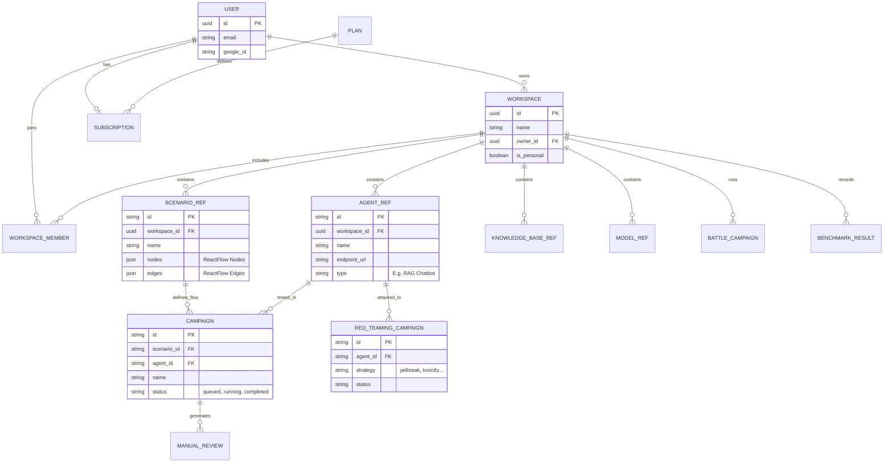

# 03. DATABASE DESIGN SPECIFICATION
**Project**: Enterprise AI Agent Evaluation Platform
**Version**: 2.0 (Active Testing Support)

---

## 1. DATA ARCHITECTURE STRATEGY (Polyglot Persistence)

We use the right tool for the right job.

| Component | Technology | Role | Rationale in Context |
|-----------|------------|------|----------------------|
| **Primary** | **PostgreSQL 16** | Metadata & Config | Requires ACID transactions for Campaign Configs, Users, and Billing management. |
| **Analytics** | **ClickHouse** | Logs & Events | High-speed insertion for millions of chat logs and low-latency aggregate (SUM, AVG) queries. |
| **Vector** | **Qdrant** | Context & Semantic | Supports similarity search for Golden Datasets and RAG context. |
| **Queue** | **Redis** | Job Queue | Lightweight broker for LangGraph tasks. |

---

## 2. POSTGRESQL SCHEMA (Metadata & Orchestration)

The PostgreSQL database acts as the single source of truth for user identities, billing, workspaces, resource configurations (Agents, Scenarios, Knowledge Bases), and campaign execution tracking.

### 2.1. ER Diagram


### 2.2. Core Tables
The platform uses a microservice architecture sharing the same PostgreSQL instance or schema structure.

**Identity & Billing (`users`, `workspaces`, `plans`, `subscriptions`)**
Manages access control and tenant isolation.
*   `users`: Stores user credentials (`email`, `google_id`).
*   `workspaces`: Represents a tenant boundary. `owner_id` links to `users`.
*   `workspace_members`: Defines RBAC (`OWNER`, `EDITOR`, `VIEWER`) across workspaces.
*   `subscriptions` & `plans`: Manages monthly/annual quotas and features limitations.

**Resource Service (`agent_ref`, `scenario_ref`, `knowledge_base_ref`, `model_ref`)**
Stores the core entities required for AI evaluations within a workspace.
*   `agent_ref`: Configurations for target bots (name, endpoint URL, API keys, Langfuse integration).
*   `scenario_ref`: Visual test scenarios built with ReactFlow. Stores `nodes` and `edges` representing the test flow.
*   `knowledge_base_ref`: Documents/Vector DB settings used for Context/RAG testing.
*   `model_ref`: Connection configurations to various LLM Providers (OpenAI, Anthropic, Local) used by the simulator or evaluation logic.

**Orchestrator & Execution (`campaigns`, `red_teaming_campaign`, `battle_campaign`)**
Tracks the state of active evaluations.
*   `campaigns`: Tracks deterministic/graph-based simulation runs (`scenario_id`, `agent_id`, `status`).
*   `red_teaming_campaign`: Tracks adversarial operations detailing `strategy` (e.g. jailbreak, prompt-injection), `intensity`, and vulnerability reports (`critical_count`, `high_count`).
*   `battle_campaign`: Orchestrates A/B testing (Agent A vs Agent B) tracking `agent_a_wins`, `agent_b_wins`, `ties`, and `current_turn`.
*   `manual_review`: Pending Human-in-the-Loop interventions holding test cases awaiting manual grading.

---

## 3. CLICKHOUSE SCHEMA (Deep Analytics)

Optimized for bulk insertion and aggregate score calculation.

### 3.1. Raw Conversation Turns
Stores detailed interaction turns during simulation.

```sql
CREATE TABLE conversation_turns (
    run_id UUID,          -- Link to Postgres CampaignRun
    trace_id UUID,        -- Langfuse Trace ID
    timestamp DateTime64(3),
    
    -- Simulation Context
    scenario_id UUID,
    simulator_persona String,
    
    -- The interaction
    turn_index UInt8,     -- Turn 1, 2, 3...
    user_input String,    -- Simulator said
    agent_msg String,     -- Target Bot said
    
    metadata Map(String, String) -- Extra tags
) ENGINE = MergeTree()
PARTITION BY toYYYYMM(timestamp)
ORDER BY (run_id, timestamp);
```

### 3.2. Evaluation Metrics Results
Detailed scoring results.

```sql
CREATE TABLE eval_results (
    run_id UUID,
    trace_id UUID,
    timestamp DateTime64(3),
    
    metric_name String, -- 'AnswerRelevancy', 'Toxicity'
    score Float32,      -- 0.0 - 1.0
    reason String,      -- "The agent failed because..."
    
    -- Cost tracking
    input_tokens UInt32,
    output_tokens UInt32,
    cost_usd Float32
) ENGINE = MergeTree()
PARTITION BY toYYYYMM(timestamp)
ORDER BY (metric_name, score, timestamp);
```

---

## 4. VECTOR DATABASE (Qdrant)

### 4.1. Collection: `golden_test_cases`
Stores sample data (Golden Dataset) for semantic comparison.

*   **Config**: Cosine Distance, 1536 dimensions (OpenAI ada-002/small-3).
*   **Payload Schema**:
    ```json
    {
      "question": "How do I change my password?",
      "expected_answer": "Go to Settings -> Security -> Change Password.",
      "ideal_context": ["doc_security_policy_v2.pdf"],
      "difficulty": "Easy",
      "category": "Account Management"
    }
    ```
*   **Usage**: During regression tests, the system queries vectors for similar historical test cases to ensure no regressions occur.

---

## 5. DATA RETENTION POLICY

*   **Hot Data (30 days)**: Full logs stored in ClickHouse NVMe storage. Instant access.
*   **Warm Data (1 year)**: Old logs moved to S3-backed storage (ClickHouse Tiered Storage). Slower queries.
*   **Cold Data (Permanent)**: Archive campaign reports (PDF/JSON summaries) in Postgres/S3. Extremely old raw logs are deleted.
