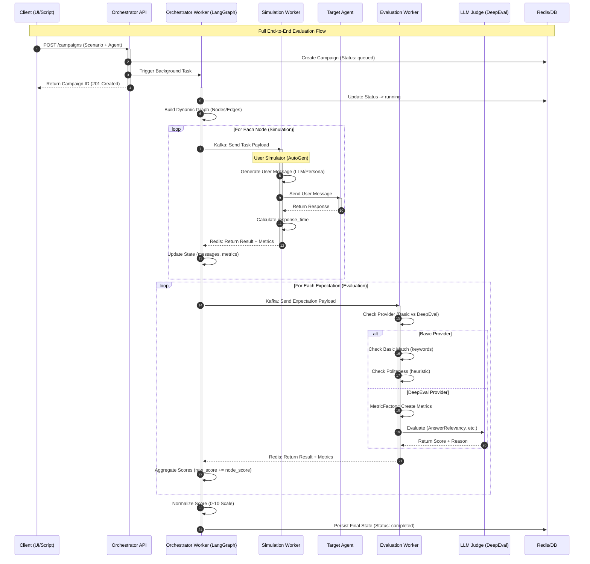

# BACKEND IMPLEMENTATION SPECIFICATION
**Project**: Enterprise AI Agent Evaluation Platform
**Status**: STABLE

## 1. System Overview & Microservices Architecture

Based on the **[System Architecture](./01-System-Architecture.md)**, the Backend system is divided into the following microservices:

| Service Name | Technology Stack | Responsibility | UI Module Mapping |
| :--- | :--- | :--- | :--- |
| **Identity Service** | Python (FastAPI) + Google OAuth 2.0 | User Management, JWT Auth, Workspace RBAC, Auto-provisioning. | `settings/team`, `profile` |
| **Resource Service** | Python (FastAPI) + PostgreSQL | CRUD for Agents (Encrypted), Scenarios, Models, Knowledge Bases, Metrics. | `agents`, `models`, `knowledge-bases` |
| **Orchestrator Service** | Python (LangGraph) + Redis | Campaign Orchestration, Dynamic Graph Building, State Persistence. | `scenario-builder`, `battle-arena` |
| **Simulation Worker** | Python (AutoGen) | Multi-turn Conversation Simulation, Red Teaming (Adversarial). | `battle-arena` (Sim side) |
| **Evaluation Worker** | Python (DeepEval) | LLM-as-a-Judge, Confidence Thresholding, Human-in-the-loop. | `metrics-library`, `reports` |
| **Data Ingestion** | **Rust** (Actix-web) | High-throughput Log/Trace collection, Batching to ClickHouse. | `trace`, `dev-console` |
| **GenAI Service** | Python (LangChain) | Persona/Test Case/Golden set generation (RAG-based), Prompt Optimization (GEPA). | `dataset-gen`, `prompt-optimizer` |
| **Langfuse** | Infrastructure (Docker) | Tracing, Observability, Evaluation Store. | `trace` |
| **Clickhouse** | Infrastructure (Docker) | High-performance Log/Trace analytics. | `trace`, `reports` |
| **Kafka + Zookeeper** | Infrastructure (Docker) | Event Streaming, Async Tasks (Simulation/Evaluation). | N/A (Internal) |
| **Redis** | Infrastructure (Docker) | Caching, LangGraph Checkpointer, Rate Limiting. | N/A (Internal) |
| **Billing Service** | Python (FastAPI) | PayPal Integration, Subscription Management (Quota tracking). | `billing`, `pricing` |

---

## 2. The Quad-Core Technology Stack

The system is built on four core pillars (Quad-Core) to ensure scalability, testing depth, and data security.

### 2.1. Orchestration: LangGraph
*   **Role**: Orchestrates complex testing flows, supporting Cyclic Graphs (self-correction loops).
*   **Deep Integration**:
    *   Uses `StateGraph` to define flows: `User Sim -> Target Bot -> Evaluator -> Decision -> Loop/End`.
    *   Manages persistent state via Redis, enabling "Time Travel" for step-by-step agent debugging.

### 2.2. Simulation: Microsoft AutoGen
*   **Role**: Simulates users (User Simulator) with diverse personalities (Personas).
*   **Why AutoGen?**:
    *   **Conversable Agents**: Optimized for natural multi-turn conversations.
    *   **Headless Mode**: Runs in the background within Docker workers.
    *   **Human Proxy**: Allows manual QA intervention (Human-in-the-loop) when necessary.

### 2.3. Evaluation: DeepEval
*   **Role**: Specialized LLM-as-a-Judge scoring for RAG and Agents.
*   **Key Features**:
    *   **G-Eval**: Custom prompt-based metrics.
    *   **Synthesizer**: Automated synthetic data generation from business documents.
    *   **Unit Test Integration**: Write test cases like PyTest, directly integrated into CI/CD.

### 2.4. Observability: Langfuse
*   **Role**: Tracing, monitoring, and debugging.
*   **Data Sovereignty**: Self-hosted deployment ensures no sensitive data leakage (Privacy-first).
*   **Trace Linking**: Tight integration of Trace IDs across AutoGen -> LangGraph -> Target Bot.
*   **Future Strategy (Arize Phoenix)**:
    *   Designed with a **Thin Wrapper SDK** (`langeval-sdk`).
    *   Allows easy switching to **Arize Phoenix** (for deep embedding analysis) without modifying Agent code.

### 2.5. Dual-Flow Data Pipeline Architecture

The backend is optimized for two distinct data flows:

**Flow A: Active Evaluation (Scenario-driven)**
*   **Path**: `User UI -> Orchestrator -> Kafka (Simulation) -> AutoGen Worker -> Kafka (Evaluation) -> DeepEval Worker -> Redis/DB`.
*   **Characteristics**: Sequential execution, stateful context, high latency (seconds to minutes).

**Flow B: Passive Monitoring (Trace-driven)**
*   **Path**: `Bot SDK/API -> Data Ingestion Service (Rust) -> Kafka (Traces) -> ClickHouse`.
*   **Characteristics**: Fire-and-forget, high throughput, sampling-based backgrounds evaluation.

---

### 2.5.1 Scoring Logic Diagrams

**Sequence Diagram: Full End-to-End Evaluation Flow**



---

## 3. Database Design

### 3.1. PostgreSQL (Relational Data)
Using **SQLModel** (SQLAlchemy + Pydantic).

#### `users` Table
| Column | Type | Description |
| :--- | :--- | :--- |
| `id` | UUID | Primary Key |
| `email` | String | Email (Unique) |
| `name` | String | Display Name |
| `avatar_url` | String | Google Avatar URL |
| `google_id` | String | Google OAuth ID |

#### `workspaces` Table
| Column | Type | Description |
| :--- | :--- | :--- |
| `id` | UUID | Primary Key |
| `name` | String | Workspace Name |
| `owner_id` | UUID | FK to `users` |
| `is_personal` | Boolean | Default Workspace flag |

#### `plans` Table
| Column | Type | Description |
| :--- | :--- | :--- |
| `id` | UUID | Primary Key |
| `name` | String | Plan Name (Free, Pro, Enterprise) |
| `price_monthly` | Float | Monthly Price |
| `features` | JSONB | Usage limits (max agents, runs, etc.) |

---

## 4. Class Design & Implementation

### 4.1. Orchestrator Service
```python
class CampaignWorkflow:
    def __init__(self, scenario_config: dict):
        self.config = scenario_config
        self.builder = StateGraph(AgentState)
        self._setup_graph()

    def _setup_graph(self):
        self.builder.add_node("simulation", simulation_node)
        self.builder.add_node("evaluation", evaluation_node)
        self.builder.set_entry_point("simulation")
        self.builder.add_edge("simulation", "evaluation")
        self.builder.add_conditional_edges("evaluation", check_retry)
```

### 4.2. Evaluation Worker
```python
class EvaluationEngine:
    def evaluate(self, input_text, output_text, context, metrics):
        test_case = LLMTestCase(input=input_text, actual_output=output_text, retrieval_context=context)
        results = []
        for m in metrics:
            metric_impl = self._get_metric(m)
            metric_impl.measure(test_case)
            results.append({
                "score": metric_impl.score,
                "reason": metric_impl.reason,
                "low_confidence": metric_impl.score < CONFIDENCE_THRESHOLD
            })
        return results
```

---

## 8. Implementation Status Summary

| Service | Status | Version | Highlights |
| :--- | :--- | :--- | :--- |
| **Resource Service** | 🟢 Production Ready | v1.2 | Full CRUD, Pagination, Langfuse Integration, Encryption. |
| **Orchestrator** | 🟢 Production Ready | v1.0 | LangGraph Engine, Dynamic Builder, Redis Persistence. |
| **Evaluation Worker** | 🟢 Production Ready | v1.0 | DeepEval framework, Human-in-the-loop, Kafka Consumer. |
| **Simulation Worker** | 🟢 Production Ready | v1.0 | AutoGen Agents, Red Teaming, Persona System. |
| **Identity Service** | 🟡 In Progress | v0.8 | Entra ID Auth, Auto-provisioning (Lacks RBAC). |
| **Data Ingestion** | 🟡 In Progress | v0.7 | Rust-based Kafka Consumer, ClickHouse Batching. |

---

## 9. Product Roadmap

### Phase 2: Studio Experience (Current - Q2/2026)
- **AI Studio Web**: Visual Scenario Builder for QA/Testers.
- **Human-in-the-loop**: Annotator UI for score overrides.
- **Team Management**: User invitations and role management.
- **Streaming Logs**: SSE/WebSocket support for real-time Thought -> Action traces.

### Phase 3: Scale & Ecosystem (Q3/2026+)
- **Battle Mode (Arena)**: Blind comparison and ELO rating system.
- **Advanced Red Teaming**: Deep integration with Garak and PyRIT.
- **CI/CD Integration**: Block merges if evaluation scores fall below thresholds.

### Phase 4: Self-Optimization (Q4/2026+)
- **Advanced Prompt Tuning**: MIPROv2 for automated prompt engineering.
- **Retrieval Drift Monitoring**: Arize Phoenix integration for vector quality tracking.
- **Multi-modal RAG Eval**: Visual information extraction evaluation (charts/images).

---
**Last Updated**: 2026-02-10
**By**: TuanTD
