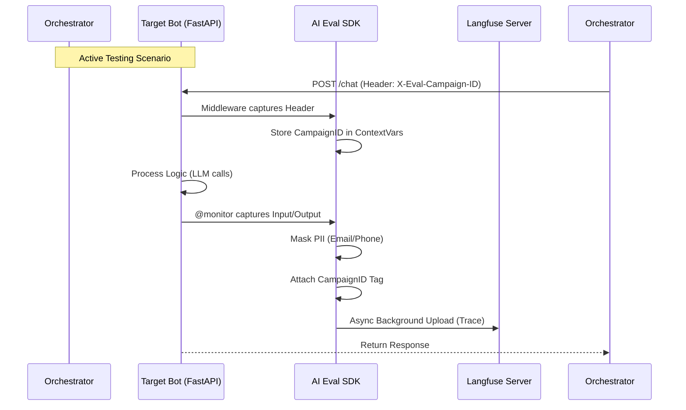

# 05. SDK INTEGRATION: THE "THIN WRAPPER" STRATEGY
**Project**: Enterprise AI Agent Evaluation Platform
**Type**: Technical Specification
**Status**: APPROVED

---

## 1. Strategy Overview: "Opinionated Thin Wrapper"

Instead of using the Langfuse SDK directly (Raw) or rewriting everything from scratch (Full Custom), we employ a **"Thin Wrapper"** strategy.

We will build a small Python library called `langeval-sdk`.
*   **Core**: Utilizes `langfuse-python` under the hood (to leverage its robust batching, async, and retry capabilities).
*   **Wrapper Layer**: Adds project-specific logic that Langfuse doesn't provide natively.

### Why this approach?
1.  **Automatic Context Injection**: Automatically reads the `X-Eval-Scenario-ID` header from requests to tag traces (crucial for active testing).
2.  **Safety First**: Enables PII Masking by default.
3.  **Simplicity**: Developers only need to use `@monitor` instead of a complex setup.

### 1.1. High-Level Flow (Data Pipeline)



---

## 2. Installation & Configuration

### 2.1. Installation
Bot developers install the internal SDK package:

```bash
pip install langeval-sdk
```

### 2.2. Environment Variables
The SDK automatically reads standard Langfuse configurations:

```bash
LANGFUSE_PUBLIC_KEY="pk-lf-..."
LANGFUSE_SECRET_KEY="sk-lf-..."
LANGFUSE_HOST="https://eval.evaluation.ai" # Self-hosted URL
AI_EVAL_PROJECT_ID="CSKH_BOT_V1"
```

---

## 3. Core Features Implementation

### 3.1. The Unified `@monitor` Decorator
The primary feature for developers.

```python
# main.py
from ai_eval_sdk import monitor

@monitor
def chat_endpoint(user_message: str):
    # Bot logic...
    return "Bot response"
```

#### How it works (Wrapper Logic)
The decorator performs three tasks:
1.  **PII Masking**: Scans `user_message` to mask phone numbers/emails before uploading to the server.
2.  **Langfuse Observe**: Calls `langfuse.observe()` to start the trace.
3.  **Context Injection**: Checks for `ContextVars` (from Middleware) to attach campaign tags.

### 3.2. Automatic Context Injection (Middleware)
To distinguish between **Real Users** and **Simulated Users**, the SDK provides Middleware for FastAPI/Flask.

```python
# app_startup.py
from fastapi import FastAPI
from ai_eval_sdk.integrations.fastapi import EvalContextMiddleware

app = FastAPI()
app.add_middleware(EvalContextMiddleware) # Automatically captures Headers
```

**Middleware Logic:**
1.  Bot receives a request from the `Orchestrator` (during testing).
2.  Request includes the header: `X-Eval-Campaign-ID: cam_123`.
3.  Middleware reads this header and stores it in `contextvars`.
4.  The `@monitor` decorator reads `contextvars` and attaches the `campaign_id=cam_123` tag to the trace.
5.  **Result**: Traces on the dashboard are automatically mapped to test campaigns.

---

## 4. Integration Examples

### 4.1. LangChain Integration
```python
from ai_eval_sdk.integrations.langchain import get_eval_callback

# Automatically retrieves config from Env and current Context
handler = get_eval_callback()

# Run chain
chain.invoke({"input": "Hello"}, config={"callbacks": [handler]})
```

### 4.2. AutoGen Integration (Manual Trace)
```python
from ai_eval_sdk.integrations.autogen import trace_agent

user_proxy = UserProxyAgent("user")
assistant = AssistantAgent("assistant")

# Wrap to capture chat content
with trace_agent(name="Autogen_Conversation"):
    user_proxy.initiate_chat(assistant, message="Hello")
```

---

## 5. SDK Architecture (Internal)

```
ai_eval_sdk/
├── __init__.py           # Exports @monitor
├── core/
│   ├── client.py         # Singleton Wrapper around Langfuse Client
│   ├── context.py        # Manages ContextVars (Campaign ID)
│   └── security.py       # PII Masking Logic
├── decorators.py         # Implementation of @monitor
└── integrations/
    ├── fastapi.py        # Header capture Middleware
    ├── langchain.py      # Factory for CallbackHandler
    └── autogen.py        # Context Manager for AutoGen
```

### Benefits of this architecture:
1.  **Decoupling**: If we switch from Langfuse to Arize Phoenix, we only update `core/client.py`. Developer code (`@monitor`) remains unchanged.
2.  **Compliance**: 100% of data leaving the bot is guaranteed to be masked via `core/security.py`.
3.  **Active Testing**: Solves the challenge of mapping traces to specific tests.
