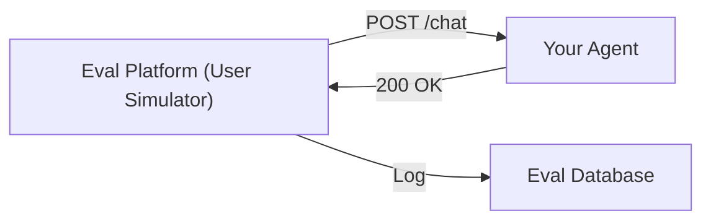
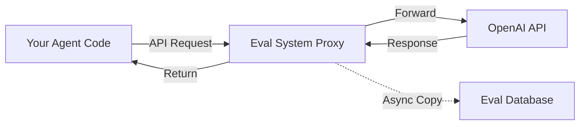
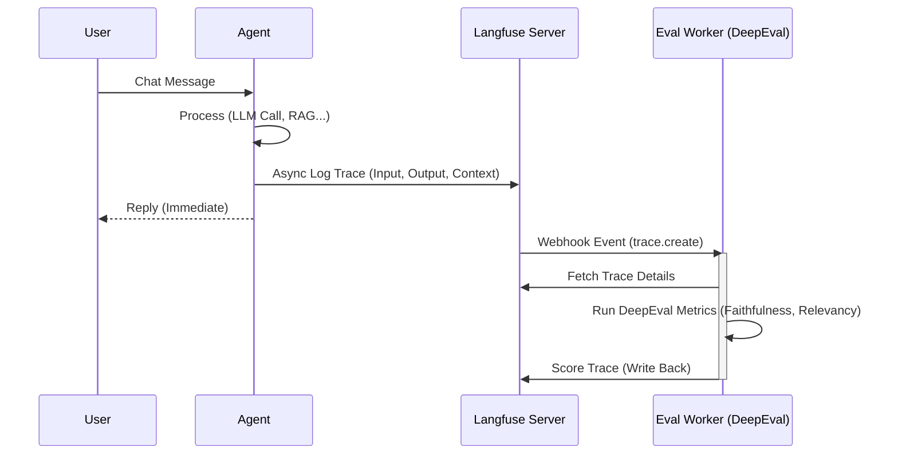

# 11. Agent Integration Patterns Guide

## 1. Overview
Answering the core question: **"How can I evaluate any AI Agent?"**
The platform provides five integration patterns, ranging from non-intrusive (Black-box) to deep integration (White-box).

---

## 2. Pattern A: The "Black-Box" Simulation (Recommended for finished Agents)
**Principle**: Treat the Agent as a black box. No access to the Agent's code or database is required.
**Mechanism**:
1.  Your Agent exposes a `POST /chat` API endpoint.
2.  The Eval System (using AutoGen) acts as a User and calls this API.
3.  The system records `Input` -> `Output` pairs for scoring.

*   **Pros**: Zero code changes. Tests can run in Production/Staging environments.
*   **Cons**: Lack of insight into "why" an agent failed (no thought process or intermediate logs).



---

## 3. Pattern B: The "LLM Proxy" Middleware
**Principle**: Your Agent calls OpenAI/Anthropic through the Eval System's "Transit Station" (Proxy).
**Implementation**:
Instead of `OPENAI_BASE_URL="https://api.openai.com"`, use:
`OPENAI_BASE_URL="https://api.eval-platform.com/proxy/openai"`

*   **Pros**: Only one line of config change (.env). Automatically captures all outgoing prompts and incoming responses.
*   **Cons**: Only captures LLM calls; ignores internal logic (tool calling, DB queries).



---

## 4. Pattern C: Async SDK Logging (Fire & Forget)
**Principle**: Insert a line of code into your Agent's chat function to send logs directly to the Eval System.

```python
# Your code
response = agent.run(user_input)

# Add this line
eval_client.log(input=user_input, output=response)
```

---

## 5. Pattern D: Deep Instrumentation (LangChain/LangGraph Callbacks)
**Principle**: Use native framework callbacks to hook into every thought and action of the Agent.

```python
from ai_eval import EvalCallbackHandler

agent = create_openai_function_agent(
    llm=llm,
    tools=tools,
    # Automatically sends every step (Thought, Tool Call, Observation)
    callbacks=[EvalCallbackHandler()]
)
```

---

## 6. Pattern E: Agent -> Langfuse -> DeepEval (Recommended Enterprise Architecture)
**Principle**: Use Langfuse as the "Source of Truth" for logs and observability, with DeepEval acting as a background "Evaluation Worker."

*   **Why this model?**
    *   **Performance**: Scoring is slow (requires LLM calls). Decoupling allows immediate agent responses.
    *   **Observability**: Leverages Langfuse's powerful trace/span visualization.
    *   **Scalability**: Allows independent scaling of evaluation workers.

### 6.1. Architecture Diagram


---

## Summary Comparison

| Pattern | Code Change? | Depth of Data | Best For |
|---------|--------------|---------------|----------|
| **Black-box** | No | Input/Output only | Business Logic, Acceptance Testing, Web UI |
| **Proxy** | Env Config | LLM Raw Inputs | Cost Debugging, Prompt Optimization |
| **SDK Log** | Minimal | Custom | Custom Agents, Production Monitoring |
| **Callbacks** | Config | Full Traces | Complex Debugging, Development Phase |
| **Langfuse->DeepEval** | **Medium** | **Full Context + Scores** | **Enterprise Production, RAG Apps** |
