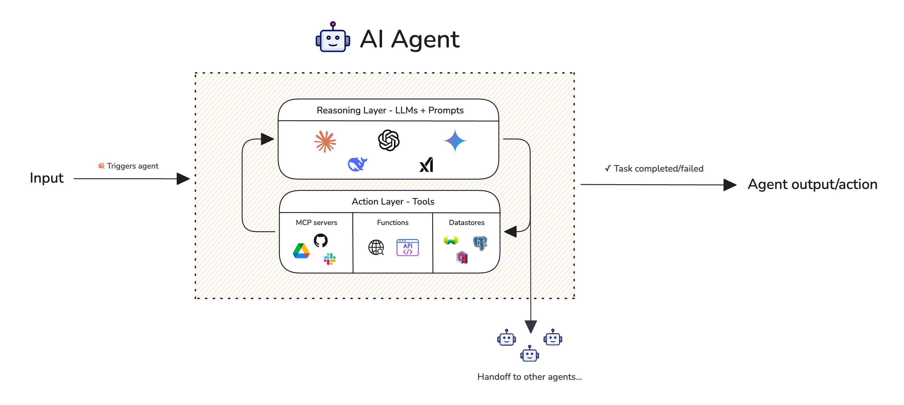

# AI Agents
# Đánh giá AI Agent

## Đánh giá AI Agent

**Đánh giá AI Agent** là quá trình đo lường mức độ hiệu quả của một agent trong việc suy luận, chọn và gọi các công cụ, và hoàn thành các tác vụ—riêng biệt tại mỗi tầng (layer)—để bạn có thể xác định chính xác cái gì bị hỏng. Nhưng trước tiên, AI agent là gì?

Một AI agent là một hệ thống được hỗ trợ bởi LLM, tự động suy luận về các tác vụ, tạo kế hoạch và thực thi các hành động bằng cách sử dụng các công cụ bên ngoài để đạt được mục tiêu của người dùng. Khác với các ứng dụng LLM đơn giản chỉ phản hồi các prompt đơn lẻ, các agent hoạt động theo vòng lặp—suy luận, hành động, quan sát kết quả và điều chỉnh cách tiếp cận của chúng cho đến khi tác vụ hoàn thành.

:::info
Các AI agent bao gồm hai tầng: **tầng suy luận (reasoning layer)** (được hỗ trợ bởi LLM) xử lý việc lập kế hoạch và ra quyết định, trong khi **tầng hành động (action layer)** (được hỗ trợ bởi các công cụ như gọi hàm) thực thi các hành động trong thế giới thực. Các tầng này làm việc cùng nhau một cách lặp đi lặp lại cho đến khi tác vụ hoàn thành.
:::

Vì kết quả thành công của agent phụ thuộc hoàn toàn vào chất lượng của cả suy luận và hành động, việc đánh giá AI agent tập trung vào việc đánh giá các tầng này một cách riêng biệt. Điều này cho phép gỡ lỗi dễ dàng hơn và xác định các vấn đề ở **cấp độ thành phần (component-level).**

*Để có phân tích toàn diện về từng số liệu agentic, hãy xem [hướng dẫn Đánh giá AI Agent](/guides/guides-ai-agent-evaluation-metrics).*

## Các Cạm Bẫy Phổ Biến trong Pipeline của AI Agent

Một pipeline AI agent liên quan đến các bước suy luận (lập kế hoạch) và hành động (gọi công cụ) lặp lại cho đến khi hoàn thành tác vụ. Tầng suy luận quyết định *làm gì*, trong khi tầng hành động thực hiện *cách làm*.



**Tầng suy luận** chứa LLM của bạn và chịu trách nhiệm hiểu các tác vụ, tạo kế hoạch và quyết định sử dụng công cụ nào. **Tầng hành động** chứa các công cụ của bạn (gọi hàm, API, v.v.) và chịu trách nhiệm thực thi các quyết định đó. Cùng nhau, chúng lặp lại cho đến khi tác vụ hoàn thành hoặc thất bại.

### Tầng Suy Luận (Reasoning Layer)

Tầng suy luận, được hỗ trợ bởi LLM của bạn, chịu trách nhiệm lập kế hoạch và ra quyết định. Điều này thường bao gồm:

1.  **Hiểu ý định của người dùng** bằng cách phân tích đầu vào để xác định tác vụ và mục tiêu cơ bản.
2.  **Phân rã các tác vụ phức tạp** thành các tác vụ phụ nhỏ hơn, dễ quản lý hơn có thể được thực thi tuần tự hoặc song song.
3.  **Tạo một chiến lược mạch lạc** phác thảo các bước cần thiết để hoàn thành tác vụ.
4.  **Quyết định sử dụng công cụ nào** và theo thứ tự nào dựa trên bối cảnh hiện tại.

Chất lượng suy luận của agent chủ yếu bị ảnh hưởng bởi:

*   **Lựa chọn LLM**: Các mô hình khác nhau có khả năng suy luận khác nhau. Các mô hình lớn hơn như `gpt-4o` hoặc `claude-3.5-sonnet` thường suy luận tốt hơn các mô hình nhỏ hơn, nhưng với chi phí và độ trễ cao hơn.
*   **Prompt template**: System prompt và các hướng dẫn được đưa cho LLM ảnh hưởng nặng nề đến cách nó tiếp cận các tác vụ. Một prompt được soạn thảo tốt sẽ hướng dẫn LLM suy luận từng bước, xem xét các trường hợp biên và tạo ra các kế hoạch mạch lạc.
*   **Temperature**: Nhiệt độ thấp hơn tạo ra suy luận tập trung, mang tính quyết định hơn; nhiệt độ cao hơn có thể dẫn đến các kế hoạch sáng tạo hơn nhưng có khả năng không nhất quán.

:::tip
Prompt template được cho là yếu tố quan trọng nhất khi cải thiện tầng suy luận.
:::

Dưới đây là các câu hỏi chính mà đánh giá AI agent nhằm giải quyết trong tầng suy luận:

*   **Agent của bạn có đang tạo ra các kế hoạch hiệu quả không?** Một kế hoạch tốt phải logic, đầy đủ và hiệu quả để hoàn thành tác vụ. Các kế hoạch kém dẫn đến lãng phí các bước, bỏ sót yêu cầu hoặc thất bại hoàn toàn.
*   **Kế hoạch có phạm vi phù hợp không?** Các kế hoạch quá chi tiết lãng phí tài nguyên, trong khi các kế hoạch quá cao cấp để lại các chi tiết quan trọng không được giải quyết.
*   **Kế hoạch có tính đến các phụ thuộc không?** Một số tác vụ phụ phải được hoàn thành trước khi những tác vụ khác có thể bắt đầu. Một kế hoạch tốt tôn trọng các phụ thuộc này.
*   **Agent của bạn có tuân theo kế hoạch của chính nó không?** Một agent tạo ra một kế hoạch tốt nhưng sau đó đi chệch khỏi nó trong quá trình thực thi sẽ làm suy yếu khả năng suy luận của chính nó.

### Tầng Hành Động (Action Layer)

Tầng hành động là nơi agent của bạn tương tác với các hệ thống bên ngoài thông qua các công cụ (gọi hàm, API, cơ sở dữ liệu, v.v.). Đây thường là nơi mọi thứ đi sai hướng. Tầng hành động thường bao gồm:

1.  **Chọn đúng công cụ** từ các tùy chọn có sẵn dựa trên tác vụ phụ hiện tại.
2.  **Tạo các tham số (arguments) chính xác** cho lệnh gọi công cụ dựa trên đầu vào và bối cảnh.
3.  **Gọi các công cụ theo đúng trình tự** khi có sự phụ thuộc giữa các hoạt động.
4.  **Xử lý đầu ra của công cụ** và chuyển kết quả trở lại tầng suy luận.

Chất lượng gọi công cụ của agent chủ yếu bị ảnh hưởng bởi:

*   **Các công cụ có sẵn**: Tập hợp các công cụ bạn hiển thị cho agent xác định những hành động nó có thể thực hiện. Quá nhiều công cụ có thể gây nhầm lẫn cho LLM; quá ít có thể để lại khoảng trống trong khả năng.
*   **Mô tả công cụ**: Các mô tả rõ ràng, không mơ hồ giúp LLM hiểu khi nào và làm thế nào để sử dụng từng công cụ. Các mô tả mơ hồ dẫn đến việc chọn công cụ không chính xác.
*   **Lược đồ (schemas) công cụ**: Các lược đồ đầu vào/đầu ra được xác định rõ với các loại thích hợp, các trường bắt buộc và ví dụ giúp LLM tạo ra các tham số chính xác.
*   **Đặt tên công cụ**: Tên công cụ trực quan, mô tả (ví dụ: `SearchFlights` so với `api_call_1`) giúp LLM dễ dàng chọn đúng công cụ hơn.

:::caution
Lỗi sử dụng công cụ là một trong những vấn đề phổ biến nhất trong các AI agent. Ngay cả các LLM hiện đại nhất cũng có thể gặp khó khăn trong việc chọn các công cụ phù hợp, tạo ra các tham số hợp lệ và tôn trọng thứ tự gọi công cụ.
:::

Dưới đây là các câu hỏi chính mà đánh giá AI agent nhằm giải quyết trong tầng hành động:

*   **Agent của bạn có đang chọn đúng công cụ không?** Với nhiều công cụ có sẵn, agent phải chọn công cụ phù hợp nhất cho từng tác vụ phụ. Chọn công cụ `Calculator` khi cần `WebSearch` sẽ dẫn đến thất bại tác vụ.
*   **Agent của bạn có đang gọi đúng số lượng công cụ không?** Gọi quá ít công cụ có nghĩa là tác vụ sẽ không được hoàn thành; gọi các công cụ không cần thiết lãng phí tài nguyên và có thể gây ra lỗi.
*   **Agent của bạn có đang gọi các công cụ theo đúng thứ tự không?** Một số tác vụ yêu cầu trình tự cụ thể—bạn không thể đặt vé máy bay trước khi tìm kiếm các tùy chọn có sẵn.
*   **Agent của bạn có cung cấp các tham số chính xác không?** Ngay cả khi đã chọn đúng công cụ, các tham số không chính xác sẽ gây ra lỗi. Ví dụ, gọi `WeatherAPI` với `{"city": "San Francisco"}` khi công cụ mong đợi `{"location": "San Francisco, CA, USA"}` có thể trả về lỗi hoặc dữ liệu không chính xác.
*   **Các giá trị tham số có được trích xuất chính xác từ bối cảnh không?** Agent phải phân tích chính xác đầu vào của người dùng và đầu ra của công cụ trước đó để xây dựng các tham số hợp lệ.
*   **Mô tả công cụ có đủ rõ ràng không?** Mô tả công cụ mơ hồ hoặc không đầy đủ có thể gây nhầm lẫn cho LLM về thời điểm và cách sử dụng từng công cụ.

### Thực Thi Tổng Thể (Overall Execution)

Thực thi tổng thể bao gồm vòng lặp agentic nơi các tầng suy luận và hành động làm việc cùng nhau một cách lặp lại. Điều này bao gồm:

1.  **Điều phối vòng lặp suy luận-hành động** nơi LLM suy luận, gọi công cụ, quan sát kết quả và suy luận lại.
2.  **Xử lý lỗi và các trường hợp biên** một cách duyên dáng, điều chỉnh cách tiếp cận khi mọi thứ không diễn ra như mong đợi.
3.  **Lặp lại cho đến khi tác vụ hoàn thành** hoặc xác định rằng việc hoàn thành là không thể.

Dưới đây là một số câu hỏi mà đánh giá AI agent có thể trả lời về thực thi tổng thể:

*   **Agent của bạn có hoàn thành tác vụ không?** Đây là thước đo cuối cùng của sự thành công—agent có hoàn thành những gì người dùng yêu cầu không?
*   **Agent của bạn có thực thi hiệu quả không?** Agent nên hoàn thành các tác vụ mà không có các bước không cần thiết hoặc dư thừa. Một agent gọi cùng một công cụ nhiều lần với các tham số giống hệt nhau, hoặc đi đường vòng để đạt được các mục tiêu đơn giản, sẽ lãng phí thời gian và tài nguyên.
*   **Agent của bạn có xử lý thất bại một cách thích hợp không?** Khi một lệnh gọi công cụ thất bại hoặc trả về kết quả không mong đợi, agent nên thích ứng thay vì liên tục thử cùng một cách tiếp cận thất bại.
*   **Agent của bạn có đi đúng hướng không?** Agent nên tập trung vào yêu cầu ban đầu của người dùng thay vì đi lạc đề hoặc thực hiện các hành động không được yêu cầu.

## Đánh Giá Agent Trong Quá Trình Phát Triển

Đánh giá agent trong quá trình phát triển là tất cả về việc benchmark với các bộ dữ liệu và số liệu. Các số liệu của bạn sẽ giải quyết hoặc tầng suy luận hoặc tầng hành động, trong khi các bộ dữ liệu đảm bảo bạn đang so sánh các phiên bản khác nhau của agent trên [cùng một tập hợp goldens.](/docs/evaluation-datasets)

Đánh giá phát triển giúp trả lời các câu hỏi như:

*   **Phiên bản agent nào hoạt động tốt nhất?** So sánh các triển khai khác nhau song song trên cùng một bộ dữ liệu.
*   **Thay đổi prompt có ảnh hưởng đến thành công tổng thể không?** Kiểm tra các biến thể prompt và đo lường tác động của chúng đến việc hoàn thành tác vụ.
*   **Công cụ mới của tôi đang giúp ích hay gây hại?** Đánh giá xem việc thêm hoặc sửa đổi các công cụ có cải thiện hiệu suất của agent hay không.
*   **Agent của tôi đang thất bại ở đâu?** Xác định xem các vấn đề bắt nguồn từ việc lập kế hoạch kém, chọn sai công cụ hay tham số không chính xác.

Nhưng trước tiên, bạn sẽ phải cho `deepeval` biết những thành phần nào nằm trong AI agent của bạn để các số liệu có thể hoạt động. Bạn có thể làm điều này thông qua [LLM tracing.](/docs/evaluation-llm-tracing) LLM tracing là một cách tuyệt vời để giúp `deepeval` vạch ra toàn bộ dấu vết thực thi của các AI agent, và bao gồm việc thêm một decorator `@observe` vào các hàm trong AI agent của bạn, và không thêm độ trễ cho AI agent của bạn.


Hãy xem ví dụ dưới đây để xem cách chúng ta có thể thiết lập tracing trên một agent đặt vé máy bay ví dụ sử dụng OpenAI làm LLM:

```python
import json
from openai import OpenAI
from deepeval.tracing import observe
from deepeval.dataset import Golden, EvaluationDataset

client = OpenAI()
tools = [...]  # Xem lược đồ công cụ bên dưới

@observe(type="tool")
def search_flights(origin, destination, date):
    # Tìm kiếm chuyến bay mô phỏng
    return [{"id": "FL123", "price": 450}, {"id": "FL456", "price": 380}]

@observe(type="tool")
def book_flight(flight_id):
    # Đặt vé mô phỏng
    return {"confirmation": "CONF-789", "flight_id": flight_id}

@observe(type="llm")
def call_openai(messages):
    response = client.chat.completions.create(
        model="gpt-4o",
        messages=messages,
        tools=tools
    )
    return response

@observe(type="agent")
def travel_agent(user_input):
    messages = [{"role": "user", "content": user_input}]

    # LLM suy luận về việc gọi công cụ nào
    response = call_openai(messages)
    tool_call = response.choices[0].message.tool_calls[0]
    args = json.loads(tool_call.function.arguments)

    # Thực thi công cụ
    flights = search_flights(args["origin"], args["destination"], args["date"])

    # LLM quyết định đặt vé rẻ nhất
    cheapest = min(flights, key=lambda x: x["price"])
    messages.append({"role": "assistant", "content": f"Found flights. Booking cheapest: {cheapest['id']}"})

    booking = book_flight(cheapest["id"])

    return f"Booked flight {cheapest['id']} for ${cheapest['price']}. Confirmation: {booking['confirmation']}"
```

Xem lược đồ công cụ OpenAI

```python
tools = [
    {
        "type": "function",
        "function": {
            "name": "search_flights",
            "description": "Search for available flights between two cities",
            "parameters": {
                "type": "object",
                "properties": {
                    "origin": {"type": "string"},
                    "destination": {"type": "string"},
                    "date": {"type": "string"}
                },
                "required": ["origin", "destination", "date"]
            }
        }
    },
    {
        "type": "function",
        "function": {
            "name": "book_flight",
            "description": "Book a specific flight by ID",
            "parameters": {
                "type": "object",
                "properties": {
                    "flight_id": {"type": "string"}
                },
                "required": ["flight_id"]
            }
        }
    }
]
```

Trong ví dụ này, chúng ta đã decorate từng thành phần của agent bằng `@observe()` để tạo ra một dấu vết thực thi đầy đủ:

*   `@observe(type="tool")` trên `search_flights` và `book_flight` — đánh dấu các cái này là tool spans, đại diện cho tầng hành động nơi agent tương tác với các hệ thống bên ngoài.
*   `@observe(type="llm")` trên `call_openai` — đánh dấu cái này là LLM span, nắm bắt tầng suy luận nơi OpenAI quyết định gọi công cụ nào.
*   `@observe(type="agent")` trên `travel_agent` — đánh dấu cái này là agent span cấp cao nhất điều phối toàn bộ luồng.

Khi `travel_agent()` được gọi, `deepeval` tự động nắm bắt thực thi lồng nhau: agent span chứa LLM span (suy luận) và tool spans (hành động), tạo thành một cấu trúc cây mà các số liệu có thể phân tích.

:::tip
Tham số `type` là tùy chọn nhưng được khuyến nghị—nó giúp `deepeval` hiểu kiến trúc của agent và cho phép hiển thị tốt hơn trên [Confident AI](https://confident-ai.com). Nếu bạn không chỉ định type, nó mặc định là custom span.
:::

Một điều khác được khuyến nghị là đăng nhập vào Confident AI, nền tảng `deepeval`. Nếu bạn đã đặt `CONFIDENT_API_KEY` hoặc chạy `deepeval login`, các lần chạy kiểm thử sẽ xuất hiện tự động trên nền tảng bất cứ khi nào bạn chạy một đánh giá như bạn sẽ nhanh chóng tìm hiểu,

[](https://deepeval-docs.s3.us-east-1.amazonaws.com/getting-started:ai-agent-evals:end-to-end.mp4)

### Đánh Giá Tầng Suy Luận

`deepeval` cung cấp hai số liệu đánh giá LLM để đánh giá khả năng suy luận và lập kế hoạch của agent:

*   [`PlanQualityMetric`](/docs/metrics-plan-quality): đánh giá xem **kế hoạch** mà agent tạo ra có logic, đầy đủ và hiệu quả để hoàn thành tác vụ đã cho hay không.
*   [`PlanAdherenceMetric`](/docs/metrics-plan-adherence): đánh giá xem agent có **tuân theo kế hoạch của chính nó** trong quá trình thực thi hay không, hay đi chệch khỏi chiến lược dự định.

**Cần có sự kết hợp của hai số liệu này** vì bạn muốn đảm bảo agent tạo ra các kế hoạch tốt VÀ tuân theo chúng một cách nhất quán. Đánh giá tầng suy luận đảm bảo agent của bạn có nền tảng vững chắc trước khi hành động bắt đầu. Đầu tiên hãy tạo hai số liệu này trong `deepeval`:

```python
from deepeval.metrics import PlanQualityMetric, PlanAdherenceMetric

plan_quality = PlanQualityMetric()
plan_adherence = PlanAdherenceMetric()
```

:::info
Tất cả các số liệu trong `deepeval` cho phép bạn đặt các ngưỡng `threshold` đạt, bật `strict_mode` và `include_reason`, và sử dụng thực sự **BẤT KỲ** LLM nào để đánh giá. Bạn có thể tìm hiểu chi tiết về từng số liệu, bao gồm thuật toán được sử dụng để tính toán chúng, trên các trang tài liệu riêng của chúng:

*   [`PlanQualityMetric`](/docs/metrics-plan-quality)
*   [`PlanAdherenceMetric`](/docs/metrics-plan-adherence)
:::

Cuối cùng, lặp agent đã được trace của bạn qua một [bộ dữ liệu](/docs/evaluation-datasets) bạn đã chuẩn bị trong khi xác định `PlanAdherenceMetric` và `PlanQualityMetric` như một số liệu end-to-end:

```python
from deepeval.dataset import EvaluationDataset, Golden

# Tạo bộ dữ liệu
dataset = EvaluationDataset(goldens=[
    Golden(input="Book a flight from NYC to London for next Monday")
])

# Lặp qua bộ dữ liệu với các số liệu
for golden in dataset.evals_iterator(metrics=[plan_quality, plan_adherence]):
    travel_agent(golden.input)
```

`travel_agent` trong ví dụ này có thể là bất kỳ agent nào được decorate bằng `@observe`. Bất kỳ hàm được decorate nào chạy bên trong `evals_iterator`, `deepeval` sẽ tự động thu thập các traces và chạy các số liệu đã chỉ định trên chúng.

**Chúc mừng 🎉!** Bạn vừa học cách đánh giá khả năng suy luận của AI agent, hãy chuyển sang tầng hành động.

### Đánh Giá Tầng Hành Động

`deepeval` cung cấp hai số liệu đánh giá LLM để đánh giá khả năng gọi công cụ của agent:

*   [`ToolCorrectnessMetric`](/docs/metrics-tool-correctness): đánh giá xem agent có **chọn đúng công cụ** và gọi chúng theo cách mong đợi dựa trên danh sách các công cụ mong đợi hay không.
*   [`ArgumentCorrectnessMetric`](/docs/metrics-argument-correctness): đánh giá xem agent có **tạo ra các tham số chính xác** cho mỗi lệnh gọi công cụ dựa trên đầu vào và bối cảnh hay không.

Đây là các **số liệu cấp độ thành phần** và nên được đặt nghiêm ngặt trên thành phần LLM của agent (ví dụ: `call_openai`), vì đây là nơi các quyết định gọi công cụ được đưa ra. LLM chịu trách nhiệm chọn công cụ nào để sử dụng và tạo ra các tham số—vì vậy đó chính xác là nơi chúng ta muốn đánh giá.

:::note
Lựa chọn công cụ và tạo tham số đều rất quan trọng—gọi đúng công cụ với tham số sai cũng có vấn đề như gọi sai công cụ hoàn toàn.
:::

Để bắt đầu, hãy xác định các số liệu của bạn:

```python
from deepeval.metrics import ToolCorrectnessMetric, ArgumentCorrectnessMetric

tool_correctness = ToolCorrectnessMetric()
argument_correctness = ArgumentCorrectnessMetric()
```

Sau đó, thêm các số liệu vào **thành phần LLM** của AI agent:

```python
# Thêm metrics=[...] vào @observe
@observe(type="llm", metrics=[tool_correctness, argument_correctness])
def call_openai(messages):
    response = client.chat.completions.create(
        model="gpt-4o",
        messages=messages,
        tools=tools
    )
    return response
```

Cuối cùng, chạy AI agent đã được trace của bạn với các số liệu đã thêm:

```python
from deepeval.dataset import EvaluationDataset, Golden

# Tạo bộ dữ liệu
dataset = EvaluationDataset(goldens=[
    Golden(input="What's the weather like in San Francisco and should I bring an umbrella?")
])

# Đánh giá với các số liệu tầng hành động
for golden in dataset.evals_iterator():
    weather_agent(golden.input)
```

`tools_called` chứa các công cụ thực tế mà agent của bạn đã gọi (với các tham số của chúng), và `expected_tools` xác định những công cụ nào đáng lẽ phải được gọi. Truy cập các trang tài liệu số liệu tương ứng của chúng để tìm hiểu cách chúng được tính toán:

*   [`ToolCorrectnessMetric`](/docs/metrics-tool-correctness)
*   [`ArgumentCorrectnessMetric`](/docs/metrics-argument-correctness)

Hãy chuyển sang đánh giá thực thi tổng thể của AI agent.

:::caution
Khi sử dụng `ToolCorrectnessMetric`, bạn có thể cấu hình mức độ nghiêm ngặt bằng cách sử dụng `evaluation_params`. Theo mặc định, chỉ tên công cụ được so sánh, nhưng bạn cũng có thể yêu cầu các tham số đầu vào và đầu ra phải khớp.
:::

### Đánh Giá Thực Thi Tổng Thể

`deepeval` cung cấp hai số liệu đánh giá LLM để đánh giá thực thi tổng thể của agent:

*   [`TaskCompletionMetric`](/docs/metrics-task-completion): đánh giá xem agent có **hoàn thành thành công tác vụ dự định** dựa trên việc phân tích toàn bộ dấu vết thực thi hay không.
*   [`StepEfficiencyMetric`](/docs/metrics-step-efficiency): đánh giá xem agent có **hoàn thành các tác vụ một cách hiệu quả** mà không có các bước không cần thiết hoặc dư thừa hay không.

:::note
Một agent có thể hoàn thành một tác vụ nhưng làm như vậy một cách kém hiệu quả, lãng phí token và thời gian. Ngược lại, một agent hiệu quả nhưng không hoàn thành tác vụ thì không mang lại giá trị. Cả hai số liệu đều cần thiết cho đánh giá thực thi toàn diện.
:::

Các số liệu này phân tích toàn bộ dấu vết agent để đánh giá chất lượng thực thi:

```python
from deepeval.metrics import TaskCompletionMetric, StepEfficiencyMetric

task_completion = TaskCompletionMetric()
step_efficiency = StepEfficiencyMetric()
```

Cuối cùng, giống như trên, chạy AI agent của bạn với các số liệu này:

```python
from deepeval.dataset import EvaluationDataset, Golden

# Tạo bộ dữ liệu
dataset = EvaluationDataset(goldens=[
    Golden(input="Book the cheapest flight from NYC to LA for tomorrow")
])

# Đánh giá với các số liệu thực thi
for golden in dataset.evals_iterator(metrics=[task_completion, step_efficiency]):
    travel_agent(golden.input)
```

`TaskCompletionMetric` sẽ đánh giá xem agent có thực sự đặt vé máy bay như yêu cầu hay không, trong khi `StepEfficiencyMetric` sẽ đánh giá xem agent có đi theo con đường trực tiếp nhất để hoàn thành hay không.

:::info
Cả `TaskCompletionMetric` và `StepEfficiencyMetric` đều là các số liệu chỉ dành cho trace (trace-only). Chúng không thể được sử dụng độc lập và **PHẢI** được sử dụng với `evals_iterator` hoặc decorator `observe`.
:::

## Đánh Giá Agent Trong Production

Trong production, mục tiêu chuyển từ benchmarking sang **giám sát hiệu suất liên tục**. Khác với phát triển nơi bạn chạy đánh giá trên các bộ dữ liệu, đánh giá production cần phải:

*   **Chạy không đồng bộ** — không bao giờ chặn phản hồi của agent
*   **Tránh chi phí tài nguyên** — không khởi tạo số liệu cục bộ hoặc gọi LLM judge
*   **Theo dõi xu hướng theo thời gian** — giám sát sự suy giảm chất lượng trước khi người dùng nhận thấy

Mặc dù bạn có thể tạo một máy chủ đánh giá riêng, [Confident AI](https://confident-ai.com) xử lý việc này một cách liền mạch. Đây là cách thiết lập:

### Tạo Bộ Sưu Tập Số Liệu (Metric Collection)

Đăng nhập vào Confident AI và tạo một bộ sưu tập số liệu chứa các số liệu bạn muốn chạy trong production:

[](https://confident-docs.s3.us-east-1.amazonaws.com/metrics:create-collection-4k.mp4)

**Chạy Đánh Giá Online trên Confident AI**

### Tham Chiếu Bộ Sưu Tập

Thay thế `metrics=[...]` cục bộ của bạn bằng `metric_collection`:

```python
# Tham chiếu bộ sưu tập số liệu Confident AI của bạn theo tên
@observe(metric_collection="my-agent-metrics")
def call_openai(messages):
    ...
```

Vậy là xong. Bất cứ khi nào agent của bạn chạy, `deepeval` tự động xuất các traces sang Confident AI theo kiểu giống như OpenTelemetry—không cần thêm mã. Confident AI sau đó đánh giá các traces này một cách không đồng bộ bằng cách sử dụng bộ sưu tập số liệu của bạn và lưu trữ kết quả để bạn phân tích.

[](https://confident-docs.s3.us-east-1.amazonaws.com/llm-tracing:traces.mp4)

**Theo dõi hiệu suất agent theo thời gian trên Confident AI**

:::tip
Để bắt đầu, hãy chạy `deepeval login` trong terminal của bạn và làm theo [hướng dẫn thiết lập LLM tracing của Confident AI](https://www.confident-ai.com/docs/llm-tracing/quickstart).
:::

## Đánh Giá End-to-End so với Cấp Độ Thành Phần

Bạn có thể nhận thấy rằng chúng ta đã sử dụng hai cách tiếp cận đánh giá khác nhau trong các phần trên:

*   **Đánh giá End-to-end** — Các số liệu tầng suy luận (`PlanQualityMetric`, `PlanAdherenceMetric`) và số liệu thực thi (`TaskCompletionMetric`, `StepEfficiencyMetric`) được chuyển đến `evals_iterator(metrics=[...])`. Các số liệu này phân tích toàn bộ dấu vết agent từ đầu đến cuối.
*   **Đánh giá Cấp độ Thành phần** — Các số liệu tầng hành động (`ToolCorrectnessMetric`, `ArgumentCorrectnessMetric`) được gắn trực tiếp vào decorator `@observe` trên thành phần LLM thông qua `@observe(metrics=[...])`. Các số liệu này đánh giá một thành phần cụ thể một cách cô lập.

Sự phân biệt này quan trọng vì các số liệu khác nhau cần phạm vi khác nhau:

| Loại Số Liệu | Phạm Vi | Tại Sao |
| --- | --- | --- |
| Suy Luận & Thực Thi | End-to-end | Cần xem toàn bộ trace để đánh giá lập kế hoạch tổng thể và hoàn thành tác vụ |
| Tầng Hành Động | Cấp độ thành phần | Các quyết định gọi công cụ xảy ra tại thành phần LLM, vì vậy chúng ta đánh giá ở đó |

Bạn có thể tìm hiểu thêm về thời điểm sử dụng từng cách tiếp cận trong tài liệu [đánh giá end-to-end](/docs/evaluation-end-to-end-llm-evals) và [đánh giá cấp độ thành phần](/docs/evaluation-component-level-llm-evals).

## Sử Dụng Đánh Giá Tùy Chỉnh

Các số liệu agentic được đề cập ở trên hữu ích nhưng chung chung. Điều gì sẽ xảy ra nếu bạn cần đánh giá điều gì đó cụ thể cho trường hợp sử dụng của mình—như liệu agent của bạn có duy trì giọng điệu chuyên nghiệp, tuân theo các hướng dẫn của công ty hoặc giải thích lý do của nó một cách rõ ràng hay không?

Đây là nơi [`GEval`](/docs/metrics-llm-evals) xuất hiện. G-Eval là một framework sử dụng LLM-as-a-judge để đánh giá đầu ra dựa trên **bất kỳ tiêu chí tùy chỉnh nào** bạn xác định bằng tiếng Anh đơn giản. Nó có thể được áp dụng ở cả cấp độ thành phần và cấp độ end-to-end.

### Trong Quá Trình Phát Triển

Xác định số liệu tùy chỉnh của bạn cục bộ bằng cách sử dụng lớp `GEval`:

```python
from deepeval.metrics import GEval
from deepeval.test_case import LLMTestCaseParams

# Xác định một số liệu tùy chỉnh cho trường hợp sử dụng cụ thể của bạn
reasoning_clarity = GEval(
    name="Reasoning Clarity",
    criteria="Evaluate how clearly the agent explains its reasoning and decision-making process before taking actions.",
    evaluation_params=[LLMTestCaseParams.INPUT, LLMTestCaseParams.ACTUAL_OUTPUT],
)
```

Bạn có thể sử dụng số liệu này ở **cấp độ end-to-end**:

```python
for golden in dataset.evals_iterator(metrics=[reasoning_clarity]):
    travel_agent(golden.input)
```

Hoặc ở **cấp độ thành phần** bằng cách gắn nó vào một thành phần cụ thể:

```python
@observe(type="llm", metrics=[reasoning_clarity])
def call_openai(messages):
    ...
```

### Trong Production

Cũng giống như với các số liệu tích hợp sẵn, bạn có thể xác định các số liệu G-Eval tùy chỉnh trên Confident AI và tham chiếu chúng qua `metric_collection`. Điều này giữ cho mã production của bạn sạch sẽ trong khi vẫn chạy các đánh giá tùy chỉnh của bạn:

```python
# Các số liệu tùy chỉnh được xác định trên Confident AI, được tham chiếu bởi tên bộ sưu tập
@observe(metric_collection="my-custom-agent-metrics")
def call_openai(messages):
    ...
```

:::tip
G-Eval tốt nhất cho đánh giá chủ quan, cụ thể cho trường hợp sử dụng. Đối với các số liệu tùy chỉnh mang tính quyết định hơn, hãy xem [`DAGMetric`](/docs/metrics-dag) cho phép bạn xây dựng các cây quyết định được hỗ trợ bởi LLM.

Để tìm hiểu thêm về G-Eval và các tính năng nâng cao của nó như các bước đánh giá và thang điểm (rubrics), hãy truy cập [tài liệu G-Eval](/docs/metrics-llm-evals).
:::

## Kết Luận

Trong hướng dẫn này, bạn đã học được rằng các AI agent có thể thất bại ở nhiều tầng:

*   **Tầng suy luận** — lập kế hoạch kém, bỏ qua các phụ thuộc, chệch hướng kế hoạch
*   **Tầng hành động** — chọn sai công cụ, tham số không chính xác, thứ tự gọi tồi
*   **Thực thi tổng thể** — tác vụ không hoàn thành, các bước không hiệu quả, đi lạc đề

Để bắt được các vấn đề này, `deepeval` cung cấp các số liệu bạn có thể áp dụng ở các phạm vi khác nhau:

| Phạm Vi | Trường Hợp Sử Dụng | Ví Dụ Số Liệu |
| --- | --- | --- |
| End-to-end | Đánh giá toàn bộ trace của agent | `PlanQualityMetric`, `TaskCompletionMetric` |
| Cấp độ thành phần | Đánh giá các thành phần cụ thể | `ToolCorrectnessMetric`, `ArgumentCorrectnessMetric` |

Phát triển so với Production

*   **Phát triển** — Benchmark và so sánh các lần lặp lại của agent bằng cách sử dụng các bộ dữ liệu với các số liệu được xác định cục bộ
*   **Production** — Xuất các traces sang Confident AI và đánh giá không đồng bộ để giám sát hiệu suất theo thời gian

Với đánh giá phù hợp tại chỗ, bạn có thể bắt được các hồi quy trước khi người dùng làm, xác định chính xác nơi agent của bạn đang thất bại, đưa ra các quyết định dựa trên dữ liệu về phiên bản nào sẽ ship, và liên tục giám sát chất lượng trong production.

## Các Bước Tiếp Theo Và Tài Nguyên Bổ Sung

Trong khi `deepeval` xử lý các số liệu và logic đánh giá, [Confident AI](https://confident-ai.com) là nền tảng kết hợp mọi thứ lại với nhau. Nó giải quyết chi phí cơ sở hạ tầng để bạn có thể tập trung vào việc xây dựng các agent tốt hơn:

*   **LLM Observability** — Trực quan hóa traces, gỡ lỗi thất bại, và hiểu chính xác nơi agent của bạn đã đi sai
*   **Đánh Giá Production Async** — Chạy các đánh giá mà không chặn agent của bạn hoặc tiêu thụ tài nguyên production
*   **Quản Lý Bộ Dữ Liệu** — Quản lý và lập phiên bản các bộ dữ liệu golden trên đám mây
*   **Theo Dõi Hiệu Suất** — Giám sát xu hướng chất lượng theo thời gian và bắt sớm sự suy giảm
*   **Báo Cáo Có Thể Chia Sẻ** — Tạo báo cáo kiểm thử bạn có thể chia sẻ với nhóm của mình

Sẵn sàng để bắt đầu? Dưới đây là những việc cần làm tiếp theo:

1.  **Đăng nhập vào Confident AI** — Chạy `deepeval login` trong terminal của bạn để kết nối tài khoản
2.  **Khám phá các số liệu** — Tìm hiểu cách mỗi số liệu hoạt động, bao gồm các công thức tính toán và các tùy chọn cấu hình, trong [hướng dẫn Đánh giá AI Agent Metrics](/guides/guides-ai-agent-evaluation-metrics)
3.  **Đọc hướng dẫn đầy đủ** — Để tìm hiểu sâu hơn về agent một lượt so với nhiều lượt, những hiểu lầm phổ biến, và các thực tiễn tốt nhất, hãy xem [Đánh Giá AI Agent: Hướng Dẫn Dứt Khoát](https://www.confident-ai.com/blog/definitive-ai-agent-evaluation-guide)
4.  **Tham gia cộng đồng** — Có câu hỏi? Tham gia [DeepEval Discord](https://discord.com/invite/a3K9c8GRGt)—chúng tôi rất vui được giúp đỡ!

**Chúc mừng 🎉!** Bạn hiện đã có kiến thức để xây dựng các pipeline đánh giá mạnh mẽ cho các AI agent của mình.

[Chỉnh sửa trang này](https://github.com/confident-ai/deepeval/edit/main/docs/guides/guides-ai-agent-evaluation.mdx)

Cập nhật lần cuối vào **9 tháng 1, 2026** bởi **Jeffrey Ip**
