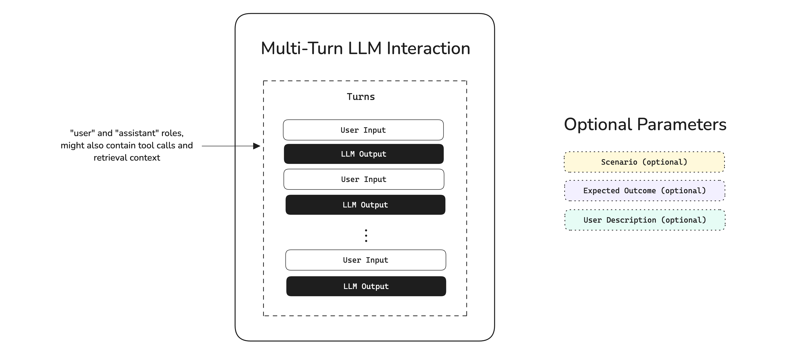

# Bắt đầu
# Trường hợp sử dụng
# Chatbots

## Hướng dẫn nhanh về Đánh giá Chatbot

Học cách đánh giá bất kỳ chatbot nhiều lượt (multi-turn) nào bằng cách sử dụng `deepeval` - bao gồm các QA agent, chatbot hỗ trợ khách hàng và thậm chí là các phòng chat.

## Tổng Quan

Đánh giá Chatbot khác với các loại đánh giá khác vì không giống như các tác vụ một lượt, các cuộc hội thoại diễn ra qua nhiều "lượt". Điều này có nghĩa là chatbot của bạn phải nhận thức được bối cảnh trong suốt cuộc hội thoại, chứ không chỉ chính xác trong các phản hồi riêng lẻ.

**Trong hướng dẫn nhanh 10 phút này, bạn sẽ học cách:**

*   Chuẩn bị các test case hội thoại
*   Đánh giá các cuộc hội thoại chatbot
*   Mô phỏng các tương tác của người dùng

## Điều Kiện Tiên Quyết

*   Cài đặt `deepeval`
*   Một khóa API Confident AI (được khuyến nghị). Đăng ký một cái [tại đây.](https://app.confident-ai.com)

:::info
Confident AI cho phép bạn xem và chia sẻ các báo cáo kiểm thử chatbot của mình. Đặt khóa API của bạn trong CLI:

```bash
CONFIDENT_API_KEY="confident_us..."
```
:::

## Hiểu Về Đánh Giá Nhiều Lượt

Đánh giá nhiều lượt rất khó vì tính chất ngẫu hứng của các cuộc hội thoại. Đầu ra AI thứ n sẽ phụ thuộc vào đầu vào người dùng thứ (n-1), và điều này phụ thuộc vào tất cả các lượt trước đó cho đến tin nhắn ban đầu.

Do đó, khi chạy các đánh giá cho mục đích benchmark, chúng ta không thể so sánh các cuộc hội thoại khác nhau bằng cách nhìn vào các lượt của chúng. Trong `deepeval`, các tương tác nhiều lượt được nhóm theo **kịch bản (scenarios)**. Nếu hai cuộc hội thoại xảy ra theo cùng một kịch bản, chúng ta coi đó là giống nhau.



:::note
Các kịch bản là tùy chọn trong sơ đồ vì không phải tất cả người dùng đều bắt đầu các cuộc hội thoại với các kịch bản được dán nhãn.
:::

## Chạy Một Đánh Giá Nhiều Lượt

Trong `deepeval`, các chatbot được đánh giá là các **tương tác** nhiều lượt. Trong mã, bạn sẽ phải định dạng chúng thành các test case, tuân theo định dạng tin nhắn của OpenAI.

:::note
`deepeval` cung cấp nhiều lựa chọn mô hình LLM mà bạn có thể dễ dàng chọn và chạy đánh giá cùng.

*   OpenAI
*   Anthropic
*   Gemini
*   Ollama
*   Grok
*   Azure OpenAI
*   Amazon Bedrock
*   Vertex AI

```python
from deepeval.metrics import TurnRelevancyMetric

task_completion_metric = TurnRelevancyMetric(model="gpt-4.1")
```

```python
from deepeval.metrics import TurnRelevancyMetric
from deepeval.models import AnthropicModel

model = AnthropicModel("claude-3-7-sonnet-latest")
task_completion_metric = TurnRelevancyMetric(model=model)
```

(Các ví dụ khác tương tự cho Gemini, Ollama, Grok, Azure OpenAI, Amazon Bedrock...)
:::

### Tạo một test case

Tạo một `ConversationalTestCase` bằng cách truyền vào danh sách các `Turn` (lượt) từ một cuộc hội thoại hiện có, tương tự như định dạng tin nhắn của OpenAI.

`main.py`

```python
from deepeval.test_case import ConversationalTestCase, Turn

test_case = ConversationalTestCase(
    turns=[
        Turn(role="user", content="Hello, how are you?"),
        Turn(role="assistant", content="I'm doing well, thank you!"),
        Turn(role="user", content="How can I help you today?"),
        Turn(role="assistant", content="I'd like to buy a ticket to a Coldplay concert."),
    ]
)
```

Bạn có thể tìm hiểu về mô hình dữ liệu của một `Turn` [tại đây.](/docs/evaluation-multiturn-test-cases#turns)

### Chạy một đánh giá

Chạy một đánh giá trên test case sử dụng các số liệu nhiều lượt của `deepeval`, hoặc tạo số liệu riêng của bạn bằng cách sử dụng [Conversational G-Eval](/docs/metrics-conversational-g-eval).

```python
from deepeval.metrics import TurnRelevancyMetric, KnowledgeRetentionMetric
from deepeval import evaluate
...

evaluate(test_cases=[test_case], metrics=[TurnRelevancyMetric(), KnowledgeRetentionMetric()])
```

Cuối cùng chạy `main.py`:

```bash
python main.py
```

🎉🥳 **Chúc mừng!** Bạn vừa chạy đánh giá nhiều lượt đầu tiên của mình. Đây là những gì đã xảy ra:

*   Khi bạn gọi `evaluate()`, `deepeval` chạy tất cả các `metrics` của bạn đối với tất cả các `test_cases`
*   Tất cả các `metrics` xuất ra một điểm số giữa `0-1`, với một `ngưỡng` mặc định là `0.5`
*   Một test case chỉ vượt qua nếu tất cả các số liệu đều vượt qua

Điều này tạo ra một lần chạy kiểm thử (test run), là một "bản chụp"/benchmark của chatbot nhiều lượt của bạn tại bất kỳ thời điểm nào.

### Xem trên Confident AI (được khuyến nghị)

Nếu bạn đã đặt `CONFIDENT_API_KEY`, các lần chạy kiểm thử sẽ xuất hiện tự động trên [Confident AI](https://app.confident-ai.com), nền tảng DeepEval.

[](https://deepeval-docs.s3.us-east-1.amazonaws.com/getting-started%3Aconversation-test-report.mp4)

:::tip
Nếu bạn chưa đăng nhập, bạn vẫn có thể tải lên lần chạy kiểm thử lên Confident AI từ bộ nhớ đệm cục bộ:

```bash
deepeval view
```
:::

## Làm Việc Với Các Bộ Dữ Liệu

Mặc dù chúng ta đã chạy một đánh giá trong phần trước, nhưng nó không hữu ích lắm vì nó còn xa so với một benchmark tiêu chuẩn hóa. Để tạo một benchmark tiêu chuẩn hóa cho các đánh giá, hãy sử dụng các bộ dữ liệu của `deepeval`:

`main.py`

```python
from deepeval.dataset import EvaluationDataset, ConversationalGolden

dataset = EvaluationDataset(
  goldens=[
    ConversationalGolden(scenario="Angry user asking for a refund"),
    ConversationalGolden(scenario="Couple booking two VIP Coldplay tickets")
  ]
)
```

Một bộ dữ liệu là một tập hợp các goldens trong `deepeval`, và trong bối cảnh nhiều lượt, chúng được đại diện bởi các `ConversationalGolden`.


Ý tưởng rất đơn giản - chúng ta bắt đầu với một danh sách các `scenario` (kịch bản) được tiêu chuẩn hóa cho mỗi golden, và chúng ta sẽ mô phỏng các lượt trong thời gian đánh giá để đánh giá mạnh mẽ hơn.

## Mô Phỏng Các Lượt Để Đánh Giá

Đánh giá chatbot của bạn từ [các lượt được mô phỏng](/docs/getting-started-chatbots#evaluate-chatbots-from-simulations) là phương pháp tiếp cận **tốt nhất** cho các đánh giá nhiều lượt, bởi vì nó:

*   Tiêu chuẩn hóa test bench của bạn, không giống như các đánh giá ngẫu hứng
*   Tự động hóa quá trình prompt thủ công, có thể mất hàng giờ

Cả hai điều này đều được giải quyết bằng cách sử dụng `ConversationSimulator` của `deepeval`.

### Tạo bộ dữ liệu goldens

Tạo một `ConversationalGolden` bằng cách cung cấp mô tả người dùng, kịch bản và kết quả mong đợi của bạn cho cuộc hội thoại mà bạn muốn mô phỏng.

`main.py`

```python
from deepeval.dataset import EvaluationDataset, ConversationalGolden

golden = ConversationalGolden(
    scenario="Andy Byron wants to purchase a VIP ticket to a Coldplay concert.",
    expected_outcome="Successful purchase of a ticket.",
    user_description="Andy Byron is the CEO of Astronomer.",
)

dataset = EvaluationDataset(goldens=[golden])
```

Nếu bạn đã đặt `CONFIDENT_API_KEY` chính xác, bạn có thể lưu chúng trên nền tảng để cộng tác với nhóm của mình:

`main.py`

```python
dataset.push(alias="A new multi-turn dataset")
```

[](https://deepeval-docs.s3.us-east-1.amazonaws.com/getting-started%3Achatbot-evals%3Amultiturn-dataset.mp4)

### Bọc chatbot trong callback

Xác định một hàm callback để tạo **phản hồi chatbot tiếp theo** trong một cuộc hội thoại, dựa trên lịch sử hội thoại.

*   Python
*   OpenAI
*   LangChain
*   LlamaIndex
*   OpenAI Agents
*   Pydantic

`main.py`

```python
from deepeval.test_case import Turn

async def model_callback(input: str, turns: List[Turn], thread_id: str) -> Turn:
    # Thay thế bằng chatbot của bạn
    response = await your_chatbot(input, turns, thread_id)
    return Turn(role="assistant", content=response)
```

(Các ví dụ mã khác cho OpenAI, LangChain, LlamaIndex... vẫn giữ nguyên)

:::info
Callback mô hình của bạn nên chấp nhận một `input`, và tùy chọn `turns` và `thread_id`. Nó sẽ trả về một đối tượng `Turn`.
:::

### Mô phỏng các lượt

Sử dụng `ConversationSimulator` của `deepeval` để mô phỏng các lượt bằng cách sử dụng goldens trong bộ dữ liệu của bạn:

`main.py`

```python
from deepeval.conversation_simulator import ConversationSimulator

simulator = ConversationSimulator(model_callback=chatbot_callback)
conversational_test_cases = simulator.simulate(goldens=dataset.goldens, max_turns=10)
```

Ở đây, chúng ta chỉ có 1 test case, nhưng trong thực tế bạn sẽ muốn mô phỏng từ ít nhất 20 goldens.

Nhấp để xem ví dụ về test case được mô phỏng

Các test case được tạo của bạn sẽ được điền các `Turn` được mô phỏng, cùng với `scenario`, `expected_outcome`, và `user_description` từ conversation golden.

```python
ConversationalTestCase(
    scenario="Andy Byron wants to purchase a VIP ticket to a Coldplay concert.",
    expected_outcome="Successful purchase of a ticket.",
    user_description="Andy Byron is the CEO of Astronomer.",
    turns=[
        Turn(role="user", content="Hello, how are you?"),
        Turn(role="assistant", content="I'm doing well, thank you!"),
        Turn(role="user", content="How can I help you today?"),
        Turn(role="assistant", content="I'd like to buy a ticket to a Coldplay concert."),
    ]
)
```

### Chạy một đánh giá

Chạy một đánh giá giống như cách bạn đã học trong phần trước:

```python
from deepeval.metrics import TurnRelevancyMetric
from deepeval import evaluate
...

evaluate(conversational_test_cases, metrics=[TurnRelevancyMetric()])
```

✅ Xong. Bạn đã học thành công cách benchmark chatbot của mình.

[](https://deepeval-docs.s3.us-east-1.amazonaws.com/getting-started%3Aconversation-test-report.mp4)

## Các Bước Tiếp Theo

Bây giờ bạn đã chạy các đánh giá chatbot đầu tiên của mình, bạn nên:

1.  **Tùy chỉnh các số liệu của bạn**: Cập nhật [danh sách các số liệu](/docs/metrics-introduction) dựa trên trường hợp sử dụng của bạn.
2.  **Thiết lập tracing**: Nó giúp bạn [ghi log các tương tác nhiều lượt](https://www.confident-ai.com/docs/llm-tracing/advanced-features/threads) trong production.
3.  **Kích hoạt đánh giá trong production**: Giám sát hiệu suất theo thời gian [sử dụng các số liệu](https://www.confident-ai.com/docs/llm-tracing/evaluations#offline-evaluations) bạn đã xác định trên Confident AI.

Bạn sẽ có thể phân tích hiệu suất theo thời gian trên các **threads** theo cách này, và thêm chúng trở lại vào bộ dữ liệu đánh giá của bạn để đánh giá thêm.

[](https://confident-docs.s3.us-east-1.amazonaws.com/llm-tracing:threads.mp4)

**Đánh Giá Chatbot trong Production**

[Chỉnh sửa trang này](https://github.com/confident-ai/deepeval/edit/main/docs/docs/getting-started-chatbots.mdx)

Cập nhật lần cuối vào **9 tháng 1, 2026** bởi **Jeffrey Ip**
