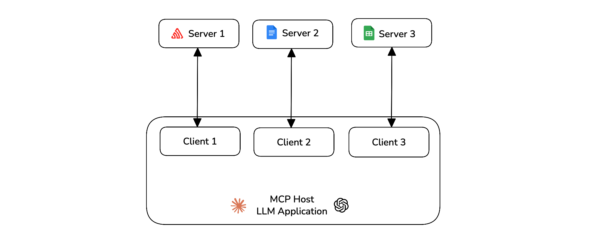

# Bắt đầu
# Trường hợp sử dụng
# MCP

## Hướng dẫn nhanh về Đánh giá MCP

Học cách đánh giá các ứng dụng dựa trên model-context-protocol (MCP) bằng cách sử dụng `deepeval`, cho cả trường hợp sử dụng một lượt và nhiều lượt.

## Tổng Quan

Đánh giá MCP khác với các đánh giá khác vì bạn có thể chọn tạo các test case một lượt hoặc test case nhiều lượt dựa trên thiết kế và kiến trúc ứng dụng của bạn.

**Trong hướng dẫn nhanh 10 phút này, bạn sẽ học cách:**

*   Theo dõi các tương tác MCP của bạn
*   Tạo các test case cho ứng dụng của bạn
*   Đánh giá ứng dụng dựa trên MCP của bạn bằng cách sử dụng các số liệu MCP

## Điều Kiện Tiên Quyết

*   Cài đặt `deepeval`
*   Một khóa API Confident AI (được khuyến nghị). Đăng ký một cái [tại đây](https://app.confident-ai.com)

:::info
Confident AI cho phép bạn xem và chia sẻ các báo cáo kiểm thử của mình. Đặt khóa API của bạn trong CLI:

```bash
CONFIDENT_API_KEY="confident_us..."
```
:::

## Hiểu Về Đánh Giá MCP

**Model Context Protocol (MCP)** là một framework mã nguồn mở được phát triển bởi **Anthropic** để chuẩn hóa cách các hệ thống AI, đặc biệt là các mô hình ngôn ngữ lớn (LLM), tương tác với các công cụ và nguồn dữ liệu bên ngoài.
Kiến trúc MCP bao gồm ba thành phần chính:

*   **Host** — Ứng dụng AI điều phối và quản lý một hoặc nhiều MCP client
*   **Client** — Duy trì kết nối một-một với một server và truy xuất bối cảnh từ nó để host sử dụng
*   **Server** — Được ghép nối với một client duy nhất, cung cấp bối cảnh mà client chuyển cho host



`deepeval` cho phép bạn đánh giá MCP host trên các tiêu chí khác nhau như việc sử dụng primitive (nguyên thủy), tạo tham số và hoàn thành tác vụ.

## Chạy Đánh Giá MCP Đầu Tiên Của Bạn

Trong `deepeval` các đánh giá MCP có thể được thực hiện bằng cách sử dụng test case một lượt hoặc nhiều lượt. Trong mã, bạn sẽ phải theo dõi tất cả các tương tác MCP và cuối cùng tạo một test case sau khi thực thi ứng dụng của bạn.

:::note
`deepeval` cung cấp nhiều lựa chọn mô hình LLM mà bạn có thể dễ dàng chọn và chạy đánh giá cùng.

*   OpenAI
*   Anthropic
*   Gemini
*   Ollama
*   Grok
*   Azure OpenAI
*   Amazon Bedrock
*   Vertex AI

```python
from deepeval.metrics import MCPUseMetric

task_completion_metric = MCPUseMetric(model="gpt-4.1")
```

(Các ví dụ khác tương tự...)
:::

### Tạo một MCP server

Kết nối ứng dụng của bạn với các MCP server và tạo đối tượng `MCPServer` cho tất cả các MCP server bạn đang sử dụng.

`main.py`

```python
import mcp
from contextlib import AsyncExitStack
from mcp import ClientSession
from mcp.client.streamable_http import streamablehttp_client
from deepeval.test_case import MCPServer

url = "https://example.com/mcp"

mcp_servers = []
tools_called = []

async def main():
    read, write, _  = await AsyncExitStack().enter_async_context(streamablehttp_client(url))
    session = await AsyncExitStack().enter_async_context(ClientSession(read, write))
    await session.initialize()

    tool_list = await session.list_tools()

    mcp_servers.append(MCPServer(
        name=url,
        transport="streamable-http",
        available_tools=tool_list.tools,
    ))
```

### Theo dõi các tương tác MCP của bạn

Trong file chính của ứng dụng MCP của bạn, bạn cần theo dõi tất cả các tương tác MCP trong thời gian chạy. Điều này bao gồm thêm `tools_called`, `resources_called` và `prompts_called` bất cứ khi nào host của bạn sử dụng chúng.


`main.py`

```python
from deepeval.test_case import MCPToolCall

available_tools = [
    {"name": tool.name, "description": tool.description, "input_schema": tool.inputSchema}
    for tool in tool_list
]

response = self.anthropic.messages.create(
    model="claude-3-5-sonnet-20241022",
    messages=messages,
    tools=available_tools,
)

for content in response.content:
    if content.type == "tool_use":
        tool_name = content.name
        tool_args = content.input
        result = await session.call_tool(tool_name, tool_args)

        tools_called.append(MCPToolCall(
            name=tool_name,
            args=tool_args,
            result=result
        ))
```

Bạn cũng có thể theo dõi bất kỳ [resources](https://www.deepeval.com/docs/evaluation-mcp#resources) hoặc [prompts](https://www.deepeval.com/docs/evaluation-mcp#prompts) nào nếu bạn sử dụng chúng. Bạn hiện đang theo dõi tất cả các tương tác MCP trong thời gian chạy của ứng dụng của mình.

### Tạo một test case

Bây giờ bạn có thể tạo một test case cho ứng dụng MCP của mình bằng cách sử dụng các tương tác ở trên.

```python
from deepeval.test_case import LLMTestCase
...

test_case = LLMTestCase(
    input=query,
    actual_output=response,
    mcp_servers=mcp_servers,
    mcp_tools_called=tools_called,
)
```

Các test case phải được tạo sau khi thực thi ứng dụng của bạn. Nhấp vào đây để xem [ví dụ đầy đủ về cách tạo test case một lượt](https://github.com/confident-ai/deepeval/blob/main/examples/mcp_evaluation/mcp_eval_single_turn.py) cho các đánh giá MCP.

:::tip
Bạn có thể làm cho hàm `main()` của mình trả về `mcp_servers`, `tools_called`, `resources_called` và `prompts_called`. Điều này giúp bạn import ứng dụng MCP của mình ở bất cứ đâu và tạo test case dễ dàng trong các file kiểm thử khác nhau.
:::

### Xác định các số liệu

Bây giờ bạn có thể sử dụng [`MCPUseMetric`](/docs/metrics-mcp-use) để chạy đánh giá trên test case một lượt của bạn.

```python
from deepeval.metrics import MCPUseMetric

mcp_use_metric = MCPUseMetric()
```

### Chạy một đánh giá

Chạy một đánh giá trên các test case bạn đã tạo trước đó bằng cách sử dụng các số liệu được xác định ở trên.

```python
from deepeval import evaluate

evaluate([test_case], [mcp_use_metric])
```

🎉🥳 **Chúc mừng!** Bạn vừa chạy đánh giá MCP một lượt đầu tiên của mình. Đây là những gì đã xảy ra:

*   Khi bạn gọi `evaluate()`, `deepeval` chạy tất cả các `metrics` của bạn đối với tất cả các `test_cases`
*   Tất cả các `metrics` xuất ra một điểm số giữa `0-1`, với một `ngưỡng` mặc định là `0.5`
*   `MCPUseMetric` đầu tiên đánh giá test case của bạn về việc sử dụng primitive để xem ứng dụng của bạn đã sử dụng các khả năng MCP được cung cấp cho nó tốt như thế nào.
*   Sau đó, nó đánh giá tính đúng đắn của tham số để xem liệu các đầu vào được tạo cho việc sử dụng primitive của bạn có chính xác và chuẩn xác cho tác vụ hay không.
*   `MCPUseMetric` sau đó cuối cùng lấy mức tối thiểu của cả hai điểm số để đưa ra điểm số cuối cùng cho test case của bạn.

### Xem trên Confident AI (được khuyến nghị)

Nếu bạn đã đặt `CONFIDENT_API_KEY`, các lần chạy kiểm thử sẽ xuất hiện tự động trên [Confident AI](https://app.confident-ai.com), nền tảng DeepEval.

[](https://deepeval-docs.s3.us-east-1.amazonaws.com/docs:getting-started-mcp-single-turn.mp4)

Báo Cáo Kiểm Thử Đánh Giá trên Confident AI

:::tip
Nếu bạn chưa đăng nhập, bạn vẫn có thể tải lên lần chạy kiểm thử lên Confident AI từ bộ nhớ đệm cục bộ:

```bash
deepeval view
```
:::

## Đánh Giá MCP Nhiều Lượt

Đối với đánh giá MCP nhiều lượt, bạn được yêu cầu thêm `mcp_tools_called`, `mcp_resource_called` và `mcp_prompts_called` trong đối tượng `Turn` cho mỗi lượt của trợ lý. (nếu có)

### Theo dõi các tương tác MCP của bạn

Trong phiên tương tác của ứng dụng của bạn, bạn cần theo dõi tất cả các tương tác MCP. Điều này bao gồm thêm `tools_called`, `resources_called` và `prompts_called` bất cứ khi nào host của bạn sử dụng chúng.


`main.py`

```python
from deepeval.test_case import MCPToolCall, Turn

async def main():
    ...

    result = await session.call_tool(tool_name, tool_args)
    tool_called = MCPToolCall(name=tool_name, args=tool_args, result=result)

    turns.append(
        Turn(
            role="assistant",
            content=f"Tool call: {tool_name} with args {tool_args}",
            mcp_tools_called=[tool_called],
        )
    )
```

Bạn cũng có thể theo dõi bất kỳ [resources](https://www.deepeval.com/docs/evaluation-mcp#resources) hoặc [prompts](https://www.deepeval.com/docs/evaluation-mcp#prompts) nào nếu bạn sử dụng chúng. Bạn hiện đang theo dõi tất cả các tương tác MCP trong thời gian chạy của ứng dụng của mình.

### Tạo một test case

Bây giờ bạn có thể tạo một test case cho ứng dụng MCP của mình bằng cách sử dụng `turns` và `mcp_servers` ở trên.

```python
from deepeval.test_case import ConversationalTestCase

convo_test_case = ConversationalTestCase(
    turns=turns,
    mcp_servers=mcp_servers
)
```

Các test case phải được tạo sau khi thực thi ứng dụng. Nhấp vào đây để xem [ví dụ đầy đủ về cách tạo test case nhiều lượt](https://github.com/confident-ai/deepeval/blob/main/examples/mcp_evaluation/mcp_eval_multi_turn.py) cho các đánh giá MCP.

:::tip
Bạn có thể làm cho hàm `main()` của mình trả về `turns` và `mcp_servers`. Điều này giúp bạn import ứng dụng MCP của mình ở bất cứ đâu và tạo test case dễ dàng trong các file kiểm thử khác nhau.
:::

### Xác định các số liệu

Bây giờ bạn có thể sử dụng [các số liệu MCP](/docs/metrics-multi-turn-mcp-use) để chạy đánh giá trên các test case của bạn. Có hai số liệu cho các test case nhiều lượt hỗ trợ đánh giá MCP.

```python
from deepeval.metrics import MultiTurnMCPUseMetric, MCPTaskCompletionMetric

mcp_use_metric = MultiTurnMCPUseMetric()
mcp_task_completion = MCPTaskCompletionMetric()
```

### Chạy một đánh giá

Chạy một đánh giá trên các test case bạn đã tạo trước đó bằng cách sử dụng các số liệu được xác định ở trên.

```python
from deepeval import evaluate

evaluate([convo_test_case], [mcp_use_metric, mcp_task_completion])
```

🎉🥳 **Chúc mừng!** Bạn vừa chạy đánh giá MCP nhiều lượt đầu tiên của mình. Đây là những gì đã xảy ra:

*   Khi bạn gọi `evaluate()`, `deepeval` chạy tất cả các `metrics` của bạn đối với tất cả các `test_cases`
*   Tất cả các `metrics` xuất ra một điểm số giữa `0-1`, với một `ngưỡng` mặc định là `0.5`
*   Bạn đã sử dụng `MultiTurnMCPUseMetric` và `MCPTaskCompletionMetric` để kiểm thử ứng dụng MCP của mình
*   `MultiTurnMCPUseMetric` đánh giá khả năng của ứng dụng của bạn về việc sử dụng primitive và tạo tham số để có được điểm số cuối cùng.
*   `MCPTaskCompletionMetric` đánh giá xem ứng dụng của bạn có đáp ứng tác vụ đã cho cho tất cả các tương tác giữa người dùng và trợ lý hay không.

### Xem trên Confident AI (được khuyến nghị)

Nếu bạn đã đặt `CONFIDENT_API_KEY`, các lần chạy kiểm thử sẽ xuất hiện tự động trên [Confident AI](https://app.confident-ai.com), nền tảng DeepEval.

[](https://deepeval-docs.s3.us-east-1.amazonaws.com/docs:getting-started-mcp-multi-turn.mp4)

Đánh giá End-to-End Nhiều Lượt

:::tip
Nếu bạn chưa đăng nhập, bạn vẫn có thể tải lên lần chạy kiểm thử lên Confident AI từ bộ nhớ đệm cục bộ:

```bash
deepeval view
```
:::

## Các Bước Tiếp Theo

Bây giờ bạn đã chạy đánh giá MCP đầu tiên của mình, bạn nên:

1.  **Tùy chỉnh các số liệu của bạn**: Bạn có thể thay đổi ngưỡng của các số liệu để nghiêm ngặt hơn đối với trường hợp sử dụng của bạn.
2.  **Chuẩn bị một bộ dữ liệu**: Nếu bạn không có, hãy [tạo một bộ](/docs/synthesizer-introduction) làm điểm khởi đầu để lưu trữ đầu vào của bạn dưới dạng goldens.
3.  **Thiết lập Tracing**: Nếu bạn đã tạo MCP server tùy chỉnh của riêng mình, bạn có thể [thiết lập tracing](https://documentation.confident-ai.com/docs/llm-tracing/tracing-features/span-types) trên các định nghĩa công cụ của mình.

[](https://confident-docs.s3.us-east-1.amazonaws.com/llm-tracing:spans.mp4)

Đánh giá Cấp độ Span trong Production

Bạn có thể [tìm hiểu thêm về MCP tại đây](/docs/evaluation-mcp).

[Chỉnh sửa trang này](https://github.com/confident-ai/deepeval/edit/main/docs/docs/getting-started-mcp.mdx)

Cập nhật lần cuối vào **9 tháng 1, 2026** bởi **Jeffrey Ip**
