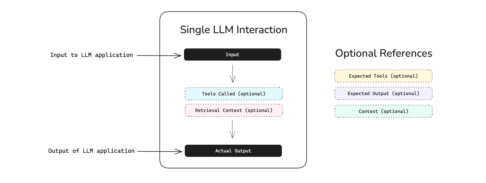

# Bắt đầu
# Trường hợp sử dụng
# RAG

## Hướng dẫn nhanh về Đánh giá RAG

Học cách đánh giá các hệ thống và pipeline retrieval-augmented-generation (RAG) bằng cách sử dụng `deepeval`, chẳng hạn như RAG QA, trình tóm tắt (summarizers), và chatbot hỗ trợ khách hàng.

## Tổng Quan

Đánh giá RAG liên quan đến việc đánh giá retriever (bộ truy xuất) và generator (bộ tạo) như các thành phần riêng biệt. Điều này là do trong một pipeline RAG, đầu ra cuối cùng chỉ tốt bằng bối cảnh mà bạn đã nạp vào LLM của mình.

**Trong hướng dẫn nhanh 5 phút này, bạn sẽ học cách:**

*   Đánh giá pipeline RAG của bạn end-to-end
*   Kiểm thử retriever và generator như các thành phần riêng biệt
*   Đánh giá RAG nhiều lượt

## Điều Kiện Tiên Quyết

*   Cài đặt `deepeval`
*   Một khóa API Confident AI (được khuyến nghị). Đăng ký một cái [tại đây.](https://app.confident-ai.com)

:::info
Confident AI cho phép bạn xem và chia sẻ các báo cáo kiểm thử của mình. Đặt khóa API của bạn trong CLI:

```bash
CONFIDENT_API_KEY="confident_us..."
```
:::

## Chạy Đánh Giá RAG Đầu Tiên Của Bạn

Đánh giá RAG end-to-end coi toàn bộ ứng dụng LLM của bạn như một pipeline RAG độc lập. Trong `deepeval`, một tương tác một lượt với pipeline RAG của bạn được mô hình hóa như một LLM test case:



`retrieval_context` trong sơ đồ trên là rất quan trọng, vì nó đại diện cho các đoạn văn bản (text chunks) đã được truy xuất tại thời điểm đánh giá.

:::note
`deepeval` cung cấp nhiều lựa chọn mô hình LLM mà bạn có thể dễ dàng chọn và chạy đánh giá cùng.

*   OpenAI
*   Anthropic
*   Gemini
*   Ollama
*   Grok
*   Azure OpenAI
*   Amazon Bedrock
*   Vertex AI

```python
from deepeval.metrics import AnswerRelevancyMetric

task_completion_metric = AnswerRelevancyMetric(model="gpt-4.1")
```

(Các ví dụ khác tương tự cho các model khác...)
:::

### Thiết lập pipeline RAG

Sửa đổi pipeline RAG của bạn để trả về các bối cảnh đã truy xuất cùng với phản hồi của LLM.

*   Python
*   LangGraph
*   LangChain
*   LlamaIndex

```python
def rag_pipeline(input):
   ...
   return 'RAG output', ['retrieved context 1', 'retrieved context 2', ...]
```

`main.py` (ví dụ LangChain)

```python
from langchain_core.messages import HumanMessage
from langchain.vectorstores import FAISS
from langchain_openai import OpenAIEmbeddings, ChatOpenAI

embeddings = OpenAIEmbeddings()
vectorstore = FAISS.load_local("./faiss_index", embeddings)
retriever = vectorstore.as_retriever()
llm = ChatOpenAI(model="gpt-4")

def rag_pipeline(input):
    # Trích xuất bối cảnh truy xuất
    retrieved_docs = retriever.get_relevant_documents(input)
    context_texts = [doc.page_content for doc in retrieved_docs]

    # Tạo phản hồi
    state = {"messages": [HumanMessage(content=input + "\\n\\n".join(context_texts))]}
    result = llm.invoke(state)
    return result["messages"][-1].content, context_texts
```

(Các ví dụ mã khác cho LlamaIndex... vẫn giữ nguyên)

:::info
Thay vì thay đổi mã của bạn để trả về dữ liệu này, chúng tôi sẽ chỉ cho bạn một cách tốt hơn để chạy các đánh giá RAG trong phần tiếp theo.
:::

### Tạo một test case

Tạo một test case sử dụng bối cảnh truy xuất và đầu ra LLM từ pipeline RAG của bạn. Tùy chọn cung cấp một đầu ra mong đợi nếu bạn định sử dụng các số liệu [contextual precision](/docs/metrics-contextual-precision) và [contextual recall](/docs/metrics-contextual-recall).

```python
from deepeval.test_case import LLMTestCase

input = 'How do I purchase tickets to a Coldplay concert?'
actual_output, retrieved_contexts = rag_pipeline(input)

test_case = LLMTestCase(
    input=input,
    actual_output=actual_output,
    retrieval_context=retrieved_contexts,
    expected_output='optional expected output'
)
```

### Xác định các số liệu

Xác định các số liệu RAG để đánh giá pipeline RAG của bạn, hoặc xác định số liệu riêng của bạn bằng cách sử dụng [G-Eval](/docs/metrics-llm-evals).

```python
from deepeval.metrics import AnswerRelevancyMetric, ContextualPrecisionMetric

answer_relevancy = AnswerRelevancyMetric(threshold=0.8)
contextual_precision = ContextualPrecisionMetric(threshold=0.8)
```

**Có những số liệu RAG nào?**

DeepEval cung cấp tổng cộng 5 số liệu RAG, đó là:

*   [Answer Relevancy](/docs/metrics-answer-relevancy)
*   [Faithfulness](/docs/metrics-faithfulness)
*   [Contextual Relevancy](/docs/metrics-contextual-relevancy)
*   [Contextual Precision](/docs/metrics-contextual-precision)
*   [Contextual Recall](/docs/metrics-contextual-recall)

Mỗi số liệu đo lường một [tham số khác nhau](/guides/guides-rag-evaluation) trong chất lượng pipeline RAG của bạn, và mỗi số liệu có thể giúp bạn xác định các prompt, mô hình hoặc cài đặt retriever tốt nhất cho trường hợp sử dụng của bạn.

### Chạy một đánh giá

Chạy một đánh giá trên LLM test case bạn đã tạo trước đó bằng cách sử dụng các số liệu được xác định ở trên.

`main.py`

```python
from deepeval import evaluate
...

evaluate([test_case], metrics=[answer_relevancy, contextual_precision])
```

🎉🥳 **Chúc mừng!** Bạn vừa chạy đánh giá RAG đầu tiên của mình. Đây là những gì đã xảy ra:

*   Khi bạn gọi `evaluate()`, `deepeval` chạy tất cả các `metrics` của bạn đối với tất cả các `test_cases`
*   Tất cả các `metrics` xuất ra một điểm số giữa `0-1`, với một `ngưỡng` mặc định là `0.5`
*   Các số liệu như `contextual_precision` đánh giá dựa trên `retrieval_context`, trong khi `answer_relevancy` kiểm tra `actual_output` của test case của bạn
*   Một test case chỉ vượt qua nếu tất cả các số liệu đều vượt qua

Điều này tạo ra một lần chạy kiểm thử, là một "bản chụp"/benchmark của pipeline RAG của bạn tại bất kỳ thời điểm nào.

### Xem trên Confident AI (được khuyến nghị)

Nếu bạn đã đặt `CONFIDENT_API_KEY`, các lần chạy kiểm thử sẽ xuất hiện tự động trên [Confident AI](https://app.confident-ai.com), nền tảng DeepEval.

[](https://deepeval-docs.s3.us-east-1.amazonaws.com/getting-started%3Arag.mp4)

:::tip
Nếu bạn chưa đăng nhập, bạn vẫn có thể tải lên lần chạy kiểm thử lên Confident AI từ bộ nhớ đệm cục bộ:

```bash
deepeval view
```
:::

## Đánh Giá Retriever

`deepeval` cho phép bạn đánh giá các thành phần RAG riêng lẻ. Điều này cũng có nghĩa là bạn không phải trả về `retrieval_context` ở những nơi khó xử chỉ để nạp dữ liệu vào hàm `evaluate()`.

### Trace retriever của bạn

Gắn decorator `@observe` vào các hàm/phương thức tạo nên retriever của bạn. Những cái này sẽ đại diện cho các thành phần riêng lẻ trong pipeline RAG của bạn.

```python
from deepeval.tracing import observe

@observe()
def retriever(input):
    # Triển khai retriever của bạn ở đây
    pass
```

:::important
Đặt `CONFIDENT_TRACE_FLUSH=1` trong CLI của bạn để ngăn traces bị mất trong trường hợp chương trình kết thúc sớm.

```bash
export CONFIDENT_TRACE_FLUSH=1
```
:::

### Xác định các số liệu & test case

Tạo một số liệu tập trung vào retriever. Sau đó bạn sẽ cần:

1.  Thêm nó vào thành phần của bạn
2.  Tạo một `LLMTestCase` trong thành phần đó với `retrieval_context`

```python
from deepeval.tracing import observe, update_current_span
from deepeval.metrics import ContextualRelevancyMetric

contextual_relevancy = ContextualRelevancyMetric(threshold=0.6)

@observe(metrics=[contextual_relevancy])
def retriever(query):
    # Triển khai retriever của bạn ở đây
    update_current_span(
        test_case=LLMTestCase(input=query, retrieval_context=["..."])
    )
    pass
```

### Chạy một đánh giá

Cuối cùng, sử dụng iterator `dataset` để gọi hệ thống RAG của bạn trên một danh sách các goldens.

```python
from deepeval.dataset import EvaluationDataset, Golden
...

# Tạo bộ dữ liệu
dataset = EvaluationDataset(goldens=[Golden(input='This is a test query')])

# Lặp qua bộ dữ liệu
for golden in dataset.evals_iterator():
    retriever(golden.input)
```

✅ Xong. Với thiết lập này, một vòng lặp for đơn giản là tất cả những gì cần thiết.

:::tip
Bạn cũng có thể đánh giá retriever của mình nếu nó được lồng trong một pipeline RAG:

```python
from deepeval.dataset import EvaluationDataset, Golden
...

def rag_pipeline(query):
    @observe(metrics=[contextual_relevancy])
    def retriever(query):
        pass

# Tạo bộ dữ liệu
dataset = EvaluationDataset(goldens=[Golden(input='This is a test query')])

# Lặp qua bộ dữ liệu
for golden in dataset.evals_iterator():
    rag_pipeline(golden.input)
```
:::

## Đánh Giá Generator

Điều tương tự cũng áp dụng cho việc đánh giá generator của pipeline RAG của bạn, chỉ lần này bạn sẽ trace generator của mình với các số liệu tập trung vào generator của bạn thay thế.

### Trace generator của bạn

Gắn decorator `@observe` vào các hàm/phương thức tạo nên generator của bạn:

```python
from deepeval.tracing import observe

@observe()
def generator(query):
    # Triển khai generator của bạn ở đây
    pass
```

### Xác định các số liệu & test case

Tạo một số liệu tập trung vào generator. Sau đó bạn sẽ cần:

1.  Thêm nó vào thành phần của bạn
2.  Tạo một `LLMTestCase` với các tham số bắt buộc

Ví dụ, `FaithfulnessMetric` yêu cầu `retrieval_context`, trong khi `AnswerRelevancyMetric` thì không.

```python
from deepeval.tracing import observe, update_current_span
from deepeval.metrics import AnswerRelevancyMetric

answer_relevancy = AnswerRelevancyMetric(threshold=0.6)

@observe(metrics=[answer_relevancy])
def generator(query, text_chunks):
    # Triển khai generator của bạn ở đây
    update_current_span(test_case=LLMTestCase(input=query, actual_output="..."))
    pass
```

### Chạy một đánh giá

Cuối cùng, sử dụng iterator `dataset` để gọi hệ thống RAG của bạn trên một danh sách các goldens.

```python
from deepeval.dataset import EvaluationDataset, Golden
...

# Tạo bộ dữ liệu
dataset = EvaluationDataset(goldens=[Golden(input='This is a test query')])

# Lặp qua bộ dữ liệu
for golden in dataset.evals_iterator():
    generator(golden.input)
```

✅ Xong. Bạn vừa học cách đánh giá generator như một thành phần độc lập.

:::info
Bạn cũng có thể kết hợp đánh giá retriever và generator:

```python
from deepeval.dataset import EvaluationDataset, Golden
...

def rag_pipeline(query):
    @observe(metrics=[contextual_relevancy])
    def retriever(query) -> list[str]:
        update_current_span(test_case=LLMTestCase(input=query, retrieval_context=["..."]))

    @observe(metrics=[answer_relevancy])
    def generator(query, text_chunks):
        update_current_span(test_case=LLMTestCase(input=query, actual_output="..."))

    text_chunks = retriever(query)
    return generator(query, text_chunks)

# Tạo bộ dữ liệu
dataset = EvaluationDataset(goldens=[Golden(input='This is a test query')])

# Lặp qua bộ dữ liệu
for golden in dataset.evals_iterator():
    rag_pipeline(golden.input)
```
:::

[](https://deepeval-docs.s3.us-east-1.amazonaws.com/getting-started%3Arag-evals%3Acomponent.mp4)

## Đánh Giá RAG Nhiều Lượt

`deepeval` cũng cho phép bạn đánh giá RAG trong các hệ thống nhiều lượt. Điều này đặc biệt hữu ích cho các chatbot dựa vào RAG để tạo phản hồi, chẳng hạn như chatbot hỗ trợ khách hàng.

:::note
Trước tiên bạn nên đọc [phần này](/docs/getting-started-chatbots) về đánh giá nhiều lượt nếu bạn chưa đọc.
:::

### Tạo một test case

Tạo một `ConversationalTestCase` bằng cách truyền vào danh sách các `Turn` từ một cuộc hội thoại hiện có, tương tự như định dạng tin nhắn của OpenAI.

```python
from deepeval.test_case import ConversationalTestCase, Turn

test_case = ConversationalTestCase(
    turns=[
        Turn(role="user", content="I'd like to buy a ticket to a Coldplay concert."),
        Turn(
            role="assistant",
            content="Great! I can help you with that. Which city would you like to attend?",
            retrieval_context=["Concert cities: New York, Los Angeles, Chicago"]
        ),
        Turn(role="user", content="New York, please."),
        Turn(
            role="assistant",
            content="Perfect! I found VIP and standard tickets for the Coldplay concert in New York. Which one would you like?",
            retrieval_context=["VIP ticket details", "Standard ticket details"]
        )
    ]
)
```

Vì chatbot của bạn sử dụng RAG, mỗi lượt từ trợ lý (assistant) cũng nên bao gồm tham số `retrieval_context`.

### Tạo các số liệu

Xác định một số liệu RAG nhiều lượt để đánh giá hệ thống chatbot của bạn:

```python
from deepeval.metrics import TurnRelevancy, TurnFaithfulness
from deepeval.test_case import TurnParams

turn_faithfulness = TurnFaithfulness()
turn_relevancy = TurnRelevancy()
```

### Chạy một đánh giá

Chạy một đánh giá trên test case sử dụng hàm `evaluate` và số liệu RAG hội thoại mà bạn đã xác định.

`main.py`

```python
from deepeval import evaluate
...

evaluate([test_case], metrics=[turn_faithfulness, turn_relevancy])
```

Cuối cùng, chạy `main.py`:

```bash
python main.py
```

✅ Xong. Có rất nhiều chi tiết chúng tôi đã bỏ qua trong phần nhiều lượt này, chẳng hạn như cách mô phỏng tương tác người dùng, bạn có thể tìm hiểu thêm [tại đây.](/docs/getting-started-chatbots)

[](https://deepeval-docs.s3.us-east-1.amazonaws.com/getting-started%3Arag-evals%3Aconversation.mp4)

## Các Bước Tiếp Theo

Bây giờ bạn đã chạy các đánh giá RAG đầu tiên của mình, bạn nên:

1.  **Tùy chỉnh các số liệu của bạn**: Bao gồm tất cả 5 [số liệu RAG](/docs/metrics-introduction) dựa trên trường hợp sử dụng của bạn.
2.  **Chuẩn bị một bộ dữ liệu**: Nếu bạn không có, hãy [tạo một bộ](/docs/synthesizer-introduction) làm điểm khởi đầu.
3.  **Kích hoạt đánh giá trong production**: Chỉ cần thay thế `metrics` trong `@observe` bằng chuỗi [`metric_collection`](https://www.confident-ai.com/docs/llm-tracing/evaluations#online-evaluations) trên Confident AI.

Bạn sẽ có thể phân tích hiệu suất theo thời gian trên các **threads** theo cách này, và thêm chúng trở lại vào bộ dữ liệu đánh giá của bạn để đánh giá thêm.

[](https://confident-docs.s3.us-east-1.amazonaws.com/llm-tracing:traces.mp4)

**Đánh Giá RAG trong Production**

[Chỉnh sửa trang này](https://github.com/confident-ai/deepeval/edit/main/docs/docs/getting-started-rag.mdx)

Cập nhật lần cuối vào **9 tháng 1, 2026** bởi **Jeffrey Ip**
