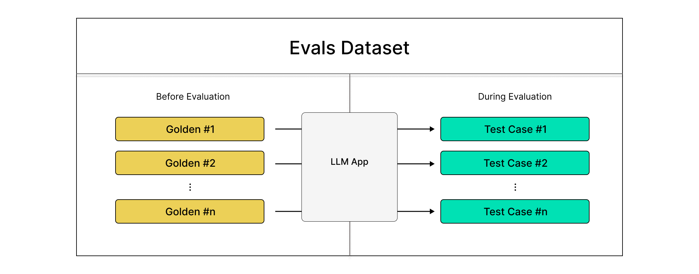

# Datasets

Trong `deepeval`, một evaluation dataset, hay gọi tắt là dataset, là một tập hợp các goldens. Một golden là tiền thân của một test case. Tại thời điểm đánh giá, trước tiên bạn sẽ chuyển đổi tất cả goldens trong dataset của mình thành test cases, trước khi chạy đánh giá trên các test cases này.

## Tóm tắt nhanh

Có hai cách tiếp cận để chạy đánh giá sử dụng datasets trong `deepeval`:

1. Sử dụng `deepeval test run`
2. Sử dụng `evaluate`

Tùy thuộc vào loại goldens bạn cung cấp, datasets có thể là **lượt đơn (single-turn)** hoặc **đa lượt (multi-turn)**. Đánh giá một dataset có nghĩa hoàn toàn giống như đánh giá hệ thống LLM của bạn, bởi vì theo định nghĩa, một dataset chứa tất cả thông tin được tạo ra bởi LLM của bạn cần thiết cho việc đánh giá.

**Các thực hành tốt nhất để quản lý một evaluation dataset là gì?**

* **Đảm bảo phạm vi kiểm thử:** Bao gồm các đầu vào thực tế đa dạng, mức độ phức tạp khác nhau và các trường hợp biên để thử thách LLM một cách thích hợp.
* **Test cases tập trung, định lượng:** Thiết kế với phạm vi rõ ràng cho phép các metrics hiệu năng có ý nghĩa mà không quá rộng hoặc quá hẹp.
* **Xác định mục tiêu rõ ràng:** Căn chỉnh datasets với các mục tiêu đánh giá cụ thể trong khi tránh phân mảnh không cần thiết.

:::info
Nếu bạn chưa có một `EvaluationDataset`, một điểm khởi đầu tuyệt vời là chỉ cần viết ra các prompts bạn hiện đang sử dụng để kiểm tra thủ công các đầu ra LLM của mình. Bạn cũng có thể làm điều này trên Confident AI, tích hợp 100% với `deepeval`:

[](https://confident-docs.s3.us-east-1.amazonaws.com/datasets:create-4k.mp4)

Learn Dataset Annotation on Confident AI

Tài liệu đầy đủ cho datasets trên [Confident AI tại đây.](https://www.confident-ai.com/docs/llm-evaluation/dataset-management/create-goldens)
:::

## Tạo một Dataset

Một `EvaluationDataset` trong `deepeval` đơn giản là một tập hợp các goldens. Bạn có thể khởi tạo một dataset trống để bắt đầu:

```python
from deepeval.dataset import EvaluationDataset  
  
dataset = EvaluationDataset()
```

Một dataset có thể là lượt đơn, **HOẶC** đa lượt (nhưng không phải cả hai). Trong quá trình khởi tạo, việc cung cấp cho dataset của bạn một danh sách các `Golden`s sẽ làm cho nó trở thành lượt đơn, trong khi cung cấp cho nó các `ConversationalGolden`s sẽ làm cho nó trở thành đa lượt:

* Single-Turn (Lượt đơn)
* Multi-Turn (Đa lượt)

```python
from deepeval.dataset import EvaluationDataset, Golden  
  
dataset = EvaluationDataset(goldens=[Golden(input="What is your name?")])  
print(dataset._multi_turn) # prints False
```

```python
from deepeval.dataset import EvaluationDataset, ConversationalGolden  
  
dataset = EvaluationDataset(  
    goldens=[  
        ConversationalGolden(  
            scenario="Frustrated user asking for a refund.",  
            expected_outcome="Redirected to a human agent."  
        )  
    ]  
)  
print(dataset._multi_turn) # prints True
```

Để đảm bảo các thực hành tốt nhất, datasets trong `deepeval` có trạng thái (stateful) và có quan điểm (opinionated). Điều này có nghĩa là bạn không thể thay đổi giá trị của `_multi_turn` một khi giá trị của nó đã được thiết lập. Tuy nhiên, bạn luôn có thể thêm các goldens mới sau khi khởi tạo bằng cách sử dụng phương thức `add_golden`:

* Single-Turn (Lượt đơn)
* Multi-Turn (Đa lượt)

```python
...  
  
dataset.add_golden(Golden(input="Nice."))
```

```python
...  
  
dataset.add_golden(  
    ConversationalGolden(  
        scenario="User expressing gratitude for redirecting to human.",  
        expected_outcome="Appreciates the gratitude."  
    )  
)
```

## Chạy đánh giá trên Dataset

Bạn chạy đánh giá trên các test cases trong datasets, cái mà bạn sẽ tạo tại thời điểm đánh giá bằng cách sử dụng các goldens trong cùng một dataset.



Bước đầu tiên là tải các goldens vào dataset của bạn. Ví dụ này sẽ tải datasets từ Confident AI, nhưng bạn cũng có thể khám phá [các tùy chọn khác bên dưới.](#load-dataset)

**main.py**

```python
from deepeval.dataset import EvaluationDataset  
  
dataset = EvaluationDataset()  
dataset.pull(alias="My Dataset") # replace with your alias  
print(dataset.goldens) # print to sanity check yourself
```

:::tip
Dataset của bạn là lượt đơn hoặc đa lượt ngay khi bạn pull dataset của mình.
:::

Khi bạn đã có dataset của mình và có thể thấy một danh sách goldens không trống, bạn có thể bắt đầu tạo các đầu ra và **thêm nó trở lại vào dataset của bạn** dưới dạng test cases thông qua phương thức `add_test_case()`:

* Single-Turn (Lượt đơn)
* Multi-Turn (Đa lượt)

**main.py**

```python
from deepeval.test_case import LLMTestCase  
...  
  
for golden in dataset.goldens:  
    test_case = LLMTestCase(  
        input=golden.input,  
        actual_output=your_llm_app(golden.input) # replace with your LLM app  
    )  
    dataset.add_test_case(test_case)  
  
print(dataset.test_cases) # print to santiy check yourself
```

Cuối cùng, bạn có thể chạy các đánh giá trên danh sách các test cases trong dataset của bạn:

* Unit-Testing In CI/CD
* In Python Scripts

**test_llm_app.py**

```python
import pytest  
from deepeval.metrics import AnswerRelevancyMetric  
...  
  
@pytest.mark.parametrize("test_case", dataset.test_cases)  
def test_llm_app(test_case: LLMTestCase):  
    assert_test(test_case=test_case, metrics=[AnswerRelevancyMetric()])
```

Và thực thi file test:

```bash
deepeval test run test_llm_app.py
```

Bạn có thể tìm hiểu thêm về `assert_test` trong [phần này.](/docs/evaluation-end-to-end-llm-evals#use-deepeval-test-run-in-cicd-pipelines)

**main.py**

```python
from deepeval.metrics import AnswerRelevancyMetric  
from deepeval import evaluate  
...  
  
evaluate(test_cases=dataset.test_cases, metrics=[AnswerRelevancyMetric()])
```

Và chạy `main.py`:

```bash
python main.py
```

Bạn có thể tìm hiểu thêm về `evaluate` trong [phần này.](/docs/evaluation-end-to-end-llm-evals#use-evaluate-in-python-scripts)

**main.py**

```python
from deepeval.test_case import ConversationalTestCase  
...  
  
for golden in dataset.goldens:  
    test_case = ConversationalTestCase(  
        scenario=golden.scenario,  
        turns=generate_turns(golden.scenario) # replace with your method to simulate conversations  
    )  
    dataset.add_test_case(test_case)  
  
print(dataset.test_cases) # print to santiy check yourself
```

Cuối cùng, bạn có thể chạy các đánh giá trên danh sách các test cases trong dataset của bạn:

* Unit-Testing In CI/CD
* In Python Scripts

**test_llm_app.py**

```python
import pytest  
from deepeval.metrics import ConversationalRelevancyMetric  
...  
  
@pytest.mark.parametrize("test_case", dataset.test_cases)  
def test_llm_app(test_case: ConversationalTestCase):  
    assert_test(test_case=test_case, metrics=[ConversationalRelevancyMetric()])
```

Và thực thi file test:

```bash
deepeval test run test_llm_app.py
```

Bạn có thể tìm hiểu thêm về `assert_test` trong [phần này.](/docs/evaluation-end-to-end-llm-evals#use-deepeval-test-run-in-cicd-pipelines)

**main.py**

```python
from deepeval.metrics import ConversationalRelevancyMetric  
from deepeval import evaluate  
...  
  
evaluate(test_cases=dataset.test_cases, metrics=[ConversationalRelevancyMetric()])
```

Và chạy `main.py`:

```bash
python main.py
```

Bạn có thể tìm hiểu thêm về `evaluate` trong [phần này.](/docs/evaluation-end-to-end-llm-evals#use-evaluate-in-python-scripts)

## Quản lý Dataset của bạn

Quản lý dataset là một phần thiết yếu trong vòng đời đánh giá của bạn. Hệ thống khuyên dùng Confident AI như là lựa chọn cho quy trình quản lý dataset của bạn vì nó đi kèm với hàng tá tính năng cộng tác ngay lập tức, nhưng bạn cũng có thể làm điều đó cục bộ.

### Lưu Dataset

Bạn có thể lưu trữ cả dataset lượt đơn và đa lượt với `deepeval`. Dataset lượt đơn chứa một danh sách các `Golden`s và dataset đa lượt sẽ chứa `ConversationalGolden`s thay thế.

* Confident AI
* Locally as JSON (Cục bộ dưới dạng JSON)
* Locally as CSV (Cục bộ dưới dạng CSV)

Bạn có thể lưu dataset của mình trên đám mây bằng cách sử dụng phương thức `push`:

```python
from deepeval.dataset import EvaluationDataset  
  
dataset = EvaluationDataset(goldens)  
dataset.push(alias="My dataset")
```

Điều này đẩy tất cả goldens trong evaluation dataset của bạn lên Confident AI. Nếu bạn không chắc chắn liệu goldens của mình đã sẵn sàng để đánh giá chưa, bạn nên đặt `finalized` thành `False`:

```python
...  
  
dataset.push(alias="My dataset", finalized=False)
```

Điều này có nghĩa là chúng sẽ không được pull cho đến khi bạn đánh dấu thủ công chúng là finalized trên nền tảng. Bạn có thể tìm hiểu thêm trên tài liệu của Confident AI [tại đây.](https://www.confident-ai.com/docs/llm-evaluation/dataset-management/create-goldens)

:::tip
Bạn cũng có thể push dataset đa lượt theo cách hoàn toàn giống như vậy.
:::

Bạn có thể lưu dataset của mình cục bộ vào một file JSON bằng cách sử dụng phương thức `save_as()`:

```python
from deepeval.dataset import EvaluationDataset  
  
dataset = EvaluationDataset(goldens)  
dataset.save_as(  
    file_type="json",  
    directory="./deepeval-test-dataset",  
)
```

Có **HAI** tham số bắt buộc và **HAI** tham số tùy chọn khi gọi phương thức `save_as()`:

* `file_type`: một chuỗi là `"csv"` hoặc `"json"` và chỉ định định dạng file để lưu `Golden`s.
* `directory`: một chuỗi chỉ định đường dẫn của thư mục bạn muốn lưu `Golden`s tại đó.
* `file_name`: một chuỗi chỉ định tên file tùy chỉnh cho file dataset. Mặc định là định dạng "YYYYMMDD_HHMMSS" của thời gian hiện tại.
* `include_test_cases`: một boolean mà khi được đặt là `True`, cũng sẽ lưu bất kỳ test cases nào trong dataset của bạn. Mặc định là `False`.

:::note
Theo mặc định, phương thức `save_as()` chỉ lưu `Golden`s trong `EvaluationDataset` của bạn vào file. Nếu bạn muốn lưu cả test cases, hãy đặt `include_test_cases` thành `True`.
:::

Bạn có thể lưu dataset của mình cục bộ vào một file CSV bằng cách sử dụng phương thức `save_as()`:

```python
from deepeval.dataset import EvaluationDataset  
  
dataset = EvaluationDataset(goldens)  
dataset.save_as(  
    file_type="csv",  
    directory="./deepeval-test-dataset",  
)
```

Có **HAI** tham số bắt buộc và **HAI** tham số tùy chọn khi gọi phương thức `save_as()`:

* `file_type`: một chuỗi là `"csv"` hoặc `"json"` và chỉ định định dạng file để lưu `Golden`s.
* `directory`: một chuỗi chỉ định đường dẫn của thư mục bạn muốn lưu `Golden`s tại đó.
* `file_name`: một chuỗi chỉ định tên file tùy chỉnh cho file dataset. Mặc định là định dạng "YYYYMMDD_HHMMSS" của thời gian hiện tại.
* `include_test_cases`: một boolean mà khi được đặt là `True`, cũng sẽ lưu bất kỳ test cases nào trong dataset của bạn. Mặc định là `False`.

:::note
Theo mặc định, phương thức `save_as()` chỉ lưu `Golden`s trong `EvaluationDataset` của bạn vào file. Nếu bạn muốn lưu cả test cases, hãy đặt `include_test_cases` thành `True`.
:::

### Tải Dataset

`deepeval` hỗ trợ tải các dataset được lưu trữ trong file JSON, file CSV, và hugging face datasets vào một `EvaluationDataset` dưới dạng test cases hoặc goldens.

* Confident AI
* From JSON
* From CSV

Bạn có thể tải toàn bộ datasets trên đám mây của Confident AI chỉ bằng một dòng code.

```python
from deepeval.dataset import EvaluationDataset  
  
dataset = EvaluationDataset()  
dataset.pull(alias="My Evals Dataset")
```

Các chuyên gia miền không chuyên về kỹ thuật có thể **tạo, chú thích và bình luận** về datasets trên Confident AI. Bạn cũng có thể tải lên datasets ở định dạng CSV, hoặc push các dataset tổng hợp được tạo trong `deepeval` lên Confident AI chỉ bằng một dòng code.

Để biết thêm thông tin, hãy truy cập [phần datasets của Confident AI.](https://www.confident-ai.com/docs/llm-evaluation/dataset-management/create-goldens)

Bạn có thể tải một `EvaluationDataset` hiện có mà bạn có thể đã tạo ở nơi khác bằng cách cung cấp `file_path` đến file `.json` của bạn dưới dạng **test cases hoặc goldens**. File `.json` của bạn nên chứa một mảng các đối tượng (hoặc danh sách các từ điển).

```python
from deepeval.dataset import EvaluationDataset  
  
dataset = EvaluationDataset()  
  
# Add goldens from a JSON file  
dataset.add_goldens_from_json_file(  
    file_path="example.json",  
) # file_path is the absolute path to your .json file
```

Nếu file JSON của bạn có các khóa khác với các tham số `Golden` hoặc `ConversationalGolden` thông thường của `deepeval`. Bạn có thể cung cấp tên khóa tùy chỉnh của mình trong [các tham số hàm](https://github.com/confident-ai/deepeval/blob/main/deepeval/dataset/dataset.py#L584).

Bạn cũng có thể thêm các `LLMTestCase` lượt đơn vào dataset của mình từ một file JSON.

```python
from deepeval.dataset import EvaluationDataset  
  
dataset = EvaluationDataset()  
  
# Add as test cases  
dataset.add_test_cases_from_json_file(  
    # file_path is the absolute path to you .json file  
    file_path="example.json",  
    input_key_name="query",  
    actual_output_key_name="actual_output",  
    expected_output_key_name="expected_output",  
    context_key_name="context",  
    retrieval_context_key_name="retrieval_context",  
)
```

:::info
Tải datasets dưới dạng goldens đặc biệt hữu ích nếu bạn đang muốn tạo `actual_output` của LLM tại thời điểm đánh giá. Bạn có thể thấy mình trong tình huống này nếu bạn đang tạo dữ liệu để kiểm thử hoặc sử dụng dữ liệu lịch sử từ sản xuất.
:::

Bạn có thể thêm test cases hoặc goldens vào `EvaluationDataset` của mình bằng cách cung cấp `file_path` đến file `.csv` của bạn. File `.csv` của bạn nên chứa các hàng có thể được ánh xạ thành `Golden` hoặc `ConversationalGolden` thông qua tên cột của chúng.

Hãy nhớ rằng, các tham số như `context` nên là một danh sách các chuỗi và trong ngữ cảnh của file CSV, điều đó có nghĩa là bạn phải cung cấp đối số `context_col_delimiter` để bảo `deepeval` cách tách các ô context của bạn thành một danh sách các chuỗi.

```python
from deepeval.dataset import EvaluationDataset  
  
dataset = EvaluationDataset()  
  
# Add goldens  
dataset.add_goldens_from_csv_file(  
    file_path="example.csv",  
) # file_path is the absolute path to you .csv file
```

Nếu file CSV của bạn có tên cột khác với các tham số `Golden` hoặc `ConversationalGolden` thông thường của `deepeval`. Bạn có thể cung cấp tên cột tùy chỉnh của mình trong [các tham số hàm](https://github.com/confident-ai/deepeval/blob/main/deepeval/dataset/dataset.py#L433).

Bạn cũng có thể thêm các `LLMTestCase` lượt đơn vào dataset của mình từ một file CSV.

```python
from deepeval.dataset import EvaluationDataset  
  
dataset = EvaluationDataset()  
  
# Add as test cases  
dataset.add_test_cases_from_csv_file(  
    # file_path is the absolute path to you .csv file  
    file_path="example.csv",  
    input_col_name="query",  
    actual_output_col_name="actual_output",  
    expected_output_col_name="expected_output",  
    context_col_name="context",  
    context_col_delimiter= ";",  
    retrieval_context_col_name="retrieval_context",  
    retrieval_context_col_delimiter= ";"  
)
```

:::note
Vì `expected_output`, `context`, `retrieval_context`, `tools_called`, và `expected_tools` là các tham số tùy chọn cho một `LLMTestCase`, các trường này cũng tương tự là các tham số **tùy chọn** khi thêm test cases từ một dataset hiện có.
:::

## Tạo tự động Dataset

Đôi khi, bạn có thể không có datasets sẵn sàng để sử dụng, và điều đó không sao cả. `deepeval` cung cấp hai tùy chọn cho cả trường hợp sử dụng lượt đơn và đa lượt:

* `Synthesizer` để tạo goldens lượt đơn
* `ConversationSimulator` để tạo `turn`s trong một [`ConversationalTestCase`](/docs/evaluation-multiturn-test-cases#conversational-test-case)

### Synthesizer

`deepeval` cung cấp cho bất kỳ ai khả năng dễ dàng tạo ra các bộ dữ liệu tổng hợp (synthetic datasets) từ các tài liệu cục bộ trên máy của bạn. Điều này đặc biệt hữu ích nếu bạn không có một evaluation dataset được chuẩn bị trước.

```python
from deepeval.synthesizer import Synthesizer  
  
goldens = Synthesizer().generate_goldens_from_docs(  
    document_paths=['example.txt', 'example.docx', 'example.pdf']  
)  
  
dataset = EvaluationDataset(goldens=goldens)
```

Trong ví dụ này, chúng tôi đã sử dụng phương thức `generate_goldens_from_docs`, là một trong bốn phương thức tạo được cung cấp bởi `Synthesizer` của `deepeval`. Bốn phương thức bao gồm:

* [`generate_goldens_from_docs()`](/docs/synthesizer-generate-from-docs): hữu ích để tạo goldens để đánh giá ứng dụng LLM của bạn dựa trên các contexts được trích xuất từ cơ sở tri thức (knowledge base) của bạn dưới dạng tài liệu.
* [`generate_goldens_from_contexts()`](/docs/synthesizer-generate-from-contexts): hữu ích để tạo goldens để đánh giá ứng dụng LLM của bạn dựa trên một danh sách context đã chuẩn bị.
* [`generate_goldens_from_scratch()`](/docs/synthesizer-generate-from-scratch): hữu ích để tạo goldens để đánh giá ứng dụng LLM của bạn mà không dựa vào contexts từ một cơ sở tri thức.
* [`generate_goldens_from_goldens()`](/docs/synthesizer-generate-from-goldens): hữu ích để tạo goldens bằng cách tăng cường (augmenting) một tập hợp goldens đã biết.

`Synthesizer` của `deepeval` sử dụng một loạt các kỹ thuật tiến hóa để làm phức tạp và làm cho goldens được tạo ra thực tế hơn đối với dữ liệu do con người chuẩn bị.

:::info
Để biết thêm thông tin về cách `Synthesizer` của `deepeval` hoạt động, hãy truy cập [phần synthesizer.](/docs/synthesizer-introduction#how-does-it-work)
:::

### Conversation Simulator

Trong khi một `Synthesizer` tạo goldens, `ConversationSimulator` hoạt động hơi khác một chút vì nó tạo `turns` trong một `ConversationalTestCase` thay thế:

```python
from deepeval.simulator import ConversationSimulator  
  
# Define simulator  
simulator = ConversationSimulator(  
    user_intentions={"Opening a bank account": 1},  
    user_profile_items=[  
        "full name",  
        "current address",  
        "bank account number",  
        "date of birth",  
        "mother's maiden name",  
        "phone number",  
        "country code",  
    ],  
)  
  
# Define model callback  
async def model_callback(input: str, conversation_history: List[Dict[str, str]]) -> str:  
    return f"I don't know how to answer this: {input}"  
  
# Start simluation  
convo_test_cases = simulator.simulate(  
  model_callback=model_callback,  
  stopping_criteria="Stop when the user's banking request has been fully resolved.",  
)  
print(convo_test_cases)
```

Bạn có thể tìm hiểu thêm trong [trang conversation simulator.](/docs/conversation-simulator)

## Goldens là gì?

Goldens đại diện cho một sự thay thế linh hoạt hơn cho test cases trong `deepeval`, và **là cách ưa thích để khởi tạo một dataset**. Không giống như test cases, goldens:

* Chỉ yêu cầu `input`/`scenario` để khởi tạo
* Lưu trữ các kết quả mong đợi như `expected_output`/`expected_outcome`
* Phục vụ như các bản mẫu (templates) trước khi trở thành test cases hoàn chỉnh

Goldens vượt trội trong các quy trình phát triển nơi bạn cần:

* Đánh giá các thay đổi qua các lần lặp khác nhau của ứng dụng LLM của bạn
* So sánh hiệu năng giữa các phiên bản model
* Kiểm thử với các `input`s chưa được xử lý bởi LLM của bạn

Hãy nghĩ về goldens như "các test cases đang chờ xử lý" - chúng chứa tất cả dữ liệu đầu vào và kết quả mong đợi, nhưng thiếu các yếu tố động (`actual_output`, `retrieval_context`, `tools_called`) sẽ được tạo ra khi LLM của bạn xử lý chúng.

### Mô hình dữ liệu

Mô hình dữ liệu golden gần như giống hệt với các đối tác test case lượt đơn/đa lượt của chúng (hay còn gọi là `LLMTestCase` và `ConversationalTestCase`).

Đối với `Golden`s lượt đơn:

```python
from pydantic import BaseModel  
  
class Golden(BaseModel):  
    input: str  
    expected_output: Optional[str] = None  
    context: Optional[List[str]] = None  
    expected_tools: Optional[List[ToolCall]] = None  
  
    # Useful metadata for generating test cases  
    additional_metadata: Optional[Dict] = None  
    comments: Optional[str] = None  
    custom_column_key_values: Optional[Dict[str, str]] = None  
  
    # Fields that you should ideally not populate  
    actual_output: Optional[str] = None  
    retrieval_context: Optional[List[str]] = None  
    tools_called: Optional[List[ToolCall]] = None
```

:::info
`actual_output`, `retrieval_context`, và `tools_called` được dùng để điền động thay vì truyền trực tiếp từ một golden sang test case tại thời điểm đánh giá.
:::

Đối với `ConversationalGolden`s đa lượt:

```python
from pydantic import BaseModel  
  
class ConversationalGolden(BaseModel):  
    scenario: str  
    expected_outcome: Optional[str] = None  
    user_description: Optional[str] = None  
    context: Optional[List[str]] = None  
  
    # Useful metadata for generating test cases  
    additional_metadata: Optional[Dict] = None  
    comments: Optional[str] = None  
    custom_column_key_values: Optional[Dict[str, str]] = None  
  
    # Fields that you should ideally not populate  
    turns: Optional[Turn] = None
```

Bạn có thể dễ dàng thêm và chỉnh sửa các cột tùy chỉnh trên [Confident AI.](https://www.confident-ai.com/docs/llm-evaluation/dataset-management/create-goldens#custom-dataset-columns)

:::tip
Tham số `turns` nên **100%** được tạo ra tại thời điểm đánh giá trong `ConversationalTestCase` của bạn thay thế. Tuy nhiên, tham số `turns` tồn tại trong trường hợp người dùng muốn hoặc là:

* [Mô phỏng lượt](/docs/conversation-simulator) bắt đầu từ một điểm nhất định của một cuộc hội thoại trước đó đã bị bỏ dở
* Tiếp tục từ một lượt cụ thể khi test cases thường thất bại ở lượt cuối cùng nơi các agents đang gọi nhiều công cụ
:::
