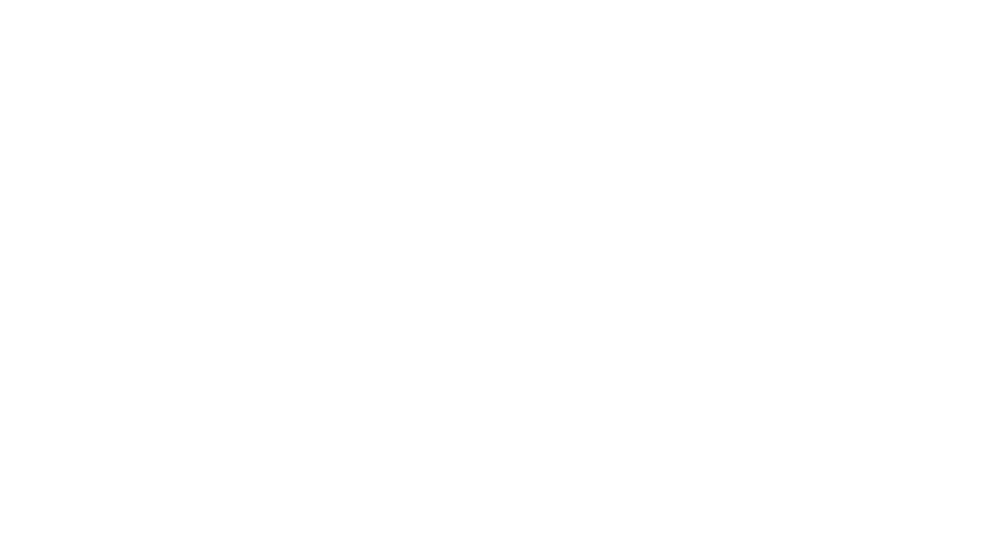

# Giới thiệu về Đánh giá LLM

## Tóm tắt nhanh

Đánh giá đề cập đến quá trình kiểm thử các đầu ra của ứng dụng LLM của bạn và yêu cầu các thành phần sau:

* Test cases (Các trường hợp kiểm thử)
* Metrics (Các chỉ số đánh giá)
* Evaluation dataset (Bộ dữ liệu đánh giá)

Dưới đây là sơ đồ về quy trình làm việc đánh giá lý tưởng trông như thế nào khi sử dụng `deepeval`:



Có **HAI** loại đánh giá LLM trong `deepeval`:

* [Đánh giá End-to-end](/docs/evaluation-end-to-end-llm-evals): Đầu vào và đầu ra tổng thể của hệ thống LLM của bạn.
* [Đánh giá cấp thành phần](/docs/evaluation-component-level-llm-evals): Các hoạt động nội bộ riêng lẻ của hệ thống LLM của bạn.

Cả hai đều có thể được thực hiện bằng cách sử dụng `deepeval test run` trong các pipeline CI/CD hoặc thông qua hàm `evaluate()` trong các tập lệnh Python.

:::note
Các test cases của bạn thường sẽ nằm trong một file python duy nhất và việc thực thi chúng sẽ dễ dàng như chạy `deepeval test run`:

```bash
deepeval test run test_example.py
```
:::

## Test Run

Chạy một đánh giá LLM tạo ra một **test run** — một tập hợp các test cases đo lường hiệu năng ứng dụng LLM của bạn tại một thời điểm cụ thể. Nếu bạn đã đăng nhập vào Confident AI, bạn cũng sẽ nhận được một [báo cáo kiểm thử LLM](https://www.confident-ai.com/docs/llm-evaluation/dashboards/testing-reports) hoàn toàn có thể chia sẻ trên đám mây.

## Metrics

`deepeval` cung cấp hơn 30 metrics đánh giá, hầu hết trong số đó được đánh giá bằng cách sử dụng LLM (truy cập [phần metrics](/docs/metrics-introduction#types-of-metrics) để tìm hiểu lý do).

```python
from deepeval.metrics import AnswerRelevancyMetric  
  
answer_relevancy_metric = AnswerRelevancyMetric()
```

Bạn sẽ cần tạo một test case để chạy các metrics của `deepeval`.

## Test Cases

Trong `deepeval`, một test case đại diện cho một [tương tác LLM](/docs/evaluation-test-cases#what-is-an-llm-interaction) và cho phép bạn sử dụng các metrics đánh giá mà bạn đã định nghĩa để kiểm thử đơn vị (unit test) các ứng dụng LLM.

```python
from deepeval.test_case import LLMTestCase  
  
test_case = LLMTestCase(  
  input="Who is the current president of the United States of America?",  
  actual_output="Joe Biden",  
  retrieval_context=["Joe Biden serves as the current president of America."]  
)
```

Trong ví dụ này, `input` mô phỏng một tương tác của người dùng với ứng dụng LLM dựa trên RAG, trong đó `actual_output` là đầu ra của ứng dụng LLM của bạn và `retrieval_context` là các node được truy xuất trong pipeline RAG của bạn. Việc tạo một test case cho phép bạn đánh giá bằng cách sử dụng các metrics mặc định của `deepeval`:

```python
from deepeval.test_case import LLMTestCase  
from deepeval.metrics import AnswerRelevancyMetric  
  
answer_relevancy_metric = AnswerRelevancyMetric()  
test_case = LLMTestCase(  
  input="Who is the current president of the United States of America?",  
  actual_output="Joe Biden",  
  retrieval_context=["Joe Biden serves as the current president of America."]  
)  
  
answer_relevancy_metric.measure(test_case)  
print(answer_relevancy_metric.score)
```

## Datasets

Datasets trong `deepeval` là một tập hợp các goldens. Nó cung cấp một giao diện tập trung để bạn đánh giá một tập hợp các test cases sử dụng một hoặc nhiều metrics.

```python
from deepeval.test_case import LLMTestCase  
from deepeval.dataset import EvaluationDataset, Golden  
from deepeval.metrics import AnswerRelevancyMetric  
from deepeval import evaluate  
  
answer_relevancy_metric = AnswerRelevancyMetric()  
dataset = EvaluationDataset(goldens=[Golden(input="Who is the current president of the United States of America?")])  
  
for golden in dataset.goldens:  
  dataset.add_test_case(  
    LLMTestCase(  
      input=golden.input,  
      actual_output=you_llm_app(golden.input)  
    )  
  )  
  
evaluate(test_cases=dataset.test_cases, metrics=[answer_relevancy_metric])
```

:::note
Bạn không cần tạo một evaluation dataset để đánh giá các test cases riêng lẻ. Truy cập [phần test cases](/docs/evaluation-test-cases#assert-a-test-case) để tìm hiểu cách assert các test cases riêng lẻ.
:::

## Synthesizer

Trong `deepeval`, `Synthesizer` cho phép bạn tạo ra các bộ dữ liệu tổng hợp (synthetic datasets). Điều này đặc biệt hữu ích nếu bạn không có dữ liệu sản xuất hoặc bạn không có một bộ dữ liệu golden để đánh giá.

```python
from deepeval.synthesizer import Synthesizer  
from deepeval.dataset import EvaluationDataset  
  
synthesizer = Synthesizer()  
goldens = synthesizer.generate_goldens_from_docs(  
  document_paths=['example.txt', 'example.docx', 'example.pdf']  
)  
  
dataset = EvaluationDataset(goldens=goldens)
```

:::info
`Synthesizer` của `deepeval` có khả năng tùy biến cao, và bạn có thể tìm hiểu thêm về nó [tại đây.](/docs/synthesizer-introduction)
:::

## Đánh giá với Pytest

:::caution
Mặc dù `deepeval` tích hợp với Pytest, chúng tôi thực sự khuyên bạn **NÊN TRÁNH** thực thi các `LLMTestCase` trực tiếp thông qua lệnh `pytest` để tránh bất kỳ lỗi không mong muốn nào.
:::

`deepeval` cho phép bạn chạy các đánh giá như thể bạn đang sử dụng Pytest thông qua tích hợp Pytest của chúng tôi. Đơn giản chỉ cần tạo một file test:

**test_example.py**

```python
from deepeval import assert_test  
from deepeval.dataset import EvaluationDataset, Golden  
from deepeval.test_case import LLMTestCase  
from deepeval.metrics import AnswerRelevancyMetric  
  
dataset = EvaluationDataset(goldens=[...])  
  
for golden in dataset.goldens:  
  dataset.add_test_case(...) # convert golden to test case  
  
@pytest.mark.parametrize(  
    "test_case",  
    dataset.test_cases,  
)  
def test_customer_chatbot(test_case: LLMTestCase):  
    assert_test(test_case, [AnswerRelevancyMetric()])
```

Và chạy file test trong CLI sử dụng `deepeval test run`:

```bash
deepeval test run test_example.py
```

Có **HAI** tham số bắt buộc và **MỘT** tham số tùy chọn khi gọi hàm `assert_test()`:

* `test_case`: một `LLMTestCase`
* `metrics`: một danh sách các metrics kiểu `BaseMetric`
* [Tùy chọn] `run_async`: một boolean mà khi được đặt là `True`, cho phép đánh giá đồng thời tất cả các metrics. Mặc định là `True`.

Bạn có thể tìm thấy tài liệu đầy đủ về `deepeval test run`, cho cả đánh giá [end-to-end](/docs/evaluation-end-to-end-llm-evals#use-deepeval-test-run-in-cicd-pipelines) và [cấp thành phần](/docs/evaluation-component-level-llm-evals#use-deepeval-test-run-in-cicd-pipelines) bằng cách nhấp vào các liên kết tương ứng của chúng.

:::info
`@pytest.mark.parametrize` là một decorator được cung cấp bởi Pytest. Nó chỉ đơn giản là lặp qua `EvaluationDataset` của bạn để đánh giá từng test case riêng lẻ.

Bạn có thể bao gồm lệnh `deepeval test run` như một bước trong file `.yaml` trong quy trình làm việc CI/CD của bạn để chạy các kiểm tra trước khi triển khai trên ứng dụng LLM của bạn.
:::

## Đánh giá không dùng Pytest

Ngoài ra, bạn có thể sử dụng hàm `evaluate` của `deepeval`. Cách tiếp cận này tránh việc dùng CLI (nếu bạn đang ở trong môi trường notebook), và cũng cho phép thực thi test song song.

```python
from deepeval import evaluate  
from deepeval.metrics import AnswerRelevancyMetric  
from deepeval.dataset import EvaluationDataset  
  
dataset = EvaluationDataset(goldens=[...])  
for golden in dataset.goldens:  
  dataset.add_test_case(...) # convert golden to test case  
  
evaluate(dataset, [AnswerRelevancyMetric()])
```

Có **HAI** tham số bắt buộc và **SÁU** tham số tùy chọn khi gọi hàm `evaluate()`:

* `test_cases`: một danh sách các `LLMTestCase` **HOẶC** `ConversationalTestCase`, hoặc một `EvaluationDataset`. Bạn không thể đánh giá `LLMTestCase` và `ConversationalTestCase` trong cùng một test run.
* `metrics`: một danh sách các metrics kiểu `BaseMetric`.
* [Tùy chọn] `hyperparameters`: một dict kiểu `dict[str, Union[str, int, float]]`. Bạn có thể log bất kỳ hyperparameter tùy ý nào liên quan đến test run này để chọn ra các hyperparameters tốt nhất cho ứng dụng LLM của bạn trên Confident AI.
* [Tùy chọn] `identifier`: một chuỗi cho phép bạn định danh tốt hơn test run của mình trên Confident AI.
* [Tùy chọn] `async_config`: một instance kiểu `AsyncConfig` cho phép bạn [tùy chỉnh mức độ đồng thời](/docs/evaluation-flags-and-configs#async-configs) trong quá trình đánh giá. Mặc định là các giá trị `AsyncConfig` mặc định.
* [Tùy chọn] `display_config`: một instance kiểu `DisplayConfig` cho phép bạn [tùy chỉnh những gì được hiển thị](/docs/evaluation-flags-and-configs#display-configs) ra console trong quá trình đánh giá. Mặc định là các giá trị `DisplayConfig` mặc định.
* [Tùy chọn] `error_config`: một instance kiểu `ErrorConfig` cho phép bạn [tùy chỉnh cách xử lý lỗi](/docs/evaluation-flags-and-configs#error-configs) trong quá trình đánh giá. Mặc định là các giá trị `ErrorConfig` mặc định.
* [Tùy chọn] `cache_config`: một instance kiểu `CacheConfig` cho phép bạn [tùy chỉnh hành vi caching](/docs/evaluation-flags-and-configs#cache-configs) trong quá trình đánh giá. Mặc định là các giá trị `CacheConfig` mặc định.

Bạn có thể tìm thấy tài liệu đầy đủ về `evaluate()`, cho cả đánh giá [end-to-end](/docs/evaluation-end-to-end-llm-evals#use-evaluate-in-python-scripts) và [cấp thành phần](/docs/evaluation-component-level-llm-evals#use-evaluate-in-python-scripts) bằng cách nhấp vào các liên kết tương ứng của chúng.

:::tip
Bạn cũng có thể thay thế `dataset` bằng một danh sách các test cases, như được hiển thị trong [phần test cases.](/docs/evaluation-test-cases#evaluate-test-cases-in-bulk)
:::

## Đánh giá các thành phần lồng nhau

Bạn cũng có thể chạy các metrics trên các thành phần lồng nhau (nested components) bằng cách thiết lập tracing trong `deepeval`, và yêu cầu dưới 10 dòng code:

```python
from deepeval.test_case import LLMTestCase  
from deepeval.metrics import AnswerRelevancyMetric  
from deepeval.tracing import observe, update_current_span  
from openai import OpenAI  
  
client = OpenAI()  
  
@observe(metrics=[AnswerRelevancyMetric()])  
def complete(query: str):  
  response = client.chat.completions.create(model="gpt-4o", messages=[{"role": "user", "content": query}]).choices[0].message.content  
  
  update_current_span(  
    test_case=LLMTestCase(input=query, output=response)  
  )  
  return response
```

Điều này rất hữu ích đặc biệt nếu bạn:

* Muốn chạy một tập hợp các metrics khác nhau trên các thành phần khác nhau
* Muốn đánh giá nhiều thành phần cùng một lúc
* Không muốn viết lại codebase của bạn chỉ để đẩy các biến trả về lên để tạo một `LLMTestCase`

Theo mặc định, `deepeval` sẽ không chạy bất kỳ metrics nào khi bạn đang chạy ứng dụng LLM của mình bên ngoài `evaluate()` hoặc `assert_test()`. Để xem hướng dẫn đầy đủ về đánh giá với tracing, hãy truy cập [trang này.](/docs/evaluation-component-level-llm-evals)
