# 01. SYSTEM ARCHITECTURE DESIGN
**Project**: Enterprise AI Agent Evaluation Platform
**Version**: 2.1 (Consolidated Master)
**Status**: APPROVED
**Last Updated**: 2026-01-22

---

## 1. GIỚI THIỆU (Introduction)

Tài liệu xác định kiến trúc tổng thể (Solution Architecture) cho **Enterprise AI Agent Evaluation Platform**, hệ thống đánh giá và kiểm thử tự động cho các AI Agent thế hệ mới.

Kiến trúc được thiết kế theo các nguyên tắc **Cloud-Native**, đảm bảo tính Khả dụng cao (High Availability), Khả năng mở rộng (Scalability) và Bảo mật (Security) theo tiêu chuẩn Enterprise, sẵn sàng triển khai trên hạ tầng **AWS Cloud**.

### Đăng ký Kiến trúc (Design Principles)
1.  **Microservices on Kubernetes**: Toàn bộ workload (ngoại trừ Data Layer) chạy trên EKS để tối ưu hóa quản lý resource và auto-scaling.
2.  **Event-Driven & Graph-based**: Sử dụng LangGraph cho logic điều phối phức tạp và Kafka/Redis cho xử lý bất đồng bộ.
3.  **Security-First**: Áp dụng mô hình Zero Trust, mã hóa dữ liệu 2 chiều (At-rest & In-transit), tuân thủ VPC Isolation nghiêm ngặt.
4.  **Separation of Concerns**: Tách biệt rõ ràng giữa Control Plane (Orchestrator), Compute Plane (Simulation/Eval Workers) và Data Plane.

---

## 2. SYSTEM CONTEXT (C4 Level 1)

Mô tả sự tương tác giữa Platform và các hệ thống bên ngoài.

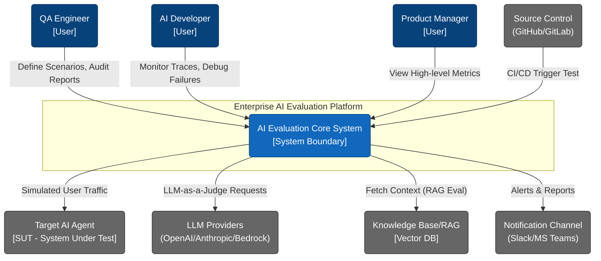

---

## 3. CONTAINER ARCHITECTURE (C4 Level 2)

Chi tiết các services và container chính trong hệ thống, mapping với hạ tầng AWS/EKS.

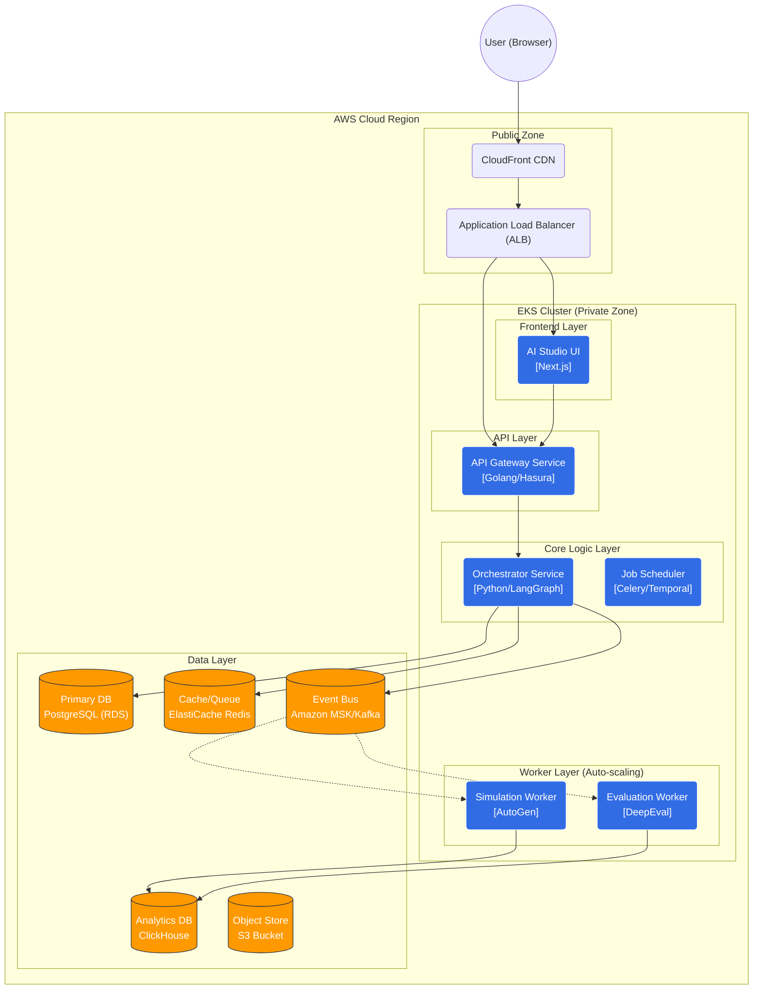

---

## 4. COMPONENT ARCHITECTURE (C4 Level 3)

Đi sâu vào cấu trúc nội bộ của `Orchestrator Service` - bộ não của hệ thống.

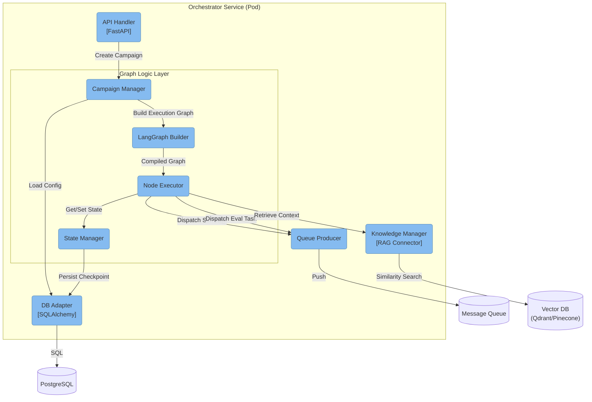

### Các Component chính
*   **Campaign Manager**: Quản lý vòng đời của một chiến dịch test.
*   **LangGraph Builder**: Dịch cấu hình JSON (từ UI) thành LangGraph Runnable objects, hỗ trợ cyclic graphs cho các kịch bản test self-correcting.
*   **Node Executor**: Thực thi logic của từng node (Start, Wait, End).
*   **State Manager**: Quản lý bộ nhớ ngắn hạn của Campaign, đảm bảo tính bền vững (durability) nếu server restart.

---

## 4.1. AUTOGEN INTEGRATION STRATEGY (Headless Simulation)

Hệ thống sử dụng **AutoGen** như một thư viện Python (Library) nhúng bên trong `Simulation Worker`, **KHÔNG** triển khai AutoGen Studio UI.

### 4.1.1. Kiến trúc Headless (Engine-only)
Chúng ta bỏ qua lớp UI của AutoGen (AutoGen Studio) và chỉ sử dụng lớp Core Engine:

*   **Role**: Tự động hóa hội thoại Multi-agent để giả lập người dùng.
*   **Deployment**: Chạy dưới dạng tiến trình Python trong Docker Container (`Simulation Worker`).
*   **Input**: JSON configuration từ `Orchestrator` (Profile User, Kịch bản test).
*   **Output**: Chat History (List of Messages) trả về cho `DeepEval` chấm điểm.

### 4.1.2. Tại sao không dùng AutoGen Studio UI?
| Feature | AutoGen Studio UI | Evaluation UI (Custom) |
| :--- | :--- | :--- |
| **Mục đích** | Prototyping & Demo Agent. | **Evaluation & Benchmarking**. |
| **Giao diện** | Chat đơn giản (ChatGPT style). | **Split-View Battle Arena**: So sánh User nghĩ gì (Thought) vs Bot nói gì. |
| **Integrations** | Khó tích hợp chấm điểm DeepEval. | Tích hợp sâu: Realtime Scoring, Latency tracking, CI/CD trigger. |
| **Customization** | Khó sửa theme/layout. | Hoàn toàn làm chủ (Shadcn/UI), đúng chuẩn Design. |

### 4.1.3. Code Snippet minh họa
Cách Worker gọi AutoGen ở mức code:

```python
# SimulationWorker.py
from autogen import UserProxyAgent, AssistantAgent

def run_simulation(persona_config, target_bot_url):
    # 1. Khởi tạo User Sim (Headless - Không cần người gõ phím)
    user_sim = UserProxyAgent(
        name="User_Simulator",
        human_input_mode="NEVER",
        system_message=persona_config['system_prompt'],
        code_execution_config=False
    )
    
    # 2. Khởi tạo Wrapper để gọi Bot cần test
    target_bot = AssistantAgent(
        name="Target_Bot",
        llm_config={"config_list": [{"model": "gpt-4", "base_url": target_bot_url}]}
    )
    
    # 3. Bắt đầu hội thoại
    chat_result = user_sim.initiate_chat(
        target_bot, 
        message="Chào bạn, tư vấn cho tôi xe VF3."
    )
    
    return chat_result.chat_history
```

---

## 5. CODE/CLASS DESIGN (C4 Level 4)

Mô hình hóa các Class chính trong module Evaluation (DeepEval Integration).

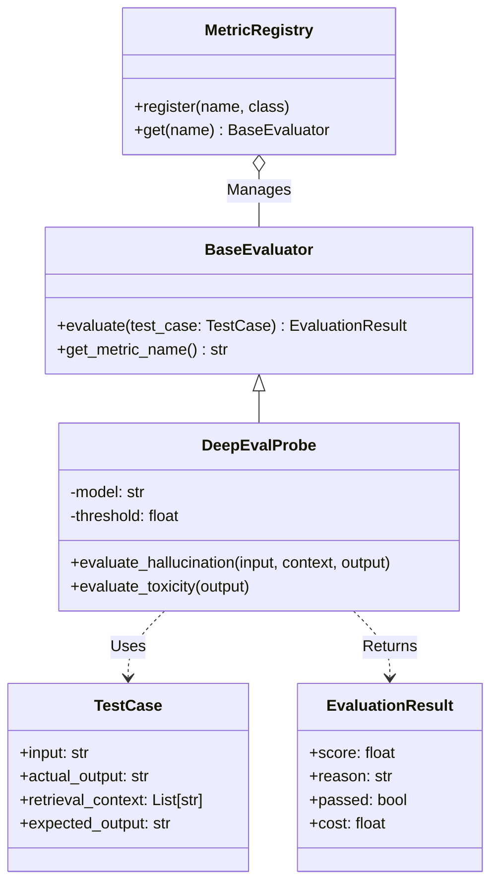

---

## 6. DYNAMIC VIEWS & SCENARIOS

### 6.1. Sequence Diagram: Kịch bản kiểm thử chủ động (Active Testing / Red Teaming)

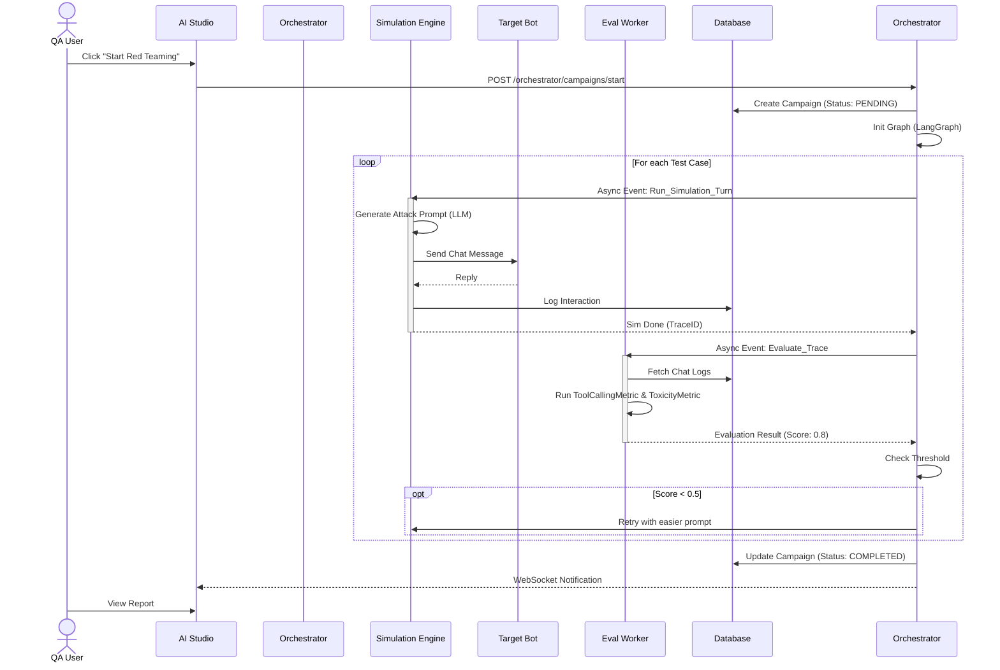

### 6.2. System Overview Data Flow
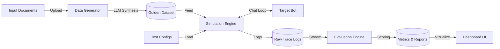

### 6.3. FUNCTIONAL FLOWS (Detailed Logic)

#### 6.3.1. Synthetic Data Generation Pipeline (FR-03)
Minh họa quy trình sinh dữ liệu test từ tài liệu gốc.

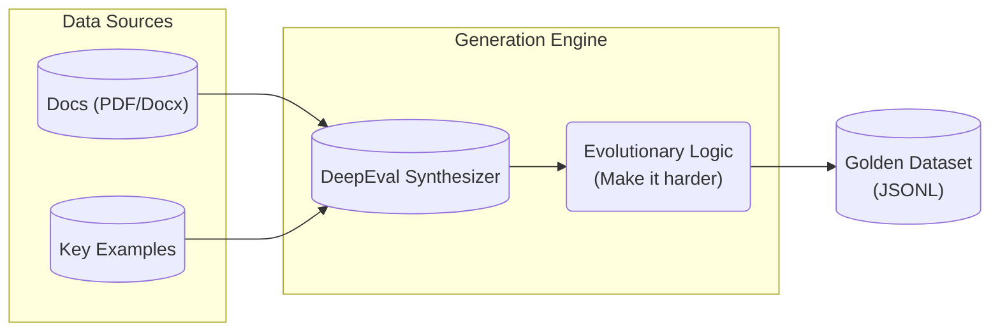

#### 6.3.2. Auto-Red Teaming Sequence (FR-04)
Quy trình giả lập tấn công bảo mật.

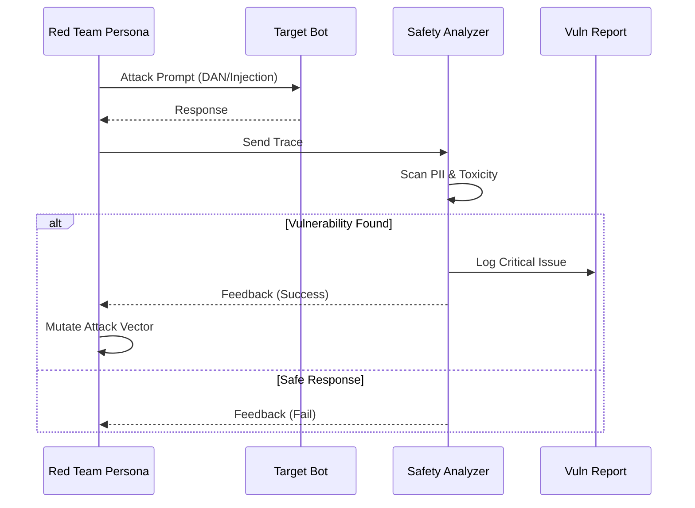

#### 6.3.3. Human-in-the-loop Grading Process (FR-05)
Quy trình xử lý các trường hợp AI chấm điểm không chắc chắn.

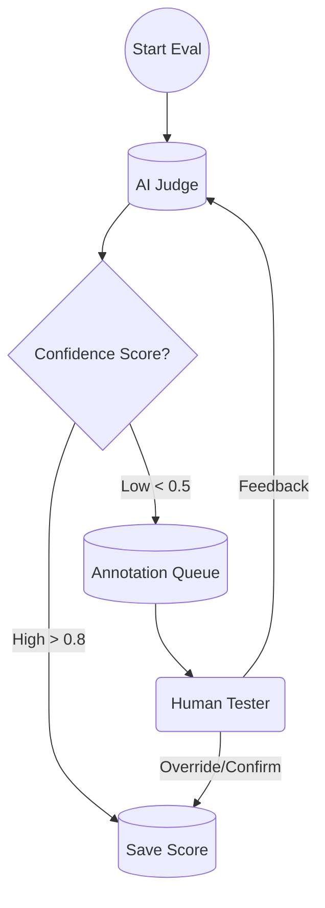

#### 6.3.4. Prompt Optimization Loop (FR-07)
Vòng lặp tối ưu hóa Prompt tự động.

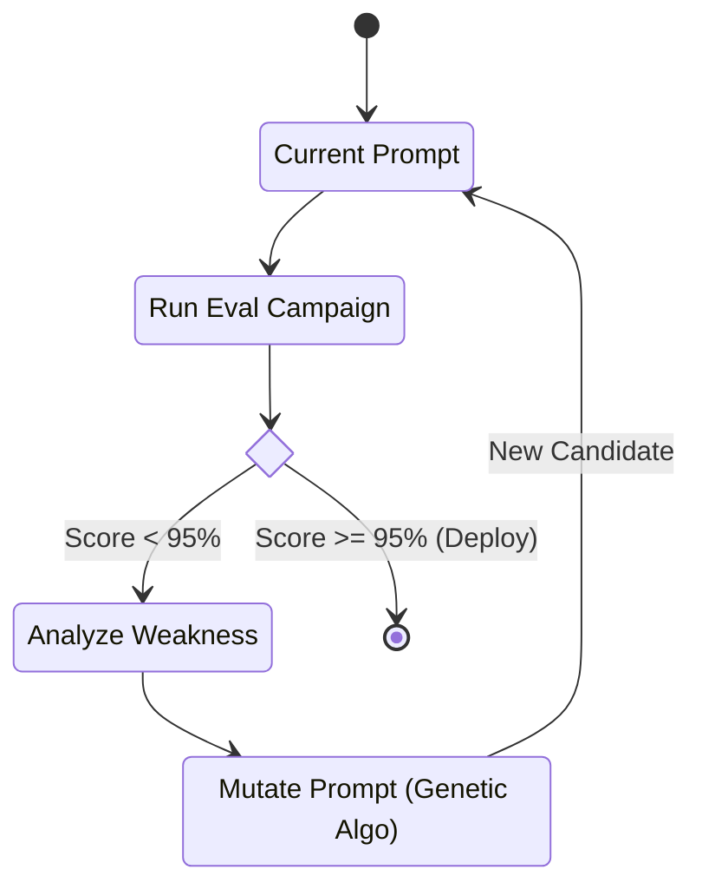

---

## 7. AMAZON AWS INFRASTRUCTURE ARCHITECTURE

Phần này mô tả chi tiết thiết kế hạ tầng vật lý trên AWS.

### 7.1. Network Topology (VPC Design)

Hệ thống được triển khai trong một **Virtual Private Cloud (VPC)** riêng biệt, trải dài trên **3 Availability Zones (AZs)**.

*   **VPC CIDR**: `10.0.0.0/16`
*   **Subnet Strategy**:
    1.  **Public Subnets**: ALB, NAT Gateways.
    2.  **Private App Subnets**: EKS Node Groups (Microservices).
    3.  **Private Data Subnets**: RDS, ElastiCache, MSK, ClickHouse.

### 7.2. Infrastructure Diagram (Physical)

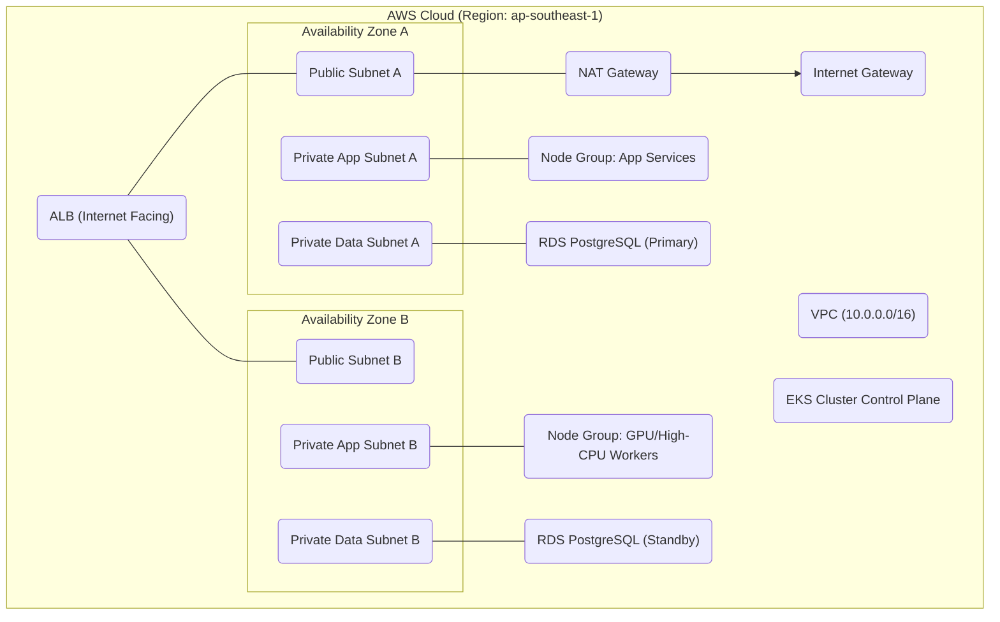

### 7.3. Compute & Data Layer
*   **Amazon EKS**: Quản lý containers.
    *   *System Node Group*: Chạy CoreDNS, VPC CNI, Prometheus.
    *   *App Node Group*: Chạy Microservices.
    *   *Spot Node Group*: Chạy Eval Workers (Cost Optimization).
*   **Persistence**:
    *   **PostgreSQL (RDS)**: Metadata.
    *   **ClickHouse**: Big Data Analytics (Traces).
    *   **S3**: Object Storage.

---

## 8. SECURITY & OPERATIONS

### 8.1. Security Architecture
*   **NetSec**: AWS WAF chặn tấn công lớp 7. Security Groups giới hạn traffic giữa các tầng.
*   **IAM**: Sử dụng IRSA (IAM Roles for Service Accounts) để cấp quyền truy cập S3/RDS cho Pods, không dùng Access Key.
*   **Encryption**: KMS cho encryption at-rest (EBS, RDS, S3).
*   **Audit Logging**: Ghi lại toàn bộ hành động tạo/sửa/xóa tài nguyên.

### 8.3. Authorization Model (RBAC)
Hệ thống áp dụng mô hình phân quyền dựa trên vai trò (Role-Based Access Control) chặt chẽ:

| Role | Quyền Hạn Chính (Key Permissions) | Đối Tượng Sử Dụng |
| :--- | :--- | :--- |
| **ADMIN** | **Full Access**: Quản lý thành viên, Billing, Cấu hình hệ thống, Xóa dự án. | Project Owner, Tech Lead |
| **EDITOR** | **Modify**: Tạo/Sửa Agent, Chạy Eval Campaign, Cấu hình Metrics. Không được quản lý User/Billing. | AI Engineers, Developers |
| **STAKEHOLDER** | **Analyze**: Xem Dashboard, Reports, Logs chi tiết. Có quyền kích hoạt Test Scenario nhưng quyền hạn chế. | QC Lead, Product Manager |
| **VIEWER** | **Read-Only**: Chỉ xem Dashboard tổng quan và Report đã xuất bản. Không xem được Log chi tiết (Traces). | Business Analysts, Guest |

*Chi tiết Ma trận phân quyền (Permission Matrix) được hiển thị trực tiếp trong giao diện Team Settings.*

### 8.2. Autoscaling & DR
*   **HPA**: Autoscaling dựa trên Custom Metrics (Queue Depth).
*   **Disaster Recovery**: Backup RDS và S3 định kỳ. Quy trình RTO < 4 giờ dùng IaC (Terraform).

---

## 9. CẤU HÌNH MÔI TRƯỜNG (Environments)

| Environment | VPC | Branch | Scale Strategy |
| :--- | :--- | :--- | :--- |
| **Development** | VPC-Dev | `develop` | Single AZ, Spot Instances (Cheap) |
| **Staging** | VPC-Staging | `release/*` | Multi-AZ, same architectural parity as Prod |
| **Production** | VPC-Prod | `main` | Multi-AZ (3 Zones), Reserved Instances |

---
*End of Document*
