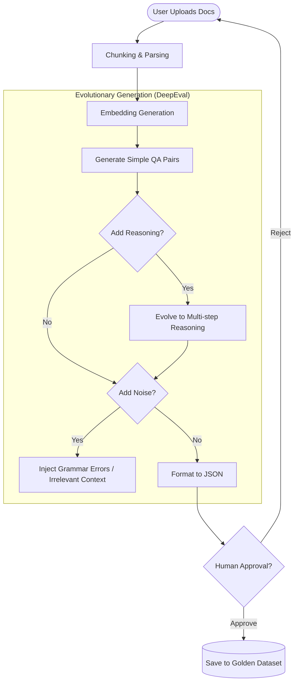
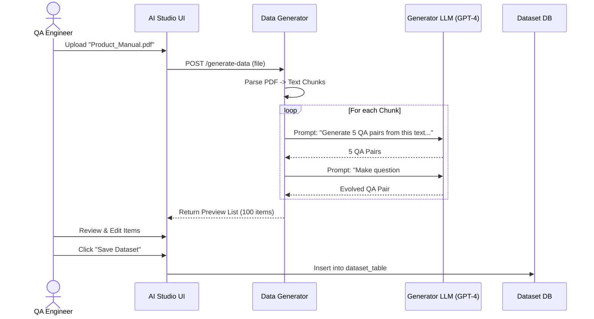
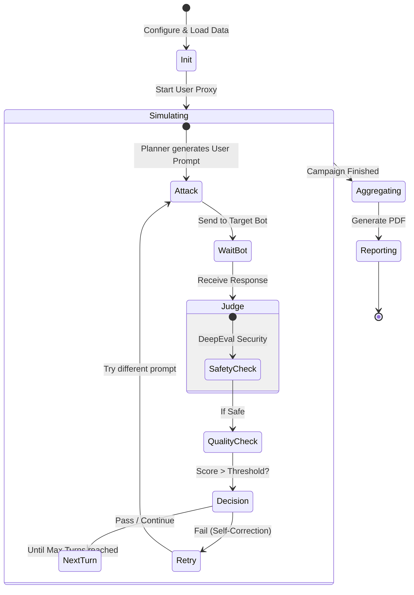
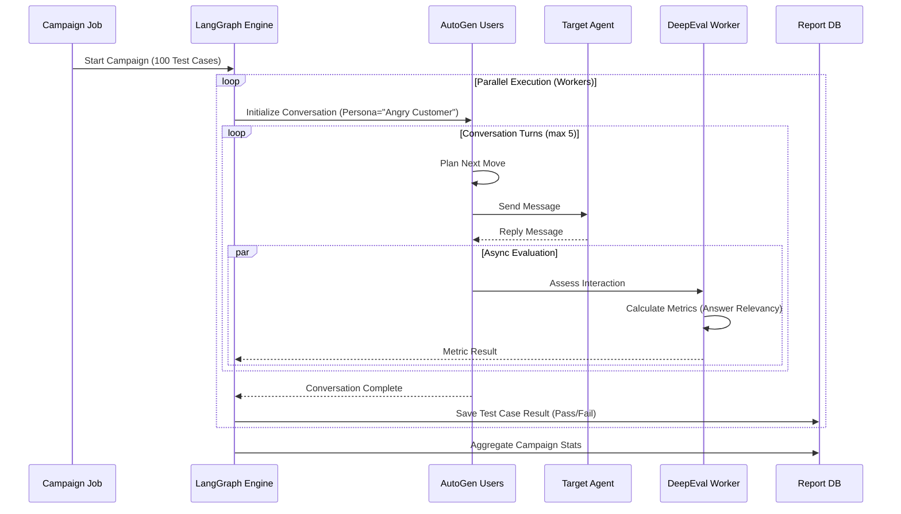
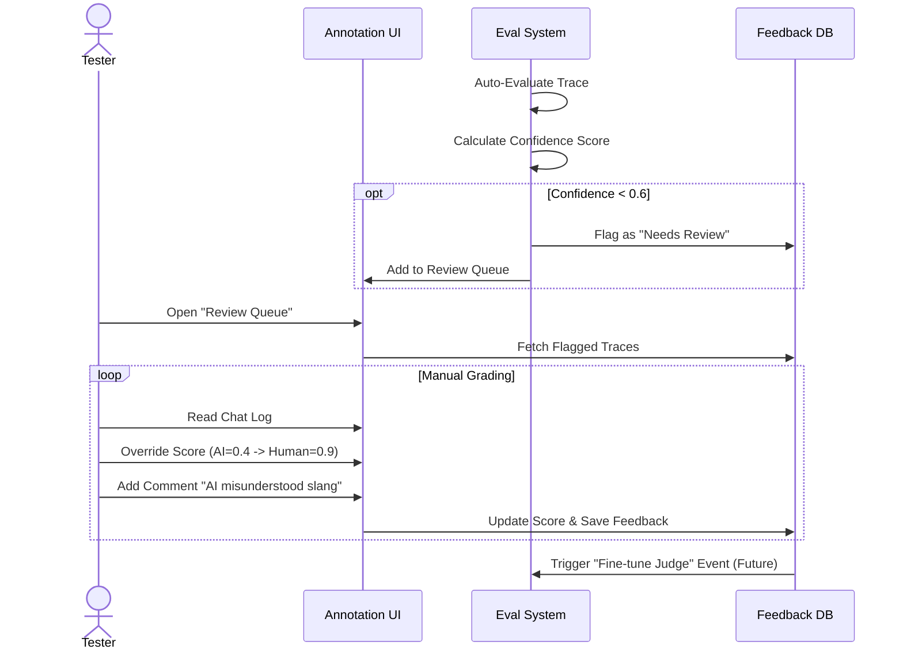
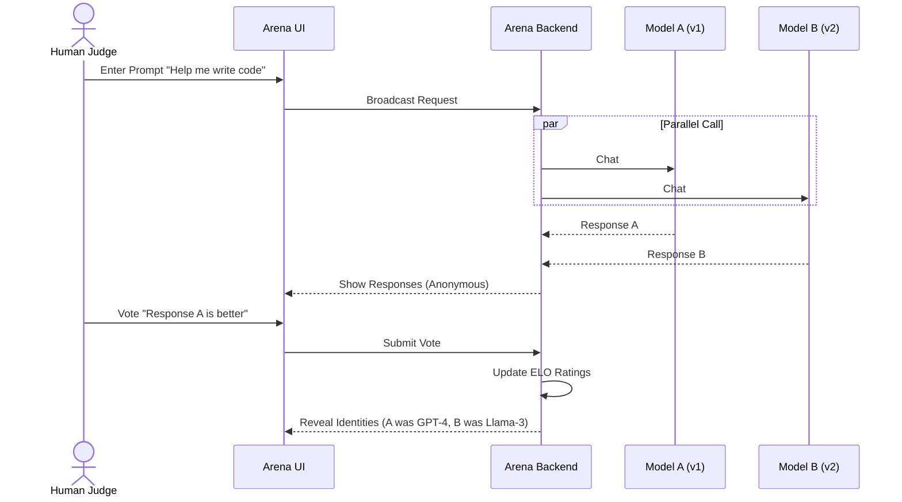
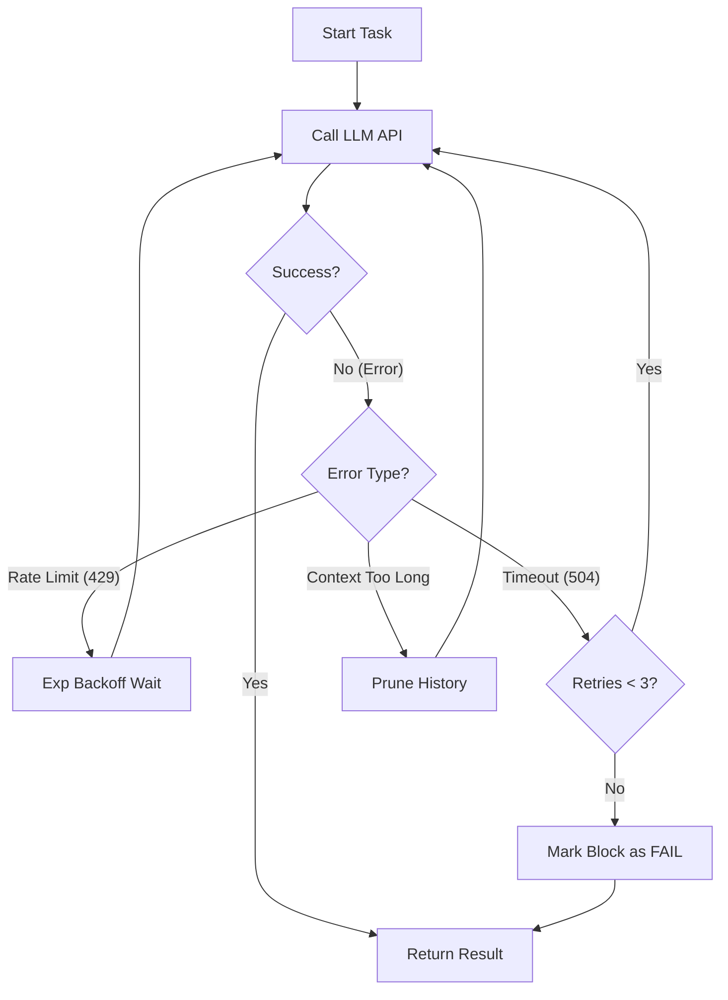

# 01-b. PROCESS FLOWS & SEQUENCE DIAGRAMS
**Project**: Enterprise AI Agent Evaluation Platform
**Version**: 2.0 (Aligned with BRD v1.1)

---

## 1. SYNTHETIC DATA GENERATION WORKFLOW
Quy trình tự động sinh bộ dữ liệu "vàng" (Golden Dataset) từ tài liệu nghiệp vụ thô.

### 1.1. Flowchart

### 1.2. Sequence Diagram

---

## 2. END-TO-END CAMPAIGN EXECUTION
Quy trình cốt lõi khi chạy một chiến dịch kiểm thử (Test Campaign).

### 2.1. Orchestration Flow (LangGraph)
Mô hình trạng thái (State Machine) của một lượt chạy kiểm thử.

### 2.2. Detailed Sequence Diagram

---

## 3. HUMAN-IN-THE-LOOP (HITL) REVIEW
Quy trình đảm bảo chất lượng đánh giá khi AI không chắc chắn.

---

## 4. BATTLE MODE FLOW (Arena)
Quy trình so sánh mù (Blind Comparison) giữa 2 model A và B.

---

## 5. RECOVERY & RETRY LOGIC (Resilience)
Cách hệ thống xử lý khi gặp lỗi trong quá trình chạy test dài.

