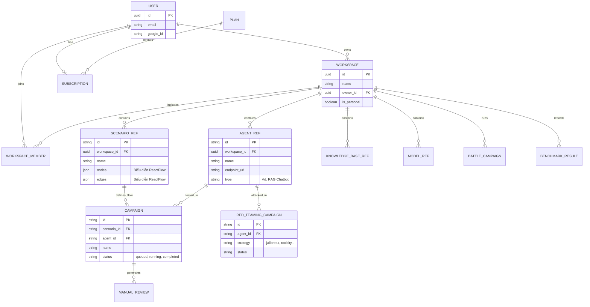

# 03. DATABASE DESIGN SPECIFICATION
**Project**: Enterprise AI Agent Evaluation Platform
**Version**: 2.0 (Active Testing Support)

---

## 1. DATA ARCHITECTURE STRATEGY (Polyglot Persistence)

Chúng ta sử dụng đúng công cụ cho đúng việc (Right tool for the right job).

| Component | Technology | Role | Rationale in Context |
|-----------|------------|------|----------------------|
| **Primary** | **PostgreSQL 16** | Metadata & Config | Cần ACID transaction cho việc quản lý Campaign Configs, Users, Billing. |
| **Analytics** | **ClickHouse** | Logs & Events | Cần tốc độ insert cực nhanh cho hàng triệu log chat và khả năng query aggregate (SUM, AVG) độ trễ thấp. |
| **Vector** | **Qdrant** | Context & Semantic | Hỗ trợ tìm kiếm Similarity cho Golden Datasets và RAG Context. |
| **Queue** | **Redis** | Job Queue | Broker nhẹ cho LangGraph tasks. |

---

## 2. POSTGRESQL SCHEMA (Metadata & Orchestration)

PostgreSQL đóng vai trò là cơ sở dữ liệu lõi thống nhất, lưu trữ thông tin về người dùng, thanh toán, không gian làm việc (Workspaces), cấu hình tài nguyên (Agents, Scenarios, Knowledge Bases), và trạng thái thực thi của các chiến dịch kiểm thử (Campaigns).

### 2.1. ER Diagram


### 2.2. Core Tables
Nền tảng sử dụng kiến trúc microservice chia sẻ cùng một structure trong PostgreSQL.

**Quản lý Danh tính & Thanh toán (`users`, `workspaces`, `plans`, `subscriptions`)**
Quản lý phân quyền truy cập và dữ liệu độc lập giữa các khách hàng (tenant isolation).
*   `users`: Lưu thông tin xác thực (`email`, `google_id`).
*   `workspaces`: Đại diện cho một ranh giới chia sẻ công việc (tenant). `owner_id` liên kết tới `users`.
*   `workspace_members`: Định nghĩa RBAC (Vai trò: `OWNER`, `EDITOR`, `VIEWER`) trong một workspace.
*   `subscriptions` & `plans`: Quản lý gói cước tính phí, giới hạn tài nguyên và số lượt chạy theo tháng.

**Quản lý Tài nguyên Dữ liệu (`agent_ref`, `scenario_ref`, `knowledge_base_ref`, `model_ref`)**
Lưu trữ các đối tượng cốt lõi cần thiết cho quá trình AI Evaluation bên trong một workspace.
*   `agent_ref`: Cấu hình của Bot mục tiêu (Tên, API Endpoint, API Keys, thiết lập Langfuse).
*   `scenario_ref`: Cấu hình kịch bản kiểm thử trực quan được dựng bằng ReactFlow (chứa `nodes` và `edges`).
*   `knowledge_base_ref`: Tài liệu và Cấu hình Vector DB dùng để kiểm tra ngữ cảnh RAG.
*   `model_ref`: Cấu hình liên kết tới các LLM Providers (OpenAI, Anthropic, Local) dùng cho logic chấm điểm và giả lập AI.

**Điều phối & Thực thi Chiến dịch (`campaigns`, `red_teaming_campaign`, `battle_campaign`)**
Theo dõi trạng thái của các đợt kiểm toán đang chạy.
*   `campaigns`: Quản lý các chiến dịch kiểm thử tĩnh/theo luồng (`scenario_id`, `agent_id`, `status`).
*   `red_teaming_campaign`: Quản lý chiến dịch tấn công bẻ khóa/lỗ hổng (Adversarial operations), lưu trữ thông tin `strategy` (vd. jailbreak, prompt-injection), `intensity`, và báo cáo điểm yếu (`critical_count`, `high_count`).
*   `battle_campaign`: Điều phối kiểm thử A/B (Agent A đấu Agent B), theo dõi số hiệp thắng (`agent_a_wins`, `agent_b_wins`), hòa (`ties`), và lượt đi hiện tại (`current_turn`).
*   `manual_review`: Chờ kiểm duyệt thủ công (Human-in-the-Loop), lưu các ca kiểm thử chưa rõ ràng đợi con người chấm điểm.

---

## 3. CLICKHOUSE SCHEMA (Deep Analytics)

Tối ưu cho việc lưu trữ hàng loạt (Bulk Insert) và tính toán Aggregate Score.

### 3.1. Raw Conversation Turns
Lưu trữ chi tiết từng lượt hội thoại trong quá trình Simulation.

```sql
CREATE TABLE conversation_turns (
    run_id UUID,          -- Link to Postgres CampaignRun
    trace_id UUID,        -- Langfuse Trace ID
    timestamp DateTime64(3),
    
    -- Simulation Context
    scenario_id UUID,
    simulator_persona String,
    
    -- The interaction
    turn_index UInt8,     -- Turn 1, 2, 3...
    user_input String,    -- Simulator said
    agent_msg String,     -- Target Bot said
    
    metadata Map(String, String) -- Extra tags
) ENGINE = MergeTree()
PARTITION BY toYYYYMM(timestamp)
ORDER BY (run_id, timestamp);
```

### 3.2. Evaluation Metrics Results
Kết quả chấm điểm chi tiết.

```sql
CREATE TABLE eval_results (
    run_id UUID,
    trace_id UUID,
    timestamp DateTime64(3),
    
    metric_name String, -- 'AnswerRelevancy', 'Toxicity'
    score Float32,      -- 0.0 - 1.0
    reason String,      -- "The agent failed because..."
    
    -- Cost tracking
    input_tokens UInt32,
    output_tokens UInt32,
    cost_usd Float32
) ENGINE = MergeTree()
PARTITION BY toYYYYMM(timestamp)
ORDER BY (metric_name, score, timestamp);
```

---

## 4. VECTOR DATABASE (Qdrant)

### 4.1. Collection: `golden_test_cases`
Lưu trữ bộ dữ liệu mẫu (Golden Dataset) để so sánh ngữ nghĩa.

*   **Config**: Cosine Distance, 1536 dimensions (OpenAI ada-002/small-3).
*   **Payload Schema**:
    ```json
    {
      "question": "Làm sao để đổi mật khẩu?",
      "expected_answer": "Bạn vào Cài đặt -> Bảo mật -> Đổi mật khẩu.",
      "ideal_context": ["doc_security_policy_v2.pdf"],
      "difficulty": "Easy",
      "category": "Account Management"
    }
    ```
*   **Usage**: Khi chạy test Regression, hệ thống sẽ query vector để tìm các test case cũ tương tự nhằm đảm bảo không bị "Regression" (cải lùi).

---

## 5. DATA RETENTION POLICY (Quy định lưu trữ)

*   **Hot Data (30 ngày)**: Lưu full logs trong ClickHouse NVMe storage. Truy xuất tức thì.
*   **Warm Data (1 năm)**: Move logs cũ sang S3-backed storage (ClickHouse Tiered Storage). Query chậm hơn.
*   **Cold Data (Vĩnh viễn)**: Archive các bản Campaign Reports (PDF/JSON summary) vào Postgres/S3. Raw logs quá cũ sẽ bị xóa.
