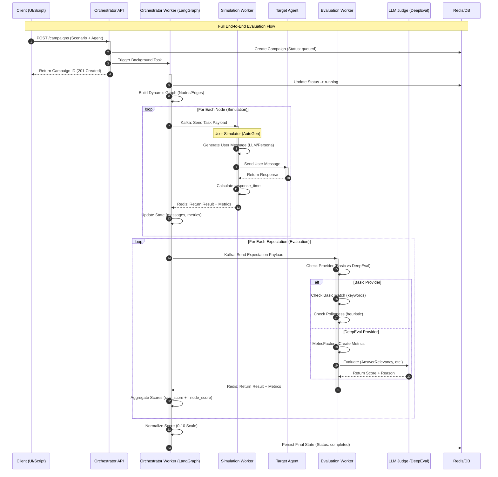
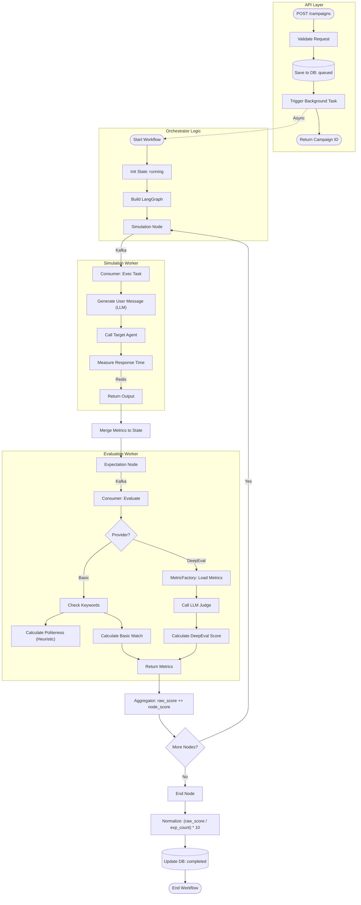

# BACKEND IMPLEMENTATION SPECIFICATION
**Project**: Enterprise AI Agent Evaluation Platform
**Status**: STABLE

## 1. System Overview & Microservices Architecture

Dựa vào **[System-Architecture](./01-System-Architecture.md)**, hệ thống Backend được chia thành các Microservices sau:

| Service Name | Technology Stack | Responsibility | UI Module Mapping |
| :--- | :--- | :--- | :--- |
| **Identity Service** | Python (FastAPI) + Google OAuth 2.0 | User Management, JWT Auth, Workspace RBAC, Auto-provisioning. | `settings/team`, `profile` |
| **Resource Service** | Python (FastAPI) + PostgreSQL | CRUD cho Agents (Encrypted), Scenarios, Models, KB, Metrics. Hỗ trợ Pagination. | `agents`, `models`, `knowledge-bases` |
| **Orchestrator Service** | Python (LangGraph) + Redis | Điều phối Campaign, Dynamic Graph Building, State Persistence. | `scenario-builder`, `battle-arena` |
| **Simulation Worker** | Python (AutoGen) | Chạy giả lập hội thoại (Multi-turn), Red Teaming (Adversarial). | `battle-arena` (Sim side) |
| **Evaluation Worker** | Python (DeepEval) | Chấm điểm LLM-as-a-judge, Confidence Threshold, Human-in-the-loop. | `metrics-library`, `reports` |
| **Data Ingestion** | **Rust** (Actix-web) | Thu thập Log/Trace tốc độ cao, Batching dữ liệu vào ClickHouse. | `trace`, `dev-console` |
| **GenAI Service** | Python (LangChain) | Sinh Persona, Test Cases, Goldens từ PDF (RAG), Prompt Optimization (GEPA). | `dataset-gen`, `prompt-optimizer` |
| **Langfuse** | Infrastructure (Docker) | Tracing, Observability, evaluation Store. | `trace` |
| **Clickhouse** | Infrastructure (Docker) | Phân tích Log/Trace hiệu năng cao. | `trace`, `reports` |
| **Kafka + Zookeeper** | Infrastructure (Docker) | Event Streaming, Async Tasks (Simulation/Evaluation). | N/A (Backend Internal) |
| **Redis** | Infrastructure (Docker) | Caching, LangGraph Checkpointer (Persistence). Quản lý Rate Limit & API Usage Limit. | N/A (Backend Internal) |
| **Billing Service** | Python (FastAPI) | Tích hợp PayPal, quản lý Subscriptions (Gói cước, Quota Limit Tracking). | `billing`, `pricing` |

---

---

## 2. The Quad-Core Technology Stack

Hệ thống được xây dựng dựa trên 4 trụ cột công nghệ (Quad-Core) để đảm bảo khả năng mở rộng, độ sâu kiểm thử và tính an toàn dữ liệu.

### 2.1. Orchestration: LangGraph
*   **Role**: Điều phối luồng kiểm thử phức tạp, hỗ trợ Cyclic Graphs (vòng lặp tự sửa sai).
*   **Deep Integration**:
    *   Sử dụng `StateGraph` để định nghĩa quy trình: `User Sim -> Target Bot -> Evaluator -> Decision -> Loop/End`.
    *   Quản lý State bền vững (Persistence) qua Redis, cho phép "Time Travel" để debug từng bước nhảy của Agent.

### 2.2. Simulation: Microsoft AutoGen
*   **Role**: Giả lập người dùng (User Simulator) với các tính cách (Persona) khác nhau.
*   **Why AutoGen?**:
    *   **Conversable Agents**: Thiết kế tối ưu cho hội thoại nhiều chiều (Multi-turn), tự nhiên hơn so với cơ chế Chain đơn giản.
    *   **Headless Mode**: Chạy ngầm trong Docker Worker, không cần giao diện AutoGen Studio.
    *   **Human Proxy**: Có khả năng cho phép QA can thiệp thủ công (Human-in-the-loop) khi cần thiết.

### 2.3. Evaluation: DeepEval
*   **Role**: Chấm điểm (LLM-as-a-Judge) chuyên sâu cho RAG và Agents.
*   **Key Features**:
    *   **G-Eval**: Tạo metrics tùy chỉnh dựa trên Prompt.
    *   **Synthesizer**: Tự sinh dữ liệu test (Synthetic Data) từ tài liệu nghiệp vụ.
    *   **Unit Test Integration**: Viết test case như PyTest, tích hợp thẳng vào CI/CD pipeline.

### 2.4. Observability: Langfuse
*   **Role**: Quan sát, truy vết (Tracing) và debugging.
*   **Data Sovereignty**: Deployment Self-hosted (Docker) đảm bảo không lọt dữ liệu nhạy cảm ra ngoài (Privacy-first).
*   **Trace Linking**: Gắn kết chặt chẽ Trace ID xuyên suốt từ AutoGen -> LangGraph -> Target Bot.
*   **Future Strategy (Arize Phoenix)**:
    *   Hệ thống được thiết kế với **Thin Wrapper SDK** (`langeval-sdk`).
    *   Giúp dễ dàng chuyển đổi Backend từ Langfuse sang **Arize Phoenix** (để phân tích chuyên sâu Embedding/Drift) mà **KHÔNG** cần sửa đổi code của Agent. Chỉ cần cập nhật logic bên trong SDK.

### 2.5. Dual-Flow Data Pipeline Architecture

Hệ thống backend được tối ưu hóa để xử lý 2 luồng dữ liệu riêng biệt:

**Flow A: Active Evaluation (Scenario-driven)**
*   **Path**: `User UI -> Orchestrator -> Kafka (Simulation) -> AutoGen Worker -> Kafka (Evaluation) -> DeepEval Worker -> Redis/DB`.
*   **Characteristics**:
    *   **Sequential**: Các bước chạy tuần tự, có dependency (Step 2 chờ Step 1).
    *   **Stateful**: Cần giữ trạng thái hội thoại (Context) chéo giữa các worker.
    *   **High Latency**: Chấp nhận độ trễ (vài giây đến phút) để xử lý logic phức tạp.

**Flow B: Passive Monitoring (Trace-driven)**
*   **Path**: `Bot SDK/API -> Data Ingestion Service (Rust) -> Kafka (Traces) -> ClickHouse`.
*   **Characteristics**:
    *   **Fire-and-forget**: SDK gửi log và không cần chờ phản hồi ngay.
    *   **High Throughput**: Xử lý hàng nghìn logs/s.
    *   **Sampling Evaluation**: Một worker riêng (`Evaluation Worker`) sẽ subscribe vào Kafka Topic `traces`, lấy mẫu ngẫu nhiên (vd: 10%) để chấm điểm ngầm, không ảnh hưởng luồng chính.

---

### 2.5.1 Scoring Logic Diagrams

Chi tiết về luồng xử lý E2E từ khi gọi API đến khi có kết quả:

**Sequence Diagram: Full End-to-End Evaluation Flow**



**Flow Diagram: System Process**



---

### 2.6. Specialized Implementation Details

Cách kiến trúc Quad-Core xử lý các kịch bản đặc biệt:

| Scenario | Orchestrator Logic | Simulation Config | Evaluation Strategy |
| :--- | :--- | :--- | :--- |
| **Battle Arena** | Fork luồng: Gửi 1 input tới 2 Target Bots song song. Sync chờ cả 2 trả về. | `HumanProxy` tắt. Chế độ `RoundRobin` để luân phiên lượt. | Sử dụng `PairwiseComparisonMetric` (DeepEval) để so sánh A/B. |
| **Red Teaming** | Loop liên tục cho đến khi tìm được lỗ hổng hoặc hết retry. | Load `Attacker Persona` (DAN/Hacker). Tăng `temperature` của Sim để sáng tạo đòn tấn công. | Sử dụng `ToxicityMetric`, `BiasMetric` làm tiêu chí chặn đứng (Fail Criteria). |
| **Benchmarks** | Linear Pipeline (No branching). Đọc từ file static JSONL. | Tắt Simulation Worker (Bypass). Chỉ dùng Orchestrator gửi request thẳng. | Sử dụng `ExactMatch`, `F1 Score` (Strict grading). |
| **Human Review** | Thêm node `WaitForHuman` vào graph nếu điểm Confidence thấp. Trạng thái `SUSPEND`. | N/A | Log kết quả `Pending` vào Database. Webhook báo Tester. |

---

## 3. Database Design (Schema Level)

### 3.1. PostgreSQL (Relational Data)

Hệ thống sử dụng **SQLModel** (SQLAlchemy + Pydantic) để định nghĩa Schema. Các bảng chính bao gồm:

#### `users` Table
Quản lý thông tin người dùng (Google OAuth).

| Column | Type | Description |
| :--- | :--- | :--- |
| `id` | String (UUID) | Primary Key |
| `email` | String | Email (Unique) |
| `name` | String | Display Name |
| `avatar_url` | String | URL Avatar từ Google |
| `google_id` | String | Google OAuth ID |
| `created_at` | DateTime | Thời điểm đăng ký |

#### `workspaces` Table
Quản lý không gian làm việc (Team/Project).

| Column | Type | Description |
| :--- | :--- | :--- |
| `id` | String (UUID) | Primary Key |
| `name` | String | Tên Workspace |
| `owner_id` | String | FK tới bảng `users` (Owner) |
| `is_personal` | Boolean | True nếu là Workspace mặc định |
| `created_at` | DateTime | Thời điểm tạo |

#### `workspace_members` Table
Quản lý thành viên trong Workspace.

| Column | Type | Description |
| :--- | :--- | :--- |
| `workspace_id` | String | FK tới bảng `workspaces` |
| `user_id` | String | FK tới bảng `users` |
| `role` | String | OWNER, EDITOR, VIEWER |
| `joined_at` | DateTime | Thời điểm tham gia |

#### `plans` Table
Quản lý cấu hình các gói dịch vụ (Free, Pro, Enterprise).

| Column | Type | Description |
| :--- | :--- | :--- |
| `id` | String (UUID) | Primary Key |
| `name` | String | Tên gói dịch vụ (Free, Pro, Enterprise) |
| `price_monthly` | Float | Giá theo tháng (USD) |
| `price_annual` | Float | Giá theo năm (USD) |
| `features` | JSONB | Cấu hình giới hạn (max_workspaces, max_scenarios, max_runs_per_month, custom_metrics, ...) |

#### `subscriptions` Table
Quản lý trạng thái gói cước hiện tại của tổ chức/Workspace.

| Column | Type | Description |
| :--- | :--- | :--- |
| `id` | String (UUID) | Primary Key |
| `workspace_id` | String | FK tới bảng `workspaces` (1 Workspace có 1 Sub active) |
| `plan_id` | String | FK tới bảng `plans` |
| `status` | String | active, past_due, canceled, pending |
| `paypal_sub_id`| String | ID subscription trả về từ hệ thống PayPal |
| `period_start` | DateTime | Chu kỳ tính cước hiện tại (Bắt đầu) |
| `period_end`   | DateTime | Chu kỳ tính cước hiện tại (Kết thúc) |

#### `agents` Table (AgentRef)
Lưu trữ thông tin chi tiết về các target chatbot cần được đánh giá. **Có thêm `workspace_id`**.

| Column | Type | Description |
| :--- | :--- | :--- |
| `id` | String (UUID) | Primary Key |
| `workspace_id` | String | FK tới bảng `workspaces` (Ownership) |
| `name` | String | Tên Agent |
| `endpoint_url` | String | Webhook/API URL của Agent |
| `api_key_encrypted` | String | API Key đã mã hóa (Fernet) |
| `type` | String | RAG Chatbot, v.v. |
| `status` | String | active, maintenance, deprecated |
| `langfuse_project_id`| String | ID dự án tương ứng trên Langfuse |
| `meta_data` | JSONB | Cấu hình bổ sung |

**(Tương tự, các bảng `knowledge_bases`, `scenarios`, `metrics`, `campaigns` đều sẽ có thêm cột `workspace_id` để phân quyền).**

#### `knowledge_bases` Table (KnowledgeBaseRef)
Quản lý các tài liệu RAG.

| Column | Type | Description |
| :--- | :--- | :--- |
| `id` | String (UUID) | Primary Key |
| `workspace_id` | String | FK tới Workspace |
| `name` | String | Tên Knowledge Base |
| `source_path` | String | Đường dẫn lưu trữ (S3/Local) |
| `vector_db_type` | String | Chroma, Qdrant, Pinecone |
| `chunking_strategy` | String | Chiến lược cắt nhỏ tài liệu |

#### `scenarios` Table (ScenarioRef)
Lưu trữ cấu trúc kịch bản test (Graph Nodes & Edges).

| Column | Type | Description |
| :--- | :--- | :--- |
| `id` | String (UUID) | Primary Key |
| `workspace_id` | String | FK tới Workspace |
| `name` | String | Tên kịch bản |
| `nodes` | JSONB | Danh sách các Node (ReactFlow format) |
| `edges` | JSONB | Danh sách các Edge (ReactFlow format) |
| `agent_id` | String | Foreign Key tới bảng `agents` |

#### `metrics` Table (MetricConfigRef)
Thư viện các tiêu chí đánh giá.

| Column | Type | Description |
| :--- | :--- | :--- |
| `id` | String | ID định danh (vd: 'faithfulness') |
| `workspace_id` | String | FK tới Workspace (hoặc null nếu là Global Metric) |
| `name` | String | Tên hiển thị |
| `threshold` | Float | Ngưỡng đạt (mặc định 0.5) |
| `config` | JSONB | Cấu hình Prompt/Params cho DeepEval |

#### `manual_reviews` Table
Hỗ trợ quy trình Duyệt thủ công (Human-in-the-loop).

| Column | Type | Description |
| :--- | :--- | :--- |
| `id` | String (UUID) | Primary Key |
| `campaign_id` | String | Tham chiếu tới Campaign |
| `auto_score` | Float | Điểm số do AI chấm |
| `human_score` | Float | Điểm số do con người chấm lại |
| `status` | String | pending, approved, rejected |

### 3.2. ClickHouse / NoSQL (Trace Data)

#### `traces` Table
Lưu trữ lịch sử chat chi tiết để phân tích.

| Column | Type | Description |
| :--- | :--- | :--- |
| `trace_id` | UUID | Unique ID của luồng |
| `span_id` | UUID | ID của step (Thought/Action) |
| `event_type` | String | 'start', 'end', 'llm_call', 'tool_call' |
| `input` | String | User Input / Prompt |
| `output` | String | LLM Response |
| `latency_ms` | Float | Thời gian phản hồi |
| `cost_usd` | Float | Chi phí token |
| `metadata` | JSON | Tags, Annotations |

---

## 4. Class Design & Implementation Details

Dưới đây là thiết kế chi tiết (Class-level) cho các service quan trọng nhất.

### 4.1. Orchestrator Service (Core Logic)

**Responsibility**: Quản lý vòng đời bài test bằng LangGraph.

```python
# orchestrator/app/services/workflow.py

class CampaignWorkflow:
    def __init__(self, scenario_config: dict):
        self.config = scenario_config
        self.builder = StateGraph(AgentState)
        self._setup_graph()

    def _setup_graph(self):
        """Khởi tạo các node và edge dựa trên kịch bản"""
        # Thêm các Node xử lý Logic
        self.builder.add_node("simulation", simulation_node)
        self.builder.add_node("evaluation", evaluation_node)

        # Định nghĩa luồng di chuyển
        self.builder.set_entry_point("simulation")
        self.builder.add_edge("simulation", "evaluation")
        
        # Luồng lặp (Cyclic) nếu điểm thấp
        self.builder.add_conditional_edges(
            "evaluation",
            check_retry,
            {
                "retry": "simulation",
                "finish": END
            }
        )
```

### 4.2. Evaluation Worker (DeepEval Integration)

**Responsibility**: Chấm điểm tự động và hỗ trợ Human-in-the-loop.

```python
# evaluation-worker/app/services/evaluator.py

class EvaluationEngine:
    def evaluate(self, input_text, output_text, context, metrics):
        """Sử dụng DeepEval để chấm điểm LLM-as-a-judge"""
        test_case = LLMTestCase(input=input_text, actual_output=output_text, retrieval_context=context)
        
        results = []
        for m in metrics:
            metric_impl = self._get_metric(m)
            metric_impl.measure(test_case)
            
            results.append({
                "score": metric_impl.score,
                "reason": metric_impl.reason,
                "low_confidence": metric_impl.score < CONFIDENCE_THRESHOLD
            })
        return results
```

### 4.3. Simulation Service (User Simulator)

**Responsibility**: Giả lập người dùng (AutoGen).

```python
# simulation/agent_factory.py

class UserSimulatorFactory:
    @staticmethod
    def create_user(persona: dict):
        """Khởi tạo AutoGen Agent với tính cách cụ thể"""
        system_prompt = f"""
        Bạn là {persona['name']}. Tính cách: {persona['behavior']}.
        Mục tiêu của bạn là: {persona['goal']}.
        Đừng dễ dàng thỏa hiệp. Hãy thử thách Bot.
        """
        
        return UserProxyAgent(
            name="SimUser",
            system_message=system_prompt,
            human_input_mode="NEVER",
            code_execution_config=False
        )
```

### 4.4. Resource Service (CRUD & Pagination)

**Responsibility**: Quản lý tài nguyên và kết nối Langfuse.

```python
# resource_service/app/api/v1/endpoints/agents.py

@router.get("/agents", response_model=Page[AgentRef])
async def list_agents(
    page: int = 1, 
    size: int = 10, 
    workspace_id: str = Header(...), # Require workspace context
    db: Session = Depends(get_db)
):
    """Lấy danh sách Agent trong Workspace hỗ trợ phân trang"""
    return agent_service.get_multi_by_workspace(db, workspace_id, page=page, size=size)

@router.post("/agents", response_model=AgentRef)
async def create_agent(
    config: AgentCreate, 
    workspace_id: str = Header(...),
    db: Session = Depends(get_db)
):
    """Tạo Agent và mã hóa API Key"""
    return agent_service.create_in_workspace(db, workspace_id, obj_in=config)
```

### 4.5. Data Ingestion Service (High-Throughput)

**Responsibility**: Nhận Log từ Kafka và ghi vào Clickhouse (Batch Insert).
**Tech Stack**: Golang + Sarama (Kafka Client) + Go-ClickHouse.

```go
// data_ingestion/main.go

func main() {
    consumer := kafka.NewConsumer("traces-topic")
    batcher := NewBatcher(1000, 5*time.Second) // Flush mỗi 1000 items hoặc 5s

    for msg := range consumer.Messages() {
        trace := ParseTrace(msg.Value)
        batcher.Add(trace)
        
        if batcher.Ready() {
            go ClickHouseRepository.BulkInsert(batcher.Flush())
        }
    }
}

type TraceLog struct {
    TraceID   string    `json:"trace_id"`
    WorkspaceID string  `json:"workspace_id"` // Add this
    Input     string    `json:"input"`
    Output    string    `json:"output"`
    Latency   float64   `json:"latency"`
    Timestamp time.Time `json:"timestamp"`
}
```

### 4.6. GenAI Service (Synthetic Data)

**Responsibility**: Sinh dữ liệu giả lập từ tài liệu (RAG Testing).

```python
# genai_service/core/synthesizer.py

from langchain.document_loaders import PyPDFLoader
from deepeval.synthesizer import Synthesizer

class DatasetGenerator:
    def __init__(self, document_path: str):
        self.loader = PyPDFLoader(document_path)
        self.documents = self.loader.load_and_split()
        self.synthesizer = Synthesizer()

    async def generate_goldens(self, count: int = 50):
        """Sinh cặp câu hỏi/câu trả lời từ tài liệu"""
        goldens = await self.synthesizer.a_generate_goldens_from_docs(
            document_paths=[self.loader.file_path],
            max_goldens_per_document=count
        )
        return [
            {
                "input": g.input,
                "expected_output": g.expected_output,
                "context": g.context
            }
            for g in goldens
        ]
```

---

## 5. Feature Implementation List

Backend cần implement các API sau để phục vụ Frontend:

### A. Auth & Users (`/api/v1`)
- [x] `GET /health`: Health check.
- [x] `POST /auth/google`: Handle Google OAuth Login, create/update User.
- [x] `GET /me`: User Profile & Default Workspace.

### B. Workspace Management (`/api/v1/workspaces`)
- [x] `POST /workspaces`: Create new team workspace.
- [x] `GET /workspaces`: List my workspaces.
- [x] `POST /workspaces/{id}/invite`: Invite member by Email (Basic).
- [ ] `DELETE /workspaces/{id}/members/{user_id}`: Remove member.
- [ ] `PATCH /workspaces/{id}/members/{user_id}/role`: Update Role (Viewer -> Editor).

### C. Billing & Subscriptions (`/api/v1/billing`) *[NEW]*
- [ ] `GET /billing/plans`: Lấy danh sách các định nghĩa gói (Free, Pro, Enterprise) kèm Options.
- [ ] `GET /billing/subscription`: Lấy tình trạng Subscriptions hiện tại của Workspace và Tracker dung lượng (Usage Limit/Quota).
- [ ] `POST /billing/checkout`: Tạo link/order thanh toán PayPal.
- [ ] `POST /billing/webhook`: Đầu API để nhận Webhook từ PayPal thông báo trạng thái thanh toán (Renewals, Cancellations).

### D. Agents & Resources (`/api/v1/resource/agents`)
- [x] `POST /resource/agents`: Create new agent config (Encrypted).
- [x] `GET /resource/agents`: List monitored agents (Pagination).
- [ ] **Must validate `Permission` (Editor/Owner) before Update/Delete.**

### D. Evaluation Campaigns (`/api/v1/orchestrator/campaigns`)
- [x] `POST /orchestrator/campaigns`: Queue a new testing job.
- [x] `GET /orchestrator/health`: Health check.
- [ ] `GET /orchestrator/campaigns/:id/state`: Streaming logs (Planned).

### D. Dataset Generator (`/api/v1/gen-ai/generate`)
- [x] `POST /generate/personas`: Sinh nhân vật giả lập.
- [x] `POST /generate/test-cases`: Sinh kịch bản test.
- [x] `POST /optimize`: Tối ưu Prompt (GEPA).

### E. Metrics & Models (`/api/v1/resource`)
- [x] `GET/POST /resource/metrics-library`: Quản lý Metrics.
- [x] `GET/POST /resource/models`: Quản lý LLM Models.

### F. Human Review (`/api/v1/resource/reviews`)
- [x] `GET /resource/reviews/manual-reviews`: Lấy danh sách queue.
- [x] `POST /resource/reviews/manual-reviews/{id}/decision`: Duyệt kết quả.

### G. Trace Debugger (`/api/v1/resource/traces`)
- [x] `GET /resource/traces`: List traces from Langfuse.
- [x] `GET /resource/traces/:id`: Get full trace detail.

---

## 6. Deployment Configuration

### 6.1. Docker Structure
Cấu trúc thư mục đề xuất:

```
/backend
  /orchestrator (LangGraph)
    Dockerfile
  /workers
    /simulation (AutoGen)
      Dockerfile
    /evaluation (DeepEval)
      Dockerfile
  /shared
    /database (Models)
```

### 6.2. Dockerfile Example (Orchestrator)

```dockerfile
# backend/orchestrator/Dockerfile
FROM python:3.10-slim

WORKDIR /app

# Install System Dependencies
RUN apt-get update && apt-get install -y gcc libpq-dev

# Install Python Deps
COPY requirements.txt .
RUN pip install --no-cache-dir -r requirements.txt

# Copy Code
COPY . .

# Run
CMD ["uvicorn", "main:app", "--host", "0.0.0.0", "--port", "8001"]
```


### 6.3. Docker Compose (Full Stack)

```yaml
services:
  # --- Data Layer ---
  postgres:
    container_name: postgres
    image: postgres:15
    restart: always
    environment:
      POSTGRES_USER: ${POSTGRES_USER:-admin}
      POSTGRES_PASSWORD: ${POSTGRES_PASSWORD:-password}
      POSTGRES_DB: ${POSTGRES_DB:-eval_db}
    volumes:
      - postgres:/var/lib/postgresql/data
      - ./init-db.sql:/docker-entrypoint-initdb.d/init-db.sql
    ports:
      - "5432:5432"
    networks:
      - app-network
    healthcheck:
      test: [ "CMD-SHELL", "pg_isready -U ${POSTGRES_USER:-admin} -d ${POSTGRES_DB:-eval_db}" ]
      interval: 5s
      timeout: 5s
      retries: 5

  clickhouse:
    container_name: clickhouse
    image: clickhouse/clickhouse-server:23.8
    restart: always
    environment:
      CLICKHOUSE_DB: logs_db
      CLICKHOUSE_USER: default
      CLICKHOUSE_PASSWORD: "password"
    ports:
      - "8123:8123"
      - "9000:9000"
    volumes:
      - clickhouse:/var/lib/clickhouse
    networks:
      - app-network

  redis:
    container_name: redis
    image: redis:7-alpine
    restart: always
    command: redis-server --requirepass myredissecret
    ports:
      - "6379:6379"
    volumes:
      - redis:/data
    networks:
      - app-network

  # --- Event Bus ---
  zookeeper:
    container_name: zookeeper
    image: confluentinc/cp-zookeeper:7.4.0
    environment:
      ZOOKEEPER_CLIENT_PORT: 2181
      ZOOKEEPER_TICK_TIME: 2000
    networks:
      - app-network

  kafka:
    container_name: kafka
    image: confluentinc/cp-kafka:7.4.0
    depends_on:
      - zookeeper
    ports:
      - "9092:9092"
    environment:
      KAFKA_BROKER_ID: 1
      KAFKA_ZOOKEEPER_CONNECT: zookeeper:2181
      KAFKA_ADVERTISED_LISTENERS: PLAINTEXT://kafka:29092,PLAINTEXT_HOST://localhost:9092
      KAFKA_LISTENER_SECURITY_PROTOCOL_MAP: PLAINTEXT:PLAINTEXT,PLAINTEXT_HOST:PLAINTEXT
      KAFKA_INTER_BROKER_LISTENER_NAME: PLAINTEXT
      KAFKA_OFFSETS_TOPIC_REPLICATION_FACTOR: 1
      KAFKA_AUTO_CREATE_TOPICS_ENABLE: "true"
    networks:
      - app-network
    healthcheck:
      test: kafka-broker-api-versions --bootstrap-server localhost:9092 || exit 1
      interval: 10s
      timeout: 5s
      retries: 5
      start_period: 10s

  kafka-ui:
    container_name: kafka-ui
    image: provectuslabs/kafka-ui:latest
    ports:
      - "8082:8080"
    environment:
      KAFKA_CLUSTERS_0_NAME: local
      KAFKA_CLUSTERS_0_BOOTSTRAPSERVERS: kafka:29092
      KAFKA_CLUSTERS_0_ZOOKEEPER: zookeeper:2181
    depends_on:
      kafka:
        condition: service_healthy
    networks:
      - app-network

  # --- Observability ---
  minio:
    container_name: minio
    image: minio/minio
    restart: always
    ports:
      - "9090:9000"
      - "9001:9001"
    command: server /data --console-address ":9001"
    environment:
      MINIO_ROOT_USER: minio
      MINIO_ROOT_PASSWORD: miniosecret
    volumes:
      - minio:/data
    networks:
      - app-network

  minio-init:
    container_name: minio-init
    image: minio/mc
    depends_on:
      - minio
    entrypoint: >
      /bin/sh -c " until (/usr/bin/mc alias set myminio http://minio:9000 minio miniosecret) do sleep 1; done; /usr/bin/mc mb --ignore-existing myminio/langfuse-events; /usr/bin/mc anonymous set public myminio/langfuse-events; "
    networks:
      - app-network

  langfuse-server:
    container_name: langfuse-server
    image: langfuse/langfuse:3
    depends_on:
      - postgres
      - redis
      - minio
      - clickhouse
    environment:
      - DATABASE_URL=postgresql://${POSTGRES_USER:-admin}:${POSTGRES_PASSWORD:-password}@postgres:5432/langfuse_db
      - NEXTAUTH_URL=http://localhost:3000
      - NEXTAUTH_SECRET=${NEXTAUTH_SECRET:-supersecret}
      - SALT=${SALT:-supersecret}
      - ENCRYPTION_KEY=bb306d480f3d47c3743a06cdf6891b038d3795caf51f17c39d8912d847d4848c
      - TELEMETRY_ENABLED=false
      - REDIS_HOST=redis
      - REDIS_PORT=6379
      - REDIS_AUTH=myredissecret
      # ClickHouse Configuration
      - CLICKHOUSE_URL=http://clickhouse:8123
      - CLICKHOUSE_MIGRATION_URL=clickhouse://clickhouse:9000
      - CLICKHOUSE_USER=default
      - CLICKHOUSE_PASSWORD=password
      - CLICKHOUSE_CLUSTER_ENABLED=false
      # MinIO / S3 Configuration for V3
      - LANGFUSE_S3_EVENT_UPLOAD_BUCKET=langfuse-events
      - LANGFUSE_S3_EVENT_UPLOAD_REGION=auto
      - LANGFUSE_S3_EVENT_UPLOAD_ACCESS_KEY_ID=minio
      - LANGFUSE_S3_EVENT_UPLOAD_SECRET_ACCESS_KEY=miniosecret
      - LANGFUSE_S3_EVENT_UPLOAD_ENDPOINT=http://minio:9000
      - LANGFUSE_S3_EVENT_UPLOAD_FORCE_PATH_STYLE=true
      - DISABLE_LATEST_RELEASE_CHECK=true
    ports:
      - "3000:3000"
    networks:
      - app-network

  langfuse-worker:
    container_name: langfuse-worker
    image: langfuse/langfuse-worker:3
    depends_on:
      - postgres
      - redis
      - minio
      - clickhouse
    environment:
      - DATABASE_URL=postgresql://${POSTGRES_USER:-admin}:${POSTGRES_PASSWORD:-password}@postgres:5432/langfuse_db
      - NEXTAUTH_SECRET=${NEXTAUTH_SECRET:-supersecret}
      - SALT=${SALT:-supersecret}
      - ENCRYPTION_KEY=bb306d480f3d47c3743a06cdf6891b038d3795caf51f17c39d8912d847d4848c
      - TELEMETRY_ENABLED=false
      - REDIS_HOST=redis
      - REDIS_PORT=6379
      - REDIS_AUTH=myredissecret
      # ClickHouse Configuration
      - CLICKHOUSE_URL=http://clickhouse:8123
      - CLICKHOUSE_MIGRATION_URL=clickhouse://clickhouse:9000
      - CLICKHOUSE_USER=default
      - CLICKHOUSE_PASSWORD=password
      - CLICKHOUSE_CLUSTER_ENABLED=false
      # MinIO / S3 Configuration for V3
      - LANGFUSE_S3_EVENT_UPLOAD_BUCKET=langfuse-events
      - LANGFUSE_S3_EVENT_UPLOAD_REGION=auto
      - LANGFUSE_S3_EVENT_UPLOAD_ACCESS_KEY_ID=minio
      - LANGFUSE_S3_EVENT_UPLOAD_SECRET_ACCESS_KEY=miniosecret
      - LANGFUSE_S3_EVENT_UPLOAD_ENDPOINT=http://minio:9000
      - LANGFUSE_S3_EVENT_UPLOAD_FORCE_PATH_STYLE=true
      - DISABLE_LATEST_RELEASE_CHECK=true
    networks:
      - app-network

  # --- Core Services ---
  orchestrator:
    container_name: orchestrator
    build: ./orchestrator
    ports:
      - "8001:8000"
    environment:
      - REDIS_URL=redis://:myredissecret@redis:6379
      - KAFKA_BOOTSTRAP_SERVERS=${KAFKA_BOOTSTRAP_SERVERS:-kafka:29092}
      - KAFKA_TOPIC_SIMULATION_REQUESTS=${KAFKA_TOPIC_SIMULATION_REQUESTS:-simulation.requests}
      - KAFKA_TOPIC_EVALUATION_REQUESTS=${KAFKA_TOPIC_EVALUATION_REQUESTS:-evaluation.requests}
      - LANGFUSE_PUBLIC_KEY=${LANGFUSE_PUBLIC_KEY}
      - LANGFUSE_SECRET_KEY=${LANGFUSE_SECRET_KEY}
      - LANGFUSE_HOST=${LANGFUSE_HOST}
      - OPENAI_API_KEY=${OPENAI_API_KEY}
    depends_on:
      kafka:
        condition: service_healthy
      redis:
        condition: service_started
    networks:
      - app-network
    volumes:
      - ./orchestrator:/app

  identity-service:
    container_name: identity-service
    build: ./identity-service
    ports:
      - "8002:8000"
    environment:
      - DATABASE_URL=postgresql://${POSTGRES_USER:-admin}:${POSTGRES_PASSWORD:-password}@postgres:5432/${POSTGRES_DB:-eval_db}
    depends_on:
      - postgres
    networks:
      - app-network
    volumes:
      - ./identity-service:/app

  resource-service:
    container_name: resource-service
    build: ./resource-service
    ports:
      - "8003:8000"
    environment:
      - OPENAI_API_KEY=${OPENAI_API_KEY}
      - OPENAI_BASE_URL=${OPENAI_BASE_URL}
      - MODEL_NAME=${MODEL_NAME:-deepseek-chat}
      - LANGFUSE_PUBLIC_KEY=${LANGFUSE_PUBLIC_KEY}
      - LANGFUSE_SECRET_KEY=${LANGFUSE_SECRET_KEY}
      - LANGFUSE_HOST=${LANGFUSE_HOST:-http://langfuse-server:3000}
      - DATABASE_URL=postgresql://${POSTGRES_USER:-admin}:${POSTGRES_PASSWORD:-password}@postgres:5432/${POSTGRES_DB:-eval_db}
    volumes:
      - ./resource-service:/app
    depends_on:
      - redis
      - kafka
      - langfuse-server
    networks:
      - app-network

  # --- Workers ---
  simulation-worker:
    container_name: simulation-worker
    build: ./simulation-worker
    ports:
      - "8004:8000"
    environment:
      - REDIS_URL=redis://:myredissecret@redis:6379
      - KAFKA_BOOTSTRAP_SERVERS=${KAFKA_BOOTSTRAP_SERVERS:-kafka:29092}
      - KAFKA_TOPIC_SIMULATION_REQUESTS=${KAFKA_TOPIC_SIMULATION_REQUESTS:-simulation.requests}
      - KAFKA_TOPIC_SIMULATION_COMPLETED=${KAFKA_TOPIC_SIMULATION_COMPLETED:-simulation.completed}
      - KAFKA_TOPIC_TRACES=${KAFKA_TOPIC_TRACES:-traces}
      - KAFKA_GROUP_SIMULATION=${KAFKA_GROUP_SIMULATION:-simulation-group}
      - OPENAI_API_KEY=${OPENAI_API_KEY}
      - OPENAI_BASE_URL=${OPENAI_BASE_URL}
      - MODEL_NAME=${MODEL_NAME:-deepseek-chat}
      - LANGFUSE_PUBLIC_KEY=${LANGFUSE_PUBLIC_KEY}
      - LANGFUSE_SECRET_KEY=${LANGFUSE_SECRET_KEY}
      - LANGFUSE_HOST=${LANGFUSE_HOST}
    depends_on:
      - orchestrator
    networks:
      - app-network
    volumes:
      - ./simulation-worker:/app

  evaluation-worker:
    container_name: evaluation-worker
    build: ./evaluation-worker
    deploy:
      replicas: 1
    ports:
      - "8005:8000"
    environment:
      - REDIS_URL=redis://:myredissecret@redis:6379
      - KAFKA_BOOTSTRAP_SERVERS=${KAFKA_BOOTSTRAP_SERVERS:-kafka:29092}
      - KAFKA_TOPIC_EVALUATION_REQUESTS=${KAFKA_TOPIC_EVALUATION_REQUESTS:-evaluation.requests}
      - KAFKA_TOPIC_EVALUATION_COMPLETED=${KAFKA_TOPIC_EVALUATION_COMPLETED:-evaluation.completed}
      - KAFKA_TOPIC_TRACES=${KAFKA_TOPIC_TRACES:-traces}
      - KAFKA_GROUP_EVALUATION=${KAFKA_GROUP_EVALUATION:-evaluation-group}
      - OPENAI_API_KEY=${OPENAI_API_KEY}
      - OPENAI_BASE_URL=${OPENAI_BASE_URL}
      - MODEL_NAME=${MODEL_NAME:-deepseek-chat}
      - LANGFUSE_PUBLIC_KEY=${LANGFUSE_PUBLIC_KEY}
      - LANGFUSE_SECRET_KEY=${LANGFUSE_SECRET_KEY}
      - LANGFUSE_HOST=${LANGFUSE_HOST}
    depends_on:
      kafka:
        condition: service_healthy
      redis:
        condition: service_started
      langfuse-server:
        condition: service_started
    networks:
      - app-network
    volumes:
      - ./evaluation-worker:/app

  gen-ai-service:
    container_name: gen-ai-service
    build: ./gen-ai-service
    ports:
      - "8006:8000"
    environment:
      - OPENAI_API_KEY=${OPENAI_API_KEY}
      - OPENAI_BASE_URL=${OPENAI_BASE_URL}
      - MODEL_NAME=${MODEL_NAME:-deepseek-chat}
    networks:
      - app-network
    volumes:
      - ./gen-ai-service:/app

  data-ingestion:
    container_name: data-ingestion
    build: ./data-ingestion
    ports:
      - "8008:8080"
    environment:
      - KAFKA_BOOTSTRAP_SERVERS=${KAFKA_BOOTSTRAP_SERVERS:-kafka:29092}
      - KAFKA_TOPIC_TRACES=${KAFKA_TOPIC_TRACES:-traces}
      - KAFKA_GROUP_INGESTION=${KAFKA_GROUP_INGESTION:-ingestion-group-rust}
      - CLICKHOUSE_URL=${CLICKHOUSE_URL:-http://clickhouse:8123}
    depends_on:
      kafka:
        condition: service_healthy
      clickhouse:
        condition: service_started
    networks:
      - app-network
    volumes:
      - data-ingestion:/app

volumes:
  postgres:
    name: postgres
  clickhouse:
    name: clickhouse
  redis:
    name: redis
  minio:
    name: minio
  orchestrator:
    name: orchestrator
  identity-service:
    name: identity-service
  resource-service:
    name: resource-service
  simulation-worker:
    name: simulation-worker
  evaluation-worker:
    name: evaluation-worker
  gen-ai-service:
    name: gen-ai-service
  data-ingestion:
    name: data-ingestion

networks:
  app-network:
    driver: bridge
```

### 6.4. Service Port Mapping

| Service Name | Host Port | Container Port | Description |
| :--- | :--- | :--- | :--- |
| **PostgreSQL** | `5432` | `5432` | Relational Database |
| **ClickHouse** | `8123`, `9000` | `8123`, `9000` | Analytics Database |
| **Redis** | `6379` | `6379` | Cache & Message Broker / State Store |
| **Kafka** | `9092` | `9092` | Event Streaming Platform |
| **Kafka UI** | `8082` | `8080` | Kafka Management UI |
| **MinIO** | `9090` (API), `9001` (Console) | `9000`, `9001` | S3-compatible Object Storage |
| **Langfuse Server** | `3000` | `3000` | Observability Platform (UI/API) |
| **Orchestrator** | `8001` | `8000` | Core Logic / LangGraph Engine |
| **Identity Service** | `8002` | `8000` | User Management & Auth |
| **Resource Service** | `8003` | `8000` | CRUD for Resources (Agents, Models) |
| **Simulation Worker** | `8004` | `8000` | User Simulator (auto-gen) |
| **Evaluation Worker** | `8005` | `8000` | LLM-as-a-Judge Worker |
| **GenAI Service** | `8006` | `8000` | Synthetic Data Generator |
| **Data Ingestion** | `8008` | `8080` | High-throughput Log Ingestion |
| **Billing Service** | `8009` | `8000` | PayPal Integration & Subscriptions Management |

---

## 7. Testing & Data Seeding

Hệ thống cung cấp bộ công cụ kiểm thử và khởi tạo dữ liệu mẫu tại thư mục `backend/tests/`.

### 7.1. Data Seeding Scripts
Dùng để chuẩn bị môi trường demo hoặc testing:
- **`seed_data.py`**: Khởi tạo thông tin cơ bản cho Agents và Scenarios.
- **`seed_metrics.py`**: Nạp các định nghĩa metrics chuẩn (Faithfulness, Relevancy) vào thư viện.
- **`seed_manual_review.py`**: Giả lập các bản ghi cần duyệt thủ công để test UI.

### 7.2. Verification & E2E Tests
Các kịch bản kiểm tra tính toàn vẹn của hệ thống:
- **`test_e2e.py`**: Chạy luồng đánh giá từ đầu đến cuối (User Sim -> Evaluator).
- **`verify_system_integration.py`**: Kiểm tra kết nối giữa các microservices và hạ tầng (Kafka, Redis, Postgres).
- **`verify_agents_crud.py`**: Kiểm tra logic CRUD và mã khóa API Key của Resource Service.

### 7.3. Security Scanning
- **`security_scan.sh`**: Script tự động chạy quét các lỗ hổng OWASP/Dependabot cho các service.

---

## 8. Tổng kết Hiện trạng Triển khai (Implementation Status)

Dựa trên thực tế mã nguồn, hệ thống đã hoàn thiện các thành phần cốt lõi (Core Foundations) và đang chuyển sang giai đoạn tối ưu hóa trải nghiệm người dùng.

### 8.1. Tổng quan theo Service

| Service | Trạng thái | Version | Các thành phần nổi bật |
| :--- | :--- | :--- | :--- |
| **Resource Service** | 🟢 Production Ready | v1.2 | CRUD đầy đủ, Pagination, Langfuse Integration, API Key Encryption |
| **Orchestrator** | 🟢 Production Ready | v1.0 | LangGraph, Dynamic Graph Builder, Redis Persistence, Cyclic Logic |
| **Evaluation Worker** | 🟢 Production Ready | v1.0 | DeepEval Integration, Human-in-the-loop, Batch Processing |
| **Simulation Worker** | 🟢 Production Ready | v1.0 | AutoGen, Red Teaming, Multi-agent Chat, Persona System |
| **Gen AI Service** | 🟢 Production Ready | v1.0 | Persona/TestCase Generation, RAG Integration, Prompt Optimization |
| **Identity Service** | 🟡 In Progress | v0.8 | Entra ID Auth, Auto-provisioning (Thiếu: Team Management, RBAC) |
| **Data Ingestion** | 🟡 In Progress | v0.7 | Kafka Consumer, ClickHouse Batch Insert (Thiếu: Parsing Logic, DLQ) |

### 8.2. Chi tiết Trạng thái từng Service

#### 🟢 Resource Service (Production Ready - v1.2)
**Đã hoàn thiện:**
- ✅ Full CRUD APIs cho Agents, Knowledge Bases, Scenarios, Models, Metrics
- ✅ Generic Pagination System với `Page[T]` response model
- ✅ API Key Encryption bằng Fernet (cryptography library)
- ✅ Langfuse Integration để fetch trace data
- ✅ Advanced Validation (Pydantic strict typing, regex validators)
- ✅ Vector DB support (ChromaDB, Qdrant, Pinecone)
- ✅ Manual Review workflow endpoints

**Đang phát triển:**
- 🔄 JWT Authentication Middleware
- 🔄 Role-based Access Control cho endpoints
- 🔄 Chuẩn hóa Error Messages 100% tiếng Việt

**Code Coverage:** Models (100%), CRUD APIs (100%), Langfuse (100%), Validation (70%)

---

#### 🟢 Orchestrator (Production Ready - v1.0)
**Đã hoàn thiện:**
- ✅ LangGraph workflow engine với State Management
- ✅ Dynamic Graph Builder từ JSON configuration
- ✅ Redis Persistence (RedisSaver) cho checkpoint và time-travel debugging
- ✅ Async Kafka Integration (Producer/Consumer)
- ✅ Cyclic Logic (Self-correction) với retry mechanism
- ✅ Campaign Management API (`POST /orchestrator/campaigns`)
- ✅ Langfuse tracing cho workflow execution
- ✅ **Red Teaming Workflow (FR-04)**:
  - `build_red_teaming_graph` implementation với specialized state machine
  - Adversarial attack orchestration (Jailbreak, Prompt Injection, PII Leakage, Toxicity)
  - Integration với Evaluation Worker để phân loại severity levels
  - Real-time progress tracking và database updates
  - Automated probe generation và attack execution loop
- ✅ **Multi-Language Support (Localization)**:
  - `language` parameter support trong Campaign workflows
  - Dynamic instruction generation dựa trên ngôn ngữ (English/Vietnamese)
  - Language propagation qua Kafka messages đến Workers
  - Metadata tracking cho language preferences

**Roadmap:**
- 📋 WebSocket/SSE streaming logs
- 📋 Prometheus metrics export
- 📋 Multi-campaign parallel execution

---

#### 🟢 Evaluation Worker (Production Ready - v1.0)
**Đã hoàn thiện:**
- ✅ DeepEval framework integration (Faithfulness, Answer Relevancy, Hallucination)
- ✅ LLM-as-a-Judge với OpenAI/DeepSeek
- ✅ Async Kafka Consumer với Batch Processing (batch size: 10)
- ✅ Redis caching cho evaluation results
- ✅ Human-in-the-loop: Auto-route low confidence items (threshold: 0.5)
- ✅ Retry mechanism với exponential backoff
- ✅ Langfuse callback tracking
- ✅ **Red Teaming Evaluation (FR-04)**: Safety Metrics (Toxicity, PII, Bias), Severity classification, Refusal detection
- ✅ **Multi-Language Support**: Language-aware evaluation prompts, support for multi-language content analysis

**Roadmap:**
- 📋 Custom Metrics cho domain-specific evaluation
- 📋 Parallel evaluation cho multiple test cases
- 📋 LLM response caching để giảm cost

---

#### 🟢 Simulation Worker (Production Ready - v1.0)
**Đã hoàn thiện:**
- ✅ Microsoft AutoGen integration cho conversational agents
- ✅ Persona System với UserSimulatorFactory
- ✅ **Red Teaming (FR-04)**: Adversarial personas, attack scenarios
- ✅ Multi-agent Chat (GroupChat, GroupChatManager)
- ✅ Dynamic connection tới target bots (HTTP/WebSocket)
- ✅ Human Proxy support với `human_input_mode`
- ✅ Conversation management với max turns limit
- ✅ **Multi-Language Support**: Dynamic persona generation and scenario execution based on language parameter

**Roadmap:**
- 📋 Dynamic Tool Loading từ external config
- 📋 Garak/PyRIT integration cho advanced red teaming
- 📋 Agent pooling để giảm initialization overhead

---

#### 🟢 Gen AI Service (Production Ready - v1.0)
**Đã hoàn thiện:**
- ✅ Persona Generation từ business context
- ✅ Test Case Generation với evolutionary approach
- ✅ RAG Integration: PDF parsing (PyMuPDF), Vector Store (ChromaDB)
- ✅ MinIO/S3 storage integration cho documents
- ✅ Prompt Optimization với GEPA algorithm
- ✅ LangChain orchestration

**Roadmap:**
- 📋 DeepEval self-check cho synthetic data quality
- 📋 Hybrid Search (Keyword + Vector)
- 📋 MIPROv2 algorithm upgrade

---

#### 🟡 Identity Service (In Progress - v0.8)
**Đã hoàn thiện:**
- ✅ Microsoft Entra ID integration (JWT verification)
- ✅ Auto-provisioning user khi đăng nhập lần đầu
- ✅ User Profile API (`GET /me`)
- ✅ Database models (User, Team, Role)

**Chưa hoàn thiện (Gap Analysis):**
- ❌ Team Management APIs (`POST /team/invite`, `PATCH /team/role`)
- ❌ Fine-grained RBAC middleware
- ❌ API Key Management (FR-06)
- ❌ Audit logging

**Ưu tiên:** High - Cần hoàn thiện để support multi-user collaboration

---

#### 🟡 Data Ingestion (In Progress - v0.7)
**Đã hoàn thiện:**
- ✅ Actix-web server với Rust async runtime
- ✅ Kafka Consumer (rdkafka) với auto-commit
- ✅ ClickHouse HTTP Client
- ✅ Batch Insert logic (flush theo size: 1000 items hoặc time: 5s)
- ✅ Prometheus metrics endpoint (`/metrics`)

**Đang phát triển:**
- 🔄 JSON/Protobuf parsing logic để map vào ClickHouse schema

**Chưa hoàn thiện:**
- ❌ Dead Letter Queue (DLQ) cho failed inserts
- ❌ Configuration externalization (Env Vars)
- ❌ Graceful shutdown (flush pending batch)
- ❌ Advanced monitoring metrics

**Ưu tiên:** Medium - Service hoạt động nhưng thiếu production-grade features

---

### 8.3. Tổng kết theo Nhóm Chức năng

| Nhóm Chức năng | Trạng thái | Ghi chú |
| :--- | :--- | :--- |
| **Core Workflow** | 🟢 Complete | Orchestrator + Workers hoạt động end-to-end |
| **Resource Management** | 🟢 Complete | CRUD đầy đủ, pagination, validation |
| **AI Capabilities** | 🟢 Complete | Evaluation, Simulation, Generation đều production-ready |
| **Red Teaming** | 🟢 Complete | Adversarial testing với 4 attack strategies, multi-language support |
| **Localization** | 🟢 Complete | English/Vietnamese support cho Scenarios và Red Teaming |
| **Observability** | 🟢 Complete | Langfuse integration, metrics endpoints |
| **Authentication** | 🟡 Partial | Basic auth có, thiếu RBAC và team management |
| **Data Pipeline** | 🟡 Partial | Ingestion hoạt động, thiếu error handling nâng cao |
| **Testing** | 🟡 Partial | Unit tests có, thiếu integration tests toàn diện |

### 8.4. Roadmap Ưu tiên

#### Ưu tiên Cao (Q1 2026)
1. **Identity Service**: Hoàn thiện Team Management và RBAC
2. **Data Ingestion**: Implement DLQ và graceful shutdown
3. **Integration Tests**: E2E testing cho toàn bộ workflow

#### Ưu tiên Trung bình (Q2 2026)
1. **Streaming Logs**: WebSocket/SSE cho real-time updates
2. **Advanced Metrics**: Custom evaluation metrics
3. **Performance**: Caching, parallel execution

#### Ưu tiên Thấp (Q3+ 2026)
1. **Advanced Red Teaming**: Garak/PyRIT integration
2. **Multi-modal RAG**: Image/Chart evaluation
3. **Self-optimization**: Automated prompt tuning

---

## 9. Lộ trình phát triển tương lai (Product Roadmap)

Lộ trình được chia làm 3 giai đoạn chiến lược để đưa sản phẩm lên tầm Enterprise-Grade, tích hợp toàn diện các năng lực về Red Teaming, RAG và Dataset.

### Giai đoạn 2: Studio Experience (Hiện tại - Q2/2026)
*Tập trung vào trải nghiệm người dùng No-code và quy trình duyệt.*
- **AI Studio Web**: Hoàn thiện Visual Scenario Builder cho QA/Tester.
- **Human-in-the-loop**: Giao diện Annotator UI cho phép ghi đè (Override) điểm số của AI Judge.
- **Team Management**: Hệ thống mời thành viên và quản lý Role chi tiết.
- **Streaming Logs**: Hỗ trợ SSE/WebSocket để xem luồng Thought -> Action của Agent realtime.
- **Dataset Expansion**: Sinh dữ liệu tiến hóa (Evolutionary) tự động từ tài liệu nghiệp vụ.

### Giai đoạn 3: Scale & Ecosystem (Q3/2026+)
*Mở rộng quy mô, tích hợp sâu và tối ưu hóa.*
- **Battle Mode (Arena)**: Giao diện so sánh mù (Blind Comparison) giữa các model để tính điểm ELO.
- **Advanced Red Teaming**: Tích hợp các thư viện tấn công chuyên sâu như Garak hoặc Microsoft PyRIT.
- **CI/CD Integration**: Cung cấp Github Actions / Gitlab UI integration để chặn Merge Request nếu điểm Eval thấp.
- **Dynamic Tool Loading**: Khả năng nạp các Function Calling Tools động từ API bên ngoài.
- **RAG Optimization**: Đánh giá Hybrid Search, Reranking và tự động gán nhãn (Auto-labeling) dataset.

### Giai đoạn 4: Self-Optimization & Intelligence (Q4/2026+)
*Hệ thống tự học và tự cải thiện.*
- **Advanced Prompt Tuning**: Nâng cấp thuật toán MIPROv2 để tự động chỉnh sửa Prompt cho Agent.
- **Retrieval Drift Monitoring**: Tích hợp **Arize Phoenix** để giám sát sự thay đổi chất lượng của Vector Database.
- **Multi-modal RAG Eval**: Đánh giá khả năng trích xuất thông tin từ biểu đồ và hình ảnh trong tài liệu.
- **Synthetic Quality Assurance**: AI-Judge tự động kiểm định chất lượng dữ liệu sinh ra (Self-check).

---
**Last Updated**: 2026-02-10
**By**: TuanTD
